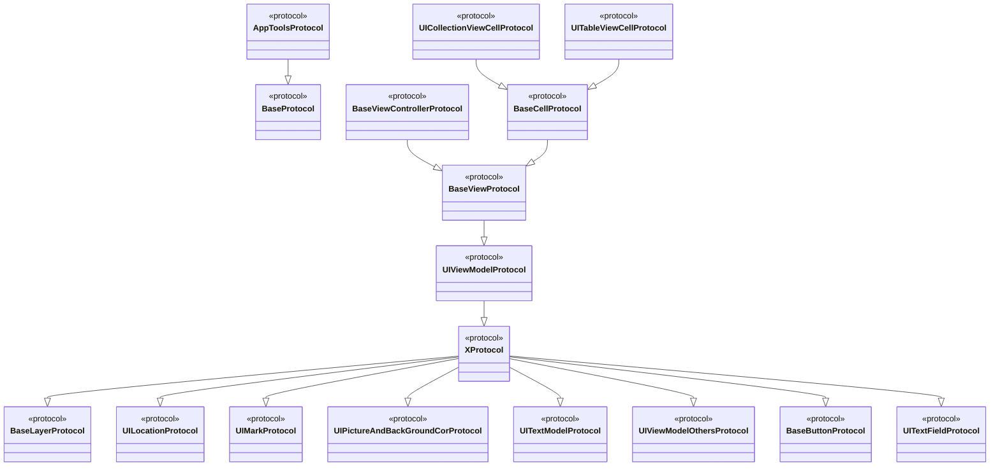

#  BaseProtocol 相关继承结构关系图

```mermaid
classDiagram
    class BaseProtocol {
        <<protocol>>
    }
    class AppToolsProtocol {
        <<protocol>>
    }
    class XProtocol {
        <<protocol>>
    }
    class UITextFieldProtocol {
        <<protocol>>
    }
    class BaseButtonProtocol {
        <<protocol>>
    }
    class BaseLayerProtocol {
        <<protocol>>
    }
    class UILocationProtocol {
        <<protocol>>
    }
    class UIMarkProtocol {
        <<protocol>>
    }
    class UIPictureAndBackGroundCorProtocol {
        <<protocol>>
    }
    class UITextModelProtocol {
        <<protocol>>
    }
    class UIViewModelOthersProtocol {
        <<protocol>>
    }
    class UIViewModelProtocol {
        <<protocol>>
    }
    class BaseViewProtocol {
        <<protocol>>
    }
    class BaseViewControllerProtocol {
        <<protocol>>
    }
    class BaseCellProtocol {
        <<protocol>>
    }
    class UICollectionViewCellProtocol {
        <<protocol>>
    }
    class UITableViewCellProtocol {
        <<protocol>>
    }

    AppToolsProtocol --|> BaseProtocol
    XProtocol --|> BaseLayerProtocol
    XProtocol --|> UILocationProtocol
    XProtocol --|> UIMarkProtocol
    XProtocol --|> UIPictureAndBackGroundCorProtocol
    XProtocol --|> UITextModelProtocol
    XProtocol --|> UIViewModelOthersProtocol
    XProtocol --|> BaseButtonProtocol
    XProtocol --|> UITextFieldProtocol

    UIViewModelProtocol --|> XProtocol
    BaseViewProtocol --|> UIViewModelProtocol
    BaseViewControllerProtocol --|> BaseViewProtocol
    BaseCellProtocol --|> BaseViewProtocol
    UICollectionViewCellProtocol --|> BaseCellProtocol
    UITableViewCellProtocol --|> BaseCellProtocol

```
