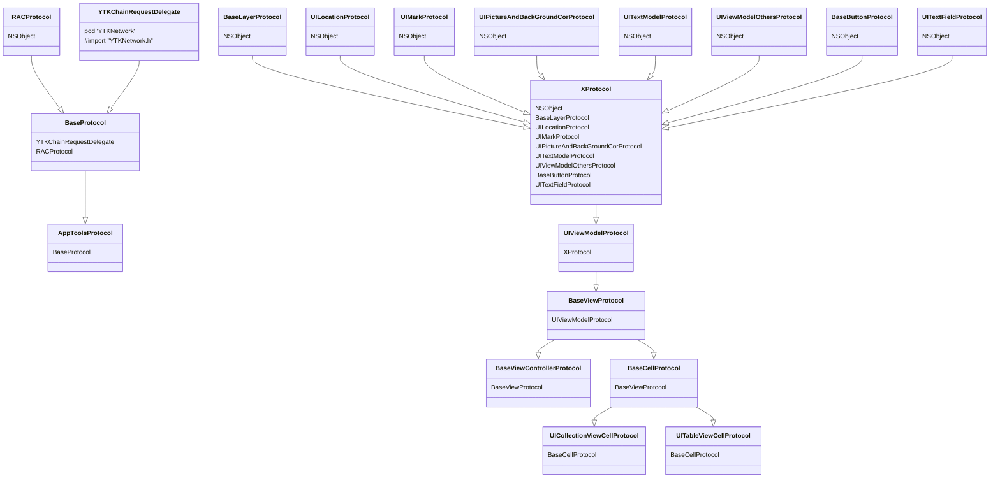

#  BaseProtocol 相关继承结构关系图

```mermaid
classDiagram
    class RACProtocol {
        NSObject 
    }
    
    class YTKChainRequestDelegate {
        pod 'YTKNetwork'
            #import "YTKNetwork.h"
    }
    
    class BaseProtocol {
        YTKChainRequestDelegate
        RACProtocol
    }
    class AppToolsProtocol {
        BaseProtocol
    }
    class XProtocol {
        NSObject
        BaseLayerProtocol
        UILocationProtocol
        UIMarkProtocol
        UIPictureAndBackGroundCorProtocol
        UITextModelProtocol
        UIViewModelOthersProtocol
        BaseButtonProtocol
        UITextFieldProtocol
    }
    class UITextFieldProtocol {
        NSObject
    }
    class BaseButtonProtocol {
        NSObject
    }
    class BaseLayerProtocol {
        NSObject
    }
    class UILocationProtocol {
        NSObject
    }
    class UIMarkProtocol {
        NSObject
    }
    class UIPictureAndBackGroundCorProtocol {
        NSObject
    }
    class UITextModelProtocol {
        NSObject
    }
    class UIViewModelOthersProtocol {
        NSObject
    }
    class UIViewModelProtocol {
        XProtocol
    }
    class BaseViewProtocol {
        UIViewModelProtocol
    }
    class BaseViewControllerProtocol {
        BaseViewProtocol
    }
    class BaseCellProtocol {
        BaseViewProtocol
    }
    class UICollectionViewCellProtocol {
        BaseCellProtocol
    }
    class UITableViewCellProtocol {
        BaseCellProtocol
    }

    RACProtocol --|> BaseProtocol
    YTKChainRequestDelegate --|> BaseProtocol
    BaseProtocol --|> AppToolsProtocol
    
    BaseLayerProtocol --|> XProtocol
    UILocationProtocol --|> XProtocol
    UIMarkProtocol --|> XProtocol
    UIPictureAndBackGroundCorProtocol --|> XProtocol
    UITextModelProtocol --|> XProtocol
    UIViewModelOthersProtocol --|> XProtocol
    BaseButtonProtocol --|> XProtocol
    UITextFieldProtocol --|> XProtocol
    
    XProtocol --|> UIViewModelProtocol
    UIViewModelProtocol --|> BaseViewProtocol
    BaseViewProtocol --|> BaseViewControllerProtocol
    BaseViewProtocol --|> BaseCellProtocol
    BaseCellProtocol --|> UICollectionViewCellProtocol
    BaseCellProtocol --|> UITableViewCellProtocol

```

