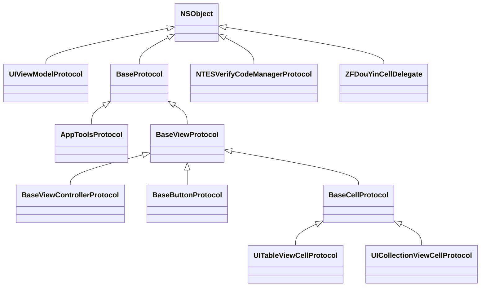
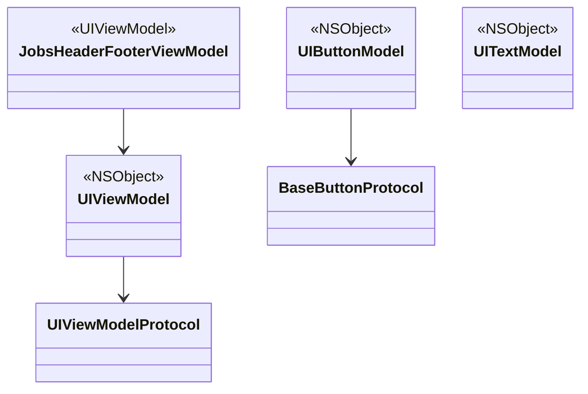

# <font color=red>iOS.OC靶场项目</font><基础配置的说明>
<p align="left">
  
  
  
</p>
[toc]

## 一、目的

* 所有的项目根据这个根来进行统一配置和调用。
* 将它作为所有项目的基类，做到全局的统一
* 千万要保证这个工程的编译通过，以后项目直接进行引用
* 作为某些代码实践的靶场，是非常有必要的
* 作为代码笔记，记录一些常用的代码，方便查阅
* 作为学习的资料，可以快速了解到一些常用的知识
* 作为项目的参考，可以快速的了解到项目的架构，代码规范，以及一些设计模式

## 二、特色
- [x] 网络模块Api<br>
- [x] Toast<br>
- [x] 系统、UI配置<br>
- [x] UI组件库<br>
- [x] 语言本地化<br>
- [x] 数据存储UserDefaults<br>
- [ ] 统一的WebView<br>
## 三、相关链接

* [**OC代码实验室**](https://github.com/295060456/Jobs_ObjectiveC_Laboratory)
* [**yanmingLiu-Xminds**](https://github.com/yanmingLiu/Xminds)
* [**yanmingLiu-iOSNotes**](https://github.com/yanmingLiu/iOSNotes)

## 四、几点重要说明

### 1、在Apple芯片（目前是M系列）编译失败的解决方案
* 禁用系统完整性保护 (**S**ystem **I**ntegrity **P**rotection, SIP)   <font color=red>**如果不禁用，会对某些文件夹有读写权限控制**</font>
  * 重启MacOS，长按开机键，直到🌏页面，进入恢复模式
  * 在恢复模式的 macOS 实用工具窗口中，选择“实用工具”菜单，然后选择“终端”以打开终端窗口
    ```shell
    csrutil disable
    ```
  * 重启MacOS
  * 在xcode里面做如下设置：<font color=red>**每一个工程下都做检查**</font>
  	因为涉及到xcode的安全设置，所以下列操作只能手动操作，而不能用脚本进行。如果不做设置，很可能编译失败
    
    
  
  * 文件夹授权
    ```shell
    sudo chown -R $(whoami) 项目目录
    sudo chmod -R u+rw 项目目录
    ```
  * 在`podfile`文件里面，设置：
    ```ruby
    # 用于指定你的 Pod 项目应使用静态库而不是动态库。
    # 这个选项主要用于解决某些与动态库相关的兼容性和性能问题。
    use_frameworks! :linkage => :static
    ```
  * 重新运行pod
    ```shell
    pod install
    ```
### 2、xcode 日志配置
* `Environment Variables`标签，添加一个新的环境变量。将 `Name` 设置为 `IDEPreferLogStreaming`，将 `Value` 设置为 `YES`


### 3、iOS xcode 代码块，提升编码效率必备之首选
* 提升编码效率，快用[**快捷键调取代码块**](https://github.com/JobsKit/JobsCodeSnippets)

### 4、[**<font color=red>JobsBlock</font>**](https://github.com/295060456/JobsBlock/blob/main/README.md)

* 统一全局的Block定义，减少冗余代码

### 5、[**<font color=red>BaseProtocol 相关继承结构关系图</font>**](https://github.com/295060456/JobsOCBaseConfigDemo/blob/main/JobsOCBaseConfigDemo/JobsOCBaseCustomizeUIKitCore/BaseProtocol/BaseProtocol.md)



### 6、UIViewModelFamily

* 产生背景：页面之间传值，只需要瞄准1个<font color=red>**数据束**</font>。当需要增删数据的时候，可以有效减少操作，方便管理；
* `UIViewModel`即是页面之间传值的这个<font color=red>**数据束**</font>
* `UITextModel`是专门针对文本的<font color=red>**数据束**</font>
* 结合`BaseProtocol`进行封装
* 减少冗余代码，将公用头文件提升到协议进行定义



### 7、JobsOCBaseCustomizeUIKitCore

* 产生背景
  * OC的基类是单继承；
  * 继承会产生很多基类，客观上造成代码的冗余；
* 解决方案
  * 继承和分类应该结合使用，功能各有优劣；
  * 分类即是"超级继承"，不需要产生额外的分类，方便管理和调用；

### 8、BaseViewController

* 为了方便管理，理论上，全局只应有一个`UIViewController`。开发者不应该创建过多的子控制器；
* 如果在`BaseViewController`无法满足的操作，应该提升到`UIViewController`的分类进行；
* 命名为`BaseViewController`也是充分考虑同业者的偏好习惯；
* 正常情况下，在建立子控制器的时候，为了缩短命名，应该将`ViewController`命名为`VC`；

### 9、度量衡适配。[**MacroDef_Size.h**](https://github.com/295060456/JobsOCBaseConfigDemo/blob/main/JobsOCBaseConfigDemo/OCBaseConfig/%E5%90%84%E9%A1%B9%E5%85%A8%E5%B1%80%E5%AE%9A%E4%B9%89/%E5%90%84%E9%A1%B9%E5%AE%8F%E5%AE%9A%E4%B9%89/MacroDef_Size/MacroDef_Size.h)

* **当前设备是否是全面屏**：`static inline BOOL isFullScreen(void) ` 
* **全局比例尺**
  * `static inline CGFloat JobsWidth(CGFloat width)`  
  * `static inline CGFloat JobsHeight(CGFloat height)`
* **安全距离**
  * 顶部的安全距离：`static inline CGFloat JobsTopSafeAreaHeight(void)`
  * 底部的安全距离，全面屏手机为34pt，非全面屏手机为0pt：`static inline CGFloat JobsBottomSafeAreaHeight(void)`
* **状态栏高度**
  * `static inline CGFloat JobsStatusBarHeightByAppleIncData(void) `
  * `static inline CGFloat JobsRectOfStatusbar(void)`
  * `static inline CGFloat JobsStatusBarHeight(void)`
* **导航栏高度**
  * `static inline CGFloat JobsNavigationHeight(UINavigationController * _Nullable navigationController)`
* **状态栏 + 导航栏高度**
  * `static inline CGFloat JobsNavigationBarAndStatusBarHeight(UINavigationController * _Nullable navigationController)`
* **Tabbar高度**：全面屏手机比普通手机多34的安全区域
  * `static inline CGFloat JobsTabBarHeight(UITabBarController * _Nullable tabBarController)`
  * `static inline CGFloat JobsTabBarHeightByBottomSafeArea(UITabBarController * _Nullable tabBarController)`<font color=red>**包括了底部安全区域的TabBar高度，一般用这个**</font>
* **除开 tabBarController 和 navigationController 的内容可用区域的大小**
  * `static inline CGFloat JobsContentAreaHeight(UITabBarController * _Nullable tabBarController, UINavigationController * _Nullable navigationController)`

## 五、代码讲解
### 1、UIButton.UIButtonConfiguration
<details id="UIButton">
<summary><strong>点我了解详情</strong></summary>

* 苹果在后续的Api中推出了`UIButtonConfiguration` 来设置UIButton，但是这个新Api会存在几大问题；

  * 大多数开发者对这个Api不熟悉；
  * 用了新Api以后，老的Api的一些调用方式可能不会起效果。如果还是按照以前的方式创建，你会发现UIButton不正常出现；
  * 大多数时候，我们会涉及到富文本。而富文本和普通的文本之间对于控件有优先级。富文本的优先级最高；
  * 因为要做兼容处理，但是`UIButtonConfiguration` 的设置环节非常繁琐；
  
* 所以，为了应对以上的问题，可以使用快捷键（init.JobsBtn）调取代码块来设置 UIButton。[**快捷键调取代码块**](https://github.com/JobsKit/JobsCodeSnippets)

  * 得出的 UIButton 是没有约束的，需要自己在外界加；
  * 具体的内部实现，请关注[<font color=blue>**`@implementation UIButton (UI)`**</font>](https://github.com/295060456/JobsOCBaseConfigDemo/tree/main/JobsOCBaseConfigDemo/JobsOCBaseCustomizeUIKitCore/UIButton/UIButton+Category/UIButton+UI);
  
* <font color=red id=用新Api（UIButtonConfiguration）创建一个带富文本的UIButton>**用新Api（UIButtonConfiguration）创建一个带富文本的UIButton**</font>

  ```objective-c
  @property(nonatomic,strong)BaseButton *titleBtn;
  @property(nonatomic,strong)NSMutableArray <NSString *>*richTextMutArr;
  @property(nonatomic,strong)NSMutableArray <RichTextConfig *>*richTextConfigMutArr;
  
  -(BaseButton *)titleBtn{
     if(!_titleBtn){
         @jobs_weakify(self)
         _titleBtn = [BaseButton.alloc jobsInitBtnByConfiguration:nil
                                                        background:nil
                                                    titleAlignment:UIButtonConfigurationTitleAlignmentCenter
                                                     textAlignment:NSTextAlignmentCenter
                                                  subTextAlignment:NSTextAlignmentCenter
                                                       normalImage:nil
                                                    highlightImage:nil
                                                   attributedTitle:nil
                                           selectedAttributedTitle:nil
                                                attributedSubtitle:[self richTextWithDataConfigMutArr:self.richTextConfigMutArr]
                                                             title:Internationalization(@"请支付")
                                                          subTitle:nil//Internationalization(@"观看完整教学视频需支付99Mata值")
                                                         titleFont:UIFontWeightBoldSize(18)
                                                      subTitleFont:nil
                                                          titleCor:JobsCor(@"#333333")
                                                       subTitleCor:nil
                                                titleLineBreakMode:NSLineBreakByWordWrapping
                                             subtitleLineBreakMode:NSLineBreakByWordWrapping
                                               baseBackgroundColor:UIColor.whiteColor
                                                      imagePadding:JobsWidth(0)
                                                      titlePadding:JobsWidth(10)
                                                    imagePlacement:NSDirectionalRectEdgeNone
                                        contentHorizontalAlignment:UIControlContentHorizontalAlignmentCenter
                                          contentVerticalAlignment:UIControlContentVerticalAlignmentCenter
                                                     contentInsets:jobsSameDirectionalEdgeInsets(0)
                                                 cornerRadiusValue:JobsWidth(0)
                                                   roundingCorners:UIRectCornerAllCorners
                                              roundingCornersRadii:CGSizeZero
                                                    layerBorderCor:nil
                                                       borderWidth:JobsWidth(0)
                                                     primaryAction:nil
                                                   clickEventBlock:^id(BaseButton *x) {
             @jobs_strongify(self)
             x.selected = !x.selected;
             if (self.objectBlock) self.objectBlock(x);
             return nil;
         }];
         [self addSubview:_titleBtn];
         [_titleBtn mas_makeConstraints:^(MASConstraintMaker *make) {
             make.height.mas_equalTo(JobsWidth(72));
             make.top.equalTo(self).offset(JobsWidth(20));
             make.centerX.equalTo(self);
         }];
         [_titleBtn makeBtnLabelByShowingType:UILabelShowingType_03];
     }return _titleBtn;
  }
  
  -(NSMutableArray<NSString *> *)richTextMutArr{
     if (!_richTextMutArr) {
         _richTextMutArr = NSMutableArray.array;
         [_richTextMutArr addObject:Internationalization(@"观看完整教学视频需支付")];
         [_richTextMutArr addObject:Internationalization(@"99")];
         [_richTextMutArr addObject:Internationalization(@"Mata值")];
     }return _richTextMutArr;
  }
  
  -(NSMutableArray<RichTextConfig *> *)richTextConfigMutArr{
     if (!_richTextConfigMutArr) {
         _richTextConfigMutArr = NSMutableArray.array;
         {
             RichTextConfig *config_01 = RichTextConfig.new;
             config_01.font = UIFontWeightRegularSize(14);
             config_01.textCor = JobsCor(@"#666666");
             config_01.targetString = self.richTextMutArr[0];
             config_01.paragraphStyle = self.jobsParagraphStyleCenter;
             [_richTextConfigMutArr addObject:config_01];
         }
  
         {
             RichTextConfig *config_02 = RichTextConfig.new;
             config_02.font = UIFontWeightRegularSize(14);
             config_02.textCor = JobsCor(@"#BA9B77");
             config_02.targetString = self.richTextMutArr[1];
             config_02.paragraphStyle = self.jobsParagraphStyleCenter;
             [_richTextConfigMutArr addObject:config_02];
         }
  
         {
             RichTextConfig *config_03 = RichTextConfig.new;
             config_03.font = UIFontWeightRegularSize(14);
             config_03.textCor = JobsCor(@"#666666");
             config_03.targetString = self.richTextMutArr[2];
             config_03.paragraphStyle = self.jobsParagraphStyleCenter;
             [_richTextConfigMutArr addObject:config_03];
         }
     }return _richTextConfigMutArr;
  }
  ```
  
* 资料来源：

  * [**UIButtonConfiguration**](https://www.jianshu.com/p/12426709420e)
  * [**Chat GPT 3.5**](https://chatgpt.com/)

 </details>

### 2、Masonry的一些使用技巧

<details id="Masonry约束动画<br>">
 <summary><strong>点我了解详情：Masonry约束动画<br></strong></summary>

```objective-c
-(MSMineView2 *)view2{
    if(!_view2){
        _view2 = MSMineView2.new;
        [_view2 richElementsInViewWithModel:nil];
        [self addSubview:_view2];
        [_view2 jobsMasonryBeforeBlock:^(MASConstraintMaker * _Nonnull make) {
            // 添加第一个 _view2 的约束
            make.width.mas_equalTo(0);
            make.height.mas_equalTo([MSMineView2 viewSizeWithModel:nil].height);
            make.right.equalTo(self).offset(JobsWidth(-10));
            make.top.equalTo(self).offset(JobsWidth(10));
        }
                     masonryAfterBlock:^(MASConstraintMaker * _Nonnull make) {
            // 添加第二个 _view2 的约束
            make.size.mas_equalTo([MSMineView2 viewSizeWithModel:nil]);
            make.centerX.equalTo(self);
            make.top.equalTo(self).offset(JobsWidth(10));
        }];
        [_view2 cornerCutToCircleWithCornerRadius:[MSMineView2 viewSizeWithModel:nil].height / 2];
    }return _view2;
}
```
</details>

### 3、退出ViewController的时候，需要做的操作

<details id="退出ViewController的时候，需要做的操作">
 <summary><strong>点我了解详情</strong></summary>

* 定义于`BaseViewProtocol`，因为是进数据，所以可以实现在控制器生命周期的任意处

  ```objective-c
   @jobs_weakify(self)
   self.jobsBackBlock = ^id _Nullable(id _Nullable data) {
       @jobs_strongify(self)
       NSLog(@"退出页面的逻辑");
       return nil;
   };
  ```

* 也可以在具体的子控制器覆写下列方法

  ```objective-c
  -(void)backBtnClickEvent:(UIButton *_Nullable)sender;
  ```

</details>

### 4、实例对象的weak化，避免循环引用
<details id="相关定义">
<summary><strong>点我了解详情：相关定义</strong></summary>

```objective-c
#ifndef MacroDef_Strong_Weak_h
#define MacroDef_Strong_Weak_h

/** 强弱引用
    Uses
    UIView *view;
    UIButton *btn;

    @jobs_weakify(view)
    weak_view.size;
    @jobs_weakify(btn)
    weak_btn.frame

 # 能用@符号进行调用的根本原因：来自GPT-3.5的回答
    在如下的宏定义中：
    @符号可以用于调用的原因是因为宏内部实际上不包含Objective-C代码块，而是包含了一个函数调用，
    这个函数调用是Objective-C代码中的一个有效表达式。
 */
#ifndef jobs_weakify
#if DEBUG
#if __has_feature(objc_arc)
#define jobs_weakify(object) autoreleasepool{} __weak __typeof__(object) weak##_##object = object;
#else
#define jobs_weakify(object) autoreleasepool{} __block __typeof__(object) block##_##object = object;
#endif
#else
#if __has_feature(objc_arc)
#define jobs_weakify(object) try{} @finally{} {} __weak __typeof__(object) weak##_##object = object;
#else
#define jobs_weakify(object) try{} @finally{} {} __block __typeof__(object) block##_##object = object;
#endif
#endif
#endif

#ifndef jobs_strongify
#if DEBUG
#if __has_feature(objc_arc)
#define jobs_strongify(object) autoreleasepool{} __typeof__(object) object = weak##_##object;
#else
#define jobs_strongify(object) autoreleasepool{} __typeof__(object) object = block##_##object;
#endif
#else
#if __has_feature(objc_arc)
#define jobs_strongify(object) try{} @finally{} __typeof__(object) object = weak##_##object;
#else
#define jobs_strongify(object) try{} @finally{} __typeof__(object) object = block##_##object;
#endif
#endif
#endif

#endif /* MacroDef_Strong_Weak_h */
```

</details>

<details id="使用方式">
 <summary><strong>点我了解详情：使用方式</strong></summary>

 ```objective-c
@jobs_strongify(self)
@jobs_weakify(self)
 ```
</details>

### 5、使用block，对selector的封装，避免方法割裂

<details id="使用block，对selector的封装，避免方法割裂">
 <summary><strong>点我了解详情</strong></summary>

   ```objective-c
 typedef id _Nullable(^JobsReturnIDBySelectorBlock)(id _Nullable weakSelf, id _Nullable arg);
 /// 用block来代替selector
 -(SEL _Nullable)jobsSelectorBlock:(JobsReturnIDBySelectorBlock)selectorBlock{
    return selectorBlocks(selectorBlock,nil,self);
 }
   ```

   ```objective-c
   /// 替代系统 @selector(selector) ,用Block的方式调用代码，使得代码逻辑和形式上不割裂
   /// - Parameters:
   ///   - block: 最终的执行体
   ///   - selectorName: 实际调用的方法名（可不填），用于对外输出和定位调用实际使用的方法
   ///   - target: 执行目标
   SEL _Nullable selectorBlocks(JobsReturnIDBySelectorBlock block,
                                NSString *_Nullable selectorName,
                                id _Nullable target){
       if (!block) {
           toastErr(JobsInternationalization(@"方法不存在,请检查参数"));
           /// 【经常崩溃损伤硬件】 [NSException raise:JobsInternationalization(@"block can not be nil") format:@"%@ selectorBlock error", target];
       }
       /// 动态注册方法：对方法名进行拼接（加盐），以防止和当下的其他方法名引起冲突
       NSString *selName = [NSString stringWithFormat:@"selector_%d_%@",random100__200(),selectorName];
       NSLog(@"selName = %@",selName);
       SEL sel = NSSelectorFromString(selName);
       /**
        方法签名由方法名称和一个参数列表（方法的参数的顺序和类型）组成
        注意：方法签名不包括方法的返回类型。不包括返回值和访问修饰符
        第一个参数是在哪个类中添加方法
        第二个参数是所添加方法的编号SEL
        第三个参数是所添加方法的函数实现的指针IMP
        第四个参数是所添加方法的签名
        */
       NSLog(@"%@",[NSString stringWithFormat:@"%d",random100__200()]);
       if(class_getInstanceMethod([target class], sel)){
           NSLog(@"方法曾经已经被成功添加，再次添加会崩溃");
       }else{
           /// class_addMethod这个方法的实现会覆盖父类的方法实现，但不会取代本类中已存在的实现，如果本类中包含一个同名的实现，则函数会返回NO
           if (class_addMethod([target class],
                               sel,
                               (IMP)selectorImp,
                               "111")) {
               objc_setAssociatedObject(target,
                                        sel,
                                        block,
                                        OBJC_ASSOCIATION_COPY_NONATOMIC);
           }else{
               [NSException raise:JobsInternationalization(@"添加方法失败")
                           format:@"%@ selectorBlock error", target];
           }
       }return sel;
   }
   /// 内部调用无需暴露
   static void selectorImp(id self,
                           SEL _cmd,
                           id arg) {
       JobsReturnIDBySelectorBlock block = objc_getAssociatedObject(self, _cmd);
       @jobs_weakify(self)
       if (block) block(weak_self, arg);
   }
   ```
</details>

* [**对按钮点击事件的使用**](#用新Api（UIButtonConfiguration）创建一个带富文本的UIButton)

* 对通知的使用

  * [**`MacroDef_Notification.h`**](https://github.com/295060456/JobsOCBaseConfigDemo/blob/main/JobsOCBaseConfigDemo/OCBaseConfig/%E5%90%84%E9%A1%B9%E5%85%A8%E5%B1%80%E5%AE%9A%E4%B9%89/%E5%90%84%E9%A1%B9%E5%AE%8F%E5%AE%9A%E4%B9%89/MacroDef_Func/MacroDef_Notification.h)

    ```objective-c
    #ifndef JobsAddNotification
    #define JobsAddNotification(Observer, SEL, NotificationName, Obj)\
    [JobsNotificationCenter addObserver:(Observer) \
                            selector:(SEL) \
                            name:(NotificationName) \
                            object:(Obj)]
    #endif
    ```
    
  * 接收通知：
  
    ```objective-c
    @jobs_weakify(self)
    [NSNotificationCenter.defaultCenter addObserver:self
                                          selector:selectorBlocks(^id _Nullable(id  _Nullable weakSelf,
                                                                                id  _Nullable arg) {
       NSNotification *notification = (NSNotification *)arg;
       NSNumber *b = notification.object;
       NSLog(@"SSS = %d",b.boolValue);
       @jobs_strongify(self)
       NSLog(@"通知传递过来的 = %@",notification.object);
       return nil;
    }, nil, self)
                                              name:LanguageSwitchNotification
                                            object:nil];
    ```
  
    ```objective-c
    @jobs_weakify(self)
    JobsAddNotification(self,
                    selectorBlocks(^id _Nullable(id _Nullable weakSelf,
                                              id _Nullable arg){
        NSNotification *notification = (NSNotification *)arg;
        NSNumber *b = notification.object;
        NSLog(@"SSS = %d",b.boolValue);
        @jobs_strongify(self)
        NSLog(@"通知传递过来的 = %@",notification.object);
        return nil;
    },nil, self),LanguageSwitchNotification,nil);
    ```
  
  * 发通知：
  
    ```objective-c
    [NSNotificationCenter.defaultCenter postNotificationName:LanguageSwitchNotification object:@(NO)];
    ```

### 6、UIViewModel的使用

* 将数据束`UIViewModel`绑定到UI中，包括一些UI交互事件

<details id="UIViewModel的使用">
 <summary><strong>对 UICollectionView 点击事件的封UIViewModel+block</strong></summary>

 ```objective-c
/// Data
@property(nonatomic,strong)NSMutableArray <UIViewModel *>*dataMutArr;
 ```
```objective-c
-(NSMutableArray<UIViewModel *> *)dataMutArr{
    if (!_dataMutArr) {
        _dataMutArr = NSMutableArray.array;
        @jobs_weakify(self)

        {
            UITextModel *textModel = UITextModel.new;
            textModel.text = JobsInternationalization(@"Hello");
            textModel.textCor = JobsRedColor;
            textModel.textAlignment = NSTextAlignmentCenter;
            
            UIViewModel *viewModel = UIViewModel.new;
            viewModel.textModel = textModel;
            viewModel.jobsBlock = ^id(id param){
                @jobs_strongify(self)
                NSLog(@"Hello");
                return nil;
            };
            [_dataMutArr addObject:viewModel];
        }

        {
            UITextModel *textModel = UITextModel.new;
            textModel.text = JobsInternationalization(@"OK");
            textModel.textCor = JobsRedColor;
            textModel.textAlignment = NSTextAlignmentCenter;
            
            UIViewModel *viewModel = UIViewModel.new;
            viewModel.textModel = textModel;
            viewModel.jobsBlock = ^id(id param){
                @jobs_strongify(self)
                NSLog(@"OK");
                return nil;
            };
            [_dataMutArr addObject:viewModel];
        }
    }return _dataMutArr;
}
```

```objective-c
/// collectionView 选中操作
- (void)collectionView:(UICollectionView *)collectionView
didSelectItemAtIndexPath:(NSIndexPath *)indexPath {
    NSLog(@"%s", __FUNCTION__);
    self.dataMutArr[indexPath.item].jobsBlock(nil);
    /**
     滚动到指定位置
     _collectionView.contentOffset = CGPointMake(0,-100);
     [_collectionView setContentOffset:CGPointMake(0, -200) animated:YES];// 只有在viewDidAppear周期 或者 手动触发才有效
     */
}
```

</details>

### 7、统一注册全局的 `UICollectionViewCell`
* 不注册相对应当UICollectionViewCell相关子类，使用时会崩溃；
* 系统注册UICollectionViewCell相关子类，是利用字符串作为桥梁进行操作；
* 注册不会开辟内存，只有当使用的时候才会开辟内存；
* 对全局进行统一的UICollectionViewCell相关子类注册是很有必要的，方便管理，防止崩溃；
* 关注实现类[<font color=blue>**`@implementation UICollectionView (JobsRegisterClass)`**</font>](https://github.com/295060456/JobsOCBaseConfigDemo/tree/main/JobsOCBaseConfigDemo/JobsOCBaseCustomizeUIKitCore/UICollectionView/UICollectionView+Category/UICollectionView+JobsRegisterClass)

### 8、全局统一的提示弹出框（对`WHToast`的二次封装）

* `Podfile`

  ```ruby
  pod 'WHToast' # https://github.com/remember17/WHToast 一个轻量级的提示控件，没有任何依赖 NO_SMP
  ```

* 关注实现类[<font color=blue>**`@implementation NSObject (WHToast)`**</font>](https://github.com/295060456/JobsOCBaseConfigDemo/tree/main/JobsOCBaseConfigDemo/JobsOCBaseCustomizeUIKitCore/NSObject/NSObject+Category/NSObject+WHToast)

* [**`MacroDef_Func.h`**](https://github.com/295060456/JobsOCBaseConfigDemo/blob/main/JobsOCBaseConfigDemo/OCBaseConfig/%E5%90%84%E9%A1%B9%E5%85%A8%E5%B1%80%E5%AE%9A%E4%B9%89/%E5%90%84%E9%A1%B9%E5%AE%8F%E5%AE%9A%E4%B9%89/MacroDef_Func/MacroDef_Func.h)

  ```objective-c
  static inline void toast(NSString *_Nullable msg){
      if(!msg || ![msg isKindOfClass:NSString.class]){
          msg = JobsInternationalization(@"数据错误");
      }
      [NSObject jobsToastMsg:JobsInternationalization(msg)];
  }
  ```

```markdown
### Test
<details id="Test">
 <summary><strong>点我了解详情</strong></summary>

 ```objective-c
// TODO
```
</details>

## 六、[一些文档和资料](https://github.com/295060456/JobsOCBaseConfig/tree/main/%E6%96%87%E6%A1%A3%E5%92%8C%E8%B5%84%E6%96%99)
### 1、配置相关
* [**解决Xcode出现：SDK does not contain 'libarclite' 错误**](https://github.com/295060456/JobsOCBaseConfig/tree/main/%E8%A7%A3%E5%86%B3Xcode%E5%87%BA%E7%8E%B0%EF%BC%9ASDK%20does%20not%20contain%20'libarclite'%20%E9%94%99%E8%AF%AF)
* [**通过SSH连接到GitHub**](https://github.com/295060456/JobsOCBaseConfig/blob/main/%E6%96%87%E6%A1%A3%E5%92%8C%E8%B5%84%E6%96%99/%E9%80%9A%E8%BF%87SSH%E8%BF%9E%E6%8E%A5%E5%88%B0GitHub/%E9%80%9A%E8%BF%87SSH%E8%BF%9E%E6%8E%A5%E5%88%B0GitHub.md)
* [**JobsGenesis**](https://github.com/295060456/JobsGenesis)
* [**unknown class viewcontroller in interface builder file**](https://github.com/295060456/JobsOCBaseConfig/blob/main/%E6%96%87%E6%A1%A3%E5%92%8C%E8%B5%84%E6%96%99/%E5%85%B6%E4%BB%96.md/unknown%20class%20viewcontroller%20in%20interface%20builder%20file.md)
* [**Xcode资料下载**](https://github.com/295060456/JobsOCBaseConfig/blob/main/%E6%96%87%E6%A1%A3%E5%92%8C%E8%B5%84%E6%96%99/%E5%85%B6%E4%BB%96.md/Xcode%E8%B5%84%E6%96%99%E4%B8%8B%E8%BD%BD.md)
### 2、面试相关
* [**OC相关经验**](https://github.com/295060456/JobsOCBaseConfig/blob/main/OCDoc/OCDoc.md)
* [**Swift 相关经验**](https://github.com/295060456/JobsOCBaseConfig/blob/main/SwiftDoc/SwiftDoc.md)
* [**iOSNotes**](https://github.com/yanmingLiu/iOSNotes)
* [**谁说HTTP GET就不能通过Body来发送数据呢？**](https://juejin.cn/post/6844903685206573069)
### 3、功能相关
  * [**UITableView 的使用指南**](https://github.com/295060456/JobsOCBaseConfig/blob/main/%E6%96%87%E6%A1%A3%E5%92%8C%E8%B5%84%E6%96%99/UITableView/UITableView.md)
  * [**关于UITableViewCell和UICollectionViewCell圆切角+Cell的偏移量**](https://github.com/295060456/JobsOCBaseConfig/blob/main/%E6%96%87%E6%A1%A3%E5%92%8C%E8%B5%84%E6%96%99/%E5%85%B6%E4%BB%96.md/%E5%85%B3%E4%BA%8EUITableViewCell%E5%92%8CUICollectionViewCell%E5%9C%86%E5%88%87%E8%A7%92%2BCell%E7%9A%84%E5%81%8F%E7%A7%BB%E9%87%8F.md)
  * [**查找系统警告对应的编码**](https://github.com/295060456/JobsOCBaseConfig/blob/main/%E6%96%87%E6%A1%A3%E5%92%8C%E8%B5%84%E6%96%99/%E6%9F%A5%E6%89%BE%E7%B3%BB%E7%BB%9F%E8%AD%A6%E5%91%8A%E5%AF%B9%E5%BA%94%E7%9A%84%E7%BC%96%E7%A0%81/%E6%9F%A5%E6%89%BE%E7%B3%BB%E7%BB%9F%E8%AD%A6%E5%91%8A%E5%AF%B9%E5%BA%94%E7%9A%84%E7%BC%96%E7%A0%81.png)
  * [**iOS状态栏颜色的修改**](文档和资料/iOS状态栏颜色的修改.md)
  * [**UICollectionView点击事件**](文档和资料/UICollectionView点击事件.md)
  * [**JXCategoryView**](https://github.com/295060456/JobsOCBaseConfig/tree/main/%E6%96%87%E6%A1%A3%E5%92%8C%E8%B5%84%E6%96%99/JXCategoryView)
  * [**同一应用设置不同图标和名称**](https://github.com/295060456/JobsOCBaseConfig/blob/main/%E6%96%87%E6%A1%A3%E5%92%8C%E8%B5%84%E6%96%99/%E5%90%8C%E4%B8%80%E5%BA%94%E7%94%A8%E8%AE%BE%E7%BD%AE%E4%B8%8D%E5%90%8C%E5%9B%BE%E6%A0%87%E5%92%8C%E5%90%8D%E7%A7%B0/%E5%90%8C%E4%B8%80%E5%BA%94%E7%94%A8%E8%AE%BE%E7%BD%AE%E4%B8%8D%E5%90%8C%E5%9B%BE%E6%A0%87%E5%92%8C%E5%90%8D%E7%A7%B0.md)
  * [**模型解析**](https://github.com/295060456/JobsOCBaseConfig/blob/main/%E6%96%87%E6%A1%A3%E5%92%8C%E8%B5%84%E6%96%99/%E6%A8%A1%E5%9E%8B%E8%A7%A3%E6%9E%90/%E6%A8%A1%E5%9E%8B%E8%A7%A3%E6%9E%90.md)
  * [**iOS 多语言环境设置**](https://github.com/295060456/JobsOCBaseConfig/blob/main/%E6%96%87%E6%A1%A3%E5%92%8C%E8%B5%84%E6%96%99/iOS%20%E5%A4%9A%E8%AF%AD%E8%A8%80%E7%8E%AF%E5%A2%83%E8%AE%BE%E7%BD%AE/iOS%20%E5%A4%9A%E8%AF%AD%E8%A8%80%E7%8E%AF%E5%A2%83%E8%AE%BE%E7%BD%AE.md)
  * [**Runtime 获取.m文件的属性（指针）**](https://github.com/295060456/JobsOCBaseConfig/blob/main/%E6%96%87%E6%A1%A3%E5%92%8C%E8%B5%84%E6%96%99/%E5%85%B6%E4%BB%96.md/Runtime%20%E8%8E%B7%E5%8F%96.m%E6%96%87%E4%BB%B6%E7%9A%84%E5%B1%9E%E6%80%A7%EF%BC%88%E6%8C%87%E9%92%88%EF%BC%89.md)
  * [**<font color=red id=iOS功能：跳转其他App,如果本机不存在,则进行下载 >iOS功能：跳转其他App,如果本机不存在,则进行下载 （需要补充）</font>**](https://github.com/295060456/JobsOCBaseConfig/blob/main/%E6%96%87%E6%A1%A3%E5%92%8C%E8%B5%84%E6%96%99/%E8%B7%B3%E8%BD%AC%E5%85%B6%E4%BB%96App%E6%B2%A1%E6%9C%89%E5%88%99%E4%B8%8B%E8%BD%BD/%E8%B7%B3%E8%BD%AC%E5%85%B6%E4%BB%96App%E6%B2%A1%E6%9C%89%E5%88%99%E4%B8%8B%E8%BD%BD.md)
  * [**iOS禁用返回手势**](https://github.com/295060456/JobsOCBaseConfig/blob/main/%E6%96%87%E6%A1%A3%E5%92%8C%E8%B5%84%E6%96%99/%E5%85%B6%E4%BB%96.md/iOS%E7%A6%81%E7%94%A8%E8%BF%94%E5%9B%9E%E6%89%8B%E5%8A%BF.md)
  * [**读取本地plist**](https://github.com/295060456/JobsOCBaseConfig/blob/main/%E6%96%87%E6%A1%A3%E5%92%8C%E8%B5%84%E6%96%99/%E5%85%B6%E4%BB%96.md/%E8%AF%BB%E5%8F%96%E6%9C%AC%E5%9C%B0plist.md)
  * [**<font color=red id=时间按照【年-月份】分组>时间按照【年-月份】分组</font>**](https://github.com/295060456/JobsOCBaseConfig/blob/main/%E6%96%87%E6%A1%A3%E5%92%8C%E8%B5%84%E6%96%99/%E5%85%B6%E4%BB%96.md/%E6%97%B6%E9%97%B4%E6%8C%89%E7%85%A7%E3%80%90%E5%B9%B4-%E6%9C%88%E4%BB%BD%E3%80%91%E5%88%86%E7%BB%84.md)
  * [**精确度量 iOS App 的启动时间**](https://github.com/295060456/JobsOCBaseConfig/blob/main/%E6%96%87%E6%A1%A3%E5%92%8C%E8%B5%84%E6%96%99/%E5%85%B6%E4%BB%96.md/%E7%B2%BE%E7%A1%AE%E5%BA%A6%E9%87%8F%20iOS-App%E7%9A%84%E5%90%AF%E5%8A%A8%E6%97%B6%E9%97%B4.md)
  * [**iOS 横竖屏切换**](https://github.com/295060456/JobsOCBaseConfigDemo/blob/main/%F0%9F%87%A8%F0%9F%87%B3ServiceLogic/%E5%8A%9F%E8%83%BD%E6%A8%A1%E5%9D%97/%E6%A8%AA%E5%B1%8FUI%E5%88%87%E6%8D%A2/%E6%A8%AA%E5%B1%8FUI%E5%88%87%E6%8D%A2.md/%E6%A8%AA%E5%B1%8FUI%E5%88%87%E6%8D%A2.md)
### 4、相关研究
#### 4.1、架构问题
* [**路由**](https://github.com/295060456/JobsOCBaseConfig/blob/main/%E6%96%87%E6%A1%A3%E5%92%8C%E8%B5%84%E6%96%99/%E5%85%B6%E4%BB%96.md/%E8%B7%AF%E7%94%B1.md)
#### 4.2、语法糖问题
* [**关于WMZBanner的怪异写法探究**](https://github.com/295060456/JobsOCBaseConfig/blob/main/%E6%96%87%E6%A1%A3%E5%92%8C%E8%B5%84%E6%96%99/%E5%85%B3%E4%BA%8EWMZBanner%E7%9A%84%E6%80%AA%E5%BC%82%E5%86%99%E6%B3%95%E6%8E%A2%E7%A9%B6/%E5%85%B3%E4%BA%8EWMZBanner%E7%9A%84%E6%80%AA%E5%BC%82%E5%86%99%E6%B3%95%E6%8E%A2%E7%A9%B6.md)
* [**关于RAC框架中的@符号进行宏定义唤起的探究**](https://github.com/295060456/JobsOCBaseConfig/blob/main/%E6%96%87%E6%A1%A3%E5%92%8C%E8%B5%84%E6%96%99/%E5%85%B6%E4%BB%96.md/%E5%85%B3%E4%BA%8ERAC%E6%A1%86%E6%9E%B6%E4%B8%AD%E7%9A%84%40%E7%AC%A6%E5%8F%B7%E8%BF%9B%E8%A1%8C%E5%AE%8F%E5%AE%9A%E4%B9%89%E5%94%A4%E8%B5%B7%E7%9A%84%E6%8E%A2%E7%A9%B6.md)
  * 响应链
    * [**关于响应链的一些研究成果**](https://github.com/295060456/JobsOCBaseConfig/blob/main/%E6%96%87%E6%A1%A3%E5%92%8C%E8%B5%84%E6%96%99/%E5%85%B6%E4%BB%96.md/%E5%85%B3%E4%BA%8E%E5%93%8D%E5%BA%94%E9%93%BE%E7%9A%84%E4%B8%80%E4%BA%9B%E7%A0%94%E7%A9%B6%E6%88%90%E6%9E%9C.md)
    * [**UICollectionView点击事件**](https://github.com/295060456/JobsOCBaseConfig/blob/main/%E6%96%87%E6%A1%A3%E5%92%8C%E8%B5%84%E6%96%99/%E5%85%B6%E4%BB%96.md/UICollectionView%E7%82%B9%E5%87%BB%E4%BA%8B%E4%BB%B6.md)
#### 4.3、算法问题
* [**N宫格问题**](https://github.com/295060456/JobsOCBaseConfig/blob/main/%E6%96%87%E6%A1%A3%E5%92%8C%E8%B5%84%E6%96%99/%E5%85%B6%E4%BB%96.md/N%E5%AE%AB%E6%A0%BC%E9%97%AE%E9%A2%98.md)
* [**定一行个数得出几行**](https://github.com/295060456/JobsOCBaseConfig/blob/main/%E6%96%87%E6%A1%A3%E5%92%8C%E8%B5%84%E6%96%99/%E5%85%B6%E4%BB%96.md/%E5%AE%9A%E4%B8%80%E8%A1%8C%E4%B8%AA%E6%95%B0%E5%BE%97%E5%87%BA%E5%87%A0%E8%A1%8C.md)
#### 4.4、加密体系相关
##### 4.4.1、加密（编码）算法
* **Base编码系列**
  * [**Base16**](https://github.com/295060456/JobsOCBaseConfigDemo/blob/main/%F0%9F%94%A8Manual_Add_ThirdParty%EF%BC%88%E6%8C%89%E9%9C%80%E5%BC%95%E5%85%A5%EF%BC%89/%E5%8A%A0%E5%AF%86%E4%BD%93%E7%B3%BB/%E5%8A%A0%E5%AF%86%EF%BC%88%E7%BC%96%E7%A0%81%EF%BC%89%E7%AE%97%E6%B3%95/Base%E7%BC%96%E7%A0%81%E7%B3%BB%E5%88%97/Base16/Base16.md)
  * [**Base32**](https://github.com/295060456/JobsOCBaseConfigDemo/blob/main/%F0%9F%94%A8Manual_Add_ThirdParty%EF%BC%88%E6%8C%89%E9%9C%80%E5%BC%95%E5%85%A5%EF%BC%89/%E5%8A%A0%E5%AF%86%E4%BD%93%E7%B3%BB/%E5%8A%A0%E5%AF%86%EF%BC%88%E7%BC%96%E7%A0%81%EF%BC%89%E7%AE%97%E6%B3%95/Base%E7%BC%96%E7%A0%81%E7%B3%BB%E5%88%97/Base32/Base32.md)
  * [**Base64**](https://github.com/295060456/JobsOCBaseConfigDemo/blob/main/%F0%9F%94%A8Manual_Add_ThirdParty%EF%BC%88%E6%8C%89%E9%9C%80%E5%BC%95%E5%85%A5%EF%BC%89/%E5%8A%A0%E5%AF%86%E4%BD%93%E7%B3%BB/%E5%8A%A0%E5%AF%86%EF%BC%88%E7%BC%96%E7%A0%81%EF%BC%89%E7%AE%97%E6%B3%95/Base%E7%BC%96%E7%A0%81%E7%B3%BB%E5%88%97/Base64/Base64.md)
  * [**Base85**](https://github.com/295060456/JobsOCBaseConfigDemo/blob/main/%F0%9F%94%A8Manual_Add_ThirdParty%EF%BC%88%E6%8C%89%E9%9C%80%E5%BC%95%E5%85%A5%EF%BC%89/%E5%8A%A0%E5%AF%86%E4%BD%93%E7%B3%BB/%E5%8A%A0%E5%AF%86%EF%BC%88%E7%BC%96%E7%A0%81%EF%BC%89%E7%AE%97%E6%B3%95/Base%E7%BC%96%E7%A0%81%E7%B3%BB%E5%88%97/Base85/Base85.md)
* [**Unicode**](https://github.com/295060456/JobsOCBaseConfigDemo/blob/main/%F0%9F%94%A8Manual_Add_ThirdParty%EF%BC%88%E6%8C%89%E9%9C%80%E5%BC%95%E5%85%A5%EF%BC%89/%E5%8A%A0%E5%AF%86%E4%BD%93%E7%B3%BB/%E5%8A%A0%E5%AF%86%EF%BC%88%E7%BC%96%E7%A0%81%EF%BC%89%E7%AE%97%E6%B3%95/Unicode/Unicode.md)
* [**MIME**](https://github.com/295060456/JobsOCBaseConfigDemo/blob/main/%F0%9F%94%A8Manual_Add_ThirdParty%EF%BC%88%E6%8C%89%E9%9C%80%E5%BC%95%E5%85%A5%EF%BC%89/%E5%8A%A0%E5%AF%86%E4%BD%93%E7%B3%BB/%E5%8A%A0%E5%AF%86%EF%BC%88%E7%BC%96%E7%A0%81%EF%BC%89%E7%AE%97%E6%B3%95/MIME/MIME.md)
* [**HexadecimalData**](https://github.com/295060456/JobsOCBaseConfigDemo/blob/main/%F0%9F%94%A8Manual_Add_ThirdParty%EF%BC%88%E6%8C%89%E9%9C%80%E5%BC%95%E5%85%A5%EF%BC%89/%E5%8A%A0%E5%AF%86%E4%BD%93%E7%B3%BB/%E5%8A%A0%E5%AF%86%EF%BC%88%E7%BC%96%E7%A0%81%EF%BC%89%E7%AE%97%E6%B3%95/HexadecimalData/HexadecimalData.md)
* [**凯撒加密解密**](https://github.com/295060456/JobsOCBaseConfigDemo/blob/main/%F0%9F%94%A8Manual_Add_ThirdParty%EF%BC%88%E6%8C%89%E9%9C%80%E5%BC%95%E5%85%A5%EF%BC%89/%E5%8A%A0%E5%AF%86%E4%BD%93%E7%B3%BB/%E5%8A%A0%E5%AF%86%EF%BC%88%E7%BC%96%E7%A0%81%EF%BC%89%E7%AE%97%E6%B3%95/%E5%87%AF%E6%92%92%E5%8A%A0%E5%AF%86%E8%A7%A3%E5%AF%86/%E5%87%AF%E6%92%92%E5%8A%A0%E5%AF%86%E8%A7%A3%E5%AF%86.md)
* [**AESCipher**]()
* [**DES**](https://github.com/295060456/JobsOCBaseConfigDemo/blob/main/%F0%9F%94%A8Manual_Add_ThirdParty%EF%BC%88%E6%8C%89%E9%9C%80%E5%BC%95%E5%85%A5%EF%BC%89/%E5%8A%A0%E5%AF%86%E4%BD%93%E7%B3%BB/%E5%8A%A0%E5%AF%86%EF%BC%88%E7%BC%96%E7%A0%81%EF%BC%89%E7%AE%97%E6%B3%95/DES/DES.md)
* [**SHA**](https://github.com/295060456/JobsOCBaseConfigDemo/blob/main/%F0%9F%94%A8Manual_Add_ThirdParty%EF%BC%88%E6%8C%89%E9%9C%80%E5%BC%95%E5%85%A5%EF%BC%89/%E5%8A%A0%E5%AF%86%E4%BD%93%E7%B3%BB/%E5%8A%A0%E5%AF%86%EF%BC%88%E7%BC%96%E7%A0%81%EF%BC%89%E7%AE%97%E6%B3%95/SHA/SHA.md)
  * [**SHA1**](https://github.com/295060456/JobsOCBaseConfigDemo/blob/main/%F0%9F%94%A8Manual_Add_ThirdParty%EF%BC%88%E6%8C%89%E9%9C%80%E5%BC%95%E5%85%A5%EF%BC%89/%E5%8A%A0%E5%AF%86%E4%BD%93%E7%B3%BB/%E5%8A%A0%E5%AF%86%EF%BC%88%E7%BC%96%E7%A0%81%EF%BC%89%E7%AE%97%E6%B3%95/SHA/SHA-1/SHA-1.md)
  * [**SHA-224**](https://github.com/295060456/JobsOCBaseConfigDemo/blob/main/%F0%9F%94%A8Manual_Add_ThirdParty%EF%BC%88%E6%8C%89%E9%9C%80%E5%BC%95%E5%85%A5%EF%BC%89/%E5%8A%A0%E5%AF%86%E4%BD%93%E7%B3%BB/%E5%8A%A0%E5%AF%86%EF%BC%88%E7%BC%96%E7%A0%81%EF%BC%89%E7%AE%97%E6%B3%95/SHA/SHA-224/SHA-224.md)
  * [**SHA-256**](https://github.com/295060456/JobsOCBaseConfigDemo/blob/main/%F0%9F%94%A8Manual_Add_ThirdParty%EF%BC%88%E6%8C%89%E9%9C%80%E5%BC%95%E5%85%A5%EF%BC%89/%E5%8A%A0%E5%AF%86%E4%BD%93%E7%B3%BB/%E5%8A%A0%E5%AF%86%EF%BC%88%E7%BC%96%E7%A0%81%EF%BC%89%E7%AE%97%E6%B3%95/SHA/SHA-256/SHA-256.md)
  * [**SHA-384**](https://github.com/295060456/JobsOCBaseConfigDemo/blob/main/%F0%9F%94%A8Manual_Add_ThirdParty%EF%BC%88%E6%8C%89%E9%9C%80%E5%BC%95%E5%85%A5%EF%BC%89/%E5%8A%A0%E5%AF%86%E4%BD%93%E7%B3%BB/%E5%8A%A0%E5%AF%86%EF%BC%88%E7%BC%96%E7%A0%81%EF%BC%89%E7%AE%97%E6%B3%95/SHA/SHA-384/SHA-384.md)
  * [**SHA-512**](https://github.com/295060456/JobsOCBaseConfigDemo/blob/main/%F0%9F%94%A8Manual_Add_ThirdParty%EF%BC%88%E6%8C%89%E9%9C%80%E5%BC%95%E5%85%A5%EF%BC%89/%E5%8A%A0%E5%AF%86%E4%BD%93%E7%B3%BB/%E5%8A%A0%E5%AF%86%EF%BC%88%E7%BC%96%E7%A0%81%EF%BC%89%E7%AE%97%E6%B3%95/SHA/SHA-512/SHA-512.md)
* [**RSA**](https://github.com/295060456/JobsOCBaseConfigDemo/blob/main/%F0%9F%94%A8Manual_Add_ThirdParty%EF%BC%88%E6%8C%89%E9%9C%80%E5%BC%95%E5%85%A5%EF%BC%89/%E5%8A%A0%E5%AF%86%E4%BD%93%E7%B3%BB/%E5%8A%A0%E5%AF%86%EF%BC%88%E7%BC%96%E7%A0%81%EF%BC%89%E7%AE%97%E6%B3%95/%E9%9D%9E%E5%AF%B9%E7%A7%B0%E5%8A%A0%E5%AF%86RSA/RSA.md)

##### 4.4.2、HASH 信息摘要

* [**MD5**](https://github.com/295060456/JobsOCBaseConfigDemo/blob/main/%F0%9F%94%A8Manual_Add_ThirdParty%EF%BC%88%E6%8C%89%E9%9C%80%E5%BC%95%E5%85%A5%EF%BC%89/%E5%8A%A0%E5%AF%86%E4%BD%93%E7%B3%BB/HASH%20%E4%BF%A1%E6%81%AF%E6%91%98%E8%A6%81/MD5/MD5.md)
* [**HASH**](https://github.com/295060456/JobsOCBaseConfigDemo/blob/main/%F0%9F%94%A8Manual_Add_ThirdParty%EF%BC%88%E6%8C%89%E9%9C%80%E5%BC%95%E5%85%A5%EF%BC%89/%E5%8A%A0%E5%AF%86%E4%BD%93%E7%B3%BB/HASH%20%E4%BF%A1%E6%81%AF%E6%91%98%E8%A6%81/HASH.md)

### 5、其他研究
* [**LYM的研究成果**](https://github.com/295060456/JobsOCBaseConfig/tree/main/%E6%96%87%E6%A1%A3%E5%92%8C%E8%B5%84%E6%96%99/%E2%9D%A4%EF%B8%8FLYM%E7%9A%84%E7%A0%94%E7%A9%B6%E6%88%90%E6%9E%9C%E2%9D%A4%EF%B8%8F)
### 6、课外阅读
  * [**FFmpeg**](https://github.com/295060456/JobsOCBaseConfig/blob/main/%E6%96%87%E6%A1%A3%E5%92%8C%E8%B5%84%E6%96%99/FFmpeg/FFmpeg.md)
  * [**优秀的关于音视频处理的文献资料**](https://github.com/295060456/JobsOCBaseConfig/blob/main/%E6%96%87%E6%A1%A3%E5%92%8C%E8%B5%84%E6%96%99/%E5%85%B6%E4%BB%96.md/%E4%BC%98%E7%A7%80%E7%9A%84%E5%85%B3%E4%BA%8E%E9%9F%B3%E8%A7%86%E9%A2%91%E5%A4%84%E7%90%86%E7%9A%84%E6%96%87%E7%8C%AE%E8%B5%84%E6%96%99.md)
  * [**Fastlane-iOS持续集成自动打包发布**](https://github.com/yanmingLiu/Xminds/blob/main/iOS/Fastlane-iOS%E6%8C%81%E7%BB%AD%E9%9B%86%E6%88%90%E8%87%AA%E5%8A%A8%E6%89%93%E5%8C%85%E5%8F%91%E5%B8%83%E3%80%82.md)
  * [**Flutter-iOS-打包等采坑ing**](https://github.com/yanmingLiu/Xminds/blob/main/iOS/Flutter-iOS-%E6%89%93%E5%8C%85%E7%AD%89%E9%87%87%E5%9D%91ing---.md)
  * [**创建Framework**](https://github.com/yanmingLiu/Xminds/blob/main/iOS/%E5%88%9B%E5%BB%BAFramework.md)
### 7、TODO
  * 将[**时间按照【年-月份】分组**](#时间按照【年-月份】分组)集成到靶场项目里
  * 完善 [**iOS功能：跳转其他App,如果本机不存在,则进行下载（需要补充）**](#iOS功能：跳转其他App,如果本机不存在,则进行下载)
* 其他
## 七、打开苹果的[<font color=red>**反馈助理**</font>](applefeedback://)
* 浏览器打开并输入 
  ```html
  feedbackassistant://
