# <font color=red>iOS.OC靶场项目</font><基础配置的说明>
<p align="left">
  <a></a>
  <a></a>
  <a>  </a>
  <a></a>
  <a href="https://github.com/295060456/JobsOCBaseConfigDemo"></a>
  <a href="https://github.com/295060456/JobsOCBaseConfigDemo"></a>
</p>

[toc]

## <font id=前言>前言</font>

* **工欲善其事必先利其器**
* **站在巨人的肩膀上，才能看得更远**
* **面向信仰编程**

## 一、目的

* 所有的项目根据这个根来进行统一配置和调用
* 将它作为所有项目的基类，做到全局的统一
* 千万要保证这个工程的编译通过，以后项目直接进行引用
* 作为某些代码实践的靶场，是非常有必要的
* 作为代码笔记，记录一些常用的代码，方便查阅
* 作为学习的资料，可以快速了解到一些常用的知识
* 作为项目的参考，可以快速的了解到项目的架构，代码规范，以及一些设计模式
* <font color=blue>**示例Demo可能因为相关Api的升级没有覆盖处理会出现闪退。修复即可**</font>

## 二、特色

* <font color=red>**自主研发**</font>
  * [x] 公共的协议簇 **BaseProtocol**<br>
  * [x] 统一的**Block**管理：[**<font color=red>JobsBlock</font>**](https://github.com/295060456/JobsBlock/blob/main/README.md)<br>
  * [x] 统一数据源的封装：[**<font color=red>UIViewModel</font>**](https://github.com/295060456/JobsOCBaseConfigDemo/tree/main/JobsOCBaseConfigDemo/JobsOCBaseCustomizeUIKitCore/NSObject/BaseObject/UIViewModelFamily/UIViewModel)<br>
  * [x] UIButton兼容最新Api：**UIButtonConfiguration**<br>
  * [x] 统一的UI组件库**JobsOCBaseCustomizeUIKitCore**<br>
  * [x] 统一注册全局的 **UICollectionViewCell**、**CollectionReusableView-Header**、**CollectionReusableView—Footer**<br>
  * [x] [<font color=red>不注册也可以使用**UICollectionViewCell**、**CollectionReusableView-Header**、**CollectionReusableView—Footer**</font>](#关于UICollectionView的注册机制)<br>
  * [x] 对**UITabBarController**和**UITabBar**的封装<br>
  * [x] **UserDefaults**数据存储封装<br>
  * [x] 对打开**URL**的兼容性封装<br>
  * [x] 对**KVC**的封装<br>
  * [x] 富文本的封装<br>
  * [x] 对倒计时按钮的封装<br>
  * [x] 统一的输入框封装<br>
  * [x] [**高仿蜜柚App的登录模块动态UI：`JobsAppDoor`**](https://github.com/295060456/JobsOCBaseConfigDemo/tree/main/%F0%9F%87%A8%F0%9F%87%B3ServiceLogic/%E5%8A%9F%E8%83%BD%E6%A8%A1%E5%9D%97/JobsAppDoor-2)<br>
  * [x] [**聊天功能：`JobsIM`**](https://github.com/295060456/JobsOCBaseConfigDemo/tree/main/%F0%9F%87%A8%F0%9F%87%B3ServiceLogic/%E5%8A%9F%E8%83%BD%E6%A8%A1%E5%9D%97/JobsIM)<br>
  * [x] [**发帖功能：`JobsPostVC`**](https://github.com/295060456/JobsOCBaseConfigDemo/tree/main/%F0%9F%87%A8%F0%9F%87%B3ServiceLogic/%E5%8A%9F%E8%83%BD%E6%A8%A1%E5%9D%97/%E5%8F%91%E5%B8%96%E5%8A%9F%E8%83%BD) （相册获取资源+存/取未完成字符串）<br>
  * [x] [**评论功能：`JobsComment`**](https://github.com/295060456/JobsOCBaseConfigDemo/tree/main/%F0%9F%87%A8%F0%9F%87%B3ServiceLogic/%E5%8A%9F%E8%83%BD%E6%A8%A1%E5%9D%97/JobsComment)<br>
  * [x] [**搜索功能：`JobsSearch`**](https://github.com/295060456/JobsOCBaseConfigDemo/tree/main/%F0%9F%87%A8%F0%9F%87%B3ServiceLogic/%E5%8A%9F%E8%83%BD%E6%A8%A1%E5%9D%97/JobsSearchCore/JobsSearchVC)<br>
  * [x] [**时间管理：`JobsTimerVC`**](https://github.com/295060456/JobsOCBaseConfigDemo/tree/main/%F0%9F%87%A8%F0%9F%87%B3ServiceLogic/%E5%8A%9F%E8%83%BD%E6%A8%A1%E5%9D%97/JobsTimer/ViewController/JobsTimerVC)<br>
  * [x] [**悬浮模块：`JobsSuspend`**](https://github.com/295060456/JobsOCBaseConfigDemo/tree/main/JobsOCBaseConfigDemo/OCBaseConfig/JobsMixFunc/JobsSuspend)<br>
  * [x] [**下载流量监控：`JobsBitsMonitor`**](https://github.com/295060456/JobsOCBaseConfigDemo/tree/main/JobsOCBaseConfigDemo/OCBaseConfig/JobsMixFunc/JobsBitsMonitor)<br>
  * [x] [让 **`UIView`**像 **`UINavigationController`**一样支持 push 和 pop](#UIView支持push和pop)
  * [x] [**下拉列表：`JobsDropDownListVC`**](https://github.com/295060456/JobsOCBaseConfigDemo/tree/main/%F0%9F%87%A8%F0%9F%87%B3ServiceLogic/%E5%8A%9F%E8%83%BD%E6%A8%A1%E5%9D%97/JobsDropDownList)<br>
* UI层封装
  * [x] 对悬浮层的封装<br>
  * [x] 对视频播放器的二次封装<br>
  * [x] 统一的**Toast**封装<br>
  * [x] 设备屏幕横竖屏适配<br>
  * [x] 对调用系统相机、系统相册的功能性封装<br>
  * [x] [**高仿抖音：Douyin_ZFPlayer**](https://github.com/295060456/JobsOCBaseConfigDemo/tree/main/%F0%9F%87%A8%F0%9F%87%B3ServiceLogic/%E5%8A%9F%E8%83%BD%E6%A8%A1%E5%9D%97/Douyin_ZFPlayer)<br>
  * [x] [**3D Touch：长按Cell出菜单**](https://github.com/295060456/JobsOCBaseConfigDemo/tree/main/%F0%9F%87%A8%F0%9F%87%B3ServiceLogic/%E5%8A%9F%E8%83%BD%E6%A8%A1%E5%9D%97/PeekAndPop)<br>
  * [x] [**卡片式滑动效果**](https://github.com/295060456/JobsOCBaseConfigDemo/tree/main/%F0%9F%94%A8Manual_Add_ThirdParty%EF%BC%88%E6%8C%89%E9%9C%80%E5%BC%95%E5%85%A5%EF%BC%89/%E5%8D%A1%E7%89%87%E5%BC%8F%E6%BB%91%E5%8A%A8%E6%95%88%E6%9E%9C)<br>
  * [x] [**图形验证码**](https://github.com/295060456/JobsOCBaseConfigDemo/tree/main/JobsOCBaseConfigDemo/OCBaseConfig/JobsMixFunc/%E5%9B%BE%E5%BD%A2%E9%AA%8C%E8%AF%81%E7%A0%81)<br>
  * [x] [**App图标切换**](https://github.com/295060456/JobsOCBaseConfigDemo/tree/main/%F0%9F%87%A8%F0%9F%87%B3ServiceLogic/%E5%8A%9F%E8%83%BD%E6%A8%A1%E5%9D%97/App%E5%9B%BE%E6%A0%87%E5%88%87%E6%8D%A2)<br>
  * [x] [**镂空特效**](https://github.com/295060456/JobsOCBaseConfigDemo/tree/main/%F0%9F%87%A8%F0%9F%87%B3ServiceLogic/%E5%8A%9F%E8%83%BD%E6%A8%A1%E5%9D%97/TransparentRegion/TransparentRegionVC)<br>
  * [x] [**不规则的按钮**](https://github.com/295060456/JobsOCBaseConfigDemo/tree/main/%F0%9F%87%A8%F0%9F%87%B3ServiceLogic/%E5%8A%9F%E8%83%BD%E6%A8%A1%E5%9D%97/TestIrregularView)<br>
  * [x] [**转场动画研究：`JobsPresentingVC`**](https://github.com/295060456/JobsOCBaseConfigDemo/tree/main/%F0%9F%87%A8%F0%9F%87%B3ServiceLogic/%E5%8A%9F%E8%83%BD%E6%A8%A1%E5%9D%97/UIPresentationController%E7%9A%84%E4%BD%BF%E7%94%A8/JobsPresentingVC)<br>
  * [x] 特色UI：**UITableViewCell**
    * [**UITableViewCell的折叠效果**](https://github.com/295060456/JobsOCBaseConfigDemo/tree/main/%F0%9F%87%A8%F0%9F%87%B3ServiceLogic/%E5%8A%9F%E8%83%BD%E6%A8%A1%E5%9D%97/UITableViewCell%E7%9A%84%E6%8A%98%E5%8F%A0%E6%95%88%E6%9E%9C)
    * [**自定义UITableViewCell内置控件距离并添加复制按钮**](https://github.com/295060456/JobsOCBaseConfigDemo/tree/main/%F0%9F%87%A8%F0%9F%87%B3ServiceLogic/%E5%8A%9F%E8%83%BD%E6%A8%A1%E5%9D%97/%E8%87%AA%E5%AE%9A%E4%B9%89UITableViewCell%E5%86%85%E7%BD%AE%E6%8E%A7%E4%BB%B6%E8%B7%9D%E7%A6%BB%E5%B9%B6%E6%B7%BB%E5%8A%A0%E5%A4%8D%E5%88%B6%E6%8C%89%E9%92%AE)
    * [**替换系统UITableViewCell编辑状态下前面的按钮UI样式，及其一部分逻辑**](https://github.com/295060456/JobsOCBaseConfigDemo/tree/main/%F0%9F%87%A8%F0%9F%87%B3ServiceLogic/%E5%8A%9F%E8%83%BD%E6%A8%A1%E5%9D%97/UITableViewCellEditorVC)
    * [**自定义UITableViewCell内置控件距离并添加复制按钮**](https://github.com/295060456/JobsOCBaseConfigDemo/tree/main/%F0%9F%87%A8%F0%9F%87%B3ServiceLogic/%E5%8A%9F%E8%83%BD%E6%A8%A1%E5%9D%97/%E8%87%AA%E5%AE%9A%E4%B9%89UITableViewCell%E5%86%85%E7%BD%AE%E6%8E%A7%E4%BB%B6%E8%B7%9D%E7%A6%BB%E5%B9%B6%E6%B7%BB%E5%8A%A0%E5%A4%8D%E5%88%B6%E6%8C%89%E9%92%AE/ViewController/CustomTableViewCellVC)
  * [x] 特色UI：**UICollectionViewCell**
    * [**UICollectionView实现重叠的卡包效果**](https://github.com/295060456/JobsOCBaseConfigDemo/tree/main/%F0%9F%87%A8%F0%9F%87%B3ServiceLogic/%E5%8A%9F%E8%83%BD%E6%A8%A1%E5%9D%97/UICollectionView%E5%AE%9E%E7%8E%B0%E9%87%8D%E5%8F%A0%E7%9A%84%E5%8D%A1%E5%8C%85%E6%95%88%E6%9E%9C/JobsWalletVC)
  * [x] 特色UI：**JX**系列Demo
    * [**JXCategoryView垂直表达**](https://github.com/295060456/JobsOCBaseConfigDemo/tree/main/%F0%9F%87%A8%F0%9F%87%B3ServiceLogic/%E5%8A%9F%E8%83%BD%E6%A8%A1%E5%9D%97/JXCategoryView%E5%9E%82%E7%9B%B4%E8%A1%A8%E8%BE%BE)
    * [**JXCategoryView下拉headerView变大**](https://github.com/295060456/JobsOCBaseConfigDemo/tree/main/%F0%9F%87%A8%F0%9F%87%B3ServiceLogic/%E5%8A%9F%E8%83%BD%E6%A8%A1%E5%9D%97/JXCategoryView%E4%B8%8B%E6%8B%89headerView%E5%8F%98%E5%A4%A7)
    * [**JXCategory弹出框**](https://github.com/295060456/JobsOCBaseConfigDemo/tree/main/%F0%9F%87%A8%F0%9F%87%B3ServiceLogic/%E5%8A%9F%E8%83%BD%E6%A8%A1%E5%9D%97/JXCategoryPopup/JXCategoryPopupVC)
  * [ ] 统一的**WebView**封装<br>
* 数据层封装
  * [x] 网络模块Api<br>
  * [x] **Block** 替换 **@selector** <br>
  * [x] 统一的对手势的封装<br>
  * [x] 多语言支持<br>
  * [x] 防止多次推出同一控制器页面<br>
  * [x] [**OC动态添加类、方法列表、属性列表**](https://github.com/295060456/JobsOCBaseConfigDemo/tree/main/%F0%9F%87%A8%F0%9F%87%B3ServiceLogic/%E5%8A%9F%E8%83%BD%E6%A8%A1%E5%9D%97/OC%E5%8A%A8%E6%80%81%E6%B7%BB%E5%8A%A0%E7%B1%BB%E3%80%81%E6%96%B9%E6%B3%95%E5%88%97%E8%A1%A8%E3%80%81%E5%B1%9E%E6%80%A7%E5%88%97%E8%A1%A8)<br>
  * [x] 加密相关<br>
    * [**指纹识别**](https://github.com/295060456/JobsOCBaseConfigDemo/tree/main/JobsOCBaseConfigDemo/JobsOCBaseCustomizeUIKitCore/NSObject/BaseObject/TouchID)<br>
    * [**手势解锁**](https://github.com/295060456/JobsOCBaseConfigDemo/tree/main/%F0%9F%94%A8Manual_Add_ThirdParty%EF%BC%88%E6%8C%89%E9%9C%80%E5%BC%95%E5%85%A5%EF%BC%89/AESCrypt-ObjC)<br>
    * [**钥匙串管理**](https://github.com/295060456/JobsOCBaseConfigDemo/tree/main/%F0%9F%94%A8Manual_Add_ThirdParty%EF%BC%88%E6%8C%89%E9%9C%80%E5%BC%95%E5%85%A5%EF%BC%89/KeyChainManager)<br>
    * [**设置手势密码**](https://github.com/295060456/JobsOCBaseConfigDemo/tree/main/%F0%9F%87%A8%F0%9F%87%B3ServiceLogic/%E5%8A%9F%E8%83%BD%E6%A8%A1%E5%9D%97/%E8%AE%BE%E7%BD%AE%E6%89%8B%E5%8A%BF%E5%AF%86%E7%A0%81)<br>
    * [**图片字符串化（加盐）存取**](https://github.com/295060456/JobsOCBaseConfigDemo/tree/main/%F0%9F%87%A8%F0%9F%87%B3ServiceLogic/%E5%8A%9F%E8%83%BD%E6%A8%A1%E5%9D%97/%E5%9B%BE%E7%89%87%E5%AD%97%E7%AC%A6%E4%B8%B2%E5%8C%96%EF%BC%88%E5%8A%A0%E7%9B%90%EF%BC%89%E5%AD%98%E5%8F%96)<br>
    * [**字符串解压缩**](https://github.com/295060456/JobsOCBaseConfigDemo/tree/main/%F0%9F%87%A8%F0%9F%87%B3ServiceLogic/%E5%8A%9F%E8%83%BD%E6%A8%A1%E5%9D%97/%E5%AD%97%E7%AC%A6%E4%B8%B2%E8%A7%A3%E5%8E%8B%E7%BC%A9)<br>
* 其他
  * [x] **GitHub.workflow**<br>
  * [x] iOS手动打包/脚本打包成`*.ipa`<br>
  * [x] iOS代码块<br>
  * [x] 实用性脚本`*.command`<br>
  * [x] 对`info.plist`的备份<br>

## 三、几点重要说明 

### 1、特别说明 <a href="#前言" style="font-size:17px; color:green;"><b>回到顶部</b></a>

* xcode对中文的兼容性非常好，所以可以中文命名路径（比如文件夹名称）

* 经实践证明，如果配置多语言化，那么xcode将会刷新`Info.plist`，<u>导致里面的注释消失</u>。正确的做法是，对`Info.plist`进行备份，随时进行替换

* 工程项目的`Info.plist`文件是对整个工程的配置说明，<u>系统固定读取</u>，所以必须在工程项目根目录的同名文件夹下。否则项目启动会出问题

  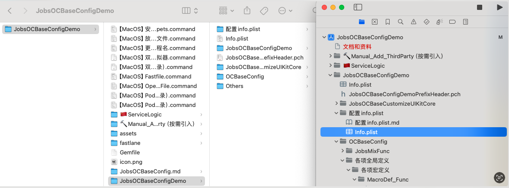


### 2、在Apple芯片（目前是M系列）编译失败的解决方案 <a href="#前言" style="font-size:17px; color:green;"><b>回到顶部</b></a>
* 禁用系统完整性保护 (**S**ystem **I**ntegrity **P**rotection, SIP)   <font color=red>**如果不禁用，会对某些文件夹有读写权限控制**</font>
  * 重启MacOS，长按开机键，直到🌏页面，进入恢复模式
  * 在恢复模式的 macOS 实用工具窗口中，选择“实用工具”菜单，然后选择“终端”以打开终端窗口
    ```shell
    csrutil disable
    ```
  * 重启MacOS
  * 在xcode里面做如下设置：<font color=red>**每一个工程下都做检查**</font>
  	因为涉及到xcode的安全设置，所以下列操作只能手动操作，而不能用脚本进行。如果不做设置，很可能编译失败
    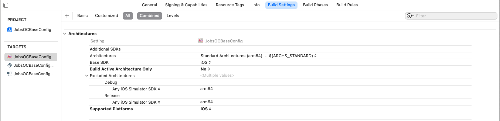
    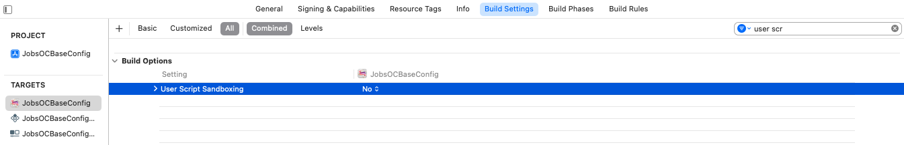
  
  * 文件夹授权
    ```shell
    sudo chown -R $(whoami) 项目目录
    sudo chmod -R u+rw 项目目录
    ```
  * 在`podfile`文件里面，设置：
    ```ruby
    # 用于指定你的 Pod 项目应使用静态库而不是动态库。
    # 这个选项主要用于解决某些与动态库相关的兼容性和性能问题。
    use_frameworks! :linkage => :static
    ```
  * 重新运行`pod`
    ```shell
    pod install
    ```
### 3、iOS模拟器 <a href="#前言" style="font-size:17px; color:green;"><b>回到顶部</b></a>

* 命令行唤起 iOS模拟器

  ```shell
  open -a Simulator
  ```

* 如果更新或者删除xcode，那么下载的iOS模拟器将会丢失

* 模拟器文件通常存储在以下路径

  ```shell
  open ~/Library/Developer/CoreSimulator/Volumes/
  ```

* 备份iOS模拟器文件夹到桌面`Volumes`

  脚本自动化：[**【MacOS】备份iOS模拟器.command**](https://github.com/295060456/JobsOCBaseConfigDemo/blob/main/%E3%80%90MacOS%E3%80%91%E5%A4%87%E4%BB%BDiOS%E6%A8%A1%E6%8B%9F%E5%99%A8.command)

  ```shell
  #!/bin/bash
  
  # 创建桌面上的Volumes文件夹（如果不存在）
  mkdir -p ~/Desktop/Volumes
  # 使用rsync复制目录并显示进度
  sudo rsync -avh --progress /Library/Developer/CoreSimulator/Volumes/ ~/Desktop/Volumes/
  echo "Volumes文件夹已成功复制到桌面。"
  ```

* 还原iOS模拟器（执行完毕后，需要重启xcode）

  脚本自动化：[**【MacOS】恢复iOS模拟器.command**](https://github.com/295060456/JobsOCBaseConfigDemo/blob/main/%E3%80%90MacOS%E3%80%91%E6%81%A2%E5%A4%8DiOS%E6%A8%A1%E6%8B%9F%E5%99%A8.command)
  
  ```shell
  #!/bin/bash
  
  # 确保目标目录存在
  sudo mkdir -p /Library/Developer/CoreSimulator/Volumes
  # 使用rsync复制目录并显示进度
  sudo rsync -avh --progress ~/Desktop/Volumes/ /Library/Developer/CoreSimulator/Volumes/
  echo "桌面的Volumes文件夹内容已成功复制到/Library/Developer/CoreSimulator/Volumes。"
  ```

### 4、`lldb`的使用 <a href="#前言" style="font-size:17px; color:green;"><b>回到顶部</b></a>

```shell
(lldb) target list
Current targets:
* target #0: /Users/user/Library/Developer/CoreSimulator/Devices/E17E7DE8-7ADA-42FD-A743-A1A3A6CB7E42/data/Containers/Bundle/Application/C590303C-50A7-4BB2-826F-8598E5F3A66C/JobsOCBaseConfigDemo.app/JobsOCBaseConfigDemo ( arch=x86_64-apple-ios-simulator, platform=ios-simulator, pid=89318, state=stopped )
(lldb) target select 0
Current targets:
* target #0: /Users/user/Library/Developer/CoreSimulator/Devices/E17E7DE8-7ADA-42FD-A743-A1A3A6CB7E42/data/Containers/Bundle/Application/C590303C-50A7-4BB2-826F-8598E5F3A66C/JobsOCBaseConfigDemo.app/JobsOCBaseConfigDemo ( arch=x86_64-apple-ios-simulator, platform=ios-simulator, pid=89318, state=stopped )
```

### 5、`Command Line Tools` <a href="#前言" style="font-size:17px; color:green;"><b>回到顶部</b></a>

* 查看`Command Line Tools`版本

  ```shell
  Last login: Wed Jul 10 09:58:40 on ttys003
  ➜  Desktop pkgutil --pkg-info=com.apple.pkg.CLTools_Executables
  
  package-id: com.apple.pkg.CLTools_Executables
  version: 15.3.0.0.1.1708646388
  volume: /
  location: /
  install-time: 1719293997
  ```

### 6、xcode 配置 <a href="#前言" style="font-size:17px; color:green;"><b>回到顶部</b></a>

#### 6.1、新工程配置

* <font id =Unknown_class_in_Interface_Builder_file>处理编译器警告：**`Unknown class in Interface Builder file`**</font>

  * 错误的原因通常是因为在**Interface Builder**中指定的类名与实际代码中的类名不匹配
  * 在`*.Storyboard`或`*.xib`文件中，选择**View Controller**，查看**Identity Inspector**，确保**Class**字段中的类名拼写正确（这里的处理方式是删除），并且**Module**字段留空或选择正确的模块（通常是你的项目名）。

  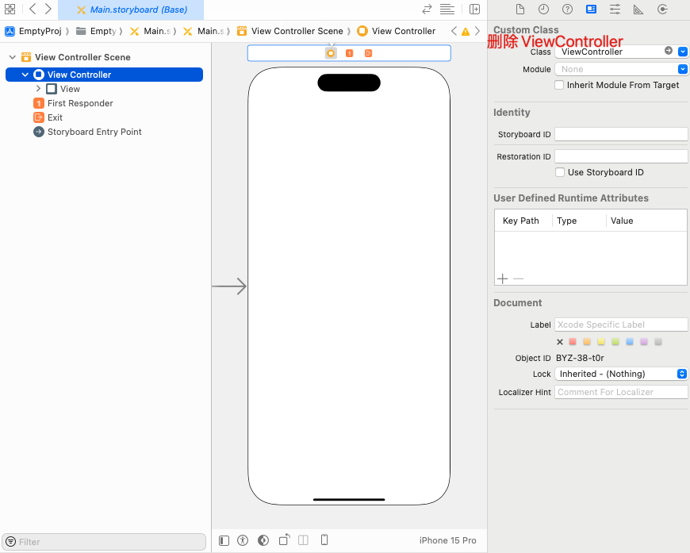

#### 6.2、`Arguments Passed On Launch`标签设置

* 设置应用的语言环境

  ```
  AppleLanguages ( "en" )
  ```

* 启用**Core Data SQL**语句调试日志

  ```
  -com.apple.CoreData.SQLDebug 1
  ```

* 忽略应用的保存状态，强制应用在每次启动时都以初始状态运行    <font color=red>**这个参数在调试应用启动问题时很有用**</font>

  ```
  -ApplePersistenceIgnoreState YES
  ```

* 强制应用使用特定的用户界面风格（浅色模式或深色模式）

  ```
  -UIUserInterfaceStyle Light
  -UIUserInterfaceStyle Dark
  ```

* 启用 **Firebase** 调试日志

  ```
  -FIRDebugEnabled
  ```

* 启用`僵尸对象`检测   <font color=red>**帮助调试被释放的对象仍然被访问的问题**</font>

  ```
  -NSZombieEnabled YES
  ```

* 启用视图对齐矩形的可视化   <font color=red>**这可以帮助调试视图布局问题**</font>

  ```
  -UIViewShowAlignmentRects YES
  ```

* 启用 **Foundation** 框架的调试描述

  ```
  -NSDebugDescription YES
  ```

* 启用文档修订调试模式

  ```
  -NSDocumentRevisionsDebugMode YES
  ```

* 启用 CFNetwork 诊断日志。    <font color=red>**这对于调试网络请求问题非常有用**</font>

  ```
  -CFNetworkDiagnosticsEnable 1
  ```

* 强制应用使用特定的文本方向（例如从左到右或从右到左）

  ```
  -AppleTextDirection YES
  ```

#### 6.3、`Environment Variables`标签

* 日志配置：添加一个新的环境变量。将 `Name` 设置为 `IDEPreferLogStreaming`，将 `Value` 设置为 `YES`

  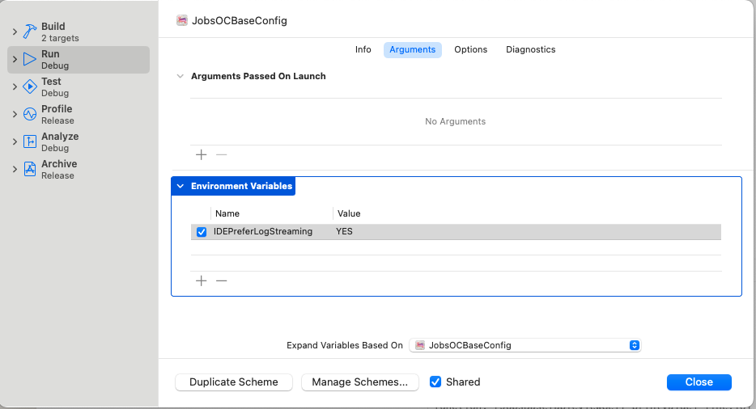

### 7、打印 <a href="#前言" style="font-size:17px; color:green;"><b>回到顶部</b></a>

#### 7.1、重写打印输出

* 关注文件：[**MacroDef_Log.h**](https://github.com/295060456/JobsOCBaseConfigDemo/blob/main/JobsOCBaseConfigDemo/OCBaseConfig/%E5%90%84%E9%A1%B9%E5%85%A8%E5%B1%80%E5%AE%9A%E4%B9%89/%E5%90%84%E9%A1%B9%E5%AE%8F%E5%AE%9A%E4%B9%89/MacroDef_Sys/MacroDef_Log.h)

  * 使之能定位到具体文件行的输出

    ```objective-c
    #pragma mark —— 控制台Log打印格式重写
    #ifndef NSLog
    #define NSLog(FORMAT, ...) fprintf(stderr,"\nfunction:%s line:%d content:%s\n", __FUNCTION__, __LINE__, [[NSString stringWithFormat:FORMAT, ##__VA_ARGS__] UTF8String]);
    #endif
    ```

  * 使之能简化打印结构体步骤

    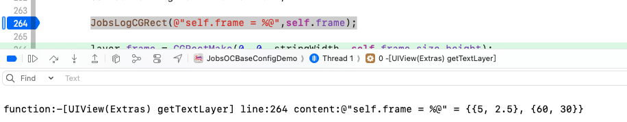

    ```objective-c
    #pragma mark —— 打印结构体
    #ifndef JobsLogCGPoint
    #define JobsLogCGPoint(format, ...) NSLog(@"%s = %@", #format, NSStringFromCGPoint(__VA_ARGS__))
    #endif
    
    #ifndef JobsLogCGVector
    #define JobsLogCGVector(format, ...) NSLog(@"%s = %@", #format, NSStringFromCGVector(__VA_ARGS__))
    #endif
    
    #ifndef JobsLogCGSize
    #define JobsLogCGSize(format, ...) NSLog(@"%s = %@", #format, NSStringFromCGSize(__VA_ARGS__))
    #endif
    
    #ifndef JobsLogCGRect
    #define JobsLogCGRect(format, ...) NSLog(@"%s = %@", #format, NSStringFromCGRect(__VA_ARGS__))
    #endif
    
    #ifndef JobsLogCGAffineTransform
    #define JobsLogCGAffineTransform(format, ...) NSLog(@"%s = %@", #format, NSStringFromCGAffineTransform(__VA_ARGS__))
    #endif
    
    #ifndef JobsLogUIEdgeInsets
    #define JobsLogUIEdgeInsets(format, ...) NSLog(@"%s = %@", #format, NSStringFromUIEdgeInsets(__VA_ARGS__))
    #endif
    
    #ifndef JobsLogDirectionalEdgeInsets
    #define JobsLogDirectionalEdgeInsets(format, ...) NSLog(@"%s = %@", #format, NSStringFromDirectionalEdgeInsets(__VA_ARGS__))
    #endif
    
    #ifndef JobsLogOffset
    #define JobsLogOffset(format, ...) NSLog(@"%s = %@", #format, NSStringFromUIOffset(__VA_ARGS__))
    #endif
    ```

* 关注实现类：[**@interface UIView (Extras)**](https://github.com/295060456/JobsOCBaseConfigDemo/tree/main/JobsOCBaseConfigDemo/JobsOCBaseCustomizeUIKitCore/UIView/UIView%2BCategory/UIView%2BExtras)

  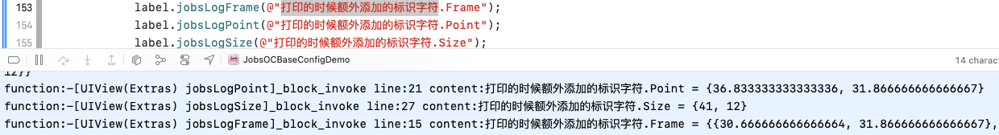

  * 定义在`View`层

    ```objective-c
    -(jobsByStringBlock _Nonnull)jobsLogFrame;
    -(jobsByStringBlock _Nonnull)jobsLogPoint;
    -(jobsByStringBlock _Nonnull)jobsLogSize;
    ```
  
  * 相关调用

    ```objective-c
    label.jobsLogFrame(@"打印的时候额外添加的标识字符");
    label.jobsLogPoint(@"打印的时候额外添加的标识字符");
    label.jobsLogSize(@"打印的时候额外添加的标识字符");
    ```
  
#### 7.2、利用**Runtime**的机制打印类的内容

* 返回并打印成员变量列表

  ```objective-c
  -(NSMutableArray <NSString *>*)printIvarList;
  ```

* 返回并打印属性列表

  ```objective-c
  -(NSMutableArray <NSString *>*)printPropertyList;
  ```

* 返回并打印方法列表

  ````objective-c
  -(NSMutableArray <NSString *>*)printMethodList;
  ````

* 返回并打印协议列表

  ```objective-c
  -(NSMutableArray <NSString *>*)printProtocolList;
  ```


### 8、iOS xcode <font color=red>代码块</font>，提升编码效率必备之首选 <a href="#前言" style="font-size:17px; color:green;"><b>回到顶部</b></a>

* 提升编码效率，快用[**快捷键调取代码块**](https://github.com/JobsKit/JobsCodeSnippets)
* 脚本自动化：[**`【MacOS】安装JobsCodeSnippets.command`**](https://github.com/295060456/JobsOCBaseConfigDemo/blob/main/%E3%80%90MacOS%E3%80%91%E5%AE%89%E8%A3%85JobsCodeSnippets.command)

### 9、**手动打包`*.ipa`流程 <a href="#前言" style="font-size:17px; color:green;"><b>回到顶部</b></a>**

* 电脑桌面新建文件夹，并重命名为`payload`

* 真机运行项目（不同设备，不同芯片组，底层指令集不一致）

* 打开项目工程目录下`Products`，里面有个`*.app`

  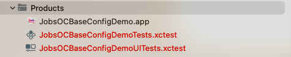

* 将这个`*.app`复制到刚才电脑桌面新建的`payload`文件夹

* 压缩电脑桌面新建的`payload`文件夹为zip格式的压缩包

* 将这个`zip`格式的压缩包，强行改名`*.ipa`

* 脚本自动化：[**`【MacOS】放在iOS项目工程根目录下，自动打包并输出为ipa文件.command`**](https://github.com/295060456/JobsOCBaseConfigDemo/blob/main/%E3%80%90MacOS%E3%80%91%E6%94%BE%E5%9C%A8iOS%E9%A1%B9%E7%9B%AE%E5%B7%A5%E7%A8%8B%E6%A0%B9%E7%9B%AE%E5%BD%95%E4%B8%8B%EF%BC%8C%E8%87%AA%E5%8A%A8%E6%89%93%E5%8C%85%E5%B9%B6%E8%BE%93%E5%87%BA%E4%B8%BAipa%E6%96%87%E4%BB%B6.command)

### 10、[**<font color=red>`JobsBlock`</font>**](https://github.com/295060456/JobsBlock/blob/main/README.md) <a href="#前言" style="font-size:17px; color:green;"><b>回到顶部</b></a>

* 背景意义：**统一全局的Block定义，减少冗余代码**

* <font color=blue>**特别说明**</font>：如果有外源（非系统Api）类参与到Block的定义，此时<u>不能使用</u><font color=red>`#import`</font>，因为会产生编译错误。此时正确的做法是使用<font color=red>**`@class`**</font>

* ```ruby
  pod 'JobsBlock' # https://github.com/295060456/JobsBlock
  ```

  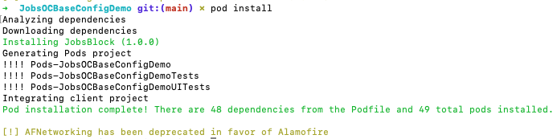

* <font color=red>因为**CDN**同步的原因，有些第三方pod并不能在[**cocoapods.org**](https://cocoapods.org/)被成功的搜索到，这就导致如果`pod install`拉取不到代码，可能需要切换镜像，然后再进行操作。建议运行项目根目录下的2个脚本文件，自动获取</font>

  * `【MacOS】Pod_Install（适用于IOS工程根目录）.command`
  * `【MacOS】Pod_Update（适用于IOS工程根目录）.command`
  
* <font color=blue>不定参数Block【 使用示例】</font>

  ```objective-c
  [self GettingPicBlock:^(id firstArg, ...)NS_REQUIRES_NIL_TERMINATION{
      @jobs_strongify(self)
      if (firstArg) {
          // 取出第一个参数
          NSLog(@"%@", firstArg);
          // 定义一个指向个数可变的参数列表指针；
          va_list args;
          // 用于存放取出的参数
          id arg = nil;
          // 初始化变量刚定义的va_list变量，这个宏的第二个参数是第一个可变参数的前一个参数，是一个固定的参数
          va_start(args, firstArg);
          // 遍历全部参数 va_arg返回可变的参数(a_arg的第二个参数是你要返回的参数的类型)
          if ([firstArg isKindOfClass:NSNumber.class]) {
              NSNumber *num = (NSNumber *)firstArg;
              for (int i = 0; i < num.intValue; i++) {
                  arg = va_arg(args, id);
  //                    NSLog(@"KKK = %@", arg);
                  if ([arg isKindOfClass:UIImage.class]) {
                      NSLog(@"");
                  }else if ([arg isKindOfClass:PHAsset.class]){
                      NSLog(@"");
                  }else if ([arg isKindOfClass:NSString.class]){
                      NSLog(@"");
                  }else if ([arg isKindOfClass:NSArray.class]){
                      NSLog(@"");
                  }else{
                      NSLog(@"");
                  }
              }
          }else{
              NSLog(@"");
          }
          // 清空参数列表，并置参数指针args无效
          va_end(args);
      }
  }];
  ```

### 11、[**<font color=red>`BaseProtocol` 相关继承结构关系图</font>**](https://github.com/295060456/JobsOCBaseConfigDemo/blob/main/JobsOCBaseConfigDemo/JobsOCBaseCustomizeUIKitCore/BaseProtocol/BaseProtocol.md) <a href="#前言" style="font-size:17px; color:green;"><b>回到顶部</b></a>

* **如果两个对象都继承了共同的协议，互相包含会造成编译器错误**

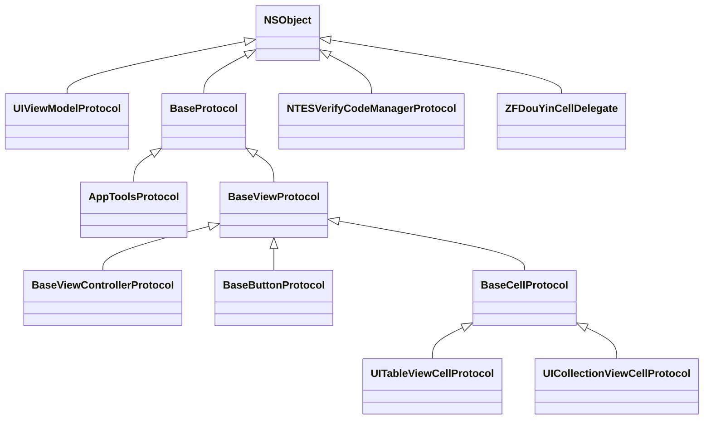

### 12、**`UIViewModelFamily`（将持续更新） <a href="#前言" style="font-size:17px; color:green;"><b>回到顶部</b></a>**

* 产生背景：页面之间传值，只需要瞄准1个<font color=red>**数据束**</font>。当需要增删数据的时候，可以有效减少操作，方便管理
* `UIViewModel`即是页面之间传值的这个<font color=red>**数据束**</font>
* `UITextModel`是专门针对文本的<font color=red>**数据束**</font>
* 结合`BaseProtocol`进行封装
* 减少冗余代码，将公用头文件提升到协议进行定义
```mermaid
classDiagram
class UIViewModelProtocol {
    +@property(nonatomic,strong,nullable)UITextModel *textModel;
    +@property(nonatomic,strong,nullable)UITextModel *subTextModel;
    +@property(nonatomic,strong,nullable)UITextModel *backBtnTitleModel;
    +@property(nonatomic,strong,nullable)UIButtonModel *buttonModel;
    +@property(nonatomic,strong,nullable)UIButtonModel *subButtonModel;
    +@property(nonatomic,strong,nullable)JobsReturnIDByIDBlock jobsBlock;
    +@property(nonatomic,strong,nullable)NSMutableArray <JobsReturnIDByIDBlock>*jobsBlockMutArr;
}
UIPictureAndBackGroundCorProtocol <|-- UIViewModelProtocol
UILocationProtocol <|-- UIViewModelProtocol
UIMarkProtocol <|-- UIViewModelProtocol
UIViewModelOthersProtocol <|-- UIViewModelProtocol
BaseButtonProtocol <|-- UIViewModelProtocol
UITextModelProtocol <|-- UIViewModelProtocol

class UICollectionViewCellProtocol {
    +-(UICollectionView *)jobsGetCurrentCollectionView;
    +-(NSIndexPath *)jobsGetCurrentIndexPath;
    +-(NSInteger)jobsGetCurrentNumberOfSections;
    +-(NSInteger)jobsGetCurrentNumberOfItemsInSection;
    +-(UITextView *)getTextView;
    +-(UIButton *)getBgBtn;
}
BaseCellProtocol <|-- UICollectionViewCellProtocol

class UIMarkProtocol {
    +@property(nonatomic,strong,nullable)NSIndexPath __block *indexPath;
    +@property(nonatomic,assign)NSInteger __block section;
    +@property(nonatomic,assign)NSInteger __block row;
    +@property(nonatomic,assign)NSInteger __block item;
    +@property(nonatomic,assign)CGPoint __block lastPoint;
    +@property(nonatomic,assign)NSInteger __block index;
    +@property(nonatomic,assign)NSInteger __block currentPage;
    +@property(nonatomic,assign)NSInteger __block pageSize;
    +@property(nonatomic,assign)BOOL __block isMark;
    +@property(nonatomic,assign)CGFloat presentUpHeight;
}
NSObject <|-- UIMarkProtocol

class UIPictureAndBackGroundCorProtocol {
    +@property(nonatomic,strong,nullable)UIImage __block *image;
    +@property(nonatomic,strong,nullable)UIImage __block *bgImage;
    +@property(nonatomic,strong,nullable)NSString __block *imageURLString;
    +@property(nonatomic,strong,nullable)NSString __block *bgImageURLString;
    +@property(nonatomic,strong,nullable)UIColor __block *bgCor;
    +@property(nonatomic,strong,nullable)UIImage __block *backBtnIMG;
    +@property(nonatomic,strong,nullable)UIBackgroundConfiguration *bgConfig API_AVAILABLE(ios(14.0), tvos(14.0), watchos(7.0));
    +@property(nonatomic,strong,nullable)UIImage __block *selectedImage;
    +@property(nonatomic,strong,nullable)UIImage __block *bgSelectedImage;
    +@property(nonatomic,strong,nullable)NSString __block *selectedImageURLString;
    +@property(nonatomic,strong,nullable)NSString __block *bgSelectedImageURLString;
    +@property(nonatomic,strong,nullable)UIColor __block *bgSelectedCor;
    +@property(nonatomic,strong,nullable)UIImage __block *backBtnSelectedIMG;
    +@property(nonatomic,strong,nullable)UIBackgroundConfiguration *bgSelectedConfig API_AVAILABLE(ios(14.0), tvos(14.0), watchos(7.0));
    +@property(nonatomic,strong,nullable)UIImageView __block *bgImageView;
}
NSObject <|-- UIPictureAndBackGroundCorProtocol

class BaseViewControllerProtocol {
    +- (void)updateStatusBarCor:(UIColor *_Nullable)cor;
    +-(void)restoreStatusBarCor:(UIColor *_Nullable)cor;
    +-(void)showUserInfo;
    +-(void)setGKNav;
    +-(void)setGKNavBackBtn;
    +@property(nonatomic,weak)UIViewController *fromVC;
    +@property(nonatomic,strong,nullable)SPAlertController *alertController;
    +@property(nonatomic,assign)ComingStyle pushOrPresent;
    +@property(nonatomic,assign)BOOL setupNavigationBarHidden;
    +@property(nonatomic,strong)UIView *statusBar;
}
BaseViewProtocol <|-- BaseViewControllerProtocol

class AppToolsProtocol {
    +-(void)toLoginOrRegister:(CurrentPage)appDoorContentType;
    +-(void)toLogin;
    +-(void)forcedLogin;
    +-(void)popUpViewToLogout;
    +-(UITabBar *)getTabBar;
    +-(void)tabBarClosePan;
    +-(void)tabBarOpenPan;
    +-(void)jumpToHome;
    +-(NSMutableArray <UIViewController *>*)appRootVC;
    +-(BOOL)isRootVC;
    +-(NSString *)encodePicStr:(NSString *)picStr;
    +-(NSString *)decodePicStr:(NSString *)encodePicStr;
    +-(void)openGameWithUrl:(NSString *)url;
    +-(UIImage *)defaultHeaderImage;
    +-(NSString *)currentLanguage;
    +-(HTTPRequestHeaderLanguageType)currentLanguageType;
    +-(void)actionForHotLabel:(JobsHotLabelWithSingleLine *)hl;
}
BaseProtocol <|-- AppToolsProtocol

class UIViewModelOthersProtocol {
    +@property(nonatomic,strong,nullable)UIColor *layerBorderCor;
    +@property(nonatomic,assign)CGFloat layerBorderWidth;
    +@property(nonatomic,assign)CGFloat layerCornerRadius;
    +@property(nonatomic,assign)BOOL isTranslucent;
    +@property(nonatomic,assign)BOOL isVisible;(BOOL)jobsVisible;
    +@property(nonatomic,assign)BOOL isMultiLineShows;
    +@property(nonatomic,assign)UILabelShowingType labelShowingType;
    +@property(nonatomic,assign)AppLanguage appLanguage;
    +@property(nonatomic,strong,nullable)NSString *internationalizationKEY;
    +@property(nonatomic,strong,nullable)NSMutableSet *jobsDataMutSet;
    +@property(nonatomic,strong,nullable)NSMutableArray *jobsDataMutArr;
    +@property(nonatomic,strong,nullable)NSMutableArray <UIViewModel *> *viewModelMutArr;
    +@property(nonatomic,strong,nullable)NSMutableDictionary *jobsDataMutDic;
    +@property(nonatomic,strong,nullable)Class cls;
    +@property(nonatomic,strong,nullable)RACSignal *reqSignal;
    +@property(nonatomic,strong,nullable)id data;
    +@property(nonatomic,strong,nullable)id requestParams;
    +@property(nonatomic,strong,nullable)UIViewModel *viewModel;
    +@property(nonatomic,assign)NSUInteger jobsTag;
    +@property(nonatomic,assign)BOOL jobsSelected;
    +@property(nonatomic,assign)BOOL jobsEnabled;
    +@property(nonatomic,strong,nullable)UIAction *primaryAction;
    +@property(nonatomic,copy,nullable)JobsReturnIDBySelectorBlock longPressGestureEventBlock;
    +@property(nonatomic,copy,nullable)JobsReturnIDByIDBlock clickEventBlock;
}
NSObject <|-- UIViewModelOthersProtocol

class UITextModelProtocol {
    +@property(nonatomic,assign)NSTextAlignment __block textAlignment;
    +@property(nonatomic,assign)NSLineBreakMode __block lineBreakMode;
    +@property(nonatomic,assign)CGFloat __block textLineSpacing;
    +@property(nonatomic,copy)NSString __block *placeholder;
    +@property(nonatomic,strong)UIColor __block *placeholderColor;
    +@property(nonatomic,assign)NSInteger __block curWordCount;
    +@property(nonatomic,assign)NSInteger __block maxWordCount;
    +@property(nonatomic,strong,nullable)NSString __block *text;
    +@property(nonatomic,strong,nullable)UIFont __block *font;
    +@property(nonatomic,strong,nullable)UIColor __block *textCor;
    +@property(nonatomic,strong,nullable)NSAttributedString __block *attributedText API_AVAILABLE(ios(6.0));
    +@property(nonatomic,strong)NSMutableArray <JobsRichTextConfig *>__block *titleAttributedDataMutArr;
    +@property(nonatomic,strong,nullable)NSString __block *selectedText;
    +@property(nonatomic,strong,nullable)UIFont __block *selectedFont;
    +@property(nonatomic,strong,nullable)UIColor __block *selectedTextCor;
    +@property(nonatomic,strong,nullable)NSAttributedString __block *selectedAttributedText API_AVAILABLE(ios(6.0));
    +@property(nonatomic,strong)NSMutableArray <JobsRichTextConfig *>__block *selectedTitleAttributedDataMutArr;
}
NSObject <|-- UITextModelProtocol

class BaseButtonProtocol {
    +-(void)richElementsInButtonWithModel:(id _Nullable)model;
    ++(CGFloat)buttonWidthWithModel:(id _Nullable)model;
    ++(CGFloat)buttonHeightWithModel:(id _Nullable)model;
    ++(CGSize)buttonSizeWithModel:(id _Nullable)model;
    ++(CGRect)buttonFrameWithModel:(id _Nullable)model;
    +-(CGFloat)buttonWidthWithModel:(id _Nullable)model;
    +-(CGFloat)buttonHeightWithModel:(id _Nullable)model;
    +-(CGSize)buttonSizeWithModel:(id _Nullable)model;
    +-(CGRect)buttonFrameWithModel:(id _Nullable)model;
    +@property(nonatomic,strong)UIFont *titleFont;
    +@property(nonatomic,assign)NSTextAlignment titleAlignment;
    +@property(nonatomic,assign)BOOL jobsSelected;
    +@property(nonatomic,strong)UIImage *normalImage;
    +@property(nonatomic,strong)UIImage *normalBackgroundImage;
    +@property(nonatomic,strong)NSString *normalTitle;
    +@property(nonatomic,strong)NSString *normalSubTitle;
    +@property(nonatomic,strong)UIColor *normalTitleColor;
    +@property(nonatomic,strong)UIColor *normalSubTitleColor;
    +@property(nonatomic,strong)NSAttributedString *normalAttributedTitle;
    +@property(nonatomic,strong)NSAttributedString *normalAttributedSubTitle;
    +@property(nonatomic,strong)UIImage *selectedImage;
    +@property(nonatomic,strong)UIImage *selectedBackgroundImage;
    +@property(nonatomic,strong)NSString *selectedTitle;
    +@property(nonatomic,strong)NSString *selectedSubTitle;
    +@property(nonatomic,strong)UIColor *selectedTitleColor;
    +@property(nonatomic,strong)UIColor *selectedSubTitleColor;
    +@property(nonatomic,strong)NSAttributedString *selectedAttributedTitle;
    +@property(nonatomic,strong)NSAttributedString *selectedAttributedSubTitle;
    +@property(nonatomic,strong)UIColor *btnBackgroundColor;
    +@property(nonatomic,assign)CGSize imageSize;
    +@property(nonatomic,assign)UIControlContentHorizontalAlignment contentHorizontalAlignment;
    +@property(nonatomic,assign)UIControlContentVerticalAlignment contentVerticalAlignment;
    +@property(nonatomic,assign)UIEdgeInsets contentEdgeInsets;
    +@property(nonatomic,readwrite,assign)NSDirectionalEdgeInsets contentInsets;
    +@property(nonatomic,assign)CGFloat contentSpacing;
    +@property(nonatomic,assign)NSLineBreakMode lineBreakMode;
    +@property(nonatomic,assign)CGFloat btnWidth;
    +@property(nonatomic,assign)CGRect textLabelFrame;
    +@property(nonatomic,assign)CGRect subTextLabelFrame;
    +@property(nonatomic,assign)CGRect imageViewFrame;
    +@property(nonatomic,assign)CGSize textLabelSize;
    +@property(nonatomic,assign)CGSize subTextLabelSize;
    +@property(nonatomic,assign)CGSize imageViewSize;
    +@property(nonatomic,assign)CGFloat textLabelWidth;
    +@property(nonatomic,assign)CGFloat subTextLabelWidth;
    +@property(nonatomic,assign)CGFloat imageViewWidth;
    +@property(nonatomic,assign)CGFloat textLabelHeight;
    +@property(nonatomic,assign)CGFloat subTextLabelHeight;
    +@property(nonatomic,assign)CGFloat imageViewHeight;
    +@property(nonatomic,assign)CGFloat textLabelFrameOffsetX;
    +@property(nonatomic,assign)CGFloat textLabelFrameOffsetY;
    +@property(nonatomic,assign)CGFloat textLabelFrameOffsetWidth;
    +@property(nonatomic,assign)CGFloat textLabelFrameOffsetHeight;
    +@property(nonatomic,assign)CGFloat subTextLabelFrameOffsetX;
    +@property(nonatomic,assign)CGFloat subTextLabelFrameOffsetY;
    +@property(nonatomic,assign)CGFloat subTextLabelFrameOffsetWidth;
    +@property(nonatomic,assign)CGFloat subTextLabelFrameOffsetHeight;
    +@property(nonatomic,assign)CGFloat imageViewFrameOffsetX;
    +@property(nonatomic,assign)CGFloat imageViewFrameOffsetY;
    +@property(nonatomic,assign)CGFloat imageViewFrameOffsetWidth;
    +@property(nonatomic,assign)CGFloat imageViewFrameOffsetHeight;
}
BaseViewProtocol <|-- BaseButtonProtocol

class UITableViewCellProtocol {
    ++(instancetype)initTableViewCellWithStyle:(UITableViewCellStyle)style;
    ++(instancetype)cellStyleDefaultWithTableView:(UITableView *)tableView;
    ++(instancetype)cellStyleValue1WithTableView:(UITableView *)tableView;
    ++(instancetype)cellStyleValue2WithTableView:(UITableView *)tableView;
    ++(instancetype)cellStyleSubtitleWithTableView:(UITableView *)tableView;
    ++(void)settingForTableViewCell:(UITableViewCell *)tableViewCell;
    +-(UITableView *)jobsGetCurrentTableView;
    +-(NSIndexPath *)jobsGetCurrentIndexPath;
    +-(NSInteger)jobsGetCurrentNumberOfSections;
    +-(NSInteger)jobsGetCurrentNumberOfRowsInSection;
    +@property(nonatomic,assign)CGRect textLabelFrame;
    +@property(nonatomic,assign)CGRect detailTextLabelFrame;
    +@property(nonatomic,assign)CGRect imageViewFrame;
    +@property(nonatomic,assign)CGSize textLabelSize;
    +@property(nonatomic,assign)CGSize detailTextLabelSize;
    +@property(nonatomic,assign)CGSize imageViewSize;
    +@property(nonatomic,assign)CGFloat textLabelWidth;
    +@property(nonatomic,assign)CGFloat textLabelHeight;
    +@property(nonatomic,assign)CGFloat detailTextLabelWidth;
    +@property(nonatomic,assign)CGFloat detailTextLabelHeight;
    +@property(nonatomic,assign)CGFloat imageViewWidth;
    +@property(nonatomic,assign)CGFloat imageViewHeight;
    +@property(nonatomic,assign)CGFloat textLabelFrameOffsetX;
    +@property(nonatomic,assign)CGFloat textLabelFrameOffsetY;
    +@property(nonatomic,assign)CGFloat textLabelFrameOffsetWidth;
    +@property(nonatomic,assign)CGFloat textLabelFrameOffsetHeight;
    +@property(nonatomic,assign)CGFloat detailTextLabelOffsetX;
    +@property(nonatomic,assign)CGFloat detailTextLabelOffsetY;
    +@property(nonatomic,assign)CGFloat detailTextLabelOffsetWidth;
    +@property(nonatomic,assign)CGFloat detailTextLabelOffsetHeight;
    +@property(nonatomic,assign)CGFloat imageViewFrameOffsetX;
    +@property(nonatomic,assign)CGFloat imageViewFrameOffsetY;
    +@property(nonatomic,assign)CGFloat imageViewFrameOffsetWidth;
    +@property(nonatomic,assign)CGFloat imageViewFrameOffsetHeight;
}
BaseCellProtocol <|-- UITableViewCellProtocol

class BaseCellProtocol {
    +-(jobsByIDBlock _Nonnull)richElementsInCellWithModel;
    +-(jobsByIDBlock _Nonnull)richElementsInCellWithModel2;
    ++(CGFloat)cellHeightWithModel:(id _Nullable)model;
    ++(CGSize)cellSizeWithModel:(id _Nullable)model;
    +-(void)setCellBgImage:(UIImage *)bgImage;
    +-(UIButton *)getLeftBtn;
    +-(UIButton *)getRightBtn;
}
BaseViewProtocol <|-- BaseCellProtocol

class BaseViewProtocol {
    +-(jobsByIDBlock _Nonnull)jobsRichElementsInViewWithModel;
    ++(CGFloat)viewWidthWithModel:(id _Nullable)model;
    ++(CGFloat)viewHeightWithModel:(id _Nullable)model;
    ++(CGFloat)heightForFooterInSection:(id _Nullable)model;
    ++(CGFloat)heightForHeaderInSection:(id _Nullable)model;
    ++(CGSize)viewSizeWithModel:(id _Nullable)model;
    ++(CGRect)viewFrameWithModel:(id _Nullable)model;
    ++(CGFloat)viewChangeXWithModel:(id _Nullable)model;
    ++(CGFloat)viewChangeYWithModel:(id _Nullable)model;
    ++(CGFloat)viewChangeWidthWithModel:(id _Nullable)model;
    ++(CGFloat)viewChangeHeightWithModel:(id _Nullable)model;
    ++(CGSize)collectionReusableViewSizeWithModel:(id _Nullable)model;
    ++(CGFloat)widthByData:(UIViewModel *_Nonnull)data;
    ++(CGFloat)heightByData:(UIViewModel *_Nonnull)data;
    +-(CGFloat)viewWidthWithModel:(id _Nullable)model;
    +-(CGFloat)viewHeightWithModel:(id _Nullable)model;
    +-(CGFloat)heightForFooterInSection:(id _Nullable)model;
    +-(CGFloat)heightForHeaderInSection:(id _Nullable)model;
    +-(CGSize)viewSizeWithModel:(id _Nullable)model;
    +-(CGRect)viewFrameWithModel:(id _Nullable)model;
    +-(CGFloat)viewChangeXWithModel:(id _Nullable)model;
    +-(CGFloat)viewChangeYWithModel:(id _Nullable)model;
    +-(CGFloat)viewChangeWidthWithModel:(id _Nullable)model;
    +-(CGFloat)viewChangeHeightWithModel:(id _Nullable)model;
    +-(CGSize)collectionReusableViewSizeWithModel:(id _Nullable)model;
    +-(CGFloat)widthByData:(UIViewModel *_Nonnull)data;
    +-(CGFloat)heightByData:(UIViewModel *_Nonnull)data;
    +-(instancetype)initWithSize:(CGSize)thisViewSize;
    +-(UIViewModel *_Nullable)getViewModel;
    +-(JobsReturnViewByTableViewHeaderFooterViewBlock)makeViewOnTableViewHeaderFooterView;
    +@property(nonatomic,strong,nullable)JobsReturnIDByIDBlock jobsBackBlock;
    +@property(nonatomic,assign)UIRectCorner layoutSubviewsRectCorner;
    +@property(nonatomic,assign)CGSize layoutSubviewsRectCornerSize;
    +@property(nonatomic,strong)NSMutableArray <MASConstraint *>*constraintMutArr;
    +@property(nonatomic,assign)CGSize thisViewSize;
    +@property(nonatomic,assign)JobsHeaderFooterViewStyle headerFooterViewStyle;
}
BaseProtocol <|-- BaseViewProtocol

class UILocationProtocol {
    +@property(nonatomic,assign)UIInterfaceOrientationMask currentInterfaceOrientationMask;
    +@property(nonatomic,assign)CGFloat __block cornerRadius;
    +@property(nonatomic,assign)UIRectCorner __block rectCorner;
    +@property(nonatomic,assign)CGSize __block cornerRadii;
    +@property(nonatomic,assign)CGFloat __block jobsWidth;
    +@property(nonatomic,assign)CGFloat __block jobsHeight;
    +@property(nonatomic,assign)CGFloat __block jobsTop;
    +@property(nonatomic,assign)CGFloat __block jobsLeft;
    +@property(nonatomic,assign)CGFloat __block jobsRight;
    +@property(nonatomic,assign)CGFloat __block jobsBottom;
    +@property(nonatomic,assign)CGFloat __block jobsOffsetX;
    +@property(nonatomic,assign)CGFloat __block jobsOffsetY;
    +@property(nonatomic,assign)CGSize __block jobsSize;
    +@property(nonatomic,assign)CGRect __block jobsRect;
    +@property(nonatomic,assign)CGPoint __block jobsPoint;
    +@property(nonatomic,assign)UILayoutConstraintAxis __block axis;
    +@property(nonatomic,assign)UIStackViewDistribution __block distribution;
    +@property(nonatomic,assign)UIStackViewAlignment __block alignment;
    +@property(nonatomic,assign)NSDirectionalRectEdge __block buttonEdgeInsetsStyle;
    +@property(nonatomic,assign)CGFloat __block imageTitleSpace;
    +@property(nonatomic,assign)CGFloat __block titleSpace;
    +@property(nonatomic,assign)CGFloat __block cellHeight;
    +@property(nonatomic,assign)CGFloat __block heightForHeaderInSection;
    +@property(nonatomic,assign)CGSize __block cellSize;
    +@property(nonatomic,assign)CGSize __block tableHeaderViewSize;
    +@property(nonatomic,assign)CGSize __block tableFooterViewSize;
    +@property(nonatomic,assign)BOOL __block usesTableViewHeaderView;
    +@property(nonatomic,assign)BOOL __block usesTableViewFooterView;
    +@property(nonatomic,assign)CGFloat __block offsetXForEach;
    +@property(nonatomic,assign)CGFloat __block offsetYForEach;
    +@property(nonatomic,assign)CGFloat __block offsetHeight;
    +@property(nonatomic,assign)CGFloat __block offsetWidth;
}
NSObject <|-- UILocationProtocol

class BaseProtocol {
    +-(void)languageSwitchNotificationWithSelector:(SEL)aSelector;
    +-(void)changeTabBarItemTitle:(NSIndexPath *)indexPath;
    +-(JobsReturnIDByIDBlock _Nonnull)valueForKeyBlock;
    +-(JobsReturnBOOLByIDBlock _Nonnull)isKindOfClassBlock;
    +-(JobsReturnBOOLByIDBlock _Nonnull)isMemberOfClassBlock;
    ++(void)target:(id)target languageSwitchNotificationWithSelector:(SEL)aSelector;
    +-(void)monitorAppLanguage;
    +-(void)languageSwitchNotification:(nonnull NSNotification *)notification;
    ++(void)destroySingleton;
    ++(instancetype)sharedManager;
    +@property(nonatomic,assign)BOOL isLock;
    +@property(nonatomic,strong)RACDisposable *racDisposable;
    +@property(nonatomic,copy)JobsReturnIDByIDBlock keyboardUpNotificationBlock;
    +@property(nonatomic,copy)JobsReturnIDByIDBlock keyboardDownNotificationBlock;
}
NSObject <|-- BaseProtocol
```
### 13、`JobsOCBaseCustomizeUIKitCore` <a href="#前言" style="font-size:17px; color:green;"><b>回到顶部</b></a>

* 产生背景
  * OC的基类是单继承
  * 继承会产生很多基类，客观上造成代码的冗余
* 解决方案
  * 继承和分类应该结合使用，功能各有优劣
  * 分类即是"超级继承"，不需要产生额外的分类，方便管理和调用

### 14、<font id=度量衡>**度量衡**</font> <a href="#前言" style="font-size:17px; color:green;"><b>回到顶部</b></a>

* [**手机屏幕尺寸大全**](https://www.strerr.com/screen.html)

* 关注文件： [**MacroDef_Size.h**](https://github.com/295060456/JobsOCBaseConfigDemo/blob/main/JobsOCBaseConfigDemo/OCBaseConfig/%E5%90%84%E9%A1%B9%E5%85%A8%E5%B1%80%E5%AE%9A%E4%B9%89/%E5%90%84%E9%A1%B9%E5%AE%8F%E5%AE%9A%E4%B9%89/MacroDef_Size/MacroDef_Size.h)

* <font color=red>**当设备横竖屏切换的时候，设备宽高定义会互相反转**</font>。 [即，**此时（横屏）的屏幕宽即为垂直屏的高。同样的，此时（横屏）的屏幕高即为垂直屏的宽**](#横屏的时候，较之于竖屏，宽高会互换)

  * 寻找此设备真正的高
    
    ```objective-c
    NS_INLINE CGFloat JobsDeviceRealHeight(void){
        return MAX(JobsMainScreen_WIDTH(), JobsMainScreen_HEIGHT());
    }
    ```
    
  * 寻找此设备真正的宽
    
    ```objective-c
    NS_INLINE CGFloat JobsDeviceRealWidth(void){
        return MIN(JobsMainScreen_WIDTH(), JobsMainScreen_HEIGHT());
    }
    ```
    
  * 寻找当前屏幕真正的高
    
    ```objective-c
    NS_INLINE CGFloat JobsRealHeight(void){
        return JobsAppTool.currentInterfaceOrientationMask == UIInterfaceOrientationMaskLandscape ? JobsDeviceRealWidth() :JobsDeviceRealHeight();
    }
    ```
    
  * 寻找当前屏幕真正的宽

    ```objective-c
    NS_INLINE CGFloat JobsRealWidth(void){
        return JobsAppTool.currentInterfaceOrientationMask == UIInterfaceOrientationMaskLandscape ? JobsDeviceRealHeight() :JobsDeviceRealWidth();
    }
    ```

* **当前设备是否是全面屏**：

  * 关注实现类：[**@interface UIDevice (XMUtils)**](https://github.com/295060456/JobsOCBaseConfigDemo/tree/main/JobsOCBaseConfigDemo/JobsOCBaseCustomizeUIKitCore/UIDevice/UIDevice%2BCategory/UIDevice%2BXMUtils) 和 [**MacroDef_Size.h**](https://github.com/295060456/JobsOCBaseConfigDemo/blob/main/JobsOCBaseConfigDemo/OCBaseConfig/%E5%90%84%E9%A1%B9%E5%85%A8%E5%B1%80%E5%AE%9A%E4%B9%89/%E5%90%84%E9%A1%B9%E5%AE%8F%E5%AE%9A%E4%B9%89/MacroDef_Size/MacroDef_Size.h)

    ```objective-c
    +(BOOL)isFullScreen;
    ```

* **全局比例尺**
  
  * ```objective-c
    NS_INLINE CGFloat JobsWidth(CGFloat width){
        return (JobsDeviceRealWidth() / 375) * width;
    }
    ```
    
  * ```objective-c
    NS_INLINE CGFloat JobsHeight(CGFloat height){
        return (JobsDeviceRealHeight() / 743) * height;
    }
    ```
  
* **安全距离**
  
  * 顶部的安全距离
  
    ```objective-c
    NS_INLINE CGFloat JobsTopSafeAreaHeight(void){
        if (@available(iOS 11.0, *)) {
            return NSObject.mainWindow().safeAreaInsets.top;
        } else return 0.f;
    }
    ```
  
  * 底部的安全距离：全面屏手机为**34pt**，非全面屏手机为**0pt** 
  
    ```objective-c
    NS_INLINE CGFloat JobsBottomSafeAreaHeight(void){
        if (@available(iOS 11.0, *)) {
            return NSObject.mainWindow().safeAreaInsets.bottom;
        } else return 0.f;
    }
    ```
  
* **状态栏高度**
  
  * `NS_INLINE CGFloat JobsStatusBarHeightByAppleIncData(void) `
  
  * ```objective-c
    NS_INLINE CGFloat JobsRectOfStatusbar(void){
        SuppressWdeprecatedDeclarationsWarning(
            if (@available(iOS 13.0, *)){
                UIStatusBarManager *statusBarManager = NSObject.mainWindow().windowScene.statusBarManager;
                return statusBarManager.statusBarHidden ? 0 : statusBarManager.statusBarFrame.size.height;
            }else return UIApplication.sharedApplication.statusBarFrame.size.height;);
    }
    ```
  
  * ```objective-c
    NS_INLINE CGFloat JobsStatusBarHeight(void){
        if (@available(iOS 11.0, *)) {
            return NSObject.mainWindow().safeAreaInsets.top;
        } else return JobsRectOfStatusbar();
    }
    ```
  
* **导航栏高度**
  * ```objective-c
    NS_INLINE CGFloat JobsNavigationHeight(UINavigationController * _Nullable navigationController){
        if (navigationController) {
            return navigationController.navigationBar.frame.size.height;
        }else return 44.f;
    }
    ```
  
* **状态栏 + 导航栏高度**
  * ```objective-c
    /// 非刘海屏：状态栏高度(20.f) + 导航栏高度(44.f) = 64.f
    /// 刘海屏系列：状态栏高度(44.f) + 导航栏高度(44.f) = 88.f
    NS_INLINE CGFloat JobsNavigationBarAndStatusBarHeight(UINavigationController * _Nullable navigationController){
        return JobsStatusBarHeight() + JobsNavigationHeight(navigationController);
    }
    ```
  
* **TabBar高度**：全面屏手机比普通手机多34的安全区域
  
  * ```objective-c
    NS_INLINE CGFloat JobsTabBarHeight(UITabBarController * _Nullable tabBarController){
        //因为tabbar可以自定义高度，所以这个地方返回系统默认的49像素的高度
        if (tabBarController) {
            return tabBarController.tabBar.frame.size.height;
        }else return 49.f;
    }
    ```
  
  * <font color=red>**包括了底部安全区域的TabBar高度，一般用这个**</font>
  
    ```objective-c
    /// tabbar高度：【包括了底部安全区域的TabBar高度，一般用这个】
    NS_INLINE CGFloat JobsTabBarHeightByBottomSafeArea(UITabBarController * _Nullable tabBarController){
        return JobsTabBarHeight(tabBarController) + JobsBottomSafeAreaHeight();
    }
    ```
  
* **除开 tabBarController 和 navigationController 的内容可用区域的大小**
  
  * ```objective-c
    #pragma mark ——  除开 tabBarController 和 navigationController 的内容可用区域的大小
    NS_INLINE CGFloat JobsContentAreaHeight(UITabBarController * _Nullable tabBarController,
                                                UINavigationController * _Nullable navigationController){
        CGFloat tabBarHeightByBottomSafeArea = JobsTabBarHeightByBottomSafeArea(tabBarController);
        CGFloat navigationBarAndStatusBarHeight = JobsNavigationBarAndStatusBarHeight(navigationController);
        return JobsMainScreen_HEIGHT(nil) - tabBarHeightByBottomSafeArea - navigationBarAndStatusBarHeight;
    }
    ```

### 15、字符串 <a href="#前言" style="font-size:17px; color:green;"><b>回到顶部</b></a>

* **富文本字符串的优先级要高于普通字符串。也就意味着，如果调用了富文本字符串，即便将其设置为nil，普通字符串的设置依然不会奏效**

  ```objective-c
  -(UILabel *)titleLab{
      @jobs_weakify(self)
      if(!_titleLab){
          _titleLab = UILabel.new;
          _titleLab.text = NavBarConfig.title;
          if(NavBarConfig.attributedTitle){
              _titleLab.attributedText = NavBarConfig.attributedTitle;
          }
          _titleLab.font = NavBarConfig.font;
          _titleLab.textColor = NavBarConfig.titleCor;
          [self addSubview:_titleLab];
          [_titleLab mas_makeConstraints:^(MASConstraintMaker *make) {
              make.center.equalTo(self);
              make.height.mas_equalTo(self.height);
          }];
          _titleLab.makeLabelByShowingType(UILabelShowingType_03);
          [self layoutIfNeeded];
          NSLog(@"");
      }return _titleLab;
  }
  ```

#### 15.1、<font color=red>**字符串判空**</font>

* 判空（因为nil是不能唤起方法的，为了防止字符串是nil，所以此方法必须是类方法或者是内敛函数）

  ```objective-c
  NS_INLINE BOOL isNull(NSString * _Nullable string){
      if(string == nil) return YES;
      if(string == NULL) return YES;
      if((NSNull *)string == NSNull.null) return YES;
      if([string isKindOfClass:NSNull.class]) return YES;
      if([string isKindOfClass:NSString.class]){
          NSString *str = (NSString *)string;
          if([str isEqualToString:@"(null)"]) return YES;
          if([str isEqualToString:@"null"]) return YES;
          if([str isEqualToString:@"<null>"]) return YES;
          if([str isEqualToString:@""]) return YES;
          /// 去掉两端的空格
          return ![str stringByTrimmingCharactersInSet:NSCharacterSet.whitespaceAndNewlineCharacterSet].length;
      }else{
          NSString *str = [NSString stringWithFormat:@"%@",string];
          /// 去掉两端的空格
          return ![str stringByTrimmingCharactersInSet:NSCharacterSet.whitespaceAndNewlineCharacterSet].length;
      }return NO;
  }
  ```

 * 有价值的字符串：`nil`、`NSNull`、`@”“`、`@”   “`均为无意义的字符串

   ```objective-c
   NS_INLINE BOOL isValue(NSString * _Nullable string){
       return !isNull(string);
   }
   ```

#### 15.2、字符串转化

* 关注头文件[**`JobsString.h`**](https://github.com/295060456/JobsOCBaseConfigDemo/blob/main/JobsOCBaseConfigDemo/JobsOCBaseCustomizeUIKitCore/NSString/JobsString.h)

* 基本数据类型转化成字符串类型

  ```objective-c
  NS_INLINE NSString * _Nonnull toStringByInt(int i){
      return [NSString stringWithFormat:@"%d",i];
  }
  
  NS_INLINE NSString * _Nonnull toStringByFloat(float i){
      return [NSString stringWithFormat:@"%f",i];
  }
  
  NS_INLINE NSString * _Nonnull toStringByDouble(double i){
      return [NSString stringWithFormat:@"%f",i];
  }
  
  NS_INLINE NSString * _Nonnull toStringByNSInteger(NSInteger i){
      return [NSString stringWithFormat:@"%ld",(long)i];
  }
  
  NS_INLINE NSString * _Nonnull toStringByNSUInteger(NSUInteger i){
      return [NSString stringWithFormat:@"%lu",(unsigned long)i];
  }
  
  NS_INLINE NSString * _Nonnull toStringByLong(long i){
      return [NSString stringWithFormat:@"%ld",i];
  }
  
  NS_INLINE NSString * _Nonnull toStringByLongLong(long long i){
      return [NSString stringWithFormat:@"%lld",i];
  }
  ```

#### 15.3、<font color=red>**字符串拼接**</font>

* ```objective-c
  -(JobsReturnStringByStringBlock _Nonnull)add{
      return ^(NSString *_Nonnull str) {
          return [self stringByAppendingString:str];
      };
  }
  ```

  ```objective-c
  config_01.targetString = JobsInternationalization(@"编译器自动管理内存地址").add(@"\n");
  ```

#### 15.4、<font color=red>**字符串比较**</font>

* **字符串相等**

  ```objective-c
  -(JobsReturnBOOLByIDBlock)isEqualToString{
      @jobs_weakify(self)
      return ^(NSString *data){
          @jobs_strongify(self)
          if ([data isKindOfClass:NSString.class]) {
              return [self isEqualToString:data];
          }return NO;
      };
  }
  ```

* **字符串包含**

  ```objective-c
  -(JobsReturnBOOLByIDBlock)containsString{
      @jobs_weakify(self)
      return ^(NSString *data){
          @jobs_strongify(self)
          if ([data isKindOfClass:NSString.class]) {
              return [self containsString:data];
          }return NO;
      };
  }
  ```

#### 15.5、字符串转`NSURL *`

* ```objective-c
  /**
   问题：直接其他地方复制过来的中文字进行网页搜索、或者中文字识别排序等情况的，会出现搜索不到的情况。
   解决方法：可能存在复制源里面的文字带了空白url编码%E2%80%8B，空白编码没有宽度，虽然看不到但是会影响结果无法正确匹配对应的中文字。可以把文字重新url编码即可。
   */
  -(NSString *_Nonnull)urlProtect{
      if ([self containsString:@"\u200B"]) {
          return [self stringByReplacingOccurrencesOfString:@"\u200B" withString:JobsInternationalization(@"")];
      }else return self;
  }
  /// 返回文件路径相关的NSURL *
  -(NSURL *_Nonnull)jobsFileUrl{
      return [NSURL fileURLWithPath:self];
  }
  ```
  
  ```objective-c
  @"http://47.243.60.31:9200".urlProtect;
  ```

#### 15.6、<font color=red>**字符串写文件**</font>

```objective-c
-(void)保留文字{
    if (isValue(self.inputDataString)) {
        JobsUserModel.sharedManager.postDraftURLStr = [NSObject saveData:self.inputDataString
                                                   withDocumentsChildDir:JobsInternationalization(@"发帖草稿数据临时文件夹")
                                                            fileFullname:@"发帖草稿数据.txt"
                                                                   error:nil];
    }else{
        FileFolderHandleTool.cleanFilesWithPath(JobsUserModel.sharedManager.postDraftURLStr);
    }
    NSLog(@"%@",JobsUserModel.sharedManager.postDraftURLStr);
    [self.view hx_showLoadingHUDText:nil];
    dispatch_async(dispatch_get_global_queue(DISPATCH_QUEUE_PRIORITY_DEFAULT, 0), ^{
        BOOL success = [self.photoManager saveLocalModelsToFile];//保存图片
        dispatch_async(dispatch_get_main_queue(), ^{
            [self.view hx_handleLoading];
            if (success) {
                [self back:nil];
            }else {
                [self.view hx_showImageHUDText:JobsInternationalization(@"保存失败")];
            }
        });
    });
}
```

#### 15.7、更多...

### 16、`UILabel`的自适应 <a href="#前言" style="font-size:17px; color:green;"><b>回到顶部</b></a>

* 影响范围：**`UILabe`** 和 **`UIButton`**

* 关键代码

  * ```objective-c
    #ifndef JobsLabelDef_h
    #define JobsLabelDef_h
    typedef enum : NSInteger {
        /// 一行显示。定宽、定高、定字体。多余部分用…表示（省略号的位置由NSLineBreakMode控制）
        UILabelShowingType_01 = 1,
        /// 一行显示。定宽、定高、定字体。多余部分scrollerView
        UILabelShowingType_02,
        /// 一行显示。不定宽、定高、定字体。宽度自适应 【单行：ByFont】
        UILabelShowingType_03,
        /// 一行显示。定宽、定高。缩小字体方式全展示 【单行：ByWidth】
        UILabelShowingType_04,
        /// 多行显示。定宽、不定高、定字体 【多行：ByFont】
        UILabelShowingType_05,
    } UILabelShowingType;// UILabel的显示样式
    #endif /* JobsLabelDef_h */
    ```

  * 作用于 `UILabe` <font color=red>**必须等`UILabe *`的Frame正确刷新加载以后，才可以使用以下方法**</font>

    ```objective-c
    -(jobsByNSIntegerBlock _Nonnull)makeLabelByShowingType;
    ```

  * 作用于 `UIButton` <font color=red>**必须等`UIButton *`的Frame正确刷新加载以后，才可以使用以下方法**</font>

    ```objective-c
    -(jobsByNSIntegerBlock _Nonnull)makeBtnLabelByShowingType;
    ```

* 示例

  ```objective-c
  -(UILabel *)titleLab{
      if(!_titleLab){
          _titleLab = UILabel.new;
          _titleLab.text = JobsInternationalization(@"LOGIN");
          _titleLab.font = bayonRegular(20);
          _titleLab.textColor = JobsCor(@"FFC700");
          [self addSubview:_titleLab];
          [_titleLab mas_makeConstraints:^(MASConstraintMaker *make) {
              make.centerX.equalTo(self);
              make.top.equalTo(self).offset(JobsWidth(13));
          }];
          _titleLab.makeLabelByShowingType(UILabelShowingType_03);
      }return _titleLab;
  }
  ```

### 17、文件介绍 <a href="#前言" style="font-size:17px; color:green;"><b>回到顶部</b></a>

* 各项宏定义

  ```objective-c
  #import "MacroDef_Size.h"
  #import "MacroDef_App.h"
  #import "MacroDef_Cor.h"
  #import "MacroDef_Func.h"
  #import "MacroDef_Sys.h"
  #import "MacroDef_Font.h"
  #import "MacroDef_String.h"
  #import "MacroDef_Singleton.h"
  #import "MacroDef_Time.h"
  #import "MacroDef_QUEUE.h"
  #import "JobsUserDefaultDefine.h"
  #import "MacroDef_Strong@Weak.h"
  #import "MacroDef_Notification.h"
  #import "MacroDef_Log.h"
  ```

* 全局通知名字符串的管理

  ```objective-c
  #import "JobsOCBaseConfigNotificationManager.h"
  ```

* [**CocoaPods**](https://cocoapods.org/)的头文件管理

  ```objective-c
  #import "DDPods.h"
  #import "DDPodsManual.h"
  ```

* 全局枚举定义

  ```objective-c
  #import "JobsDefineAllEnumHeader.h"
  ```

* **`.pch`**文件

  ```objective-c
  #import "FMPrefixHeader.pch"
  #import "JobsOCBaseConfigDemoPrefixHeader.pch"
  ```

* 储存key值的文件：

  ```objective-c
  #import "APIKey.h"
  ```

* 网络请求的接口的文件

  ```objective-c
  #import "NSObject+URLManager.h
  ```

### 18、输入框（**`UITextField`**） <a href="#前言" style="font-size:17px; color:green;"><b>回到顶部</b></a>

#### 18.1、**`UITextFieldDelegate`**

* 在文本字段即将开始编辑时调用。返回YES表示允许编辑，返回NO则表示不允许编辑

  ```objective-c
  /// 用途：您可以使用此方法进行输入验证或单元格选择，以决定是否允许用户开始编辑。
  -(BOOL)textFieldShouldBeginEditing:(UITextField *)textField{
      return YES;
  }
  ```

* 文本字段已经开始编辑时调用

  ```objective-c
  /// 用途：在此方法中，您可以开始相应的操作，例如更新用户界面（UI），显示工具条等
  -(void)textFieldDidBeginEditing:(UITextField *)textField{
      
  }
  ```

* 在文本字段即将结束编辑时调用。返回YES表示允许结束编辑，返回NO则表示不允许结束编辑

  ```objective-c
  /// 用途：您可以在这里执行验证，例如检查用户输入的有效性
  -(BOOL)textFieldShouldEndEditing:(UITextField *)textField{
      return YES;
  }
  ```

* 文本字段已经结束编辑时调用

  ```objective-c
  /// 用途：在此方法中，可以处理输入完成后的操作，例如更新数据模型或用户界面的状态
  -(void)textFieldDidEndEditing:(UITextField *)textField{
      
  }
  ```

* 文本字段结束编辑时调用，并带有结束原因

  ```objective-c
  /// 用途：可以根据不同的结束原因执行不同的操作
  /// API_AVAILABLE(ios(10.0))
  -(void)textFieldDidEndEditing:(UITextField *)textField
                          reason:(UITextFieldDidEndEditingReason)reason{
  }
  ```
  
* <font color=red id=textField的文本变化监控>**在文本字段的字符将要改变时调用，因为用户输入、删除或粘贴内容。返回YES允许更改，返回NO禁止更改**</font>

  * 对于删除操作，此时的**string**是<u>长度为0个字符单位</u>的空字符
  * 对于空格操作，此时的**string**是<u>长度为1个字符单位</u>的空字符

  ```objective-c
  /// 用途：您可以用于限制输入的字符类型或长度，或实现某些格式化规则
  -(BOOL)textField:(UITextField *)textField
  shouldChangeCharactersInRange:(NSRange)range
  replacementString:(NSString *)string{
      return YES;
  }
  ```

* 在文本字段的选中文本发生改变时调用    <font color=red>**API_AVAILABLE(ios(13.0), tvos(13.0))**</font>

  ```objective-c
  /// 用途：可以用于实时更新相关UI或执行某些操作
  -(void)textFieldDidChangeSelection:(UITextField *)textField{
      
  }
  ```

* 在清除文本字段内容之前调用。返回YES允许清除，返回NO禁止清除

  ```objective-c
  /// 用途：可以用于提示用户、确认清除操作或进行额外的验证。
  -(BOOL)textFieldShouldClear:(UITextField *)textField{
      return YES;
  }
  ```

* 在用户按下**Return**键时调用。返回YES表示处理当前输入（如关闭键盘），返回NO表示不处理

  ```objective-c
  /// 用途：一般用于提交表单，关闭键盘，或进行下一步的输入
  -(BOOL)textFieldShouldReturn:(UITextField *)textField{
      return YES;
  }
  ```

* 在文本字段要展示编辑菜单时调用。可自定义菜单内容    <font color=red>**API_AVAILABLE(ios(16.0))**</font>

  ```objective-c
  /// 用途：可以提供自定义的剪切、复制、粘贴等操作选项
  -(nullable UIMenu *)textField:(UITextField *)textField
    editMenuForCharactersInRange:(NSRange)range
                suggestedActions:(NSArray<UIMenuElement *> *)suggestedActions{
      return nil;
  }
  ```

* 在文本字段即将展示编辑菜单时调用    <font color=red>**API_AVAILABLE(ios(16.0)) API_UNAVAILABLE(tvos, watchos)**</font>

  ```objective-c
  /// 用途：可以在菜单展示前进行动画处理或其他UI调整
  -(void)textField:(UITextField *)textField
  willPresentEditMenuWithAnimator:(id<UIEditMenuInteractionAnimating>)animator{
      
  }
  ```

* 在文本字段即将消失编辑菜单时调用

  ```objective-c
  /// 用途：可以在菜单消失前进行相关清理或动画效果
  /// API_AVAILABLE(ios(16.0)) API_UNAVAILABLE(tvos, watchos)
  -(void)textField:(UITextField *)textField
  willDismissEditMenuWithAnimator:(id<UIEditMenuInteractionAnimating>)animator{
      
  }
  ```

#### 18.2、系统提供的修改接口（子类需要重写以下父类方法）

* **当前文本框聚焦时就会调用**

  ```objective-c
  -(BOOL)becomeFirstResponder{
      return [super becomeFirstResponder];
  }
  ```

* **当前文本框失去焦点时就会调用**

    ```objective-c
    -(BOOL)resignFirstResponder{
        return [super resignFirstResponder];
    }
    ```

* **重写来重置clearButton位置,改变size可能导致button的图片失真**

    ```objective-c
    -(CGRect)clearButtonRectForBounds:(CGRect)bounds{
    	return [super clearButtonRectForBounds:bounds];
    }
    ```

* **leftView——Rect 【键盘弹起会调用此方法】**

    ```objective-c
    -(CGRect)leftViewRectForBounds:(CGRect)bounds{
    	return [super leftViewRectForBounds:bounds];
    }
    ```

* **rightView——Rect 【键盘弹起会调用此方法】**

    ```objective-c
    - (CGRect)rightViewRectForBounds:(CGRect)bounds{
    	return [super rightViewRectForBounds:bounds];
    }
    ```

* **重写改变绘制占位符属性。重写时调用super可以按默认图形属性绘制;若自己完全重写绘制函数，就不用调用super了**

    ```objective-c
    -(void)drawPlaceholderInRect:(CGRect)rect{
    	return [super drawPlaceholderInRect:rect];
    }
    ```

* **重写来重置边缘区域**

    ```objective-c
    -(CGRect)borderRectForBounds:(CGRect)bounds{
        return [super borderRectForBounds:bounds];
    }
    ```

* **重写来重置占位符区域 【键盘弹起会调用此方法】**

    ```objective-c
    -(CGRect)placeholderRectForBounds:(CGRect)bounds{
        return [super placeholderRectForBounds:bounds];
    }
    ```

* **重写来重置文字区域 【未编辑状态下光标的起始位置】【键盘弹起会调用此方法】**

    ```objective-c
    -(CGRect)textRectForBounds:(CGRect)bounds{
        return [super textRectForBounds:bounds];
    }
    ```

* **重写来重置编辑区域【编辑状态下的起始位置】、UIFieldEditor的位置大小【键盘弹起会调用此方法】**

    ```objective-c
    -(CGRect)editingRectForBounds:(CGRect)bounds{
        return [super editingRectForBounds:bounds];
    }
    ```

#### 18.3、有4+1个`TextField`可供继承使用（具体使用方式，查询相关头文件定义）

##### 18.3.1、处理方式：将**`UITextField`**作为一个子视图加载到一个父容器视图

* 产生背景

  * iOS系统的 **`UITextField`** 内部其实还有若干子视图，对于这些子视图原则上是不希望我们进行直接访问的，所以在设计之初就没有提供更多的Api对外暴露给我们使用
  * 然而，当我们需要自定义一些UI的时候，因为在`-(void)layoutSubviews`等生命周期方法中是过程值（不准确，不是我们想要的），这个过程值又UI的展开有关，很难定位终值，就会对我们的布局产生纠缠，至少增加思维量和代码厚度，加大接入难度
  * <font color=red>**键盘的弹起和回收也会对这些子视图的frame产生影响**</font>。这让情况变得更加错综复杂
  * 特别的，如果要<u>自定义光标的闪动位置</u>、<u>**TextField**.**leftView**.**frame**</u>、<u>**TextField**.**rightView**.**frame**</u>、<u>清除按钮的frame</u>等功能的话，就会变得很吃力，甚至不可为


  * 现在的做法是将系统的**UITextField**作为一个整体，<u>不再去关心内部的子视图的实现及其布局调整</u>
    * 外界传入的**leftView**替代系统的**`TextField`**.**leftView**
    * 外界传入的**rightView**替代系统的**`TextField`**.**rightView**
  * 对**`textField`**我们只关心2个值
    * 当下输入的文本值
    * 当前**`textField`**的文本值
  * `placeholder`是针对普通文本。系统原则上不希望我们在这个属性上去过多纠缠文本字体、文本色号，转而考虑`attributedPlaceholder`。但如果一定要对`placeholder`的文本字体、文本色号进行定义，则关注`placeholderColor`、`placeholderFont`

* <font color=red>`JobsTextField`</font>：**`BaseView`**

  ```objective-c
  -(JobsTextField *)textField_phone{
      if(!_textField_phone){
          @jobs_weakify(self)
          _textField_phone = JobsTextField.new;
          _textField_phone.backgroundColor = JobsBlackCor(0.5f);
          _textField_phone.alpha = 0.5f;
          // 只针对真实的textField配置
          _textField_phone.realTextFieldBgCor = JobsClearColor;
          _textField_phone.leftViewByOutLineOffset = JobsWidth(4);
          _textField_phone.leftViewByTextFieldOffset = JobsWidth(4);
          _textField_phone.rightViewByTextFieldOffset = JobsWidth(4);
          _textField_phone.rightViewByOutLineOffset = JobsWidth(14);
          _textField_phone.returnKeyType = UIReturnKeyDefault;
          _textField_phone.keyboardAppearance = UIKeyboardAppearanceDefault;
          _textField_phone.keyboardType = UIKeyboardTypeDefault;
          _textField_phone.leftViewMode = UITextFieldViewModeNever;
          _textField_phone.rightViewMode = UITextFieldViewModeNever;
          _textField_phone.leftView = self.choose_zone_code_btn;
          _textField_phone.placeholder = JobsInternationalization(@"Validate phone no. starts with 0 and must be 11 digits");
          _textField_phone.placeholderColor = JobsCor(@"#6A6A6A");
          _textField_phone.placeholderFont = UIFontWeightSemiboldSize(10);
  //        _textField_phone.attributedPlaceholder = self.richTextWithDataConfigMutArr(jobsMakeMutArr(^(__kindof NSMutableArray <JobsRichTextConfig *>*_Nullable data) {
  //            data.add(jobsMakeRichTextConfig(^(__kindof JobsRichTextConfig * _Nullable data1) {
  //                @jobs_strongify(self)
  //                data1.font = UIFontWeightRegularSize(JobsWidth(12));
  //                data1.textCor = JobsBlueColor;
  //                data1.targetString = JobsInternationalization(@"编译器自动管理内存地址").add(@"\n");
  //                data1.textBgCor = JobsBrownColor;
  //                data1.paragraphStyle = jobsMakeParagraphStyle(^(NSMutableParagraphStyle * _Nullable data2) {
  //                    data2.alignment = NSTextAlignmentJustified;
  //                    data2.paragraphSpacing = 0;//段距，取值 float
  //                    data2.paragraphSpacingBefore = 0;//段首空间，取值 float
  //                    data2.firstLineHeadIndent = 0.0;//首行缩进，取值 float
  //                    data2.headIndent = 0.0;//整体缩进(首行除外)，取值 float
  //                    data2.lineSpacing = 0;//行距，取值 float
  //                });
  //            }));
  //            data.add(jobsMakeRichTextConfig(^(__kindof JobsRichTextConfig * _Nullable data1) {
  //                @jobs_strongify(self)
  //                data1.font = UIFontWeightSemiboldSize(JobsWidth(13));
  //                data1.textCor = JobsWhiteColor;
  //                data1.targetString = JobsInternationalization(@"让程序员更加专注于").add(@"\n");
  //                data1.textBgCor = JobsBrownColor;
  //                data1.paragraphStyle = jobsMakeParagraphStyle(^(NSMutableParagraphStyle * _Nullable data2) {
  //                    data2.alignment = NSTextAlignmentJustified;
  //                    data2.paragraphSpacing = 0;//段距，取值 float
  //                    data2.paragraphSpacingBefore = 0;//段首空间，取值 float
  //                    data2.firstLineHeadIndent = 0.0;//首行缩进，取值 float
  //                    data2.headIndent = 0.0;//整体缩进(首行除外)，取值 float
  //                    data2.lineSpacing = 0;//行距，取值 float
  //                });
  //            }));
  //            data.add(jobsMakeRichTextConfig(^(__kindof JobsRichTextConfig * _Nullable data1) {
  //                @jobs_strongify(self)
  //                data1.font = UIFontWeightUltraLightSize(JobsWidth(14));
  //                data1.textCor = JobsGreenColor;
  //                data1.targetString = JobsInternationalization(@"APP的业务。");
  //                data1.textBgCor = JobsBrownColor;
  //                data1.paragraphStyle = jobsMakeParagraphStyle(^(NSMutableParagraphStyle * _Nullable data2) {
  //                    data2.alignment = NSTextAlignmentJustified;
  //                    data2.paragraphSpacing = 0;//段距，取值 float
  //                    data2.paragraphSpacingBefore = 0;//段首空间，取值 float
  //                    data2.firstLineHeadIndent = 0.0;//首行缩进，取值 float
  //                    data2.headIndent = 0.0;//整体缩进(首行除外)，取值 float
  //                    data2.lineSpacing = 0;//行距，取值 float
  //                });
  //            }));
  //        }));
          _textField_phone.layoutSubviewsRectCorner = UIRectCornerAllCorners;
          _textField_phone.layoutSubviewsRectCornerSize = CGSizeMake(JobsWidth(8), JobsWidth(8));
          // 真实的textField，输入回调（每次输入的字符），如果要当前textField的字符，请取值textField.text
          [_textField_phone actionObjectBlock:^(id  _Nullable data) {
              NSLog(@"ddf = %@",data);
          }];
          
          [self addSubview:_textField_phone];;
          [_textField_phone mas_makeConstraints:^(MASConstraintMaker *make) {
              make.size.mas_equalTo(CGSizeMake(JobsWidth(200), JobsWidth(32)));
              make.top.equalTo(self.titleLab_phone.mas_bottom);
              make.left.equalTo(self.titleLab_phone);
          }];
          _textField_phone.jobsRichViewByModel(nil);
          // 最外层的UI-描边
          _textField_phone.layerByBorderCor(JobsCor(@"#FFC700")).layerByBorderWidth(1);
          // 最外层的UI-切全角
          _textField_phone.cornerCutToCircleWithCornerRadius(JobsWidth(8));
      }return _textField_phone;
  }
  ```
  
  ```objective-c
  -(UIImageView *)textFieldLeftView{
      if(!_textFieldLeftView){
          _textFieldLeftView = UIImageView.new;
          _textFieldLeftView.image = JobsIMG(@"UserLogoTextFieldLeftImage");
          _textFieldLeftView.size = CGSizeMake(JobsWidth(15), JobsWidth(15));
      }return _textFieldLeftView;
  }
  
  -(UIImageView *)textFieldRightView{
      if(!_textFieldRightView){
          _textFieldRightView = UIImageView.new;
          _textFieldRightView.image = JobsIMG(@"UserLogoTextFieldRightImage");
          _textFieldLeftView.size = CGSizeMake(JobsWidth(16), JobsWidth(16));
      }return _textFieldRightView;
  }
  ```

##### 18.3.2、处理方式：**`UITextField`**的子类

* `CJTextField`：**`UITextField`**

* `HQTextField`：**`CJTextField`**：**`UITextField`**

* `JobsMagicTextField`：**`ZYTextField`**：**`UITextField`**

  ```objective-c
  -(JobsMagicTextField *)textField{
      if (!_textField) {
          _textField = JobsMagicTextField.new;
          _textField.delegate = self;
          @jobs_weakify(self)
          [_textField jobsTextFieldEventFilterBlock:^BOOL(id _Nullable data) {
              @jobs_strongify(self)
              return self.returnBoolByIDBlock ? self.returnBoolByIDBlock(data) : YES;
          } subscribeNextBlock:^(id _Nullable x) {
              @jobs_strongify(self)
              NSLog(@"MMM = %@",x);
              [self block:self->_textField
                    value:x];
          }];
          [self addSubview:_textField];
          [_textField mas_makeConstraints:^(MASConstraintMaker *make) {
              make.left.top.bottom.equalTo(self);
              make.right.equalTo(self.imageCodeView.mas_left);
          }];
      }return _textField;
  }
  ```

  ```objective-c
  -(void)configTextField{
      _textField.leftView = [UIImageView.alloc initWithImage:self.doorInputViewBaseStyleModel.leftViewIMG];
      _textField.leftViewMode = self.doorInputViewBaseStyleModel.leftViewMode;
      _textField.returnKeyType = self.doorInputViewBaseStyleModel.returnKeyType;
      _textField.keyboardAppearance = self.doorInputViewBaseStyleModel.keyboardAppearance;
      _textField.placeholder = self.doorInputViewBaseStyleModel.placeHolderStr;
      _textField.keyboardType = self.doorInputViewBaseStyleModel.keyboardType;
      _textField.textColor = self.doorInputViewBaseStyleModel.titleStrCor;
      _textField.useCustomClearButton = self.doorInputViewBaseStyleModel.useCustomClearButton;
      _textField.isShowDelBtn = self.doorInputViewBaseStyleModel.isShowDelBtn;
      _textField.rightViewOffsetX = self.doorInputViewBaseStyleModel.rightViewOffsetX ? : JobsWidth(8);// 删除按钮的偏移量
      _textField.placeholderColor = self.doorInputViewBaseStyleModel.placeholderColor;
      _textField.leftViewOffsetX = self.doorInputViewBaseStyleModel.leftViewOffsetX ? : JobsWidth(17);
      _textField.placeholderFont = self.doorInputViewBaseStyleModel.placeholderFont;
      _textField.requestParams = self.textFieldInputModel;
      _textField.animationColor = self.doorInputViewBaseStyleModel.animationColor ? : Cor4;
      _textField.placeHolderAlignment = self.doorInputViewBaseStyleModel.placeHolderAlignment ? : NSTextAlignmentLeft;
      _textField.placeHolderOffset = self.doorInputViewBaseStyleModel.placeHolderOffset ? : JobsWidth(20);
      _textField.moveDistance = self.doorInputViewBaseStyleModel.moveDistance ? : JobsWidth(40);
      _textField.fieldEditorOffset = self.doorInputViewBaseStyleModel.fieldEditorOffset ? : JobsWidth(50);
  }
  ```

* `ZYTextField`： **UITextField**

  ```objective-c
  -(ZYTextField *)textField{
     if (!_textField) {
         _textField = ZYTextField.new;
         _textField.delegate = self;
         _textField.textColor = JobsBlackColor;
         _textField.backgroundColor = RGBA_COLOR(245, 245, 245, 1);
         _textField.returnKeyType = UIReturnKeyDefault;
         _textField.keyboardAppearance = UIKeyboardAppearanceDefault;
         _textField.keyboardType = UIKeyboardTypeDefault;
         _textField.rightView = self.titleLab;
         _textField.rightViewMode = UITextFieldViewModeAlways;
         _textField.placeholder = JobsInternationalization(@"打赏的Mata值");
         _textField.placeholderColor = JobsCor(@"#333333");
         _textField.placeholderFont = UIFontWeightRegularSize(12);
  
         _textField.drawPlaceholderInRect = CGRectMake(0, 0, JobsWidth(255 - 20 - 40 - 5), JobsWidth(32));
         _textField.rightViewRectForBounds = CGRectMake(JobsWidth(255 - 20 - 40), JobsWidth(10), JobsWidth(40), JobsWidth(12));
         _textField.placeholderRectForBounds = CGRectMake(JobsWidth(10), JobsWidth(10), JobsWidth(255 - 20 - 40 - 5), JobsWidth(12));
         _textField.textRectForBounds = CGRectMake(JobsWidth(10), 0, JobsWidth(255 - 20 - 40 - 10), 100);
         _textField.editingRectForBounds = CGRectMake(JobsWidth(10), 0, JobsWidth(255 - 20 - 40 - 10), 100);
  
         @jobs_weakify(self)
         [_textField jobsTextFieldEventFilterBlock:^BOOL(id data) {
  //            @jobs_strongify(self)
             return YES;
         } subscribeNextBlock:^(NSString * _Nullable x) {
             @jobs_strongify(self)
             self.textField.text = x;
             [self textFieldBlock:self.textField
                   textFieldValue:x];
         }];
         [_textField cornerCutToCircleWithCornerRadius:JobsWidth(8)];
         [self addSubview:_textField];
         [_textField mas_makeConstraints:^(MASConstraintMaker *make) {
             make.size.mas_equalTo(CGSizeMake(JobsWidth(255), JobsWidth(32)));
             make.centerX.equalTo(self);
             make.top.equalTo(self.titleView.mas_bottom).offset(JobsWidth(10));
         }];
     }return _textField;
  }
  ```

#### 18.4、字符过滤

* 一般情况下，如果要监控输入字符，需要实现相应的`UITextFieldDelegate`方法，某些情况下会比较繁琐，包括但不仅限于下列：

  * 监控**emoji**字符（多个字符组成一个**emoji**字符，且**emoji**字符集还在随时扩充）
  * [**监控输入空格和删除操作**](#textField的文本变化监控)

* 目前最好的字符过滤解决方案：利用[**ReactiveCocoa**](https://github.com/ReactiveCocoa/ReactiveObjC)框架

  * 对[**ReactiveCocoa**](https://github.com/ReactiveCocoa/ReactiveObjC)框架的二次封装，方便对[**ReactiveCocoa**](https://github.com/ReactiveCocoa/ReactiveObjC)框架不熟悉的使用者

    ```objective-c
    -(RACDisposable *)jobsTextFieldEventFilterBlock:(JobsReturnBOOLByIDBlock)filterBlock
                                 subscribeNextBlock:(jobsByIDBlock)subscribeNextBlock{
        return [[self.rac_textSignal filter:^BOOL(NSString * _Nullable value) {
            return filterBlock ? filterBlock(value) : YES;
        }] subscribeNext:^(NSString * _Nullable x) {
            if (subscribeNextBlock) subscribeNextBlock(x);
        }];
    }
    ```

  * 最外层的调用方式

    ```objective-c
     @jobs_weakify(self)
     [_textField jobsTextFieldEventFilterBlock:^BOOL(id data) {
    //            @jobs_strongify(self)
         return YES;
     } subscribeNextBlock:^(NSString * _Nullable x) {
         @jobs_strongify(self)
         self.textField.text = x;
         [self textFieldBlock:self.textField
               textFieldValue:x];
     }];
    ```

#### 18.5、禁止编辑

* `isUserInteractionEnabled`：设置为 `false` 后，用户将无法与 `UITextField` 进行任何交互，包括无法选择文本、无法点击光标等

  ```objective-c
  UITextField *textField = UITextField.new;
  textField.isUserInteractionEnabled = NO;
  ```

* `enabled`：设置为 `false` 后，`UITextField` 将变成白色，用户无法输入文字，但仍然可以选择和复制文本

  ```objective-c
  UITextField *textField = UITextField.new;
  textField.enabled = NO;
  ```

#### 18.6、阻止键盘弹起（而是转向其他的操作）

* ```objective-c
  // 实现代理方法
  - (BOOL)textFieldShouldBeginEditing:(UITextField *)textField {
      // 在这里执行其他操作
      NSLog(@"TextField 被点击了，但不会弹出键盘");
      return NO; // 返回 NO，阻止键盘弹出
  }
  ```

#### 18.7、RAC监控输入框

* 制作信号

  * 如果UITextField不可用

    ```objective-c
    /// 则监控UITextField.text
    -(NSArray<RACSignal *>*_Nonnull)makeSignals1{
       @jobs_weakify(self);
       return [jobsMakeMutArr(^(__kindof NSMutableArray * _Nullable data) {
           @jobs_strongify(self)
           /// 获取所有需要监控的输入框
    //            data.add(textField1.realTextField);
    //            data.add(textField2.realTextField);
       }).rac_sequence map:^id(UITextField *textField) {
           return [RACSignal merge:jobsMakeMutArr(^(__kindof NSMutableArray * _Nullable data) {
               data.add(textField.rac_textSignal);/// 监听用户输入
               data.add(RACObserve(textField, text));/// 监听直接设置的 text
           })];
       }].array;
    }
    ```

  * 如果UITextField可用

    ```objective-c
    /// 创建每个输入框的信号：结合 `rac_textSignal` 和 KVO 信号
    -(id<NSFastEnumeration>)makeSignals2{
       @jobs_weakify(self);
       return jobsMakeMutArr(^(__kindof NSMutableArray * _Nullable data) {
           @jobs_strongify(self)
           /// 获取所有需要监控的输入框
    //        data.add(textField1.rac_textSignal);
    //        data.add(textField2.rac_textSignal);
       });
    }
    ```

* 处理信号

  ```objective-c
  -(void)checkInput{
     @jobs_weakify(self);
     /// 合并信号并处理逻辑
     [[RACSignal combineLatest:self.makeSignals1 /// 或者 self.makeSignals2
                        reduce:^id(NSString *text1,
                                   NSString *text2) {
         /// 检查每个输入框是否有值
         return @(
             isValue(text1) &&
             isValue(text2)
         );
     }] subscribeNext:^(NSNumber *bothHaveText) {
         @jobs_strongify(self);
  //        if (bothHaveText.boolValue) {
  //            self.submitBtn.jobsResetBtnBgImage(JobsIMG(@"SUBMIT"));
  //            self.submitBtn.enabled = YES;
  //        } else {
  //            self.submitBtn.jobsResetBtnBgImage(JobsIMG(@"SUBMIT（不可点击）"));
  //            self.submitBtn.enabled = NO;
  //        }
     }];
  }
  ```

### 19、[<font color=red>**寻找系统关键变量**</font>](https://github.com/295060456/JobsOCBaseConfigDemo/blob/main/JobsOCBaseConfigDemo/OCBaseConfig/%E5%90%84%E9%A1%B9%E5%85%A8%E5%B1%80%E5%AE%9A%E4%B9%89/%E5%90%84%E9%A1%B9%E5%AE%8F%E5%AE%9A%E4%B9%89/MacroDef_Func/MacroDef_Func.h) <a href="#前言" style="font-size:17px; color:green;"><b>回到顶部</b></a>
* [**寻找当前控制器 **](#寻找当前控制器 )

* 获取**window**

  * 获取<font color=blue>**iOS 13**</font>之前的 **window**

    ```objective-c
    NS_INLINE UIWindow *_Nullable jobsGetMainWindowBefore13(void){
        UIWindow *window = nil;
        /// 使用UIApplication的windows属性来获取当前窗口：
        /// 这种方式获取窗口的方式在iOS 13之前是常用的做法
        if (UIApplication.sharedApplication.delegate.window) {
            window = UIApplication.sharedApplication.delegate.window;
        }
        
        if(!window){
            /// 这种获取窗口的方式在iOS 2.0到iOS 13.0版本之间都是可用的
            SuppressWdeprecatedDeclarationsWarning(
                if (UIApplication.sharedApplication.keyWindow) {
                window = UIApplication.sharedApplication.keyWindow;
            });
        }return window;
    }
    ```

  * 获取<font color=blue>**iOS 13**</font>之后的 **window**

    ```objective-c
    NS_INLINE UIWindow *_Nullable jobsGetMainWindowAfter13(void){
        UIWindow *mainWindow = nil;
        if (@available(iOS 13.0, *)) {
            for (UIWindowScene* windowScene in UIApplication.sharedApplication.connectedScenes) {
                if (windowScene.activationState == UISceneActivationStateForegroundActive) {
                    for (UIWindow *window in windowScene.windows) {
                        if (window.isKeyWindow) {
                            mainWindow = window;
                            break;
                        }
                    }
                }
                if (mainWindow) {
                    break; // 如果找到主窗口，退出循环
                }else{
                    mainWindow = windowScene.windows.firstObject;
                }
            }
        }return mainWindow;
    }
    ```

  * 获取全系统是的 **window**

    `@implementation NSObject (Extras)`

    ```objective-c
    +(JobsReturnWindowByVoidBlock _Nonnull)mainWindow{
        return ^__kindof UIWindow *_Nullable(){
            UIWindow *mainWindowBefore13 = jobsGetMainWindowBefore13().landscape;
            UIWindow *mainWindowAfter13 = jobsGetMainWindowAfter13().landscape;
            UIWindow *resultWindow = UIDevice.currentDevice.systemVersion.floatValue >= 13.0 ? mainWindowAfter13 : mainWindowBefore13;
            
            if(resultWindow) return resultWindow;
            if(mainWindowBefore13) return mainWindowBefore13;
            if(mainWindowAfter13) return mainWindowAfter13;
            return nil;
        };
    }
    ```

  * 获取一个有Size的 **window**

    ```objective-c
    NS_INLINE UIWindow *_Nullable jobsGetMainWindowWithSize(void){
        UIWindow *window = nil;
        window = NSObject.mainWindow();
        return CGSizeEqualToSize(CGSizeZero, window.size) ? jobsGetMainWindowBefore13() : window;
    }
    ```

  * 获取 **keyWindowScene**<font color=blue>**iOS 13**</font>版本后可用

    ```objective-c
    NS_INLINE UIWindowScene *_Nullable jobsGetkeyWindowScene(void) {
        if(@available(iOS 13.0, *)){
            UIWindowScene *keyWindowScene = (UIWindowScene *)UIApplication.sharedApplication.connectedScenes.allObjects.firstObject;
            return keyWindowScene;
        }else return nil;
    }
    ```
    

* 寻找**AppDelegate**

  * ```objective-c
    NS_INLINE id<UIApplicationDelegate> _Nullable getSysAppDelegate(void){
        return UIApplication.sharedApplication.delegate;
    }
    ```

  * ```objective-c
    AppDelegate *appDelegate;/// 声明，否则 extern AppDelegate *appDelegate;会崩溃
    @interface AppDelegate ()
    
    @end
    ```
  
    ```c
    extern AppDelegate *appDelegate;
    ```

* 寻找**SceneDelegate**

  * ```objective-c
    NS_INLINE id _Nullable getSysSceneDelegate(void){
        id sceneDelegate = nil;
        if (@available(iOS 13.0, *)) {
            sceneDelegate = UIApplication.sharedApplication.connectedScenes.allObjects.firstObject.delegate;
        }return sceneDelegate;
    }
    ```
  
* <font color=red>**读写用户信息**</font>

  ```objective-c
  /// 模拟用户数据
  -(void)simulateUserData{
      JobsUserModel *userModel = JobsUserModel.new;
      userModel.userHeaderIMG = JobsIMG(@"用户默认头像");
      userModel.userName = @"张三丰";
      userModel.phone = @"134****0000";
      self.saveUserInfo(userModel);
      
      id f = self.readUserInfo;
      NSLog(JobsInternationalization(@""));
  }
  /// 存取用户信息Demo
  -(void)saveAndReadUserInfoDemo{
      JobsUserModel *userModel = JobsUserModel.new;
      userModel.token = @"12345";
      userModel.uid = @"54321";
      
      self.saveUserInfo(userModel);
      NSLog(JobsInternationalization(@""));
      JobsUserModel *f = self.readUserInfo();
      NSLog(JobsInternationalization(@""));
  }
  ```
  
  ```objective-c
  -(jobsByVoidBlock)loginByAccAndPwd{
      return ^(){
          FM_loginByVerificationCode_api *api = [FM_loginByVerificationCode_api.alloc initWithParameters:@{
              @"captcha_id": @"",
              @"captcha_key": @"",
              @"captcha_output": @"",
              @"countryCode": @"CN",/// 国家编码两位码(中国CN、越南VN)-国家的ISO 3166-1 Alpha-2代码
              @"domain": @"",
              @"gen_time": @"",
              @"inviteCode": @"",/// 代理邀请码
              @"lot_number": @"",
              @"mobile": @"09668536375",/// 手机号
              @"pass_token": @"",
              @"password": @"",/// 密码
              @"referCode": @"",
              @"smsCode": @"888",/// 短信验证码
              @"userName": @""/// 用户名
          }];
          if ([api loadCacheWithError:nil]) {
              NSDictionary *json = api.responseJSONObject;
              NSLog(@"json = %@", json);
              // show cached data
          }
  
          api.animatingText = JobsInternationalization(@"正在登录");
          api.animatingView = self;
  
          [api startWithCompletionBlockWithSuccess:^(YTKBaseRequest *request) {
              JobsResponseModel *responseModel = [JobsResponseModel mj_objectWithKeyValues:request.responseObject];
              if(responseModel.code == HTTPResponseCodeSuccess){
                  NSLog(@"登录成功");
                  FMLoginModel *model = [FMLoginModel mj_objectWithKeyValues:responseModel.data];
                  self.jobsSaveUserInfo(model,FM用户数据);
                  id f = self.readUserInfoByUserName(FMLoginModel.class,FM用户数据);
                  if (self.objectBlock) self.objectBlock(self.login_btn);
              }
          } failure:^(YTKBaseRequest *request) {
              NSLog(@"failed");
          }];
      };
  }
  ```
### 20、[**`JobsTabBarCtrl`-深层次自定义`UITabbar`**](https://github.com/295060456/JobsOCBaseConfigDemo/blob/main/JobsOCBaseConfigDemo/OCBaseConfig/JobsMixFunc/%E6%B7%B1%E5%BA%A6%E6%8B%93%E5%B1%95%E7%B3%BB%E7%BB%9FUITabBar%E5%85%A8%E5%AE%B6%E6%A1%B6/JobsTabbarCtrl.md) <a href="#前言" style="font-size:17px; color:green;"><b>回到顶部</b></a>

* 背景介绍
  * 完全继承自系统Api，最大化兼容系统特色
  * 扩展系统的一些方法，丰富使用
* 功能介绍
  * 支持 `Tabbaritem` 在居中对齐的大前提下，图文相对位置的4个方向适配
  * 自定义 `UITabBar`
  * 支持单例模式
  * 导航控制器包裹每一个子控制器，使得每一个子控制器具备`push`到其他控制器的能力
  * 支持手势滑动切换子控制器。（等效于： `- (void)tabBar:(UITabBar *)tabBar didSelectItem:(UITabBarItem *)item`切换挂载的子控制器 ）
  * 支持对某一特定的`Tabbaritem`向上凸起
  * 支持自定义 `UITabBar`的高度
  * `Tabbaritem`事件触发
    * 支持长按手势
      * 长按手势出菜单（高仿 **Telegram**）
    * 一些动画效果（比如：图片从小放大）
    * 点击震动
    * 点击声音
    * 支持`lottie`动画
    * 支持`PPBadgeView`
    * 支持强行自检跳转登录模块

### 21、iOS横竖屏切换 <a href="#前言" style="font-size:17px; color:green;"><b>回到顶部</b></a>

* [**相关文档：iOS 横竖屏切换**](https://github.com/295060456/JobsOCBaseConfig/blob/main/%E6%96%87%E6%A1%A3%E5%92%8C%E8%B5%84%E6%96%99/%E6%A8%AA%E5%B1%8FUI%E5%88%87%E6%8D%A2.md/%E6%A8%AA%E5%B1%8FUI%E5%88%87%E6%8D%A2.md)

* <font color=red>**相关经验总结**</font>
  
  * <font id=横屏的时候，较之于竖屏，宽高会互换>**横屏的时候，较之于竖屏，宽高会互换**</font>
  
    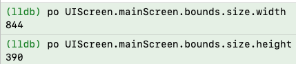
  
  * 系统通知`UIDeviceOrientationDidChangeNotification`也是需要服从界面UI的生命周期，否则取值不成功
  
  * 其实系统有2个维度来读取是否横屏
    * 设备真实的方向（定义手机横卧为横屏）
    * 在`AppDelegate`里面，对<font color=green>`- (UIInterfaceOrientationMask)application:(UIApplication *)application supportedInterfaceOrientationsForWindow:(UIWindow *)window`</font>进行了配置。因为是强制性的横屏呈现，所以<font color=red>**优先级最高**</font>
    
  * <font color=red>`- (BOOL)application:(UIApplication *)application didFinishLaunchingWithOptions:(NSDictionary *)launchOptions`</font> 的执行早于<font color=green>`- (UIInterfaceOrientationMask)application:(UIApplication *)application supportedInterfaceOrientationsForWindow:(UIWindow *)window`</font>
  
  * <font color=green>`- (UIInterfaceOrientationMask)application:(UIApplication *)application supportedInterfaceOrientationsForWindow:(UIWindow *)window`</font> **会执行多次**
  
  * 如果配置了<font color=green>`- (UIInterfaceOrientationMask)application:(UIApplication *)application supportedInterfaceOrientationsForWindow:(UIWindow *)window`</font>为横屏模式（默认为竖屏模式），但是终值为竖屏，**则为错误读取**
  
  * 如果不配置<font color=green>`- (UIInterfaceOrientationMask)application:(UIApplication *)application supportedInterfaceOrientationsForWindow:(UIWindow *)window`</font>为横屏模式（默认为竖屏模式），则以当前设备定位为准
  
  * 对于页面，因为需要自适应调整，那么以靠后的生命周期读取值为准。比如在**viewController**里面`-(void)viewDidAppear:(BOOL)animated`的值为最终系统在综合各种因素后调整后的值。<font color=red>**不要去关心中间值，以终值为准，这样方便定位我们从何时调用方法为有效调用**</font>
  
  * **一般的架构是将`UITabBarController`及其子类作为根控制器，那么在呈现页面的时候，内部会去调整UI适配横竖屏。所以，`UITabBarController`及其子类以及挂载在上面的子控制器，均是需要在页面生命周期走完以后（即，`-(void)viewDidAppear:(BOOL)animated`以后）才能获取到正确的值**
  
  * [**如果锚定`UIDevice.currentDevice.orientation`**](#锚定`UIDevice.currentDevice.orientation`)
    * `UIDevice.currentDevice.orientation`不是总是有效。在应用启动时，设备方向信息有时可能还没有完全初始化，这可能导致得到 `UIDeviceOrientationUnknown`
    * <font color=red>不能配置 </font> <font color=green>`- (UIInterfaceOrientationMask)application:(UIApplication *)application supportedInterfaceOrientationsForWindow:(UIWindow *)window`</font> <font color=red>因为竖屏检测会失败 </font>
    
    * 如果当前控制器为`UITabBarController`及其子类，`-(void)viewDidAppear:(BOOL)animated`生命周期以后（包含），方位数据才正常
    * 如果当前控制器为普通的`UIViewController`及其子类，则全部生命周期正常
    
  * [**如果锚定场景方向`UIInterfaceOrientation`**](#锚定场景方向`UIInterfaceOrientation`)，则需要在相关控制器的`-(void)viewDidAppear:(BOOL)animated`生命周期（包含）以后，才会获取到真正的`UIInterfaceOrientation`
  
  * [**如果锚定`view.traitCollection.verticalSizeClass`**](#锚定`view.traitCollection.verticalSizeClass`)，则需要配置 <font color=green>`- (UIInterfaceOrientationMask)application:(UIApplication *)application supportedInterfaceOrientationsForWindow:(UIWindow *)window`</font> 方可正常检测横竖屏

### 22、<font color=red>**全局工具箱**</font> <a href="#前言" style="font-size:17px; color:green;"><b>回到顶部</b></a>

* [**JobsAppTools**](https://github.com/295060456/JobsOCBaseConfigDemo/tree/main/JobsOCBaseConfigDemo/JobsOCBaseCustomizeUIKitCore/NSObject/BaseObject/JobsAppTools) （单例模式）

* [**NSObject+AppTools**](https://github.com/295060456/JobsOCBaseConfigDemo/tree/main/JobsOCBaseConfigDemo/JobsOCBaseCustomizeUIKitCore/NSObject/NSObject%2BCategory/NSObject%2BAppTools) （分类模式）

* [**`FileFolderHandleModel`**](https://github.com/295060456/JobsOCBaseConfigDemo/tree/main/JobsOCBaseConfigDemo/JobsOCBaseCustomizeUIKitCore/NSObject/BaseObject/FileFolderHandleTool)：**文件夹操作**

  * ```ruby
    pod 'TXFileOperation' # 文件夹操作 https://github.com/xtzPioneer/TXFileOperation
    ```

    ```
    #if __has_include(<TXFileOperation/TXFileOperation.h>)
    #import <TXFileOperation/TXFileOperation.h>
    #else
    #import "TXFileOperation.h"
    #endif
    ```

* [**`JobsLoadingImage`**](https://github.com/295060456/JobsOCBaseConfigDemo/blob/main/JobsOCBaseConfigDemo/JobsOCBaseCustomizeUIKitCore/UIImage/JobsLoadingImage)：**图片存取**

### 23、<font color=red>`View` 和 `ViewController`</font> <a href="#前言" style="font-size:17px; color:green;"><b>回到顶部</b></a>

* 两者都是属于UI层

* 因为`ViewController`里面也包含了一部分数据层，不利于解耦。所以在Flutter中对UI层和数据层进行完全的剥离，即一个UI层带一个状态（State）

* `View`层可以允许初始化方法带参（Frame）。而`ViewController`是控制器，通常铺满整个屏幕，所以不需要带参（Frame）初始化

* 两者的生命周期有很大区别。主要关系到UI布局和进数据

* <font color=red>**因为是继承，所以创建和销毁必须调用父类，否则异常**</font>。<font size=2>因为是ARC模式，所以`-(void)dealloc`方法不需要调用父类</font>

* 一般`View`不会独立存在，会依附于`ViewController`。<font color=red>就要求`ViewController`需要观察是否正常销毁</font>（即，退出页面是否执行`-(void)dealloc`方法）。<font color=blue>如果对象没有成功销毁，会影响数据的写入，且下一次新建对象的时候，会优先执行上一个对象的`-(void)dealloc`方法</font>

#### 23.1、`ViewController`的生命周期

* **初始化方法**`-(instancetype)init`：最早装载本页面数据的时机
    * `- (void)loadView`：**一般在此方法里面装载**本页面的固定数据和刷新的数据（比如网络请求的数据）
    * `- (void)viewDidLoad`：最晚装载本页面数据的时机。**只要本页面没有被销毁，则此方法只执行一次**
    * `-(void)viewWillAppear:(BOOL)animated`：不建议在此生命周期方法及其以后装载本页面的一些固定的数据，刷新的数据（比如网络请求的数据）可以。**只要出现本页面都会走一次**
    * `-(void)viewDidAppear:(BOOL)animated`：同上
    * `-(void)viewWillLayoutSubviews`：页面UI进行调整的时候，都会执行（多次运行，直到UI布局）稳定。**这里取值可能是过程值，有可能不准确**
    * `-(void)viewDidLayoutSubviews `：同上
* 销毁流程
    * `-(void)viewWillDisappear:(BOOL)animated`
    * `-(void)viewDidDisappear:(BOOL)animated`
    * `-(void)dealloc`

#### 23.2、`View`的生命周期

* **初始化方法**`-(instancetype)init`：最根本的初始化方法

  * **初始化方法（带参Frame）**`-(instancetype)initWithFrame:(CGRect)frame`
  * `- (void)layoutSubviews`：只要布局UI，此方法会执行多次，直到UI布局稳定。**这里取值可能是过程值，有可能不准确**
  * `-(void)drawRect:(CGRect)rect`：UI布局完成，进行绘制，**只会执行一次**
  * `- (void)layoutIfNeeded`：<font color=red>如果利用`Masonry`进行布局，不可能马上得到**Frame**值。但是如果需要马上得到**Frame**值，就需要在最顶层的父View上执行`layoutIfNeeded`，在子View上执行得到的值为过程值，可能不准确。</font>

* 销毁流程

  * 如果当前View是单例模式，则需要

    ```objective-c
    static JobsMenuView *JobsMenuViewInstance = nil;
    static dispatch_once_t JobsMenuViewOnceToken;
    + (void)destroyInstance {
        JobsMenuViewOnceToken = 0;
        JobsMenuViewInstance = nil;
    }
    ```

  * ```objective-c
    -(void)dealloc
    ```

### 24、<font color=red>**AppDelegate** 和 **SceneDelegate** </font> <a href="#前言" style="font-size:17px; color:green;"><b>回到顶部</b></a>

* 在iOS 13及更高版本中，Apple引入了多窗口支持，这意味着一个应用程序可以拥有多个场景（Scene），每个场景都有自己的生命周期和界面

* 这种多场景架构允许应用程序支持多窗口环境，特别是在iPad上，每个窗口可以有自己独立的生命周期和界面

* 一个iOS应用程序App的生命周期里面，只有一个**AppDelegate**实例存在，但是可能有多个**SceneDelegate**实例存在

  * **AppDelegate**：应用程序的委托对象。整个应用程序在其生命周期中只有一个`AppDelegate`实例，负责处理应用程序级别的事件，例如应用程序的启动、终止、后台和前台切换等
  * **SceneDelegate**：场景的委托对象。每个场景都有一个`SceneDelegate`实例，负责处理该场景级别的事件，例如场景的连接、断开、后台和前台切换等。在多窗口应用程序中，可能有多个`SceneDelegate`实例，每个实例对应一个场景

* <font color=red>故，**AppDelegate** 可以设计成为单例</font>

  ```objective-c
  static AppDelegate *AppDelegateInstance = nil;
  static dispatch_once_t AppDelegateOnceToken;
  +(instancetype)sharedManager{
      dispatch_once(&AppDelegateOnceToken, ^{
          AppDelegateInstance = [super allocWithZone:NULL].init;
      });return AppDelegateInstance;
  }
  /// 单例的销毁
  +(void)destroyInstance{
      AppDelegateOnceToken = 0;
      AppDelegateInstance = nil;
  }
  /// 防止外部使用 alloc/init 等创建新实例
  +(instancetype)allocWithZone:(struct _NSZone *)zone{
      dispatch_once(&AppDelegateOnceToken, ^{
          AppDelegateInstance = [super allocWithZone:zone];
      });return AppDelegateInstance;
  }
  
  -(instancetype)copyWithZone:(NSZone *)zone{
      return self;
  }
  
  -(instancetype)mutableCopyWithZone:(NSZone *)zone{
      return self;
  }
  
  -(instancetype)init{
      if (self = [super init]) {
  
      }return self;
  }
  ```

* 关于 **UIWindow ***

  * 每个`SceneDelegate`实例都有自己的`UIWindow`，而不再是通过`AppDelegate`共享一个单独的`UIWindow`实例
  * 即便是单场景App， `SceneDelegate`和 `AppDelegate`都有各自的`UIWindow`
  * `AppDelegate`中的`window`属性在多场景应用中实际上不再被使用。这是为了向后兼容一些现有代码，但在多场景环境下，`AppDelegate`不会处理任何具体的窗口
  * 在多场景架构下，`SceneDelegate`中的`window`是实际显示和管理UI的窗口，而`AppDelegate`中的`window`只是为了兼容老的单窗口应用

* 获取 **AppDelegate**

  * ```objective-c
    UIApplication.sharedApplication.delegate;
    ```

  * ```objective-c
    AppDelegate.sharedManager;
    ```

* 获取 **SceneDelegate**

  * ```objective-c
    if (@available(iOS 13.0, *)) {
    	sceneDelegate = UIApplication.sharedApplication.connectedScenes.allObjects.firstObject.delegate;
    }
    ```

### 26、**`UIScrollView` **的滚动生命周期 <a href="#前言" style="font-size:17px; color:green;"><b>回到顶部</b></a>

* 有2种方式驱动滚动效果

  * 用户手动拖拽（拖拽过程的执行生命周期，由上至下。<font color=red>**只会执行一次**</font>）

    * ```objective-c
      -(void)scrollViewWillBeginDragging:(UIScrollView *)scrollView;
      ```

    * ```objective-c
      -(void)scrollViewWillEndDragging:(UIScrollView *)scrollView 
                          withVelocity:(CGPoint)velocity
                   targetContentOffset:(inout CGPoint *)targetContentOffset
      ```

    * ```objective-c
      -(void)scrollViewDidEndDragging:(UIScrollView *)scrollView
                       willDecelerate:(BOOL)decelerate
      ```

  * 代码事件触发，改变`UIScrollView.contentOffset`

* <font color=red>**`- (void)scrollViewDidScroll:(UIScrollView *)scrollView`**</font>

  * 不管是哪种方式驱动的滚动效果，最终都会汇集到这个方法里面
  * 只要在滚动，<font color=red>**这个方法一定会重复多次的调用**</font>
  * 如果开启了分页滚动，即：`UIScrollView.pagingEnabled = YES;`。如果`scrollView.contentOffset.x`为负，<u>最后在这个方法里面会被调整为0</u>
  * 因为这个方法会被反复调用多次，所以一般的逻辑处理，不建议在这里进行处理

### 25、对象间传值比较（**通知**/**Block**/**协议**）<a href="#前言" style="font-size:17px; color:green;"><b>回到顶部</b></a>

#### 25.1、正向传值一般是通过初始化方法、属性等手段正向传入

#### 25.2、一般重点关注对象的反向传值

* **通知**
  * 万能的上帝模式。但<font color=red>**不建议过分的使用**</font>
  * 有一定的系统开销，在最开始的iOS版本里面，通知的使用是有上限的。后期版本可以无限制的使用
  * 如果对象释放的时候，不手动对其通知进行释放，可能会造成对象内存的溢出。所以，在iOS7以后，即便不写移除通知，系统帮我们解决
  
* **Block**
  * C语言底层的API，执行效率高。但是<font color=red>**只能单项订阅**</font>，<u>后出现的Block实现会覆盖掉之前的Block实现</u>。即，如果需要多个地方接收到数据，则不行
  * **Block不一定开异步线程**
  * 可以实现类似于内部类的功能
  * <font color=red>**如果数据的发出发和接收方之间存在若干对象，需要层层反向传值，比较冗余**</font>
  * 依附于实例变量，需要关注循环引用的问题
  
* **协议**
  
  * **协议也可以提取公共的头文件，作为一个规范，而广泛遵守**
  
  * 引申出一个中间对象：代理（**Delegate**）。对<font color=red>**代理检测和回调**</font>的封装
  
    * ```objective-c
      /// 代理用weak修饰，因为要调用NSObject层分类封装的方法，所以不能是id类型
      @property(nonatomic,weak)NSObject <MianTableViewCellDelegate>*delegate;
      ```
  
    * **@implementation NSObject (Extras)**
  
      ```objective-c
      @jobs_weakify(self)
      self.delegate.jobsDelegate(@"mianTableViewCellScrollerDid:",^(){
      		@jobs_strongify(self)
          [self.delegate mianTableViewCellScrollerDid:scrollView];
      });
      ```
  
  * 依附于实例变量。**协议同样存在循环引用的问题**
  
  * 可以多点订阅，解决Block的痛点
  
  * 容易造成代码割裂。<u>如果修改协议方法的定义，对应的协议方法的实现不会有警告或者报错，会降格为普通方法，会造成代码业务逻辑的变更</u>

#### 25.3、总结

* 一般建议系统级别的，使用通知。例如：检测键盘、横竖屏...
* 对象间传值一般的业务场景是：需要传值的对象之间至多有一个中间对象。此时建议用**Block**
* <font color=red>如果需要涉及到多点订阅，那么使用**通知**或者**协议**</font>

### 26、数据解析 <a href="#前言" style="font-size:17px; color:green;"><b>回到顶部</b></a>

#### 26.1、对`json`数据的解析

* 对待data是数组

  ```objective-c
  NSMutableArray <VideoTagModel *>*tags = [VideoTagModel mj_objectArrayWithKeyValuesArray:data];
  ```

* 对待data是字典

  ```objective-c
  DDMyVipModel *myVipModel = [DDMyVipModel mj_objectWithKeyValues:data]; 
  ```
  
* 二次封装

  ```objective-c
  @implementation NSObject (Data)
  #pragma mark —— 关于数据（MJExtension）解析
  /// 对待输入参数是含字典的数组
  +(JobsReturnArrByArrBlock)byDataArr{
      @jobs_weakify(self)
      return ^__kindof NSArray *_Nullable(__kindof NSArray <NSDictionary *>*_Nullable data){
          @jobs_strongify(self)
          return [self.class mj_objectArrayWithKeyValuesArray:data];
      };
  }
  /// 对待输入参数是字典
  +(JobsReturnIDByDicBlock)byDataDic{
      @jobs_weakify(self)
      return ^id _Nullable(__kindof NSDictionary *_Nullable data){
          @jobs_strongify(self)
          return [self.class mj_objectWithKeyValues:data];
      };
  }
  /// 万能解析
  +(JobsReturnIDByIDBlock)byData{
      @jobs_weakify(self)
      return ^id _Nullable(id _Nullable data){
          @jobs_strongify(self)
          if(KindOfDicCls(data)) return [self.class mj_objectWithKeyValues:data];
          if(KindOfArrCls(data)) return [self.class mj_objectArrayWithKeyValuesArray:data];
          return nil;
      };
  }
  
  @end
  ```
  
* 字段替换：接口返回字段<font color=red>**id**</font>和OC关键字<font color=red>**id**</font>重合冲突，这里用<font color=green>**jj**</font>替换<font color=red>**id**</font>

  ```objective-c
  + (NSDictionary *)mj_replacedKeyFromPropertyName {
      return @{
          @"jj" : @"id"
      };
  }
  ```
  
* 字段映射

  * **`- (id)mj_newValueFromOldValue:(id)oldValue property:(MJProperty *)property `**解析 JSON 数据时，对模型属性的值进行自定义处理。

    可以通过重写这个方法，来实现对某些属性的特殊处理，比如数据转换或默认值设置

    ```objective-c
    // 重写这个方法进行自定义数据处理
    - (id)mj_newValueFromOldValue:(id)oldValue 
                         property:(MJProperty *)property {
        if ([property.name isEqualToString:@"age"]) {
            NSInteger age = [oldValue integerValue];
            if (age < 0) {
                return @(0); // 如果 age 小于 0，返回 0
            }
        } return oldValue;// 默认返回旧值
    }
    ```

  * **`+ (NSDictionary *)mj_objectClassInArray`** <font color=red>**解析模型里面的数组**</font>

    ```objective-c
    @property(nonatomic,strong)NSArray<FMGameListModel *> *gameList; 
    
    // 告诉 MJExtension "gameList" 是一个 FMGameListModel 数组
    + (NSDictionary *)mj_objectClassInArray {
        return @{
            @"gameList" : FMGameListModel.class
        };
    }
    ```

#### 26.2、对图片URL数据的解析（对`SDWebImage`的二次封装）

* ```ruby
  pod 'SDWebImage' # https://github.com/SDWebImage/SDWebImage YES_SMP
  ```

* ```objective-c
  #if __has_include(<SDWebImage/SDWebImage.h>)
  #import <SDWebImage/SDWebImage.h>
  #else
  #import "SDWebImage.h"
  #endif
  ```

* [**@interface UIImageView (SDWebImage)**]()

  ```objective-c
  self.bgImageView
      .imageURL(model.url)
      .placeholderImage(model.bgImage)
      .options(SDWebImageRefreshCached)/// 强制刷新缓存
      .completed(^(UIImage * _Nullable image,
                   NSError * _Nullable error,
                   SDImageCacheType cacheType,
                   NSURL * _Nullable imageURL) {
          if (error) {
              NSLog(@"图片加载失败: %@-%@", error,imageURL);
          } else {
              NSLog(@"图片加载成功");
          }
      }).load();
  ```
  
  [**@interface UIButton (SDWebImage）**]()
  
  ```objective-c
   self.headBtn.imageURL(self.BaseUrl.add(model.iosImage).jobsUrl)
           .placeholderImage(model.image)
           .options(SDWebImageRefreshCached)/// 强制刷新缓存
           .completed(^(UIImage * _Nullable image,
                        NSError * _Nullable error,
                        SDImageCacheType cacheType,
                        NSURL * _Nullable imageURL) {
               if (error) {
                   NSLog(@"图片加载失败: %@-%@", error,imageURL);
               } else {
                   NSLog(@"图片加载成功");
               }
           }).normalLoad();
  ```
  
  ```objective-c
  self.headBtn.imageURL(self.BaseUrl.add(self.loginModel.avatar).jobsUrl)
          .placeholderImage(self.loginModel.userDefaultHeadImage)
          .options(SDWebImageRefreshCached)/// 强制刷新缓存
          .completed(^(UIImage * _Nullable image,
                       NSError * _Nullable error,
                       SDImageCacheType cacheType,
                       NSURL * _Nullable imageURL) {
              if (error) {
                  NSLog(@"图片加载失败: %@-%@", error,imageURL);
              } else {
                  NSLog(@"图片加载成功");
              }
          }).bgNormalLoad();
  ```

### 27、<font color=blue>**竖形菜单**</font>方案 <a href="#前言" style="font-size:17px; color:green;"><b>回到顶部</b></a>

#### 27.1、左边的目录是UITableView，右边的内容是<font color=purper>UIView</font>

* [**`JobsMenuView`**](https://github.com/295060456/JobsOCBaseConfigDemo/blob/main/JobsOCBaseConfigDemo/OCBaseConfig/JobsMixFunc/JobsMenu/JobsMenuView/JobsMenuView.m)

  * <font color=green>**整体是一个大View**</font>

  * 左侧菜单标题是**`UIButton`**

  * 右侧的菜单内容是**`UIScrollView`**

    ```objective-c
    @property(nonatomic,strong)JobsMenuView *menuView;
    
    -(JobsMenuView *)menuView{
        if(!_menuView){
            _menuView = JobsMenuView.new;
    //        _menuView.backgroundColor = JobsPurpleColor;
            [self.view addSubview:_menuView];
            _menuView.frame = CGRectMake(JobsWidth(59),
                                         0,
                                         [JobsMenuView viewSizeWithModel:nil].width,
                                         [JobsMenuView viewSizeWithModel:nil].height
                                         );
    //        [_menuView mas_makeConstraints:^(MASConstraintMaker *make) {
    //            make.size.mas_equalTo([_menuView viewSizeWithModel:nil]);
    //            make.centerY.equalTo(self.view);
    //            make.left.equalTo(self.view);
    //        }];
    //        _menuView.jobsRichElementsInViewWithModel(nil);
    //        @jobs_weakify(self)
    //        [_menuView actionObjectBlock:^(id  _Nullable x) {
    //            @jobs_strongify(self)
    //            if (self.objectBlock) self.objectBlock(x);
    //        }];
        }return _menuView;
    }
    
     - (void)viewDidLoad {
         [super viewDidLoad];
         self.setGKNav(nil);
         self.setGKNavBackBtn(nil);
     
         self.menuView.resetOriginY([TopBar viewSizeWithModel:nil].height);
         self.menuView.linkageMenuViewConfig.MENU_WIDTH = JobsWidth(139);
         self.menuView.alpha = JobsAppTool.currentInterfaceOrientationMask == UIInterfaceOrientationMaskLandscape;
    //     self.menuView.alpha = JobsAppTool.jobsDeviceOrientation == DeviceOrientationLandscape;
         [self configMenuView];
     }
     
     -(void)configMenuView{
         self.menuView.titleMutArr = self.titleMutArr;
         self.menuView.subViewMutArr = self.subViewMutArr;
         self.menuView.normal_titleBgImageMutArr = self.normal_titleBgImageMutArr;
         self.menuView.select_titleBgImageMutArr = self.select_titleBgImageMutArr;
         self.menuView.jobsRichElementsInViewWithModel(nil);
         @jobs_weakify(self)
         [self.menuView actionObjectBlock:^(id _Nullable x) {
             @jobs_strongify(self)
             if([x isKindOfClass:UIButton.class]){
                 UIButton *btn = (UIButton *)x;
                 if([btn.titleForConfigurationAttributed isEqualToString:JobsInternationalization(@"TOP GAMES")]){
                     self.bgImageView.image = JobsIMG(@"TOP GAMES");
                     self.topImageView.image = JobsIMG(@"Top_Games");
                 }
                 
                 if([btn.titleForConfigurationAttributed isEqualToString:JobsInternationalization(@"SLOT GAMES")]){
                     self.bgImageView.image = JobsIMG(@"SLOT GAMES");
                     self.topImageView.image = JobsIMG(@"Slot_Games");
                 }
                 
                 if([btn.titleForConfigurationAttributed isEqualToString:JobsInternationalization(@"LIVE CASINO")]){
                     self.bgImageView.image = JobsIMG(@"LIVE CASINO");
                     self.topImageView.image = JobsIMG(@"Live_Casino");
                 }
                 
                 if([btn.titleForConfigurationAttributed isEqualToString:JobsInternationalization(@"TABLE GAMES")]){
                     self.bgImageView.image = JobsIMG(@"TABLE GAMES");
                     self.topImageView.image = JobsIMG(@"Table_Games");
                 }
                 
                 if([btn.titleForConfigurationAttributed isEqualToString:JobsInternationalization(@"SPORTS")]){
                     self.bgImageView.image = JobsIMG(@"SPORTS");
                     self.topImageView.image = JobsIMG(@"Sports");
                 }
                 
                 if([btn.titleForConfigurationAttributed isEqualToString:JobsInternationalization(@"FINSHING")]){
                     self.bgImageView.image = JobsIMG(@"FINSHING");
                     self.topImageView.image = JobsIMG(@"Fishing");
                 }
             }
         }];
     }
    ```

* [**`JobsVerticalMenuVC@0`**]() <font color=red>**强烈推荐**</font>

  * 右边点选进行切换的子View一定要继承自 JobsVerticalMenuSubView，否则点选的时候无法移除。

  ```objective-c
  #import "BaseViewController.h"
  
  #import "TopBar.h"
  #import "JobsHotRecommendView.h"
  
  #import "FMMenuTBVCell.h"
  
  #import "TopGamesView.h" /// 一定要继承自 JobsVerticalMenuSubView。否则点选的时候无法移除
  #import "SlotGamesView.h" /// 一定要继承自 JobsVerticalMenuSubView。否则点选的时候无法移除
  #import "LiveCasinoView.h" /// 一定要继承自 JobsVerticalMenuSubView。否则点选的时候无法移除
  #import "TableGamesView.h" /// 一定要继承自 JobsVerticalMenuSubView。否则点选的时候无法移除
  #import "SportsView.h" /// 一定要继承自 JobsVerticalMenuSubView。否则点选的时候无法移除
  #import "FishingView.h" /// 一定要继承自 JobsVerticalMenuSubView。否则点选的时候无法移除
  
  NS_ASSUME_NONNULL_BEGIN
  
  @interface IncentiveVC : BaseViewController
  <
  UITableViewDelegate,
  UITableViewDataSource
  >
  
  @end
  ```

  ```objective-c
  import "FMIncentiveVC.h"
  #define MenuWidth JobsWidth(159)
  @interface FMIncentiveVC ()
  /// UI
  @property(nonatomic,strong)UITableView *tableView; /// 左侧的标题
  @property(nonatomic,strong)UIImageView *topImageView;
  /// Data
  @property(nonatomic,strong)NSMutableArray <UIViewModel *>*titleMutArr;
  @property(nonatomic,strong)NSMutableArray <__kindof UIView *>*subViewMutArr;/// 右侧的视图数组
  @property(nonatomic,strong)NSMutableArray <UIImage *>*normal_titleBgImageMutArr;
  @property(nonatomic,strong)NSMutableArray <UIImage *>*normal_titleImageMutArr;
  @property(nonatomic,strong)NSMutableArray <UIImage *>*select_titleBgImageMutArr;
  @property(nonatomic,strong)NSMutableArray <UIImage *>*bgImageMutArr1; /// 底图
  @property(nonatomic,strong)NSMutableArray <UIImage *>*bgImageMutArr2; /// 最上面的小图
  
  @end
  
  @implementation FMIncentiveVC
  
  - (void)dealloc{
      NSLog(@"%@",JobsLocalFunc);
      JobsRemoveNotification(self);
  }
  
  - (instancetype)init{
      if (self = [super init]) {
          NSLog(@"");
      }return self;
  }
  
  -(void)loadView{
      [super loadView];
      
      if ([self.requestParams isKindOfClass:UIViewModel.class]) {
          self.viewModel = (UIViewModel *)self.requestParams;
      }
      self.setupNavigationBarHidden = YES;
      self.viewModel.backBtnTitleModel.text = JobsInternationalization(@"INCENTIVE");
      self.viewModel.textModel.textCor = JobsWhiteColor;
      self.viewModel.textModel.text = JobsInternationalization(@"");
      self.viewModel.textModel.font = bayonRegular(JobsWidth(18));
      
      // 使用原则：底图有 + 底色有 = 优先使用底图数据
      // 以下2个属性的设置，涉及到的UI结论 请参阅父类（BaseViewController）的私有方法：-(void)setBackGround
      // self.viewModel.bgImage = JobsIMG(@"内部招聘导航栏背景图");
      self.viewModel.navBgCor = JobsClearColor.colorWithAlphaComponent(0);
  //    self.viewModel.navBgImage = JobsIMG(@"导航栏左侧底图");
  }
  
  - (void)viewDidLoad {
      [super viewDidLoad];
      self.makeNavByAlpha(1);
      self.bgImageView.image = self.bgImageMutArr1[0];
      self.topImageView.alpha = 1;
      
      self.tableView.alpha = 1;
      
      self.displayView(self.subViewMutArr[0]);/// 显示指定的右侧视图
  }
  
  -(void)viewWillAppear:(BOOL)animated{
      [super viewWillAppear:animated];
      self.gk_navigationBar.hidden = YES;
  }
  
  -(void)viewDidAppear:(BOOL)animated{
      [super viewDidAppear:animated];
  }
  
  -(void)viewWillDisappear:(BOOL)animated{
      [super viewWillDisappear:animated];
  }
  
  - (void)viewDidDisappear:(BOOL)animated{
      [super viewDidDisappear:animated];
  }
  #pragma mark —— UITableViewDelegate, UITableViewDataSource
  - (NSInteger)tableView:(__kindof UITableView *)tableView
   numberOfRowsInSection:(NSInteger)section {
      return self.titleMutArr.count;
  }
  
  - (__kindof UITableViewCell *)tableView:(__kindof UITableView *)tableView
                    cellForRowAtIndexPath:(NSIndexPath *)indexPath {
      FMMenuTBVCell *cell = FMMenuTBVCell.cellStyleDefaultWithTableView(tableView);
      cell.jobsRichElementsInCellWithModel(self.titleMutArr[indexPath.row]);
      return cell;
  }
  
  - (CGFloat)tableView:(__kindof UITableView *)tableView
  heightForRowAtIndexPath:(NSIndexPath *)indexPath {
      return [FMMenuTBVCell cellHeightWithModel:nil];
  }
  
  - (void)tableView:(__kindof UITableView *)tableView
  didSelectRowAtIndexPath:(NSIndexPath *)indexPath {
      self.displayView(self.subViewMutArr[indexPath.row]);
      FMMenuTBVCell *cell = [tableView cellForRowAtIndexPath:indexPath];
  
      for (int t = 0; t < tableView.visibleCells.count; t++) {
          FMMenuTBVCell *cell = tableView.visibleCells[t];
          UIViewModel *viewModel = self.titleMutArr[t];
          viewModel.isMark = NO;
          cell.jobsRichElementsInCellWithModel(viewModel);
      }
      
      self.bgImageView.image = self.bgImageMutArr1[indexPath.row];
      self.topImageView.image = self.bgImageMutArr2[indexPath.row];
      
      UIViewModel *viewModel = self.titleMutArr[indexPath.row];
      viewModel.isMark = YES;
      cell.jobsRichElementsInCellWithModel(viewModel);
      
  //    self.refreshNewView(indexPath.row);
  }
  #pragma mark —— 一些私有方法
  -(JobsReturnViewByClassBlock _Nonnull)makeSubViews{
      return ^UIView *_Nullable(Class _Nonnull cls){
          UIView *view = cls.new;
          view.frame = CGRectMake(MenuWidth,
                                  0,
                                  JobsRealWidth() - MenuWidth,
                                  JobsRealHeight());
          view.jobsRichElementsInViewWithModel(nil);
          return view;
      };
  }
  
  -(jobsByNSIntegerBlock _Nonnull)refreshNewView{
      @jobs_weakify(self)
      return ^(NSInteger data){
          @jobs_strongify(self)
          JobsMenuBaseSubView *view = self.subViewMutArr[data];
          view.refreshNewView();
      };
  }
  /// 显示指定的右侧视图
  - (jobsByViewBlock _Nonnull)displayView {
      @jobs_weakify(self)
      return ^(__kindof UIView *subview) {
          @jobs_strongify(self)
          /// 移除当前显示的视图
          for (UIView *subView in self.view.subviews) {
              if ([subView isKindOfClass:JobsVerticalMenuSubView.class]) {
                  [subView removeFromSuperview];
              }
          }
          /// 添加新的视图
  //        view.frame = CGRectMake(self.tableView.width,
  //                                0,
  //                                self.view.width - self.tableView.width,
  //                                self.view.height);
          [self.view addSubview:subview];
          [subview mas_makeConstraints:^(MASConstraintMaker *make) {
              make.top.equalTo(self.tableView);
              make.bottom.equalTo(self.tableView);
              make.right.equalTo(self.view);
              make.width.mas_equalTo(JobsRealWidth() - MenuWidth);
          }];
          [self.view layoutIfNeeded];
      };
  }
  #pragma mark —— lazyLoad
  -(UITableView *)tableView{
      if (!_tableView){
          _tableView = UITableView.initWithStylePlain;
          _tableView.backgroundColor = JobsClearColor.colorWithAlphaComponent(0);
          _tableView.dataLink(self);
          _tableView.showsVerticalScrollIndicator = NO;
          _tableView.separatorStyle = UITableViewCellSeparatorStyleNone;
          [self.view addSubview:_tableView];
          [_tableView mas_makeConstraints:^(MASConstraintMaker *make) {
              make.left.equalTo(self.view);
              make.top.equalTo(self.navBar.mas_bottom);
              make.bottom.equalTo(self.view);
              make.width.mas_equalTo(MenuWidth);
          }];
      }return _tableView;
  }
  
  -(UIImageView *)topImageView{
      if(!_topImageView){
          _topImageView = UIImageView.new;
          _topImageView.image = self.bgImageMutArr2[0];
          [self.bgImageView addSubview:_topImageView];
          [_topImageView mas_makeConstraints:^(MASConstraintMaker *make) {
              make.top.equalTo(self.view);
              make.centerX.equalTo(self.view);
              make.size.mas_equalTo(CGSizeMake(JobsWidth(182), JobsWidth(65)));
          }];
      }return _topImageView;
  }
  
  - (NSMutableArray<UIViewModel *> *)titleMutArr {
      if (!_titleMutArr) {
          /// 最初默认的数据
          _titleMutArr = jobsMakeMutArr(^(NSMutableArray * _Nullable data) {
              data.add(jobsMakeViewModel(^(__kindof UIViewModel * _Nullable viewModel) {
                  viewModel.textModel.text = JobsInternationalization(@"ALL");
                  viewModel.textModel.textCor = HEXCOLOR(0xB0B0B0);
                  viewModel.image = self.normal_titleImageMutArr[0];
                  viewModel.bgSelectedImage = self.select_titleBgImageMutArr[0];
                  viewModel.isMark = YES;
              }));
              
              data.add(jobsMakeViewModel(^(__kindof UIViewModel * _Nullable viewModel) {
                  viewModel.textModel.text = JobsInternationalization(@"SLOT GAMES");
                  viewModel.textModel.textCor = HEXCOLOR(0xB0B0B0);
                  viewModel.image = self.normal_titleImageMutArr[1];
                  viewModel.bgSelectedImage = self.select_titleBgImageMutArr[1];
              }));
  
              data.add(jobsMakeViewModel(^(__kindof UIViewModel * _Nullable viewModel) {
                  viewModel.textModel.text = JobsInternationalization(@"LIVE CASINO");
                  viewModel.textModel.textCor = HEXCOLOR(0xB0B0B0);
                  viewModel.image = self.normal_titleImageMutArr[2];
                  viewModel.bgSelectedImage = self.select_titleBgImageMutArr[2];
              }));
  
              data.add(jobsMakeViewModel(^(__kindof UIViewModel * _Nullable viewModel) {
                  viewModel.textModel.text = JobsInternationalization(@"SPORTS");
                  viewModel.textModel.textCor = HEXCOLOR(0xB0B0B0);
                  viewModel.image = self.normal_titleImageMutArr[3];
                  viewModel.bgSelectedImage = self.select_titleBgImageMutArr[3];
              }));
              
              data.add(jobsMakeViewModel(^(__kindof UIViewModel * _Nullable viewModel) {
                  viewModel.textModel.text = JobsInternationalization(@"OTHERS");
                  viewModel.textModel.textCor = HEXCOLOR(0xB0B0B0);
                  viewModel.image = self.normal_titleImageMutArr[4];
                  viewModel.bgSelectedImage = self.select_titleBgImageMutArr[4];
              }));
          });
      }return _titleMutArr;
  }
  
  -(NSMutableArray<__kindof UIView *> *)subViewMutArr{
      if(!_subViewMutArr){
          @jobs_weakify(self)
          _subViewMutArr = jobsMakeMutArr(^(NSMutableArray * _Nullable data) {
              @jobs_strongify(self)
              data.add(self.makeSubViews(FMIncentiveAllView.class));
              data.add(self.makeSubViews(FMIncentiveSlotGamesView.class));
              data.add(self.makeSubViews(FMIncentiveLiveCasinoView.class));
              data.add(self.makeSubViews(FMIncentiveSportsView.class));
              data.add(self.makeSubViews(FMIncentiveOthersView.class));
          });
      }return _subViewMutArr;
  }
  
  -(NSMutableArray<UIImage *> *)normal_titleBgImageMutArr{
      if(!_normal_titleBgImageMutArr){
          _normal_titleBgImageMutArr = jobsMakeMutArr(^(NSMutableArray * _Nullable data) {
              data.add(JobsIMG(@"Top_Games_menu_未点击"));
              data.add(JobsIMG(@"Slot_Games_menu_未点击"));
              data.add(JobsIMG(@"Live_Casino_menu_未点击"));
              data.add(JobsIMG(@"Table_Games_menu_未点击"));
              data.add(JobsIMG(@"Sport_Menu_未点击"));
  //            data.add(JobsIMG(@"Fishing_menu_未点击"));
          });
      }return _normal_titleBgImageMutArr;
  }
  
  -(NSMutableArray<UIImage *> *)normal_titleImageMutArr{
      if(!_normal_titleImageMutArr){
          _normal_titleImageMutArr = jobsMakeMutArr(^(NSMutableArray * _Nullable data) {
              data.add(JobsIMG(@"Top_Games_小图标_未点击"));
              data.add(JobsIMG(@"Slot_Games_小图标_未点击"));
              data.add(JobsIMG(@"Live_Casino_小图标_未点击"));
              data.add(JobsIMG(@"Table_Games_小图标_未点击"));
              data.add(JobsIMG(@"Sport_小图标_未点击"));
  //            data.add(JobsIMG(@"Fishing_小图标_未点击"));
          });
      }return _normal_titleImageMutArr;
  }
  
  -(NSMutableArray<UIImage *> *)select_titleBgImageMutArr{
      if(!_select_titleBgImageMutArr){
          _select_titleBgImageMutArr = jobsMakeMutArr(^(NSMutableArray * _Nullable data) {
              data.add(JobsIMG(@"Top_Games_menu_已点击"));
              data.add(JobsIMG(@"Slot_Games_menu_已点击"));
              data.add(JobsIMG(@"Live_Casino_menu_已点击"));
              data.add(JobsIMG(@"Table_Games_menu_已点击"));
              data.add(JobsIMG(@"Sport_Menu_已点击"));
  //            data.add(JobsIMG(@"Fishing_menu_已点击"));
          });
      }return _select_titleBgImageMutArr;
  }
  /// 底图
  -(NSMutableArray<UIImage *> *)bgImageMutArr1{
      if(!_bgImageMutArr1){
          _bgImageMutArr1 = jobsMakeMutArr(^(NSMutableArray * _Nullable data) {
              data.add(JobsIMG(@"TOP GAMES"));
              data.add(JobsIMG(@"SLOT GAMES"));
              data.add(JobsIMG(@"LIVE CASINO"));
              data.add(JobsIMG(@"TABLE GAMES"));
              data.add(JobsIMG(@"SPORTS"));
  //            data.add(JobsIMG(@"FINSHING"));
          });
      }return _bgImageMutArr1;
  }
  /// 最上面的小图
  -(NSMutableArray<UIImage *> *)bgImageMutArr2{
      if(!_bgImageMutArr2){
          _bgImageMutArr2 = jobsMakeMutArr(^(NSMutableArray * _Nullable data) {
              data.add(JobsIMG(@"Top_Games"));
              data.add(JobsIMG(@"Slot_Games"));
              data.add(JobsIMG(@"Live_Casino"));
              data.add(JobsIMG(@"Table_Games"));
              data.add(JobsIMG(@"Sports"));
  //            data.add(JobsIMG(@"Fishing"));
          });
      }return _bgImageMutArr2;
  }
  @synthesize backBtnModel = _backBtnModel;
  -(UIButtonModel *)backBtnModel{
      if(!_backBtnModel){
          _backBtnModel = UIButtonModel.new;
  //        _backBtnModel.backgroundImage = JobsIMG(@"返回");
  //        _backBtnModel.selected_backgroundImage = JobsIMG(@"返回");
          _backBtnModel.normalImage = JobsIMG(@"返回");
          _backBtnModel.highlightImage = JobsIMG(@"返回");
          _backBtnModel.baseBackgroundColor = JobsClearColor.colorWithAlphaComponent(0);
          _backBtnModel.title = self.viewModel.backBtnTitleModel.text;
          _backBtnModel.titleFont = bayonRegular(JobsWidth(18));
          _backBtnModel.titleCor = JobsWhiteColor;
          _backBtnModel.selected_titleCor = JobsWhiteColor;
          _backBtnModel.roundingCorners = UIRectCornerAllCorners;
          _backBtnModel.imagePlacement = NSDirectionalRectEdgeLeading;
          _backBtnModel.imagePadding = JobsWidth(5);
          @jobs_weakify(self)
          _backBtnModel.longPressGestureEventBlock = ^id(id _Nullable weakSelf,
                                                         id _Nullable arg) {
              NSLog(@"按钮的长按事件触发");
              return nil;
          };
          _backBtnModel.clickEventBlock = ^id(BaseButton *x){
              @jobs_strongify(self)
              if (self.objectBlock) self.objectBlock(x);
              self.jobsBackBtnClickEvent(x);
              return nil;
          };
      }return _backBtnModel;
  }
  
  @end
  ```
  
* [**`JobsVerticalMenuVC@2`**](https://github.com/295060456/JobsOCBaseConfigDemo/tree/main/JobsOCBaseConfigDemo/%E4%B8%9A%E5%8A%A1%E9%80%BB%E8%BE%91/%E5%8A%9F%E8%83%BD%E6%A8%A1%E5%9D%97/%E7%AB%96%E5%BD%A2%E8%8F%9C%E5%8D%95%E9%80%89%E6%8B%A9%E5%8A%9F%E8%83%BD/ViewController/JobsVerticalMenuVC)

  * 左侧的菜单标题是**`UITableView`**
  * 右侧的菜单内容是**`UICollectionView`** 

#### 27.2、左边的目录是UITableView，右边的内容是<font color=purper>UIViewController</font>

* [**`JobsVerticalMenuVC@1`**]() <font color=red>**强烈推荐**</font>
* [**`JXCategoryView`**](https://github.com/pujiaxin33/JXCategoryView)的垂直表达（<u>目前没有做到很好的支持，只能通过取巧</u>）<font color=red>**不推荐**</font>

### 28、Excel方案：[**JobsExcelView**](https://github.com/295060456/JobsOCBaseConfigDemo/tree/main/JobsOCBaseConfigDemo/%E4%B8%9A%E5%8A%A1%E9%80%BB%E8%BE%91/%E5%8A%9F%E8%83%BD%E6%A8%A1%E5%9D%97/Excel/Excel-JobsExcelView/View/JobsExcelView) <a href="#前言" style="font-size:17px; color:green;"><b>回到顶部</b></a>

* 框架介绍

  * 一横行用**`UITableViewCell`**、每一个单元小格是**`UICollectionViewCell`**

  * 起始格子

    * UI：**`JobsExcelView`** .**`titleL`**
    * 数据：**`JobsExcelConfigureViewModel`**.**`contentStr_00`**

  * 其他格子

    * 左边第一竖排的标题：**`JobsExcelLeftListView`**，内含一个**`UITableView`**，其中包含<font color=green>**`TableViewOneCell`**</font>
    * 顶部第一横行的标题：**`JobsExcelTopHeadView`**，内含一个**`UICollectionView`**，其中包含<font color=green>**`JobsTopViewItem`**</font>
    * （中部的）内容数据：**`JobsExcelContentView`**，内含一个**`UITableView`**，其中包含**`MainTableViewCell`**
      * **`MainTableViewCell`**内含一个**`UICollectionView`**，其中包含<font color=green>**`MainTableViewCellItem`**</font>

  * 数据源

    * **Excel**表格的总数据源：**`JobsExcelConfigureViewModel`**
    * 对单个的小格子的数据源用：**`UITextModel`**
    * 如果要设置**Excel**表的宽高，一定要在**`JobsExcelView`**里面的**`viewSizeWithModel`**方法里面进行设置

  * 一些人性化进阶设置

    **MainTableViewCell**

     ```objective-c
     #pragma mark —— UIScrollViewDelegate
     - (void)scrollViewDidScroll:(UIScrollView *)scrollView{
         NSLog(@"MainTableViewCell - scrollView.contentOffset.x = %f",scrollView.contentOffset.x);
         /// 防止在数据拉完的情况下，无意义的往右拉动👉🏻
         if (scrollView.contentOffset.x < 0) scrollView.contentOffset = CGPointMake(0, scrollView.contentOffset.y);
         if (scrollView.contentOffset.x >= 0) {
             /// 防止在数据拉完的情况下，无意义的往左拉动👈🏻
             CGFloat d = (self.viewModel_.rowNumber * self.viewModel_.itemW - self.viewModel_.XZExcelW) + self.viewModel_.itemW + self.viewModel_.scrollOffsetX;
             
             if(scrollView.contentOffset.x > d) scrollView.contentOffset = CGPointMake(d, scrollView.contentOffset.y);
             @jobs_weakify(self)
             self.delegate.jobsDelegate(@"mianTableViewCellScrollerDid:",^(){
                 @jobs_strongify(self)
                 [self.delegate mianTableViewCellScrollerDid:scrollView];
             });
         }
     }
     ```
    
    **JobsExcelTopHeadView**
    
    ```objective-c
    #pragma mark —— UIScrollViewDelegate
    - (void)scrollViewDidScroll:(UIScrollView *)scrollView{
        self.viewModel.jobsKVC(HorizontalScrollBegin,[NSValue valueWithCGPoint:scrollView.contentOffset]);
        NSLog(@"JobsExcelTopHeadView - scrollView.contentOffset.x = %f",scrollView.contentOffset.x)
        /// 防止在初始情况下，无意义的往右拉动👉🏻
        if (scrollView.contentOffset.x < 0) scrollView.contentOffset = CGPointMake(0, scrollView.contentOffset.y);
        /// 防止在初始情况下，无意义的往左拉动👈🏻
        CGFloat d = (self.viewModel.rowNumber * self.viewModel.itemW - self.viewModel.XZExcelW) + self.viewModel.itemW + self.viewModel.scrollOffsetX;
        if(scrollView.contentOffset.x > d) scrollView.contentOffset = CGPointMake(d, scrollView.contentOffset.y);
    }
    ```
    
    **JobsExcelLeftListView**

    ```objective-c
    #pragma mark —— UIScrollViewDelegate
    - (void)scrollViewDidScroll:(UIScrollView *)scrollView{
        NSLog(@"KKK3 = %f",scrollView.contentOffset.y);
        /// 防止在初始情况下，无意义的往下拉动👇🏻
        if (scrollView.contentOffset.y < 0) scrollView.contentOffset = CGPointMake(scrollView.contentOffset.x, 0);
        if (scrollView.contentOffset.y >= 0) {
            /// 防止在初始情况下，无意义的往上拉动👆🏻
            CGFloat d = ((self.viewModel.colNumber + 1) * self.viewModel.itemH - self.viewModel.XZExcelH) + self.viewModel.scrollOffsetY;
            if(scrollView.contentOffset.y > d) scrollView.contentOffset = CGPointMake(scrollView.contentOffset.x, d);
            if(scrollView.contentOffset.y <= d) self.viewModel.jobsKVC(VerticalScrollBegin,[NSValue valueWithCGPoint:scrollView.contentOffset]);
        }
    }
    ```

* 完整调用

  ```objective-c
  /// UI
  @property(nonatomic,strong)JobsExcelView *excelView;
  /// Data
  @property(nonatomic,strong)JobsExcelConfigureViewModel *excelData;
  ```

  ```objective-c
  -(JobsExcelView *)excelView{
      if(!_excelView){
          _excelView = JobsExcelView.new;
          _excelView.backgroundColor = JobsYellowColor;
          [self.view addSubview:_excelView];
          [_excelView mas_makeConstraints:^(MASConstraintMaker *make) {
              make.center.equalTo(self.view);
              make.size.mas_equalTo([JobsExcelView viewSizeWithModel:nil]);
          }];
          _excelView.jobsRichElementsInViewWithModel(self.excelData);
      }return _excelView;
  }
  
  -(JobsExcelConfigureViewModel *)excelData{
      if(!_excelData){
          _excelData = JobsExcelConfigureViewModel.new;
          _excelData.XZExcelH = [JobsExcelView viewSizeWithModel:nil].height;
          _excelData.XZExcelW = [JobsExcelView viewSizeWithModel:nil].width;
          
          _excelData.topHeaderTitles.add(JobsInternationalization(@"Order Time"));
          _excelData.topHeaderTitles.add(JobsInternationalization(@"Order No."));
          _excelData.topHeaderTitles.add(JobsInternationalization(@"Transaction Type"));
          _excelData.topHeaderTitles.add(JobsInternationalization(@"Amount"));
          _excelData.topHeaderTitles.add(JobsInternationalization(@"Method"));
          _excelData.topHeaderTitles.add(JobsInternationalization(@"Status"));
          
          _excelData.configureData();
      }return _excelData;
  }
  ```

### 29、雪花算法（Snowflake ID或Snowflake Algorithm） <a href="#前言" style="font-size:17px; color:green;"><b>回到顶部</b></a>

#### 29.1、什么是雪花算法

* 是一种分布式ID生成算法
* 由Twitter在2010年开源
* 主要用于在分布式系统中生成唯一的、时间排序的ID
* 这种算法生成的ID是一个64位的整数，保证了全局唯一性和高性能，适用于分布式系统的需要

#### 29.2、雪花算法的特点

* **唯一性**：生成的每一个ID都是唯一的，没有重复。
* **时间有序性**：根据时间戳的增长，生成的ID也会按时间顺序递增，具有时间排序的特性。
* **高效率**：生成ID的过程非常快，能够每秒生成数百万个ID。
* **分布式**：支持在多个节点上并行生成ID，不会因为网络延迟等问题导致冲突。

#### 29.3、雪花算法的ID结构

雪花算法生成的ID是一个64位的整数，具体结构如下：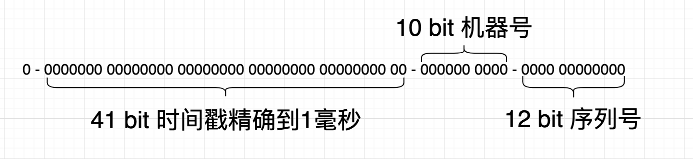

```scss
| 1 bit (符号位) | 41 bits (时间戳) | 10 bits (机器ID) | 12 bits (序列号) |
```

* **1 bit 符号位**：永远为0，不使用。
* **41 bits 时间戳**：存储当前时间与一个初始时间的差值（通常是1970-01-01的时间戳起点），单位为毫秒。41位可以表示大约69年的时间。
* **10 bits 机器ID**：用来区分不同的机器或节点。10位可以表示1024个不同的节点（5位工作节点ID + 5位数据中心ID）。
* **12 bits 序列号**：在同一毫秒内生成多个ID的情况下，用于区分这些ID。12位可以表示4096个不同的序列号。

#### 29.4、雪花算法的工作原理

* **时间戳生成**：每次生成ID时获取当前时间戳，减去一个初始时间（纪元）得到相对时间戳。
* **机器ID**：每个节点有唯一的机器ID，通过配置或计算获得。
* **序列号**：在同一毫秒内生成多个ID时，序列号递增，最多支持4096个序列号；当序列号用尽时，等待下一毫秒再生成ID。
* **组合ID**：将时间戳、机器ID和序列号组合成一个64位的整数，形成唯一ID。

#### 29.5、雪花算法的评价

*  <font color=red>**高效性**</font>：在本地内存中生成ID，不需要数据库等集中式服务的支持。
* <font color=red>**可扩展性**</font>：支持多个节点并行生成ID，无需担心ID冲突。
* <font color=red>**稳定性**</font>：不受网络环境的影响，即使在网络分区的情况下，仍能生成唯一的ID。
* <font color=green>**时间依赖**</font>：依赖于机器的时间戳，如果服务器的时间不准确或者发生了时间回拨，可能导致生成的ID不唯一或重复。
* <font color=green>**配置复杂**</font>：需要配置和管理机器ID，确保每个节点的ID是唯一的。

#### 29.6、雪花算法的使用场景

* 数据库主键ID生成
* 消息队列ID生成
* 分布式存储系统中的对象ID生成
* OC方法签名
* ...

#### 29.7、雪花算法的OC实现（及使用示例）

*  通过ChatGPT 翻译自 https://github.com/DamonHu/SnowflakeSwift

```objective-c
#import <Foundation/Foundation.h>
#include <unistd.h>

@interface JobsSnowflake : NSObject

-(instancetype _Nonnull)initWithPublishMillisecond:(uint64_t)publishMillisecond
                                             IDCID:(uint32_t)IDC
                                         machineID:(uint32_t)machine;
-(nullable NSNumber *)nextID;
-(uint64_t)timeWithID:(uint64_t)id;
-(uint32_t)IDCWithID:(uint64_t)id;
-(uint32_t)machineWithID:(uint64_t)id;

@end
```

```objective-c
#import "JobsSnowflake.h"

static const uint32_t kSymbolBits = 1;
static const uint32_t kTimeBits = 41;
static const uint32_t kIDCBits = 5;
static const uint32_t kMachineBits = 5;
static const uint32_t kSequenceBits = 12;

@interface JobsSnowflake ()

@property(nonatomic,assign)uint32_t machine;
@property(nonatomic,assign)uint32_t IDC;
@property(nonatomic,assign)uint32_t sequence;
@property(nonatomic,assign)uint64_t publishMillisecond;
@property(nonatomic,assign)uint64_t lastGeneralMillisecond;

@end

@implementation JobsSnowflake
/// 初始化方法
/// - Parameters:
///   - publishMillisecond: 表示雪花算法开始生成 ID 的时间戳（以毫秒为单位）。这是生成 ID 时使用的基准时间。此参数设置生成雪花 ID 的起始时间点。例如，如果你希望雪花 ID 从某个特定的日期和时间开始生成，你需要提供该时刻的时间戳。
///   - IDC: 表示 IDC（数据中心）的标识符。用于唯一标识运行雪花算法的特定数据中心或集群。此参数帮助标识哪个数据中心或集群生成了某个雪花 ID。它允许你在多个数据中心中扩展 ID 生成而不会发生冲突。IDC 的值必须在算法配置允许的范围内（由 kIDCBits 定义）。
///   - machine: 表示数据中心内的机器或服务器的标识符。用于唯一标识生成雪花 ID 的特定机器或服务器。此参数帮助区分同一数据中心内不同机器生成的 ID。即使多台机器在生成 ID，每台机器生成的 ID 也将保持唯一。机器 ID 的值必须在算法配置允许的范围内（由 kMachineBits 定义）。
-(instancetype _Nonnull)initWithPublishMillisecond:(uint64_t)publishMillisecond
                                             IDCID:(uint32_t)IDC
                                         machineID:(uint32_t)machine{
    if (self = [super init]) {
        NSAssert(publishMillisecond <= ((uint64_t)1 << kTimeBits), @"time is too big");
        NSAssert(IDC <= ((uint32_t)1 << kIDCBits), @"IDC id is too big");
        NSAssert(machine <= ((uint32_t)1 << kMachineBits), @"machine id is too big");
        
        self.publishMillisecond = publishMillisecond;
        self.lastGeneralMillisecond = publishMillisecond;
        self.IDC = IDC & ((1 << kIDCBits) - 1);
        self.machine = machine & ((1 << kMachineBits) - 1);
        self.sequence = 0;
    }return self;
}

-(nullable NSNumber *)nextID{
    uint64_t currentTime = (uint64_t)NSDate.date.timeIntervalSince1970 * 1000;
    if (self.lastGeneralMillisecond < currentTime) {
        self.lastGeneralMillisecond = currentTime;
        self.sequence = 0;
    } else if (self.lastGeneralMillisecond == currentTime) {
        self.sequence = (self.sequence + 1) & ((1 << kSequenceBits) - 1);
        if (self.sequence == 0) {
            usleep(1000);
            currentTime = (uint64_t)NSDate.date.timeIntervalSince1970 * 1000;
            self.lastGeneralMillisecond = currentTime;
        }
    } else {
        // Clock rollback, should handle according to business logic
        return nil;
    }
    
    uint64_t timeParameter = self.lastGeneralMillisecond - self.publishMillisecond;
    uint64_t timeOffset = kIDCBits + kMachineBits + kSequenceBits;
    
    uint64_t idcParameter = self.IDC;
    uint64_t idcOffset = kMachineBits + kSequenceBits;
    
    uint64_t machineParameter = self.machine;
    uint64_t machineOffset = kSequenceBits;
    
    uint64_t result = (timeParameter << timeOffset) | (idcParameter << idcOffset) | (machineParameter << machineOffset) | self.sequence;
    return @(result);  // Return as NSNumber
}

- (uint64_t)timeWithID:(uint64_t)id {
    uint64_t timeOffset = kIDCBits + kMachineBits + kSequenceBits;
    return (id >> timeOffset) + self.publishMillisecond;
}

- (uint32_t)IDCWithID:(uint64_t)id {
    uint64_t step1 = id << (kTimeBits + kSymbolBits);
    return (uint32_t)(step1 >> (kTimeBits + kMachineBits + kSequenceBits + kSymbolBits));
}

- (uint32_t)machineWithID:(uint64_t)id {
    uint64_t step1 = id << (kTimeBits + kIDCBits + kSymbolBits);
    return (uint32_t)(step1 >> (kIDCBits + kTimeBits + kSequenceBits + kSymbolBits));
}

@end
```

```objective-c
 // 使用示例
-(NSNumber *_Nonnull)makeSnowflake{
    JobsSnowflake *snowflake = [JobsSnowflake.alloc initWithPublishMillisecond:self.currentUnixTimeStampInMilliseconds
                                                                         IDCID:1
                                                                     machineID:1];
    NSNumber *snowflakeID = snowflake.nextID;
    if (snowflakeID){
        NSLog(@"Generated Snowflake ID: %@", snowflakeID);
    }else{
        NSLog(@"Failed to generate Snowflake ID.");
    }return snowflakeID;
}
```

### 30、数据的归档和解档 <a href="#前言" style="font-size:17px; color:green;"><b>回到顶部</b></a>

#### 30.1、数据的序列化

* **数据的序列化**是指将数据结构或对象状态转换为一种可以存储或传输的格式的过程。
* 序列化后的数据可以保存在文件、内存、数据库中，或者通过网络进行传输。
* 当数据需要恢复成原来的数据结构或对象状态时，**反序列化**（即反序列化过程）就会将数据从序列化格式恢复为其原始状态。
* 序列化的必要性
  * 持久化存储
  * 网络传输
  * 缓存
  * 跨语言互操作性：不同编程语言之间的数据交换需要统一的格式。通过序列化，数据可以转换为一种标准化的格式（如 JSON、XML、Protocol Buffers 等），从而实现跨语言的互操作性
  * 复制和传递对象

#### 30.2、iOS.OC 的数据<u>归档/解档</u>

* 需要<u>归档/解档</u>的类必须遵守<NSCoding>编码协议 和  <NSSecureCoding>解码协议

* 在需要<u>归档/解档</u>的类的实现加入：

  ```objective-c
  #pragma mark —— NSSecureCoding
  /**
   方法的目的是告诉系统该类是否支持安全编码（NSSecureCoding）。
   通常情况下，为了确保数据的安全性，特别是在跨应用程序或跨设备之间传输数据时，您应该将其设置为 YES。这样可以确保在归档和解档过程中，只有指定的类可以被解档，从而防止潜在的安全风险。
   */
  +(BOOL)supportsSecureCoding{
      return YES;
  }
  ```

* 实现<NSCoding>编码协议

  * 对每个属性进行单独的处理

    ```objective-c
    @property(nonatomic,copy)NSString *accessToken;
    @property(nonatomic,copy)NSString *expireTime;
    ```

    ```objective-c
    /// 解档
    - (nullable instancetype)initWithCoder:(NSCoder *)coder {
        if (self = [super init]) {
            _accessToken = [coder decodeObjectOfClass:NSString.class forKey:@"accessToken"];
            _expireTime = [coder decodeObjectOfClass:NSString.class forKey:@"expireTime"];
            // 解码更多属性
        }return self;
    }
    /// 归档
    - (void)encodeWithCoder:(NSCoder *)coder {
        [coder encodeObject:self.accessToken forKey:@"accessToken"];
        [coder encodeObject:self.expireTime forKey:@"expireTime"];
        // 编码更多属性
    }
    ```

  * 如果不希望对每个属性进行单独的处理，可以用以下的方法。但是控制台会有警告⚠️出现

    ```objective-c
    /// 解档
    - (nullable instancetype)initWithCoder:(NSCoder *)decoder {
    //    _img = [coder decodeObjectOfClass:UIImage.class forKey:@"img"];
        if (self = [super initWithCoder:decoder]) {
            
            NSMutableSet <Class>*allowedClasses = NSMutableSet.set;
            allowedClasses.add(self.class);
            allowedClasses.add(NSString.class);
            allowedClasses.add(NSNumber.class);
            allowedClasses.add(NSArray.class);
            allowedClasses.add(NSDictionary.class);
            allowedClasses.add(UIImage.class);
            
            for (NSString *key in printPropertyListByClass(self.class)) {
                if ([self respondsToSelector:NSSelectorFromString(key)]) {
                    id value = [decoder decodeObjectOfClasses:allowedClasses forKey:key];
                    if (value) self.jobsKVC(key,value);
                }
            }
        }return self;
    }
    /// 归档
    -(void)encodeWithCoder:(NSCoder *)encoder{
        [super encodeWithCoder:encoder];
        // 获取对象的属性列表
        NSLog(@"printPropertyListByClass = %@",printPropertyListByClass(self.class));
        for (NSString *key in printPropertyListByClass(self.class)) {
            // 检查是否实现了协议中的属性对应的setter方法
            NSLog(@"key.jobsCapitalCaseString = %@",@"set".add(key.jobsCapitalCaseString).add(@":"));
            NSLog(@"key = %@",key);
            if ([self respondsToSelector:NSSelectorFromString(@"set".add(key.jobsCapitalCaseString).add(@":"))]) {
                id value = [self valueForKey:key];
                [encoder encodeObject:value forKey:key];
            }
        }
    }
    ```

* 最外层调用归档

  ```objective-c
  +(jobsByUserDefaultModelBlock)updateWithModel{
      return ^(UserDefaultModel *_Nonnull userDefaultModel) {
          if (isValue(userDefaultModel.key)) {
              if (userDefaultModel.obj && ![userDefaultModel.obj isKindOfClass:NSNull.class]) {
                  // 步骤1: 将NSObject对象归档为二进制数据
                  NSError *error = nil;
                  NSData *archivedData = [NSKeyedArchiver archivedDataWithRootObject:userDefaultModel.obj
                                                               requiringSecureCoding:YES
                                                                               error:&error];
                  if (error) {
                      NSLog(@"归档失败: %@", error.localizedDescription);
                  } else {
                      // 步骤2: 将归档数据存储到NSUserDefaults
                      JobsSetUserDefaultKeyWithObject(userDefaultModel.key, archivedData);
                      JobsUserDefaultSynchronize;
                      NSLog(@"%@",NSString.userDefaultsDir);
                      return;
                  }
              }
              
              if (userDefaultModel.booLValue) {
                  JobsSetUserBoolKeyWithBool(userDefaultModel.key, userDefaultModel.booLValue);
                  JobsUserDefaultSynchronize;
                  NSLog(@"%@",NSString.userDefaultsDir);
                  return;
              }
          }
      };
  }
  ```

* 最外层调用解档。需要加入需要进行<u>归档/解档</u>的类。否则解档出来为<font color=red>**nil**</font>

  如果没有加入需要进行<u>归档/解档</u>的类，那么需要进行<u>归档/解档</u>的目标类只会执行`-(void)encodeWithCoder:(NSCoder *)encoder`而不会执行`- (nullable instancetype)initWithCoder:(NSCoder *)decoder`

  ```objective-c
  -(JobsReturnIDByClsAndSaltStrBlock)readUserInfoByUserName{
      return ^id _Nullable(Class _Nonnull cls,NSString *_Nullable userName){
          NSData *archivedData = NSUserDefaults.readWithKey(userName);
          if(HDDeviceSystemVersion.floatValue < 12.0){
              SuppressWdeprecatedDeclarationsWarning(return [NSKeyedUnarchiver unarchiveObjectWithData:archivedData];);
          }else{
              NSError *error = nil;
              /// 如果 JobsUserModel 中包含更多自定义类型或者你需要解码其他基本类型（例如 NSArray 或 NSDictionary），需要将这些类也加入到 allowedClasses 集合中。
              /// 确保在解码所有需要的类时，将其包含在 allowedClasses 集合中以避免警告和潜在的解码失败。例如
              NSMutableSet *allowedClasses = NSMutableSet.set;
              allowedClasses.add(JobsUserModel.class);
              allowedClasses.add(NSString.class);
              allowedClasses.add(NSNumber.class);
              allowedClasses.add(NSArray.class);
              allowedClasses.add(NSDictionary.class);
              allowedClasses.add(UIImage.class);
              allowedClasses.add(NSArray.class);
              allowedClasses.add(cls);
              
              id userModel = [NSKeyedUnarchiver unarchivedObjectOfClasses:allowedClasses
                                                                 fromData:archivedData
                                                                    error:&error];
              if (!userModel) {
                  NSLog(@"解档失败: %@", error.localizedDescription);
              }return userModel;
          }
      };
  }
  ```

### 31、容器类的二次封装使用 <a href="#前言" style="font-size:17px; color:green;"><b>回到顶部</b></a>

* 数组

  [**@implementation NSMutableArray (Extra)**]()

  ```objective-c
  /// 清除数组元素
  -(jobsByVoidBlock _Nonnull)clean{
      @jobs_weakify(self)
      return ^(){
          @jobs_strongify(self)
          [self removeAllObjects];
      };
  }
  /// 元素包含
  -(JobsReturnBOOLByIDBlock)containsObject{
      return ^BOOL((id _Nullable data)){
          return [self containsObject:data];
      };
  }
  /// 数组取值（无法关联数组的泛型）
  -(JobsReturnIDByUIntegerBlock _Nonnull)objectAt{
      @jobs_weakify(self)
      return ^id _Nullable(NSUInteger data){
          @jobs_strongify(self)
          return [self objectAtIndex:data];
      };
  }
  /// 数组取下标
  -(JobsReturnNSUIntegerByIDBlock)indexBy{
      @jobs_weakify(self)
      return ^NSUInteger(id _Nullable data){
          @jobs_strongify(self)
          return [self indexOfObject:data];
      };
  }
  /// 阻止向可变数组添加空元素
  -(JobsReturnIDByIDBlock _Nonnull)add{
      @jobs_weakify(self)
      return ^id (id _Nullable data) {
          @jobs_strongify(self)
          if(data){
              [self addObject:data];/// 向数组加入nil会崩
          }else{
              NSLog(@"数组被添加了一个空元素");
          }return self;
      };
  }
  /// 向数组加入一个从来没有没有过的元素，以保证数组元素的单一性
  -(JobsReturnIDByIDBlock _Nonnull)jobsAddSoleObject{
      @jobs_weakify(self)
      return ^id (id _Nullable data) {
          @jobs_strongify(self)
          if(data){
              if (![self containsObject:data]) {
                  [self addObject:data];
              }
          }else{
              NSLog(@"数组被添加了一个空元素");
          }return self;
      };
  }
  ```

  ```objective-c
  /// 可变数组的方便调用
  NS_INLINE __kindof NSArray *_Nonnull jobsMakeMutArr(jobsByMutableArrayBlock _Nonnull block){
      NSMutableArray *data = NSMutableArray.array;
      if (block) block(data);
      return data;
  }
  ```
  
* 集合

  [**@implementation NSMutableSet (Extra)**]()

  ```objective-c
  /// 阻止向可变集合添加空元素
  -(JobsReturnIDByIDBlock _Nonnull)add{
      @jobs_weakify(self)
      return ^id (id _Nullable data) {
          @jobs_strongify(self)
          if(data){
              /// 向集合加入nil会崩
              [self addObject:data];
          }else{
              NSLog(@"集合被添加了一个空元素");
          }return self;
      };
  }
  ```

  ```objective-c
  /// 可变集合的方便调用
  NS_INLINE __kindof NSSet *_Nonnull jobsMakeMutSet(jobsBySetBlock _Nonnull block){
      NSMutableSet *data = NSMutableSet.set;
      if (block) block(data);
      return mutableSet;
  }
  ```

### 32、协议属性的使用

* 协议的属性值无法在控制台用`po`进行打印输出，只能通过`NSLog`。因为当本类的成员变量列表已经部署完毕了以后，再部署以runtime的形式部署分类的属性

* 同一属性，不要<font color=red>**@dynamic**</font>和<font color=red>**@synthesize**</font>，容易出现一些异常。（比如，<font color=red>**@synthesize**</font>修饰的属性，无法覆盖本类的子类）

* 就近原则：本类直接定义的属性 > <font color=red>**@synthesize**</font> > <font color=red>**@dynamic**</font>

* 在分类里面实现协议属性需要涉及到关键字<font color=red>**@dynamic**</font>

  * <font color=red>**copy**</font>：`Jobs_setAssociatedCOPY_NONATOMIC`、`Jobs_setAssociatedCOPY`

    ```objective-c
    #pragma mark —— @property(nonatomic,copy)jobsByIDBlock makeBlock;
    JobsKey(_makeBlock)
    @dynamic makeBlock;
    -(jobsByIDBlock)makeBlock{
        return Jobs_getAssociatedObject(_makeBlock);
    }
    
    -(void)setMakeBlock:(jobsByIDBlock)makeBlock{
        Jobs_setAssociatedCOPY_NONATOMIC(_makeBlock, makeBlock)
    }
    ```

  * <font color=red>**retain**</font>：`Jobs_setAssociatedRETAIN_NONATOMIC`、`Jobs_setAssociatedRETAIN`

    ```objective-c
    #pragma mark —— @property(nonatomic,strong,nullable)UIViewModel *viewModel;
    JobsKey(_viewModel)
    @dynamic viewModel;
    -(UIViewModel *)viewModel{
        UIViewModel *VM = Jobs_getAssociatedObject(_viewModel);
        if(!VM){
            VM = UIViewModel.new;
            VM.textModel.textCor = HEXCOLOR(0x3D4A58);
            VM.textModel.font = UIFontWeightRegularSize(16);
            Jobs_setAssociatedRETAIN_NONATOMIC(_viewModel, VM);
        }return VM;
    }
    
    -(void)setViewModel:(UIViewModel *)viewModel{
        Jobs_setAssociatedRETAIN_NONATOMIC(_viewModel, viewModel)
    }
    ```

    对基本数据类型，需要封装成`NSNumber`对象再进行存储

    ```objective-c
    #pragma mark —— @property(nonatomic,assign)NSUInteger minimumNumberOfTouches API_UNAVAILABLE(tvos);
    JobsKey(_minimumNumberOfTouches)
    @dynamic minimumNumberOfTouches;
    -(NSUInteger)minimumNumberOfTouches{
        return [Jobs_getAssociatedObject(_minimumNumberOfTouches) unsignedIntegerValue];
    }
    
    -(void)setMinimumNumberOfTouches:(NSUInteger)minimumNumberOfTouches{
        Jobs_setAssociatedRETAIN_NONATOMIC(_minimumNumberOfTouches, @(minimumNumberOfTouches))
    }
    ```

  * <font color=red>**assign**</font>：`Jobs_setAssociatedASSIGN`

    weak对象

    ```objective-c
    #pragma mark —— <BaseViewControllerProtocol> @property(nonatomic,weak)UIViewController *fromVC;
    JobsKey(_fromVC)
    @dynamic fromVC;
    -(UIViewController *)fromVC{
        return Jobs_getAssociatedObject(_fromVC);
    }
    
    -(void)setFromVC:(UIViewController *)fromVC{
        Jobs_setAssociatedASSIGN(_fromVC, fromVC)
    }
    ```

* 在具体子类里面实现协议属性需要涉及到关键字<font color=red>**@synthesize**</font>

  ```objective-c
  @synthesize viewModel = _viewModel;
  -(UIViewModel *)viewModel{
      if (!_viewModel) {
          _viewModel = UIViewModel.new;
          _viewModel.textModel.textCor = HEXCOLOR(0x3D4A58);
          _viewModel.textModel.font = UIFontWeightRegularSize(16);
      }return _viewModel;
  }
  ```

### 33、Runtime 获取.m文件的属性（指针）

* ```objective-c
  WMZBannerControl *bannerControl = _bannerView.getObjByName(@"bannerControl");
  ```

* ```objective-c
  -(void)Test{
      Ivar ivar = class_getInstanceVariable([BRDatePickerView class], "_monthNames");//必须是下划线接属性
      NSArray *_monthNames = @[@"一月份", @"二月份", @"三月份", @"四月份", @"五月份", @"六月份", @"七月份", @"八月份", @"九月份", @"十月份", @"十一月份", @"十二月份"];
      object_setIvar(self.datePickerView, ivar, _monthNames);
  }
  ```

* 也可以用`KVC`。比方说有一个变量叫**aaa**，然后我用 变量 = [对象 valueForKey：@"aaa"]来取.顺序是这样的：

  * 看是否有`-aaa{}`，如果有就调用
  * 看是否有**_aaa**变量，如果有，直接取
  * 看是否有**aaa**变量，如果有，直接取
  * 看是否有**_isAaa**变量，如果有，直接取
  * 看是否有**isAaa**变量，如果有，直接取
  * 返回<font color=red>**nil**</font>

### 34、其他 <a href="#前言" style="font-size:17px; color:green;"><b>回到顶部</b></a>

* <font color=red>属性化的block可以用**assign**修饰，但是最好用**copy**</font>

* <font color=red>不要在属性上加`__block`</font>。转而是在这个对象上使用`__block`

* <font color=red>属性化的`NSString *`可以用**assign**修饰，但是最好用**copy**</font>

* ```objective-c
  /// 获取 GKPhotoBrowser 类的 layoutSubviews 方法。
  Method method = class_getInstanceMethod(GKPhotoBrowser.class, sel_registerName("layoutSubviews"));
  /// 获取到的方法实现转换为一个函数指针 super_func，并指定了函数的参数类型为 (id, SEL)。
  void (*super_func)(id,SEL) = (void *)method_getImplementation(method);
  /// 检查 super_func 是否为非空，即是否成功获取到 layoutSubviews 方法的实现。
  /// 如果 super_func 不为空，它执行 super_func 函数，传递 self 和 sel_registerName("layoutSubviews") 作为参数，从而调用了 GKPhotoBrowser 类的 layoutSubviews 方法。
  if (super_func) super_func(self, sel_registerName("layoutSubviews"));
  
  [super layoutSubviews];
  ```

* <font color=red>**根据后端接口文档返回的字段类型为 `number`，建议在 iOS 的模型中使用 `NSNumber`，而不是 `NSString` 。**</font>原因如下：

  1. **兼容多种数字类型**：`NSNumber` 是一个对象类，可以存储 `int`、`float`、`double` 等数值类型，非常适合处理后端返回的 `number` 字段。
  2. **方便与数值类型转换**：`NSNumber` 可以方便地与数值类型进行转换，比如 `intValue`、`floatValue`、`doubleValue`，而 `NSString` 则需要额外的解析和转换操作。
  3. **避免解析问题**：如果使用 `NSString` 存储数字类型字段，在解析时需要手动转换，这可能会引入额外的复杂性和潜在的错误。`NSNumber` 则直接支持数值类型，无需额外处理。

* **将视图至于最底层**

  ```objective-c
  [cell insertSubview:imageView atIndex:0];
  ```

* [**iOS 父视图透明度影响到子视图**](https://blog.csdn.net/ios_xumin/article/details/114263960)

  * 父视图的透明度会影响到其子视图。跟着一起变得半透明

    ```objective-c
    self.view.backgroundColor = UIColor.redColor;
    self.view.alpha = 0.5f;
    ```

  * 避免以上的情况的写法

    ```objective-c
    self.view.backgroundColor = [UIColor.redColor colorWithAlphaComponent:0.5f];
    ```

* <font color=red>**nil**</font> vs <font color=red>**NULL**</font>

  * ```objective-c
  NSObject *object = nil; // object 是一个空指针，不指向任何对象。
    ```

  * ```c
    int *ptr = NULL; // ptr 是一个空指针，不指向任何内存地址。
    ```
  
* `+ (void)load`会在类或分类被加载到内存时自动调用。即使这个类或分类没有被直接引用，只要它被编译进目标程序并被加载，它的 `+ (void)load` 方法仍然会被调用。通常早于 `main()` 函数的执行。相比 `+ (void)load`，`+ (void)initialize` 只有在类首次使用时才会被调用

* 泛型

  * 协变（`__covariant`）：如果 `B` 是 `A` 的子类，那么 `Container<B>` 可以被当作 `Container<A>` 来使用。这意味着子类型可以赋值给父类型。
  
  * 逆变（`__contravariant`）：与协变相反，如果 `B` 是 `A` 的子类，那么 `Container<A>` 可以被当作 `Container<B>` 来使用。父类型可以被赋值给子类型。

  * `__covariant` 和 `__contravariant` 是用于泛型类型的修饰符，无法直接用于局部变量或非泛型方法。
  
  * 正确的写法（<font color=red>**不能在分类中使用**</font>）
  
    ```objective-c
    @interface MyGenericDictionary<__covariant KeyType, __covariant ObjectType> : NSObject
    
    @end
    ```
  
* 在函数内部修改外部的值

  * 如果你希望在函数内部能够修改外部变量的值，你可以使用指针的指针（`UIView  **` ），传递变量的地址来改变原变量的值。
  
    ```objective-c
    NS_INLINE void destroyView(__strong __kindof UIView * _Nonnull * _Nonnull view) {
        [*view removeFromSuperview];
        *view = nil;
    }
    
    destroyView(&view);
    ```
  
    ```objective-c
    /// 在 Objective-C 中，无法直接通过函数参数隐式传递对象的地址。
    /// 如果希望在函数调用时自动传递对象的地址，只能通过宏来实现。
    #ifndef DestroyView
    #define DestroyView(view) destroyView(&(view))
    #endif /* DestroyView */
    ```
  
  * <font color=red>**"Passing address of non-local object to __ autoreleasing parameter for write-back"**</font>警告的原因是 **Objective-C **对指针操作的内存管理有一套特殊的机制，特别是涉及  <font color=red>**__autoreleasing**</font>、<font color=red>**__strong**</font> 等修饰符时
  
  * 当你传递一个对象的指针（比如 UIView）时，编译器可能会将这个指针的参数视为 <font color=red>**__autoreleasing**</font>。而你试图传递一个本地对象的地址给<font color=red>**__autoreleasing**</font> 参数时，就会触发这个警告。简而言之，**Objective-C** 认为这样操作可能会引发内存管理上的问题。
  
  * 要解决这个问题，首先可以强制指定参数为<font color=red>**__strong**</font> 以避免自动推导为  <font color=red>**__autoreleasing**</font>
  
* `CGRect` 可能因为浮点数的精度问题或隐式转换，导致某些底层操作触发异常。在设备屏幕渲染中，整数更符合逻辑像素值的要求，因此不会触发异常。
  
  * ```objective-c
    (lldb) po stringWidth
    628.1015625 
    
    layer.frame = CGRectMake(0, 0, stringWidth, self.frame.size.height); /// 崩溃
    layer.frame = CGRectMake(0, 0, 628, self.frame.size.height);/// 不崩溃
    ```

## 四、架构相关 <a href="#前言" style="font-size:17px; color:green;"><b>回到顶部</b></a>

### 1、[**不使用 Storyboard + 使用自定义的控制器（ViewController@1）**](#https://blog.csdn.net/htwhtw123/article/details/125348408) + **不使用多场景**

* 给`AppDelegate.h`添加属性，作为渲染的window

  ```objective-c
  #import <UIKit/UIKit.h>
  #import "ViewController@1.h"
  
  @interface AppDelegate : UIResponder <UIApplicationDelegate>
  @property (strong, nonatomic) UIWindow *window;
  @end
  ```

* `AppDelegate.m`

  ```objective-c
  - (BOOL)application:(UIApplication *)application
  didFinishLaunchingWithOptions:(NSDictionary *)launchOptions {
      self.window = [UIWindow.alloc initWithFrame:UIScreen.mainScreen.bounds];
      // 创建并设置初始视图控制器为登录界面
      self.window.rootViewController = ViewController_1.new;
      [self.window makeKeyAndVisible];
      self.window.backgroundColor = UIColor.cyanColor;
      NSLog(@"qwer");
      return YES;
  }
  ```

* 删除以下`AppDelegate`里面对多场景的支持代码

  ```objective-c
  #pragma mark - UISceneSession lifecycle
  - (UISceneConfiguration *)application:(UIApplication *)application
  configurationForConnectingSceneSession:(UISceneSession *)connectingSceneSession
                                options:(UISceneConnectionOptions *)options {
      // Called when a new scene session is being created.
      // Use this method to select a configuration to create the new scene with.
      return [[UISceneConfiguration alloc] initWithName:@"Default Configuration" sessionRole:connectingSceneSession.role];
  }
  
  
  - (void)application:(UIApplication *)application
  didDiscardSceneSessions:(NSSet<UISceneSession *> *)sceneSessions {
      // Called when the user discards a scene session.
      // If any sessions were discarded while the application was not running, this will be called shortly after application:didFinishLaunchingWithOptions.
      // Use this method to release any resources that were specific to the discarded scenes, as they will not return.
  }
  ```

* 删除`Info.plist`中，关于多场景的键值对

  ```objective-c
  <key>UIApplicationSceneManifest</key>
  <dict>
    <key>UIApplicationSupportsMultipleScenes</key>
    <false/>
    <key>UISceneConfigurations</key>
    <dict>
      <key>UIWindowSceneSessionRoleApplication</key>
      <array>
        <dict>
          <key>UISceneConfigurationName</key>
          <string>Default Configuration</string>
          <key>UISceneDelegateClassName</key>
          <string>SceneDelegate</string>
          <key>UISceneStoryboardFile</key>
          <string>Main</string>
        </dict>
      </array>
    </dict>
  </dict>
  ```

* 删除新建工程默认生成的`ViewController` (或者不包含进工程目录，防止进入编译期)

  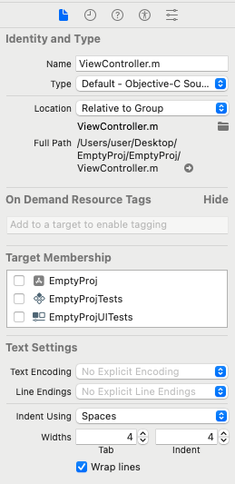

* 删除`SceneDelegate.h`和 `SceneDelegate.m`   (或者不包含进工程目录，防止进入编译期)

  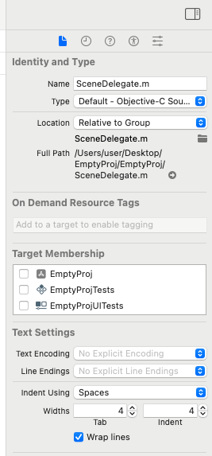

* [处理：**`Unknown class ViewController in Interface Builder file.`**](#Unknown_class_in_Interface_Builder_file)

### 2、iOS新建应用使用多场景

* TODO


## 五、代码讲解

### 1、**`UIButton.UIButtonConfiguration`** <a href="#前言" style="font-size:17px; color:green;"><b>回到顶部</b></a>
<details id="UIButton">
<summary><strong>点我了解详情</strong></summary>

* 苹果在后续的Api中推出了`UIButtonConfiguration` 来设置UIButton，但是这个新Api会存在几大问题

  * 大多数开发者对这个Api不熟悉
  * <font color=red>**用了新Api以后，老的Api的一些调用方式可能不会起效果**</font>。如果还是按照以前的方式创建，你会发现**UIButton**不正常出现
  * 大多数时候，我们会涉及到富文本。而富文本和普通的文本之间对于控件有优先级。<font color=blue>**富文本的优先级最高**</font>
  * 因为要做兼容处理，但是`UIButtonConfiguration` 的设置环节非常繁琐
  
* 所以，为了应对以上的问题，可以使用快捷键（`init.JobsBtn`）调取代码块来设置 **UIButton**。[**快捷键调取代码块**](https://github.com/JobsKit/JobsCodeSnippets)

  * 得出的 UIButton 是没有约束的，需要自己在外界加
  * 关注实现类：[<font color=blue>**`@implementation UIButton (UI)`**</font>](https://github.com/295060456/JobsOCBaseConfigDemo/tree/main/JobsOCBaseConfigDemo/JobsOCBaseCustomizeUIKitCore/UIButton/UIButton+Category/UIButton+UI)
  
* [<font color=blue>**`@interface UIButtonModel : BaseModel<BaseButtonProtocol>`**</font>](https://github.com/295060456/JobsOCBaseConfigDemo/tree/main/JobsOCBaseConfigDemo/JobsOCBaseCustomizeUIKitCore/NSObject/BaseObject/UIViewModelFamily/UIButtonModel)

  * 可以对单个的**UIButton**进行配置
  * 可以批量对**UIButton**进行配置（自带数据源）
  
* 对以**`UIButton`**为基底，里面的子控件进行配置（在创建后立即调用）

  * **BaseButtonProtocol.h**
  
    ```objective-c
    @protocol BaseButtonProtocol <BaseViewProtocol>
    @optional
    #pragma mark —— UIButton + UI
    /// 为了迎合点语法而故意把下列方法属性化
    /// Common
    @property(nonatomic,strong)UIButtonConfiguration *buttonConfiguration;
    @property(nonatomic,strong)UIBackgroundConfiguration *backgroundConfiguration;
    @property(nonatomic,assign)NSTextAlignment titleAlignment;
    @property(nonatomic,assign)UIButtonConfigurationTitleAlignment buttonConfigurationTitleAlignment;
    @property(nonatomic,assign)BOOL jobsSelected;
    #pragma mark —— JobsBtnModel
    @property(nonatomic,strong)UIColor *btnBackgroundColor;
    @property(nonatomic,assign)CGSize imageSize;
    /// 结合下列属性来实现改变Button文字位置
    @property(nonatomic,assign)UIControlContentHorizontalAlignment contentHorizontalAlignment;
    @property(nonatomic,assign)UIControlContentVerticalAlignment contentVerticalAlignment;
    @property(nonatomic,assign)NSDirectionalRectEdge directionalRectEdge;
    @property(nonatomic,assign)UIEdgeInsets contentEdgeInsets;/// iOS 15以前可以用
    @property(nonatomic,readwrite,assign)NSDirectionalEdgeInsets contentInsets;/// iOS 15以后 结合UIButtonConfiguration 以替换属性：UIEdgeInsets contentEdgeInsets;
    @property(nonatomic,assign)CGFloat contentSpacing;
    @property(nonatomic,assign)NSLineBreakMode lineBreakMode;
    @property(nonatomic,assign)NSLineBreakMode subLineBreakMode;
    @property(nonatomic,assign)CGFloat btnWidth;/// 预设值，父视图的宽度不能大于这个值
    #pragma mark —— 以前的
    /// ⚠️执行return的顺序依照下列👇🏻属性的排序⚠️
    ///【组 1】UIButton 单独自定义设置系统自带控件的Frame【形成Frame后直接return，避免被其他中间过程修改】❤️与组2、3属性互斥❤️
    @property(nonatomic,assign)CGRect textLabelFrame;
    @property(nonatomic,assign)CGRect subTextLabelFrame;
    @property(nonatomic,assign)CGRect imageViewFrame;
    ///【组 2】UIButton 单独自定义设置系统自带控件的Size【形成Frame后直接return，避免被其他中间过程修改】❤️与组1、3属性互斥❤️
    @property(nonatomic,assign)CGSize textLabelSize;
    @property(nonatomic,assign)CGFloat textLabelFrameResetX;
    @property(nonatomic,assign)CGFloat textLabelFrameResetY;
    
    @property(nonatomic,assign)CGSize subTextLabelSize;
    @property(nonatomic,assign)CGFloat subTextLabelFrameResetX;
    @property(nonatomic,assign)CGFloat subTextLabelFrameResetY;
    
    @property(nonatomic,assign)CGSize imageViewSize;
    @property(nonatomic,assign)CGFloat imageViewFrameResetX;
    @property(nonatomic,assign)CGFloat imageViewFrameResetY;
    ///【组 3】UIButton 单独自定义设置系统自带控件的长宽【形成Frame后直接return，避免被其他中间过程修改】❤️与组1、2属性互斥❤️
    @property(nonatomic,assign)CGFloat textLabelWidth;
    @property(nonatomic,assign)CGFloat subTextLabelWidth;
    @property(nonatomic,assign)CGFloat imageViewWidth;
    @property(nonatomic,assign)CGFloat textLabelHeight;
    @property(nonatomic,assign)CGFloat subTextLabelHeight;
    @property(nonatomic,assign)CGFloat imageViewHeight;
    /// UIButton 单独自定义设置系统自带控件的偏移量 ❤️与其他组属性不互斥❤️
    // 关于 textLabel 的偏移
    @property(nonatomic,assign)CGFloat textLabelFrameOffsetX;
    @property(nonatomic,assign)CGFloat textLabelFrameOffsetY;
    @property(nonatomic,assign)CGFloat textLabelFrameOffsetWidth;
    @property(nonatomic,assign)CGFloat textLabelFrameOffsetHeight;
    // 关于 subTextLabel 的偏移
    @property(nonatomic,assign)CGFloat subTextLabelFrameOffsetX;
    @property(nonatomic,assign)CGFloat subTextLabelFrameOffsetY;
    @property(nonatomic,assign)CGFloat subTextLabelFrameOffsetWidth;
    @property(nonatomic,assign)CGFloat subTextLabelFrameOffsetHeight;
    // 关于 imageView 的偏移
    @property(nonatomic,assign)CGFloat imageViewFrameOffsetX;
    @property(nonatomic,assign)CGFloat imageViewFrameOffsetY;
    @property(nonatomic,assign)CGFloat imageViewFrameOffsetWidth;
    @property(nonatomic,assign)CGFloat imageViewFrameOffsetHeight;
    //具体由子类进行复写【数据定UI】【如果所传参数为基本数据类型，那么包装成对象NSNumber进行转化承接】
    -(void)richElementsInButtonWithModel:(id _Nullable)model;
    #pragma mark —— 用类方法定义
    //具体由子类进行复写【数据定宽】【如果所传参数为基本数据类型，那么包装成对象NSNumber进行转化承接】
    +(CGFloat)buttonWidthWithModel:(id _Nullable)model;
    //具体由子类进行复写【数据定高】【如果所传参数为基本数据类型，那么包装成对象NSNumber进行转化承接】
    +(CGFloat)buttonHeightWithModel:(id _Nullable)model;
    //具体由子类进行复写【数据尺寸】【如果所传参数为基本数据类型，那么包装成对象NSNumber进行转化承接】
    +(CGSize)buttonSizeWithModel:(id _Nullable)model;
    //具体由子类进行复写【数据Frame】【如果所传参数为基本数据类型，那么包装成对象NSNumber进行转化承接】
    +(CGRect)buttonFrameWithModel:(id _Nullable)model;
    #pragma mark —— 用实例方法定义
    //具体由子类进行复写【数据定宽】【如果所传参数为基本数据类型，那么包装成对象NSNumber进行转化承接】
    -(CGFloat)buttonWidthWithModel:(id _Nullable)model;
    //具体由子类进行复写【数据定高】【如果所传参数为基本数据类型，那么包装成对象NSNumber进行转化承接】
    -(CGFloat)buttonHeightWithModel:(id _Nullable)model;
    //具体由子类进行复写【数据尺寸】【如果所传参数为基本数据类型，那么包装成对象NSNumber进行转化承接】
    -(CGSize)buttonSizeWithModel:(id _Nullable)model;
    //具体由子类进行复写【数据Frame】【如果所传参数为基本数据类型，那么包装成对象NSNumber进行转化承接】
    -(CGRect)buttonFrameWithModel:(id _Nullable)model;
    ```
  
* 系统配置文件

  * ```objective-c
    @interface UIButtonConfiguration : NSObject <NSCopying, NSSecureCoding>
    ```
  
  * ```objective-c
    @interface UIBackgroundConfiguration : NSObject <NSCopying, NSSecureCoding>
    ```
  
  * ```objective-c
    @interface UIImageConfiguration : NSObject <NSCopying, NSSecureCoding>
    ```
  
    * ```objective-c
      @interface UIImageSymbolConfiguration : UIImageConfiguration
      ```
  
* 新的Api（**UIButtonConfiguration**）不带状态。即以下的带状态的无法配置。全部由**UIButtonConfiguration**接管

  * ```objective-c
    typedef NS_OPTIONS(NSUInteger, UIControlState) {
        UIControlStateNormal       = 0,
        UIControlStateHighlighted  = 1 << 0,                  // used when UIControl isHighlighted is set
        UIControlStateDisabled     = 1 << 1,
        UIControlStateSelected     = 1 << 2,                  // flag usable by app (see below)
        UIControlStateFocused API_AVAILABLE(ios(9.0)) = 1 << 3, // Applicable only when the screen supports focus
        UIControlStateApplication  = 0x00FF0000,              // additional flags available for application use
        UIControlStateReserved     = 0xFF000000               // flags reserved for internal framework use
    };
    ```
  
  * ```objective-c
    - (void)setTitle:(nullable NSString *)title forState:(UIControlState)state;                     // default is nil. title is assumed to be single line
    - (void)setTitleColor:(nullable UIColor *)color forState:(UIControlState)state UI_APPEARANCE_SELECTOR; // default is nil. use opaque white
    - (void)setTitleShadowColor:(nullable UIColor *)color forState:(UIControlState)state UI_APPEARANCE_SELECTOR; // default is nil. use 50% black
    - (void)setImage:(nullable UIImage *)image forState:(UIControlState)state;                      // default is nil. should be same size if different for different states
    - (void)setBackgroundImage:(nullable UIImage *)image forState:(UIControlState)state UI_APPEARANCE_SELECTOR; // default is nil
    - (void)setPreferredSymbolConfiguration:(nullable UIImageSymbolConfiguration *)configuration forImageInState:(UIControlState)state UI_APPEARANCE_SELECTOR API_AVAILABLE(ios(13.0), tvos(13.0), watchos(6.0));
    - (void)setAttributedTitle:(nullable NSAttributedString *)title forState:(UIControlState)state API_AVAILABLE(ios(6.0)); // default is nil. title is assumed to be single line
    
    - (nullable NSString *)titleForState:(UIControlState)state;          // these getters only take a single state value
    - (nullable UIColor *)titleColorForState:(UIControlState)state;
    - (nullable UIColor *)titleShadowColorForState:(UIControlState)state;
    - (nullable UIImage *)imageForState:(UIControlState)state;
    - (nullable UIImage *)backgroundImageForState:(UIControlState)state;
    - (nullable UIImageSymbolConfiguration *)preferredSymbolConfigurationForImageInState:(UIControlState)state API_AVAILABLE(ios(13.0), tvos(13.0), watchos(6.0));
    - (nullable NSAttributedString *)attributedTitleForState:(UIControlState)state API_AVAILABLE(ios(6.0));
    ```
  
* 对配置文件的修改：<font color=red>**必须对配置文件`UIButtonConfiguration *configuration`进行整体的替换**</font>

  * 无效的修改
  
    ```objective-c
    id A = button.configuration.background.image;
    button.configuration.background.image = nil;
    [button updateConfiguration];
    id B = button.configuration.background.image;
    ```
  
  * 有效的修改
  
    ```objective-c
    id A = button.configuration;
    button.configuration = nil;
    [button updateConfiguration];
    id B = button.configuration;
    ```
  
* <font color=red id=用新Api（UIButtonConfiguration）创建一个带富文本的UIButton>**用新Api（UIButtonConfiguration）创建一个带富文本的UIButton**</font>

  ```objective-c
  -(BaseButton *)applyNowBtn{
     if(!_applyNowBtn){
         _applyNowBtn = BaseButton.jobsInit()
             .bgColor(JobsWhiteColor)
             .jobsResetImagePlacement(NSDirectionalRectEdgeLeading)
             .jobsResetImagePadding(1)
             .jobsResetBtnImage(JobsIMG(@"APPLY NOW"))
             .jobsResetBtnBgImage(JobsIMG(@"APPLY NOW"))
             .jobsResetBtnTitleCor(JobsWhiteColor)
             .titleFont(UIFontWeightBoldSize(JobsWidth(12)))
             .jobsResetBtnTitle(JobsInternationalization(@"APPLY NOW"))
             .onClick(^(UIButton *x){
                 NSLog(@"");
             }).onLongPressGesture(^(id data){
                 NSLog(@"");
             });
         [self.bgImageView addSubview:_applyNowBtn];
         [_applyNowBtn mas_makeConstraints:^(MASConstraintMaker *make) {
             make.size.mas_equalTo(CGSizeMake(JobsWidth(99), JobsWidth(29)));
             make.right.equalTo(self.view).offset(JobsWidth(-166));
             make.bottom.equalTo(self.view).offset(JobsWidth(-127));
         }];
     }return _applyNowBtn;
  }
  ```
  
* <font color=red>`UIButtonConfiguration`</font> + <font color=red>`SDWebImage`</font>

  ```objective-c
  _headBtn = BaseButton.jobsInit()
     .imageURL(@"".jobsUrl)
     .placeholderImage(JobsIMG(@"小狮子"))
     .options(SDWebImageRefreshCached)/// 强制刷新缓存
     .completed(^(UIImage * _Nullable image,
                  NSError * _Nullable error,
                  SDImageCacheType cacheType,
                  NSURL * _Nullable imageURL) {
         if (error) {
             NSLog(@"图片加载失败: %@-%@", error,imageURL);
         } else {
             NSLog(@"图片加载成功");
         }
     }).onClick(^(UIButton *x){
         @jobs_strongify(self)
         if (self.objectBlock) self.objectBlock(x);
     }).onLongPressGesture(^(id data){
     NSLog(@"");
  }).bgNormalLoad();
  ```
  
* <font color=red>**因为此Api过于冗长且较为繁琐，所以对上述Api的二次封装**</font>

  ```objective-c
  -(BaseButton *)applyNowBtn{
      if(!_applyNowBtn){
          @jobs_weakify(self)
          _applyNowBtn = BaseButton.initByAttributedString(self.richTextWithDataConfigMutArr(jobsMakeMutArr(^(__kindof NSMutableArray * _Nullable data) {
              data.add(jobsMakeRichTextConfig(^(__kindof JobsRichTextConfig * _Nullable data1) {
                  @jobs_strongify(self)
                  data1.font = UIFontWeightRegularSize(14);
                  data1.textCor = JobsCor(@"#666666");
                  data1.targetString = self.richTextMutArr[0];
                  data1.paragraphStyle = self.jobsParagraphStyleCenter;
              }));
              data.add(jobsMakeRichTextConfig(^(__kindof JobsRichTextConfig * _Nullable data1) {
                  @jobs_strongify(self)
                  data1.font = UIFontWeightRegularSize(14);
                  data1.textCor = JobsCor(@"#BA9B77");
                  data1.targetString = self.richTextMutArr[1];
                  data1.paragraphStyle = self.jobsParagraphStyleCenter;
              }));
              data.add(jobsMakeRichTextConfig(^(__kindof JobsRichTextConfig * _Nullable data1) {
                  @jobs_strongify(self)
                  data1.font = UIFontWeightRegularSize(14);
                  data1.textCor = JobsCor(@"#666666");
                  data1.targetString = self.richTextMutArr[2];
                  data1.paragraphStyle = self.jobsParagraphStyleCenter;
              }));
          }))).bgColor(JobsWhiteColor)
              .jobsResetImagePlacement(NSDirectionalRectEdgeLeading)
              .jobsResetImagePadding(1)
              .jobsResetBtnImage(JobsIMG(@"APPLY NOW"))
              .jobsResetBtnBgImage(JobsIMG(@"APPLY NOW"))
              .jobsResetBtnTitleCor(JobsWhiteColor)
              .jobsResetBtnTitleFont(UIFontWeightBoldSize(JobsWidth(12)))
              .jobsResetBtnTitle(JobsInternationalization(@"APPLY NOW"))
              .onClick(^(UIButton *x){
                  @jobs_strongify(self)
                  x.selected = !x.selected;
                  if (self.objectBlock) self.objectBlock(x);
              }).onLongPressGesture(^(id data){
                  NSLog(@"");
              });
      }return _applyNowBtn;
  }
  ```
  
* 对按钮各项属性的设置

  * ```objective-c
    /// 主标题是否多行显示
    -(jobsByBOOLBlock _Nonnull)makeNewLineShows;
    ///【兼容】重设Btn主标题的文字内容 优先级高于jobsResetTitle
    -(JobsReturnButtonByStringBlock _Nonnull)jobsResetBtnTitle;
    ///【兼容】重设Btn主标题的文字颜色
    -(JobsReturnButtonByColorBlock _Nonnull)jobsResetBtnTitleCor;
    ///【兼容】重设Btn的主标题字体
    -(JobsReturnButtonByFontBlock _Nonnull)jobsResetBtnTitleFont;
    ///【兼容】重设Btn的主标题对其方式
    -(JobsReturnButtonByNSIntegerBlock _Nonnull)jobsResetBtnTitleAlignment;
    #pragma mark —— 一些通用修改.副标题
    ///【最新的Api】重设Btn副标题的文字内容
    -(JobsReturnButtonByStringBlock _Nonnull)jobsResetBtnSubTitle API_AVAILABLE(ios(16.0));
    ///【最新的Api】重设Btn副标题的文字颜色
    -(JobsReturnButtonByColorBlock _Nonnull)jobsResetBtnSubTitleCor API_AVAILABLE(ios(16.0));
    ///【兼容】重设Btn的副标题字体
    -(JobsReturnButtonByFontBlock _Nonnull)jobsResetBtnSubTitleFont;
    ///【最新的Api】修改副标题的对齐方式
    -(JobsReturnButtonByTextAlignmentBlock _Nonnull)jobsResetSubTitleTextAlignment API_AVAILABLE(ios(16.0));
    #pragma mark —— 一些通用修改.按钮图片
    ///【兼容】重设Btn.Image
    -(JobsReturnButtonByImageBlock _Nonnull)jobsResetBtnImage;
    #pragma mark —— 一些通用修改.按钮背景图片
    ///【兼容】重设Btn的背景图片
    -(JobsReturnButtonByImageBlock _Nonnull)jobsResetBtnBgImage;
    #pragma mark —— 一些通用修改.按钮颜色
    ///【兼容】重设Btn的背景颜色
    -(JobsReturnButtonByColorBlock _Nonnull)jobsResetBtnBgCor;
    #pragma mark —— 一些通用修改.Layer
    ///【合并】重设Btn的描边：线宽和线段的颜色
    -(JobsReturnButtonByColor_FloatBlock _Nonnull)jobsResetBtnLayerBorderCorAndWidth;
    ///【兼容】重设Btn的圆切角
    -(JobsReturnButtonByCGFloatBlock _Nonnull)jobsResetBtnCornerRadiusValue;
    ///【兼容】重设Btn的描边线段的颜色
    -(JobsReturnButtonByColorBlock _Nonnull)jobsResetBtnLayerBorderCor;
    ///【兼容】重设Btn的描边线段的宽度
    -(JobsReturnButtonByCGFloatBlock _Nonnull)jobsResetBtnLayerBorderWidth;
    #pragma mark —— 一些通用修改.富文本
    ///【兼容】重设Btn富文本
    -(JobsReturnButtonByAttributedStringBlock _Nonnull)jobsResetBtnNormalAttributedTitle;
    #pragma mark —— 一些通用修改.间距
    ///【兼容】重设Btn的图文间距和相对位置
    -(JobsReturnButtonByImagePlacementAndPaddingBlock _Nonnull)jobsResetImagePlacement_Padding API_AVAILABLE(ios(16.0));
    ///【最新的Api】重设Btn的图文相对位置
    -(JobsReturnButtonByImagePlacementBlock _Nonnull)jobsResetImagePlacement API_AVAILABLE(ios(16.0));
    ///【最新的Api】重设Btn的图文间距
    -(JobsReturnButtonByCGFloatBlock _Nonnull)jobsResetImagePadding API_AVAILABLE(ios(16.0));
    ///【最新的Api】重设Btn主标题与副标题之间的距离
    -(JobsReturnButtonByCGFloatBlock _Nonnull)jobsResetTitlePadding API_AVAILABLE(ios(16.0));
    ```
    
  * ```objective-c
    -(JobsReturnButtonByTitleAlignmentBlock _Nonnull)jobsResetTitleAlignment API_AVAILABLE(ios(16.0));
    -(JobsReturnButtonByBOOLBlock _Nonnull)jobsResetAutomaticallyUpdateForSelection API_AVAILABLE(ios(16.0));
    -(JobsReturnButtonConfigurationByBackgroundBlock _Nonnull)jobsResetBackground API_AVAILABLE(ios(16.0));
    -(JobsReturnButtonConfigurationByImageBlock _Nonnull)jobsResetBackgroundImage API_AVAILABLE(ios(16.0));
    -(JobsReturnButtonConfigurationByCornerStyleBlock _Nonnull)jobsResetCornerStyle API_AVAILABLE(ios(16.0));
    -(JobsReturnButtonConfigurationBySizeBlock _Nonnull)jobsResetButtonSize API_AVAILABLE(ios(16.0));
    -(JobsReturnButtonConfigurationByMacIdiomStyleBlock _Nonnull)jobsResetMacIdiomStyle API_AVAILABLE(ios(16.0));
    -(JobsReturnButtonConfigurationByBaseBackgroundColorBlock _Nonnull)jobsResetBaseBackgroundColor API_AVAILABLE(ios(16.0));
    -(JobsReturnButtonConfigurationByImageBlock _Nonnull)jobsResetImage API_AVAILABLE(ios(16.0));
    -(JobsReturnButtonConfigurationByImageColorTransformerBlock _Nonnull)jobsResetImageColorTransformer API_AVAILABLE(ios(16.0));
    -(JobsReturnButtonConfigurationByPreferredSymbolConfigurationForImageBlock _Nonnull)jobsResetPreferredSymbolConfigurationForImage API_AVAILABLE(ios(16.0));
    -(JobsReturnButtonConfigurationByShowsActivityIndicatorBlock _Nonnull)jobsResetShowsActivityIndicator API_AVAILABLE(ios(16.0));
    -(JobsReturnButtonConfigurationByActivityIndicatorColorTransformerBlock _Nonnull)jobsResetActivityIndicatorColorTransformer API_AVAILABLE(ios(16.0));
    -(JobsReturnButtonConfigurationByTitleBlock _Nonnull)jobsResetTitle API_AVAILABLE(ios(16.0));
    -(JobsReturnButtonConfigurationByTitleBlock _Nonnull)jobsResetSubTitle API_AVAILABLE(ios(16.0));
    -(JobsReturnButtonConfigurationByAttributedTitleBlock _Nonnull)jobsResetAttributedTitle API_AVAILABLE(ios(16.0));
    -(JobsReturnButtonConfigurationByTitleTextAttributesTransformerBlock _Nonnull)jobsResetTitleTextAttributesTransformer API_AVAILABLE(ios(16.0));
    -(JobsReturnButtonConfigurationByTitleLineBreakModeBlock _Nonnull)jobsResetTitleLineBreakMode API_AVAILABLE(ios(16.0));
    -(JobsReturnButtonConfigurationByTitleLineBreakModeBlock _Nonnull)jobsResetSubTitleLineBreakMode API_AVAILABLE(ios(16.0));
    -(JobsReturnButtonConfigurationBySubtitleBlock _Nonnull)jobsResetSubtitle API_AVAILABLE(ios(16.0));
    -(JobsReturnButtonConfigurationByAttributedSubtitleBlock _Nonnull)jobsResetAttributedSubtitle API_AVAILABLE(ios(16.0));
    -(JobsReturnButtonConfigurationBySubtitleTextAttributesTransformerBlock _Nonnull)jobsResetSubtitleTextAttributesTransformer API_AVAILABLE(ios(16.0));
    -(JobsReturnButtonConfigurationBySubtitleLineBreakModeBlock _Nonnull)jobsResetSubtitleLineBreakMode API_AVAILABLE(ios(16.0));
    -(JobsReturnButtonConfigurationByIndicatorBlock _Nonnull)jobsResetIndicator API_AVAILABLE(ios(16.0));
    -(JobsReturnButtonConfigurationByIndicatorColorTransformerBlock _Nonnull)jobsResetIndicatorColorTransformer API_AVAILABLE(ios(16.0));
    -(JobsReturnButtonConfigurationByContentInsetsBlock _Nonnull)jobsResetContentInsets API_AVAILABLE(ios(16.0));
    -(JobsReturnButtonConfigurationByBaseForegroundColorBlock _Nonnull)jobsResetTitleBaseForegroundColor API_AVAILABLE(ios(16.0));
    -(JobsReturnButtonConfigurationByBaseForegroundColorBlock _Nonnull)jobsResetSubTitleBaseForegroundColor API_AVAILABLE(ios(16.0));
    -(JobsReturnButtonConfigurationByFontBlock _Nonnull)jobsResetTitleFont API_AVAILABLE(ios(16.0));
    -(JobsReturnButtonConfigurationByFontBlock _Nonnull)jobsResetSubTitleFont API_AVAILABLE(ios(16.0));
    ```
  
* 资料来源：

  * [**UIButtonConfiguration**](https://www.jianshu.com/p/12426709420e)
  * [**Chat GPT 3.5**](https://chatgpt.com/)

 </details>

### 2、倒计时按钮的封装 <a href="#前言" style="font-size:17px; color:green;"><b>回到顶部</b></a>

* 关注实现类 [**@interface UIButton (Timer)**](https://github.com/295060456/JobsOCBaseConfigDemo/tree/main/JobsOCBaseConfigDemo/JobsOCBaseCustomizeUIKitCore/UIButton/UIButton+Category/UIButton+Timer)

* 调用示例

  ```objective-c
  /// 带倒计时功能的发送短信验证码按钮
  -(__kindof UIButton *)makeSendSMSCodeBtn{
      @jobs_weakify(self)
      return UIButton.initByConfig(jobsMakeButtonTimerConfigModel(^(__kindof ButtonTimerConfigModel * _Nullable data) {
          /// 一些通用的设置
          data.count = 10;
          data.showTimeType = ShowTimeType_SS;// 时间显示风格
          data.countDownBtnType = TimerStyle_anticlockwise;// 时间方向
          data.cequenceForShowTitleRuningStrType = CequenceForShowTitleRuningStrType_tail;//
          data.labelShowingType = UILabelShowingType_01;//【换行模式】
          data.secondStr = @" ".add(JobsInternationalization(@"S"));
          /// 计时器未开始【静态值】
          data.readyPlayValue = jobsMakeButtonModel(^(UIButtonModel * _Nullable model) {
              model.jobsSize = CGSizeMake(JobsWidth(80), JobsWidth(28));
              model.bgCor = JobsClearColor;
              model.layerBorderCor = JobsClearColor;
              model.titleCor = JobsWhiteColor;
              model.title = JobsInternationalization(@"GET CODE");
              model.titleFont = bayonRegular(JobsWidth(12));
              model.backgroundImage = JobsIMG(@"获取验证码背景图");
          });
          /// 计时器进行中【动态值】
          data.runningValue = jobsMakeButtonModel(^(UIButtonModel * _Nullable model) {
              model.jobsSize = CGSizeMake(JobsWidth(80), JobsWidth(28));
              model.bgCor = JobsClearColor;
              model.title = @"  ";
              model.layerBorderCor = JobsClearColor;
              model.titleCor = JobsWhiteColor;
              model.titleFont = bayonRegular(JobsWidth(12));
              model.backgroundImage = JobsIMG(@"获取验证码背景图");
          });
          /// 计时器结束【静态值】
          data.endValue = jobsMakeButtonModel(^(UIButtonModel * _Nullable model) {
              model.jobsSize = CGSizeMake(JobsWidth(80), JobsWidth(28));
              model.bgCor = JobsClearColor;
              model.titleCor = JobsWhiteColor;
              model.title = JobsInternationalization(@"GET CODE");
              model.titleFont = bayonRegular(JobsWidth(12));
              model.backgroundImage = JobsIMG(@"获取验证码背景图");
          });
      })).onClick(^(__kindof UIButton *x){
          @jobs_strongify(self)
          x.startTimer();//选择时机、触发启动
          if (self.objectBlock) self.objectBlock(x);
      }).onLongPressGesture(^(id data){
          NSLog(@"");
      }).heartBeat(^(NSTimerManager *_Nullable data){
          NSLog(@"❤️❤️❤️❤️❤️%f",data.anticlockwiseTime);
      });
  }
  ```
  
* <font color=red>**倒计时事件触发**</font>
  
  * **对倒计时按钮的倒计时功能进行控制**
  
    * **开始**
    
      ```objective-c
      self.countDownBtn.startTimer();
      ```
    
    * **暂停**

      ```objective-c
      self.countDownBtn.timerSuspend();
      ```

    * **继续**

      ```objective-c
      self.countDownBtn.timerContinue();
      ```

    * **结束**

      ```objective-c
      self.countDownBtn.timerDestroy();
      ```
    
  * **正常的按钮点击事件**
    
    * 主调用中的`clickEventBlock:(JobsReturnIDByIDBlock _Nullable)clickEventBlock`参数
    
    * 和主调用进行剥离，可以在其他地方灵活实现
    
      ```objective-c
      [self.countDownBtn jobsBtnClickEventBlock:^id(UIButton *x) {
         x.startTimer();//选择时机、触发启动
         NSLog(@"🪓🪓🪓🪓🪓 = 获取验证码");
         return nil;
      }];
      ```
    
  * **按钮的长按事件**：
    
    * 因为是低频需求，所以目前只封装在主调用上进行呈现
    
    * 长按手势用RAC进行实现
    
      ```objective-c
      /// 设置按钮的长按手势
      -(void)jobsBtnLongPressGestureEventBlock:(JobsReturnIDByIDBlock _Nullable)longPressGestureEventBlock{
          if(longPressGestureEventBlock){
              self.userInteractionEnabled = YES;
              self.addGesture([jobsMakeLongPressGesture(^(UILongPressGestureRecognizer * _Nullable gesture) {
                  /// 这里写手势的配置
              }) gestureActionBy:^{
                  /// 这里写手势的触发
                  if(longPressGestureEventBlock) longPressGestureEventBlock(self);
              }]);
          }
      }
      ```

### 3、[**`Masonry`**](https://github.com/SnapKit/Masonry) 的一些使用技巧 <a href="#前言" style="font-size:17px; color:green;"><b>回到顶部</b></a>

* ```ruby
  pod 'Masonry' # https://github.com/SnapKit/Masonry NO_SMP
  ```

  ```objective-c
  #if __has_include(<Masonry/Masonry.h>)
  #import <Masonry/Masonry.h>
  #else
  #import "Masonry.h"
  #endif
  ```

* 关注实现类：[**@interface UIView (Masonry)**](https://github.com/295060456/JobsOCBaseConfigDemo/tree/main/JobsOCBaseConfigDemo/JobsOCBaseCustomizeUIKitCore/UIView/UIView+Category/UIView+Masonry)

* 统一设置内边距
  
  ```objective-c
  [self.chatBubbleIMGV addSubview:_chatContentLab];
  [_chatContentLab mas_makeConstraints:^(MASConstraintMaker *make) {
      make.edges.equalTo(self.chatBubbleIMGV).with.insets(UIEdgeInsetsMake(5, 5, 5, 5));
  }];
  ```
  
*  对Masonry约束Block进行存储，一般一个View对应一个约束。先addSubview，再利用存储的约束进行绘制UI
*  ```objective-c
  -(JobsReturnViewByButtonModelBlock _Nonnull)showEmptyButtonBy{
      return ^__kindof UIView *_Nullable(UIButtonModel *model){
          @jobs_weakify(self)
          return jobsMakeView(^(__kindof UIView *_Nullable view) {
              @jobs_strongify(self)
              view.frame = self.bounds;
              self.addSubview(view);
              view.cleanSubview();
              view.addSubview(UIButton.initByButtonModel(model ? : jobsMakeButtonModel(^(__kindof UIButtonModel * _Nullable data) {
                  data.title = JobsInternationalization(@"No Datas");
                  data.titleCor = JobsWhiteColor;
                  data.titleFont = bayonRegular(JobsWidth(30));
                  data.normalImage = JobsIMG(@"暂无数据");
                  data.baseBackgroundColor = JobsClearColor.colorWithAlphaComponent(0);
              })).setMasonryBy(^(MASConstraintMaker *make){
                  @jobs_strongify(self)
                  make.centerX.equalTo(self).offset(model.btn_offset_x);
                  make.centerY.equalTo(self).offset(model.btn_offset_y);
                  make.width.equalTo(self);
              }));
          });
      };
  }
  ```
  
* 将以前的约束全部清除，用最新的`mas_remakeConstraints`
  
* 如果在已有的约束基础上，再更新约束`mas_updateConstraints`
  
  ```objective-c
  -(UIView *)pointView{
      if(!_pointView){
          _pointView = UIView.new;
          [self addSubview:_pointView];
          [_pointView mas_makeConstraints:^(MASConstraintMaker *make) {
              make.size.mas_equalTo(CGSizeMake(JobsWidth(8), JobsWidth(8)));
              make.top.equalTo(self);
              make.left.equalTo(self);
          }];
      }return _pointView;
  }
  
  -(void)updatePointViewPositionWithOffsetY:(CGFloat)y{
      [self.pointView mas_updateConstraints:^(MASConstraintMaker *make) {
          make.top.equalTo(self).offset(y);
      }];
      [self setNeedsLayout];
      [self layoutIfNeeded];
  }
  ```
  
* [**【开发笔记】Masonry 的 distributeViewsAlongAxis 方法**](https://juejin.cn/post/6935778993320755214)
  
  * 横向拉伸以均分
  
    ```objective-c
    [self.btnMutArr mas_distributeViewsAlongAxis:MASAxisTypeHorizontal/// 在水平方向上分布这些视图
                                withFixedSpacing:20/// 指定每个视图之间的固定间距
                                     leadSpacing:5/// 指定第一个视图与父视图左边缘之间的距离
                                     tailSpacing:5];/// 指定最后一个视图与父视图右边缘之间的距离
    [self.btnMutArr mas_makeConstraints:^(MASConstraintMaker *make) {
        make.top.equalTo(@60);
        make.height.equalTo(@60);
    }];
    ```
  
  * 纵向拉伸以均分
  
    ```objective-c
    [self.btnMutArr mas_distributeViewsAlongAxis:MASAxisTypeVertical/// 在垂直方向上分布这些视图
                                withFixedSpacing:20/// 指定每个视图之间的固定间距
                                     leadSpacing:5/// 指定第一个视图与父视图顶部之间的距离
                                     tailSpacing:5];/// 指定最后一个视图与父视图底部之间的距离
    [self.btnMutArr mas_makeConstraints:^(MASConstraintMaker *make) {
        make.left.equalTo(@0);
        make.width.equalTo(@60);
    }];
    ```
  
  * 纵向固定大小显示
  
    ```objective-c
    [self.btnMutArr mas_distributeViewsAlongAxis:MASAxisTypeVertical/// 在垂直方向上分布这些视图
                             withFixedItemLength:30/// 指定每个视图之间的固定间距
                                     leadSpacing:30/// 指定第一个视图与父视图顶部之间的距离
                                     tailSpacing:200];/// 指定最后一个视图与父视图底部之间的距离
    [self.btnMutArr mas_makeConstraints:^(MASConstraintMaker *make) {
        make.left.equalTo(@0);
        make.width.equalTo(@60);
    }];
    ```
    
  * 将上述进行封装以后的调用示例：
  
    ```objective-c
    #import "NSArray+Tools.h"
    
    @property(nonatomic,strong)NSMutableArray <UIImageView *>*subViewsMutArr;
    self.subViewsMutArr.describe();
    
    -(NSMutableArray<UIImageView *> *)subViewsMutArr{
        if(!_subViewsMutArr){
            @jobs_weakify(self)
            _subViewsMutArr = jobsMakeMutArr(^(__kindof NSMutableArray <__kindof UIView *>*_Nullable data) {
                @jobs_strongify(self)
                data.add(BonusEarnedView.JobsRichElementsInViewWithModel(nil));
                data.add(InvitedFriendsNumberView.JobsRichElementsInViewWithModel(nil));
                data.add(CopyLinkView.JobsRichElementsInViewWithModel(nil));
                data.add(DownloadQRCodeView.JobsRichElementsInViewWithModel(nil));
                for (UIView *view in data) {
                    self.view.addSubview(view);
                }
            }).installByMasonryModel(jobsMakeMasonryModel(^(__kindof MasonryModel * _Nullable data) {
                data.axisType = MASAxisTypeHorizontal;
                data.fixedSpacing = JobsWidth(22);
                data.leadSpacing = JobsWidth(52);
                data.tailSpacing = JobsWidth(52);
                data.top = JobsWidth(90);
                data.height = [BonusEarnedView viewSizeWithModel:nil].height;
            }));
        }return _subViewsMutArr;
    }
    ```
  

<details id="Masonry约束动画<br>">
 <summary><strong>点我了解详情：Masonry约束动画<br></strong></summary>

```objective-c
-(MSMineView2 *)view2{
    if(!_view2){
        _view2 = MSMineView2.new;
        _view2.jobsRichElementsInViewWithModel(nil);
        [self addSubview:_view2];
        [_view2 jobsMasonryBeforeBlock:^(MASConstraintMaker * _Nonnull make) {
            // 添加第一个 _view2 的约束
            make.width.mas_equalTo(0);
            make.height.mas_equalTo([MSMineView2 viewSizeWithModel:nil].height);
            make.right.equalTo(self).offset(JobsWidth(-10));
            make.top.equalTo(self).offset(JobsWidth(10));
        }
                     masonryAfterBlock:^(MASConstraintMaker * _Nonnull make) {
            // 添加第二个 _view2 的约束
            make.size.mas_equalTo([MSMineView2 viewSizeWithModel:nil]);
            make.centerX.equalTo(self);
            make.top.equalTo(self).offset(JobsWidth(10));
        }];
        [_view2 cornerCutToCircleWithCornerRadius:[MSMineView2 viewSizeWithModel:nil].height / 2];
    }return _view2;
}
```


</details>

### 4、退出`ViewController`的时候，需要做的操作 <a href="#前言" style="font-size:17px; color:green;"><b>回到顶部</b></a>

<details id="退出ViewController的时候，需要做的操作">
 <summary><strong>点我了解详情</strong></summary>

* 定义于`BaseViewProtocol`，因为是进数据，所以可以实现在控制器生命周期的任意处

  ```objective-c
   @jobs_weakify(self)
   self.jobsBackBlock = ^id _Nullable(id _Nullable data) {
       @jobs_strongify(self)
       NSLog(@"退出页面的逻辑");
       return nil;
   };
  ```

* 也可以在具体的子控制器覆写下列方法

  ```objective-c
  -(void)backBtnClickEvent:(UIButton *_Nullable)sender;
  ```
  
  ```objective-c
  ///【子类需要覆写 】创建返回键的点击事件
  -(void)backBtnClickEvent:(UIButton *_Nullable)sender{
      if (self.jobsBackBlock) self.jobsBackBlock(sender);
      switch (self.pushOrPresent) {
          case ComingStyle_PRESENT:{
              [self dismissViewControllerAnimated:YES completion:nil];
          }break;
          case ComingStyle_PUSH:{
              self.navigationController ? [self.navigationController popViewControllerAnimated:YES] : [self dismissViewControllerAnimated:YES completion:nil];
          }break;
              
          default:
              break;
      }
  }
  ```

</details>

### 5、实例对象的weak化，避免循环引用 <a href="#前言" style="font-size:17px; color:green;"><b>回到顶部</b></a>
<details id="相关定义">
<summary><strong>点我了解详情：相关定义</strong></summary>

```objective-c
#ifndef MacroDef_Strong_Weak_h
#define MacroDef_Strong_Weak_h

/** 强弱引用
    Uses
    UIView *view;
    UIButton *btn;

    @jobs_weakify(view)
    weak_view.size;
    @jobs_weakify(btn)
    weak_btn.frame

 # 能用@符号进行调用的根本原因：来自GPT-3.5的回答
    在如下的宏定义中：
    @符号可以用于调用的原因是因为宏内部实际上不包含Objective-C代码块，而是包含了一个函数调用，
    这个函数调用是Objective-C代码中的一个有效表达式。
 */
#ifndef jobs_weakify
#if DEBUG
#if __has_feature(objc_arc)
#define jobs_weakify(self) autoreleasepool{} __weak __typeof__(self) weak##_##self = self;
#else
#define jobs_weakify(self) autoreleasepool{} __block __typeof__(self) block##_##self = self;
#endif
#else
#if __has_feature(objc_arc)
#define jobs_weakify(self) try{} @finally{} {} __weak __typeof__(self) weak##_##self = self;
#else
#define jobs_weakify(self) try{} @finally{} {} __block __typeof__(self) block##_##self = self;
#endif
#endif
#endif

#ifndef jobs_strongify
#if DEBUG
#if __has_feature(objc_arc)
#define jobs_strongify(self) autoreleasepool{} __typeof__(self) self = weak##_##self;
#else
#define jobs_strongify(self) autoreleasepool{} __typeof__(self) self = block##_##self;
#endif
#else
#if __has_feature(objc_arc)
#define jobs_strongify(self) try{} @finally{} __typeof__(self) self = weak##_##self;
#else
#define jobs_strongify(self) try{} @finally{} __typeof__(self) self = block##_##self;
#endif
#endif
#endif

#endif /* MacroDef_Strong_Weak_h */
```

</details>

<details id="使用方式">
 <summary><strong>点我了解详情：使用方式</strong></summary>

 ```objective-c
@jobs_strongify(self)
@jobs_weakify(self)
 ```
</details>

### 6、**使用block，对`@selector`的替代封装，避免方法割裂** <a href="#前言" style="font-size:17px; color:green;"><b>回到顶部</b></a>

<details id="使用block，对selector的封装，避免方法割裂">
 <summary><strong>点我了解详情</strong></summary>

   ```objective-c
 typedef id _Nullable(^JobsReturnIDBySelectorBlock)(id _Nullable weakSelf, id _Nullable arg);
-(SEL _Nullable)jobsSelectorBlock:(JobsReturnIDBySelectorBlock)selectorBlock{
    return selectorBlocks(selectorBlock, MethodName(self), self);
}
   ```

   ```objective-c
   /// 替代系统 @selector(selector) ,用Block的方式调用代码，使得代码逻辑和形式上不割裂
   /// 类方法或全局函数，用于添加选择器
   /// - Parameters:
   ///   - block: 最终的执行体
   ///   - selectorName: 实际调用的方法名（可不填），用于对外输出和定位调用实际使用的方法
   ///   - target: 执行目标
   SEL _Nullable selectorBlocks(JobsReturnIDBySelectorBlock _Nullable block,
                                NSString *_Nullable selectorName,
                                NSObject *_Nonnull target) {
       if (!block) {
           toastErr(JobsInternationalization(@"方法不存在,请检查参数"));
           return NULL;
       }
       NSString *selName = @"selector"
           .add(@"_")
           .add(toStringByID(target.makeSnowflake))
           .add(@"_")
           .add(selectorName);
       NSLog(@"selName = %@", selName);
       SEL sel = NSSelectorFromString(selName);
       /// 检查缓存
       static NSMutableDictionary *methodCache;
       static dispatch_once_t onceToken;
       dispatch_once(&onceToken, ^{
           methodCache = NSMutableDictionary.dictionary;
       });
       
       NSValue *cachedSelValue = methodCache[selName];
       if (cachedSelValue) {
           return cachedSelValue.pointerValue;
       }
       /**
        方法签名由方法名称和一个参数列表（方法的参数的顺序和类型）组成
        注意：方法签名不包括方法的返回类型。不包括返回值和访问修饰符
        第一个参数是在哪个类中添加方法
        第二个参数是所添加方法的编号SEL
        第三个参数是所添加方法的函数实现的指针IMP
        第四个参数是所添加方法的签名
        */
       /// 检查目标类是否已有该方法
       if (class_getInstanceMethod([target class], sel)) {
           NSLog(@"方法曾经已经被成功添加，再次添加会崩溃");
           return sel;
       } else {
           /// 动态添加方法
           if (class_addMethod([target class], sel, (IMP)selectorImp, "v@:@@")) {
               objc_setAssociatedObject(target, sel, block, OBJC_ASSOCIATION_COPY_NONATOMIC);
               methodCache[selName] = NSValue.byPoint(sel);
           } else {
               [NSException raise:JobsInternationalization(@"添加方法失败")
                           format:@"%@ selectorBlock error", target];
           }
       }return sel;
   }
   /// 内部调用无需暴露
   static void selectorImp(id target, SEL _cmd, id arg) {
       JobsReturnIDBySelectorBlock block = objc_getAssociatedObject(target, _cmd);
       if (block) block(target, arg);
   }
   ```
</details>

#### 6.1、[**对按钮点击事件的使用**](#用新Api（UIButtonConfiguration）创建一个带富文本的UIButton)

#### 6.2、对通知的使用

关注实现类：[**`MacroDef_Notification.h`**](https://github.com/295060456/JobsOCBaseConfigDemo/blob/main/JobsOCBaseConfigDemo/OCBaseConfig/%E5%90%84%E9%A1%B9%E5%85%A8%E5%B1%80%E5%AE%9A%E4%B9%89/%E5%90%84%E9%A1%B9%E5%AE%8F%E5%AE%9A%E4%B9%89/MacroDef_Func/MacroDef_Notification.h) [**`@interface NSNotificationCenter (JobsBlock)`**]()

##### 6.2.1、发通知

* ```objective-c
  @implementation NSString (Notification)
  
  -(jobsByIDBlock _Nonnull)postNotificationBy{
      @jobs_weakify(self)
      return ^(id _Nullable data){
          @jobs_strongify(self)
          [NSNotificationCenter.defaultCenter postNotificationName:self object:data];
      };
  }
  
  -(jobsByNotificationModelBlock _Nonnull)postNotificationByModel{
      @jobs_weakify(self)
      return ^(NotificationModel *_Nullable data){
          @jobs_strongify(self)
          [NSNotificationCenter.defaultCenter postNotificationName:self
                                                            object:data.anObject
                                                          userInfo:data.userInfo];
      };
  }
  
  @end
  ```

*  ```objective-c
  [JobsNotificationCenter postNotificationName:LanguageSwitchNotification object:@(NO)];
  ```

* ```objective-c
  /// 在主线程上带参发通知
  -(jobsByKey_ValueBlock _Nonnull)JobsPost{
      return ^(NSString *_Nonnull key,id _Nullable value){
          dispatch_async(dispatch_get_main_queue(), ^{
              key.postNotificationBy(value);
          });
      };
  }
  /// 在主线程上不带参发通知
  -(jobsByStringBlock _Nonnull)jobsPost{
      return ^(NSString *_Nonnull key){
          dispatch_async(dispatch_get_main_queue(), ^{
              key.postNotificationBy(nil);
          });
      };
  }
  ```

* 
  ```objective-c
  /// 2.1、不带参数的发送通知
  #ifndef JobsPostNotification
  #define JobsPostNotification(NotificationName,Obj)\
  [JobsNotificationCenter postNotificationName:(NotificationName) object:(Obj)];
  #endif
  /// 2.2、带参数的发送通知
  #ifndef JobsPostNotificationUserInfo
  #define JobsPostNotificationUserInfo(NotificationName,Obj,UserInfo)\
  [JobsNotificationCenter postNotificationName:(NotificationName) \
                                        object:(Obj) \
                                      userInfo:(UserInfo)];
  #endif
  /// 2.3、在主线程上发送通知【建议】
  #ifndef JobsPostNotificationOnMainThread
  #define JobsPostNotificationOnMainThread(NotificationName, Obj, UserInfo)\
  dispatch_async(dispatch_get_main_queue(), ^{\
      JobsPostNotificationUserInfo(NotificationName,Obj,UserInfo);\
  });
  #endif
  ```

##### 6.2.2、接收通知

* ```objective-c
  @jobs_weakify(self)
  [self addNotificationName:kReachabilityChangedNotification
                      block:^(id _Nullable weakSelf,
                              id _Nullable arg) {
      @jobs_strongify(self)
      NSNotification *notification = (NSNotification *)arg;
      NSLog(@"通知传递过来的 = %@",notification.object);
  }];
  ```

* ```objective-c
  @jobs_weakify(self)
  [JobsNotificationCenter addObserver:self
                             selector:selectorBlocks(^id _Nullable(id _Nullable weakSelf,
                                                                   id _Nullable arg) {
      NSNotification *notification = (NSNotification *)arg;
      if([notification.object isKindOfClass:NSNumber.class]){
          NSNumber *b = notification.object;
          NSLog(@"SSS = %d",b.boolValue);
      }
      NSLog(@"通知传递过来的 = %@",notification.object);
      return nil;
  }, MethodName(self), self) name:JobsLanguageSwitchNotification object:nil];
  ```
  
* ```objective-c
  [JobsNotificationCenter addObserverForName:GSUploadNetworkSpeedNotificationKey
                                      object:nil
                                       queue:nil
                                  usingBlock:^(NSNotification * _Nonnull notification) {
      NSLog(@"%@",notification.object);
  }];
  ```

##### 6.2.3、移除通知

* [**@implementation NSNotificationCenter (JobsBlock)**]()
  
  ```objective-c
  -(jobsByIDBlock _Nonnull)remove{
      return ^(id _Nullable data){
          [JobsNotificationCenter removeObserver:data];
      };
  }
  
  -(jobsByKey_ValueBlock _Nonnull)Remove{
      return ^(NSString *_Nonnull key,id _Nullable value){
          [JobsNotificationCenter removeObserver:value
                                            name:key
                                          object:nil];
      };
  }
  ```

### 7、`UIViewModel`的使用 <a href="#前言" style="font-size:17px; color:green;"><b>回到顶部</b></a>

* 将数据束`UIViewModel`绑定到UI中，包括一些UI交互事件

<details id="UIViewModel的使用">
 <summary><strong>对 UICollectionView 点击事件的封UIViewModel+block</strong></summary>

 ```objective-c
/// Data
@property(nonatomic,strong)NSMutableArray <UIViewModel *>*dataMutArr;
 ```
```objective-c
-(NSMutableArray<UIViewModel *> *)dataMutArr{
    if (!_dataMutArr) {
        @jobs_weakify(self)
        _dataMutArr = jobsMakeMutArr(^(__kindof NSMutableArray * _Nullable data) {
            data.add(jobsMakeViewModel(^(__kindof UIViewModel * _Nullable data1) {
                data1.textModel = jobsMakeTextModel(^(__kindof UITextModel * _Nullable data2) {
                    data2.text = JobsInternationalization(@"Hello");
                    data2.textCor = JobsRedColor;
                    data2.textAlignment = NSTextAlignmentCenter;
                });
                data1.jobsBlock = ^id(id param){
                    @jobs_strongify(self)
                    NSLog(@"Hello");
                    return nil;
                };
            }));
        });
    }return _dataMutArr;
}
```

```objective-c
/// collectionView 选中操作
- (void)collectionView:(UICollectionView *)collectionView
didSelectItemAtIndexPath:(NSIndexPath *)indexPath {
    NSLog(@"%s", __FUNCTION__);
    self.dataMutArr[indexPath.item].jobsBlock(nil);
    /**
     滚动到指定位置
     _collectionView.contentOffset = CGPointMake(0,-100);
     [_collectionView setContentOffset:CGPointMake(0, -200) animated:YES];// 只有在viewDidAppear周期 或者 手动触发才有效
     */
}
```

</details>

### 8、统一注册全局的 `UICollectionViewCell` <a href="#前言" style="font-size:17px; color:green;"><b>回到顶部</b></a>
* 不注册相对应当`UICollectionViewCell`相关子类，使用时会崩溃

* 系统注册`UICollectionViewCell`相关子类，是利用字符串作为桥梁进行操作

* <font color=red>**注册不会开辟内存，只有当使用的时候才会开辟内存**</font>

* 对全局进行统一的`UICollectionViewCell`相关子类注册是很有必要的，方便管理，防止崩溃

* 关注实现类[<font color=blue>**`@implementation UICollectionView (JobsRegisterClass)`**</font>](https://github.com/295060456/JobsOCBaseConfigDemo/tree/main/JobsOCBaseConfigDemo/JobsOCBaseCustomizeUIKitCore/UICollectionView/UICollectionView+Category/UICollectionView+JobsRegisterClass)

* 在每一个`_collectionView`创建的时候，加入以下这一段代码

  ```objective-c
  [_collectionView registerCollectionViewClass];
  ```

### 9、全局的弹出框 <a href="#前言" style="font-size:17px; color:green;"><b>回到顶部</b></a>

#### 9.1、全局统一的<font color=red>**提示弹出框**</font>

* 本质是对[**`WHToast`**](https://github.com/remember17/WHToast)的二次封装。其实[**TFPopup**](https://github.com/shmxybfq/TFPopup)也有同样的功能

* 接入方式：

  * `Podfile`
  
    ```ruby
    pod 'WHToast' # https://github.com/remember17/WHToast 一个轻量级的提示控件，没有任何依赖 NO_SMP
    ```
    
  * ```objective-c
    #if __has_include(<WHToast/WHToast.h>)
    #import <WHToast/WHToast.h>
    #else
    #import "WHToast.h"
    #endif
    ```
    
  * 关注实现类：[<font color=blue>**`@implementation NSObject (WHToast)`**</font>](https://github.com/295060456/JobsOCBaseConfigDemo/tree/main/JobsOCBaseConfigDemo/JobsOCBaseCustomizeUIKitCore/NSObject/NSObject+Category/NSObject+WHToast)
  
    ```objective-c
    #pragma mark —— 仅文字，展示在屏幕中间
    +(jobsByStringBlock _Nonnull)jobsToastMsg;
    -(jobsByStringBlock _Nonnull)jobsToastMsg;
    #pragma mark —— 成功图标和文字，展示在屏幕中间
    +(jobsByStringBlock _Nonnull)jobsToastSuccessMsg;
    -(jobsByStringBlock _Nonnull)jobsToastSuccessMsg;
    #pragma mark —— 失败图标和文字，展示在屏幕中间
    +(jobsByStringBlock _Nonnull)jobsToastErrMsg;
    -(jobsByStringBlock _Nonnull)jobsToastErrMsg;
    #pragma mark —— 延时操作
    +(jobsByStringBlock _Nonnull)jobsToastLoadingMsg;
    -(jobsByStringBlock _Nonnull)jobsToastLoadingMsg;
    #pragma mark —— 手动关闭WHToast，在主线程
    +(jobsByVoidBlock _Nonnull)jobsToastHide;
    -(jobsByVoidBlock _Nonnull)jobsToastHide;
    ```
    
    关注实现类：[<font color=blue>**`MacroDef_Func.h`**</font>](https://github.com/295060456/JobsOCBaseConfigDemo/blob/main/JobsOCBaseConfigDemo/OCBaseConfig/%E5%90%84%E9%A1%B9%E5%85%A8%E5%B1%80%E5%AE%9A%E4%B9%89/%E5%90%84%E9%A1%B9%E5%AE%8F%E5%AE%9A%E4%B9%89/MacroDef_Func/MacroDef_Func.h)
    
    ```objective-c
    NS_INLINE void toast(NSString *_Nullable msg){
        if(!msg || ![msg isKindOfClass:NSString.class]){
            msg = JobsInternationalization(@"数据错误");
        }NSObject.jobsToastMsg(JobsInternationalization(msg));
    }
    ```

#### 9.2、[**`TFPopup`**](https://github.com/shmxybfq/TFPopup)

* 最底层承接的是一个**UIButton**

* **弹窗消失的时候，挂载的视图一定要销毁，而不是隐藏**

* 对其二次封装，方便使用。关注实现类：[<font color=blue>**`@implementation NSObject (TFPopup)`**</font>](https://github.com/295060456/JobsOCBaseConfigDemo/tree/main/JobsOCBaseConfigDemo/JobsOCBaseCustomizeUIKitCore/NSObject/NSObject%2BCategory/NSObject%2BTFPopup)

  * ```objective-c
    #pragma mark —— PopView
    /// 出现的弹窗需要手动触发关闭——禁止点击背景消失弹框
    -(jobsByViewBlock _Nonnull)show_view{
        @jobs_weakify(self)
        return ^(UIView *_Nonnull data) {
            @jobs_strongify(self)
            self.popupParameter.popupSize = data.viewSizeByModel(nil);
            self.popupParameter.dragEnable = YES;
            self.popupParameter.disuseBackgroundTouchHide = YES;/// 禁止点击背景消失弹框
            [self checkByView:data action:^{
                @jobs_strongify(self)
                [data tf_showSlide:MainWindow
                         direction:PopupDirectionContainerCenter
                        popupParam:self.popupParameter];
            }];
        };
    }
    /// 出现的弹窗需要手动触发关闭——允许点击背景消失弹框
    -(jobsByViewBlock _Nonnull)show_view2{
        @jobs_weakify(self)
        return ^(UIView *_Nonnull data) {
            @jobs_strongify(self)
            self.popupParameter.popupSize = data.viewSizeByModel(nil);
            self.popupParameter.dragEnable = YES;
            self.popupParameter.backgroundColor = JobsBlackColor.colorWithAlphaComponent(.3f);
            self.popupParameter.disuseBackgroundTouchHide = NO;/// 允许点击背景消失弹框
            [self checkByView:data action:^{
                @jobs_strongify(self)
                [data tf_showSlide:MainWindow
                         direction:PopupDirectionContainerCenter
                        popupParam:self.popupParameter];
            }];
        };
    }
    /// 出现的弹窗自动触发关闭
    -(jobsByViewBlock _Nonnull)show_tips{
        @jobs_weakify(self)
        return ^(UIView *_Nonnull data) {
            @jobs_strongify(self)
            self.tipsParameter.popupSize = data.viewSizeByModel(nil);
            [self checkByView:data action:^{
                @jobs_strongify(self)
                [data tf_showSlide:MainWindow
                         direction:PopupDirectionContainerCenter
                        popupParam:self.tipsParameter];
            }];
        };
    }
    ```

* 接入方式

  * `Podfile`

    ```ruby
    pod 'TFPopup' # https://github.com/shmxybfq/TFPopup 不耦合view代码,可以为已创建过 / 未创建过的view添加弹出方式;只是一种弹出方式;
    ```

  * ```objective-c
    #if __has_include(<TFPopup/TFPopup.h>)
    #import <TFPopup/TFPopup.h>
    #else
    #import "TFPopup.h"
    #endif
    ```

  * **出现**
    
    ```objective-c
    self.show_view(PopListBaseView
                   .BySize(CGSizeMake(JobsWidth(328), JobsWidth(37 * 2)))
                   .JobsRichViewByModel2(self.type_popList_dataMutArr)
                   .JobsBlock1(^(UITableViewCell __kindof * _Nullable data){
                       @jobs_strongify(self)
                       self.type_textField.placeholder = data.viewModel.text;
                   }));
    ```
    
  * **消失**（先消失，后展现）
  
    ```objective-c
    [self tf_hide:^{
        ShowTips(ResetPWDSuccessPopView
                 .BySize(ResetPWDSuccessPopView.viewSizeByModel(nil))
                 .JobsRichViewByModel2(nil));
    }];
    ```

### 10、关于`UIViewController`的一些配置 <a href="#前言" style="font-size:17px; color:green;"><b>回到顶部</b></a>

####  10.1、`BaseViewController`

  * 为了方便管理，理论上，全局只应有一个`UIViewController`。开发者不应该创建过多的子控制器

  * 如果在`BaseViewController`无法满足的操作，应该提升到`UIViewController`的分类进行

  * 最终形成`BaseViewController`背后是一系列的按照功能进行区分的子控制器。用户只需要对接`BaseViewController`即可

  * 命名为`BaseViewController`也是充分考虑同业者的偏好习惯

  * 正常情况下，在建立子控制器的时候，为了缩短命名，应该将`ViewController`命名为`VC`

  * 在 `BaseViewController` 里面对导航栏进行二选一的使用

    ```objective-c
    - (void)viewDidLoad {
        [super viewDidLoad];
    #pragma mark —— JobsNavBar <BaseViewControllerProtocol> 仅做Demo演示
        self.makeNavBarConfig(nil,nil);
        self.navBar.backBtn.normalTitleColor(JobsWhiteColor);
        self.navBar.backBtn.jobsVisible = YES;
        self.navBar.jobsVisible = YES;
    #pragma mark —— GKNavigationBar -(void)makeGKNavigationBarConfigure 仅做Demo演示
        self.gk_statusBarHidden = NO;
        self.setGKNav(nil);
        self.setGKNavBackBtn(nil);
        self.gk_navBackgroundColor = JobsWhiteColor;
        self.gk_navTitleFont = [UIFont systemFontOfSize:18 weight:UIFontWeightMedium];
        self.gk_navTitleColor = AppMainCor_01;
        self.gk_backStyle = GKNavigationBarBackStyleBlack;
        self.gk_navLineHidden = YES;
        self.gk_navRightBarButtonItem = JobsBarButtonItem(self.contactBtn);
        self.gk_navigationBar.jobsVisible = YES;
        @jobs_weakify(self)
        self.gk_navRightBarButtonItems = jobsMakeMutArr(^(NSMutableArray * _Nullable data) {
            @jobs_strongify(self)
            data.add(self.msgBtn);
            data.add(self.customerServiceBtn);
        });
    }
    ```
    
  * ```mermaid
    classDiagram
        class BaseViewController
        class JobsBaseDataSettingVC
        class JobsDebugVC
        class JobsMonitorVC
        class JobsNavSettingVC
        class JobsStatusBarSetttingVC
        class JobsTabBarSettingVC
        class UIViewController
    
        BaseViewController <|-- JobsBaseDataSettingVC
        JobsBaseDataSettingVC <|-- JobsDebugVC
        JobsDebugVC <|-- JobsMonitorVC
        JobsMonitorVC <|-- JobsNavSettingVC
        JobsNavSettingVC <|-- JobsTabBarSettingVC
    
        UIViewController <|.. UIViewController_JXCategoryListContentViewDelegate
        UIViewController <|.. UIViewController_JXPagerViewListViewDelegate
        UIViewController <|.. UIViewController_XLBubbleTransition
        UIViewController <|.. UIViewController_MJRefresh
        UIViewController <|.. UIViewController_SafeTransition
        UIViewController <|.. UIViewController_JPImageresizerView
        UIViewController <|.. UIViewController_BackBtn
        UIViewController <|.. UIViewController_EmptyData
        UIViewController <|.. UIViewController_Shake
        UIViewController <|.. UIViewController_BaseVC
        UIViewController <|.. UIViewController_GifImageView
        UIViewController <|.. UIViewController_BaseNavigationBar
        UIViewController <|.. UIViewController_Lottie
        UIViewController <|.. UIViewController_SuspendBtn
        UIViewController <|.. UIViewController_TFPopupView
    
    ```

#### 10.2、关于导航栏

##### 10.2.1、[**`GKNavigationBar`**](https://github.com/QuintGao/GKNavigationBar)

* ```ruby
  pod 'GKNavigationBar' # https://github.com/QuintGao/GKNavigationBar NO_SMP
  ```

  ```objective-c
  #if __has_include(<GKNavigationBar/GKNavigationBar.h>)
  #import <GKNavigationBar/GKNavigationBar.h>
  #else
  #import "GKNavigationBar.h"
  #endif
  ```
  
  ```objective-c
  self.setGKNav(nil);
  self.setGKNavBackBtn(nil);
  self.gk_navRightBarButtonItem = JobsBarButtonItem(self.contactBtn);
  self.gk_navigationBar.jobsVisible = YES;
  ```
  
* 产生的背景和原因

  * 系统原生的`NavigationBar`晦涩难懂不方便修改，很多人理解不深刻容易出问题
  * 系统原生的`NavigationBar`有很多内部类（系统创建但不希望程序员进行直接访问的）。某些版本内部类的图层结构会用有所不同
  * 第三方`GKNavigationBar`因为是分类实现，没有代码入侵性，更加的安全和方便
  * 第三方`GKNavigationBar`更加契合国人的开发思维

* 一般情况下，需要<font color=red>禁用系统的`UINavigationBar`转而用 [**`gk_navigationBar`**](https://github.com/QuintGao/GKNavigationBar)进行替代 </font>

* 分类实现，无代码入侵

* [**`gk_navigationBar`**](https://github.com/QuintGao/GKNavigationBar)没有做到对横屏模式的很好兼容，且没有办法自定义 [**`gk_navigationBar`**](https://github.com/QuintGao/GKNavigationBar)的高度

* 对系统类做了扩充和兼容

  * <font color=blue>**@interface UIBarButtonItem (GKNavigationBar)**</font>
  * <font color=blue>**@interface UIImage (GKNavigationBar)**</font>
  * <font color=blue>**@interface UINavigationController (GKNavigationBar)**</font>
  * <font color=blue>**@interface UINavigationItem (GKNavigationBar)**</font>
  * <font color=blue>**@interface UIViewController (GKNavigationBar)**</font>
  * <font color=red>**@interface GKCustomNavigationBar : UINavigationBar**</font>

* 在这个基础上进行的二次封装

  * 关注实现类：[**`@interface BaseViewController : UIViewController`**](https://github.com/295060456/JobsOCBaseConfigDemo/tree/main/JobsOCBaseConfigDemo/JobsOCBaseCustomizeUIKitCore/UIViewController/BaseViewController)
  * 关注实现类：[**`@interface UIViewController (BaseVC)`**](https://github.com/295060456/JobsOCBaseConfigDemo/tree/main/JobsOCBaseConfigDemo/JobsOCBaseCustomizeUIKitCore/UIViewController/UIViewController+Category/UIViewController+Others/UIViewController+BaseVC)

##### 10.2.2、[**`JobsNavBar`**](https://github.com/295060456/JobsOCBaseConfigDemo/tree/main/JobsOCBaseConfigDemo/%F0%9F%94%A8Manual_Add_ThirdParty%EF%BC%88%E6%8C%89%E9%9C%80%E5%BC%95%E5%85%A5%EF%BC%89/JobsNavBar)

* 适配横屏

* 内部含3个子控件：左按钮/中间的标题/右边的按钮。如果右边希望多个子控件按钮，获取[**JobsNavBar**](https://github.com/295060456/JobsOCBaseConfigDemo/tree/main/JobsOCBaseConfigDemo/%F0%9F%94%A8Manual_Add_ThirdParty%EF%BC%88%E6%8C%89%E9%9C%80%E5%BC%95%E5%85%A5%EF%BC%89/JobsNavBar)以后进行添加

* 可以自定义**NavBar**的高度

* 完全一个新的View，不涉及系统的**UINavigationBar**

* 以分类的方式集成在**UIViewController**层。关注实现类：[**`@interface UIViewController (BaseVC)`**](https://github.com/295060456/JobsOCBaseConfigDemo/tree/main/JobsOCBaseConfigDemo/JobsOCBaseCustomizeUIKitCore/UIViewController/UIViewController+Category/UIViewController+Others/UIViewController+BaseVC)

* 以继承的方式集成在**UIView**层。关注实现类：[**`@interface BaseView : UIView`**](https://github.com/295060456/JobsOCBaseConfigDemo/tree/main/JobsOCBaseConfigDemo/JobsOCBaseCustomizeUIKitCore/UIView/BaseView)

* 配置并使用

  * ```objective-c
    self.makeNavBarConfig(nil,nil);
    self.navBar.backBtn.normalTitleColor(JobsWhiteColor);
    self.navBar.backBtn.jobsVisible = YES;
    self.navBar.jobsVisible = YES;
    ```
    
    ```objective-c
    -(UIButtonModel *)closeBtnModel{
        if(!_closeBtnModel){
            _closeBtnModel = UIButtonModel.new;
            _closeBtnModel.backgroundImage = JobsIMG(@"联系我们");
    //        _closeBtnModel.selected_backgroundImage = JobsIMG(@"联系我们");
    //        _closeBtnModel.normalImage = JobsIMG(@"联系我们");
    //        _closeBtnModel.highlightImage = JobsIMG(@"联系我们");
    //        _closeBtnModel.imagePadding = JobsWidth(5);
            _closeBtnModel.roundingCorners = UIRectCornerAllCorners;
            _closeBtnModel.baseBackgroundColor = JobsClearColor;
        }return _closeBtnModel;
    }
    
    -(UIButtonModel *)backBtnModel{
        if(!_backBtnModel){
            _backBtnModel = UIButtonModel.new;
    //        _backBtnModel.backgroundImage = JobsIMG(@"返回");
    //        _backBtnModel.selected_backgroundImage = JobsIMG(@"返回");
            _backBtnModel.normalImage = JobsIMG(@"返回");
            _backBtnModel.highlightImage = JobsIMG(@"返回");
            _backBtnModel.baseBackgroundColor = JobsClearColor.colorWithAlphaComponent(0);
            _backBtnModel.title = self.viewModel.backBtnTitleModel.text;
            _backBtnModel.titleCor = JobsBlackColor;
            _backBtnModel.selected_titleCor = JobsBlackColor;
            _backBtnModel.roundingCorners = UIRectCornerAllCorners;
            _backBtnModel.imagePlacement = NSDirectionalRectEdgeLeading;
            _backBtnModel.imagePadding = JobsWidth(5);
            @jobs_weakify(self)
            _backBtnModel.longPressGestureEventBlock = ^(id  _Nullable weakSelf,
                                                         id  _Nullable arg) {
                NSLog(@"按钮的长按事件触发");
            };
            _backBtnModel.clickEventBlock = ^id(BaseButton *x){
                @jobs_strongify(self)
                if (self.objectBlock) self.objectBlock(x);
                self.backBtnClickEvent(x);
                return nil;
            };
        }return _backBtnModel;
    }
    
    -(JobsReturnNavBarConfigByButtonModelBlock _Nonnull)makeNavBarConfig{
        @jobs_weakify(self)
        return ^(UIButtonModel *_Nullable backBtnModel,
                 UIButtonModel *_Nullable closeBtnModel) {
            @jobs_strongify(self)
            JobsNavBarConfig *_navBarConfig = JobsNavBarConfig.new;
            _navBarConfig.bgCor = self.viewModel.navBgCor;
            _navBarConfig.bgImage = self.viewModel.navBgImage;
            _navBarConfig.attributedTitle = self.viewModel.backBtnTitleModel.attributedText;
            _navBarConfig.title = self.viewModel.textModel.text;
            _navBarConfig.font = self.viewModel.textModel.font;
            _navBarConfig.titleCor = self.viewModel.textModel.textCor;
            _navBarConfig.backBtnModel = backBtnModel ? : self.backBtnModel;
            _navBarConfig.closeBtnModel = closeBtnModel ? : self.closeBtnModel;
            self.navBarConfig = _navBarConfig;
            return _navBarConfig;
        };
    }
    ```

#### 10.3、推控制器

  * 关注实现类：[**`@interface NSObject (Extras)`**](https://github.com/295060456/JobsOCBaseConfigDemo/tree/main/JobsOCBaseConfigDemo/JobsOCBaseCustomizeUIKitCore/NSObject/NSObject%2BCategory/NSObject%2BExtras)

    ```objective-c
    /// 强制以Push的方式展现页面
    /// @param toPushVC 需要进行展现的页面
    /// @param requestParams 正向推页面传递的参数
    /// 如果想用AppDelegate的自定义TabbarVC：
    /// extern AppDelegate *appDelegate;
    /// (UIViewController *)appDelegate.tabBarVC;
    -(void)forceComingToPushVC:(UIViewController *_Nonnull)toPushVC
                 requestParams:(id _Nullable)requestParams;
    /// 强制以Present的方式展现页面
    /// @param toPresentVC 需要进行展现的页面
    /// @param requestParams 正向推页面传递的参数
    /// @param completion 完成Present动作以后得动作
    -(void)forceComingToPresentVC:(UIViewController *_Nonnull)toPresentVC
                    requestParams:(id _Nullable)requestParams
                       completion:(void (^ __nullable)(void))completion;
    ```
    
  * 关注实现类：[**`@interface UIViewController (BaseVC)`**](https://github.com/295060456/JobsOCBaseConfigDemo/tree/main/JobsOCBaseConfigDemo/JobsOCBaseCustomizeUIKitCore/UIViewController/UIViewController%2BCategory/UIViewController%2BOthers/UIViewController%2BBaseVC)

    ```objective-c
    #pragma mark —— present
    /// 简洁版强制present展现一个控制器页面【不需要正向传参】
    -(jobsByVCBlock _Nonnull)comingToPresentVC;
    /// 简洁版强制present展现一个控制器页面【需要正向传参】
    -(jobsByVCAndDataBlock _Nonnull)comingToPresentVCByRequestParams;
    #pragma mark —— push
    /// 简洁版强制push展现一个控制器页面【不需要正向传参】
    -(jobsByVCBlock _Nonnull)comingToPushVC;
    /// 简洁版强制push展现一个控制器页面【需要正向传参】
    -(jobsByVCAndDataBlock _Nonnull)comingToPushVCByRequestParams;
    ```
    
    ```objective-c
    /**
     ❤️【强制推控制器】❤️
     1、自定义是PUSH还是PRESENT展现控制器，如果自定义PUSH但是navigationController不存在，则换用PRESENT展现控制器
     2、定位于@implementation UINavigationController (SafeTransition)，交换系统的push方法，防止某些情况下系统资源紧张导致的多次推控制器
     @param fromVC 从A控制器（上一个页面）
     @param toVC  推到B控制器 （下一个页面）
     @param comingStyle 自定义展现的方式
     @param presentationStyle  如果是PRESENT情况下的一个系统参数设定
     @param requestParams  A控制器—>B控制器，正向传值
     @param hidesBottomBarWhenPushed 跳转子页面的时候隐藏tabbar
     @param animated  是否动画展现
     @param successBlock 在推控制器之前，反向block(B控制器），以便对B控制器的一些自定义修改
     */
    +(instancetype _Nullable)comingFromVC:(UIViewController *_Nonnull)fromVC
                                     toVC:(UIViewController *_Nonnull)toVC
                              comingStyle:(ComingStyle)comingStyle
                        presentationStyle:(UIModalPresentationStyle)presentationStyle
                            requestParams:(id _Nullable)requestParams
                 hidesBottomBarWhenPushed:(BOOL)hidesBottomBarWhenPushed
                                 animated:(BOOL)animated
                                  success:(jobsByIDBlock _Nullable)successBlock;
    ```

  #### 10.4、[**`UIViewController`转场动画的使用方法**](https://github.com/295060456/JobsOCBaseConfigDemo/blob/main/JobsOCBaseConfigDemo/JobsOCBaseCustomizeUIKitCore/UIViewController/UIViewController%2BCategory/UIViewController%2BXLBubbleTransition/UIViewController%2BXLBubbleTransition.md/UIViewController%2BXLBubbleTransition.md)

  * 关注实现类：[**@interface UIViewController (XLBubbleTransition)**](https://github.com/295060456/JobsOCBaseConfigDemo/tree/main/JobsOCBaseConfigDemo/JobsOCBaseCustomizeUIKitCore/UIViewController/UIViewController%2BCategory/UIViewController%2BXLBubbleTransition)

#### 10.5、<font color=red>**悬浮视图**</font>

  * 以分类的方式，定义在`view`层，针对全局所有的`UIView *`

    * 关注实现类：[**@interface UIViewController (SuspendBtn)**](https://github.com/295060456/JobsOCBaseConfigDemo/tree/main/JobsOCBaseConfigDemo/JobsOCBaseCustomizeUIKitCore/UIViewController/UIViewController+Category/UIViewController+Others/UIViewController+SuspendBtn)
    * 关注实现类：[**@interface UIView (SuspendView)**](https://github.com/295060456/JobsOCBaseConfigDemo/tree/main/JobsOCBaseConfigDemo/JobsOCBaseCustomizeUIKitCore/UIView/UIView+Category/UIView+SuspendView)

  * 使用方法

    * **在需要作用的UIView的子类**

      * 关键代码（外界传进来的，父承接的VC）：<font color=red>self.vc = self.vcer;</font>
      * 关键代码（是否允许拖动手势 <font color=red>= isAllowDrag</font>）：<font color=red>self.panRcognize.enabled = YES;</font>

      ```objective-c
      -(void)drawRect:(CGRect)rect{
           [super drawRect:rect];
      	   //开启悬浮效果
           if (self.isSuspend) {
               self.vc = self.vcer;//外界传进来的，父承接的VC
               self.panRcognize.enabled = YES;
           }else{
               self.vc = nil;
           }
       }
      ```

    * 在某个控制器上添加某个悬浮视图（按钮为例）

      * 关键代码：<font color=red>self.view.vc = weak_self;</font>
      * 关键代码（悬浮效果必须要的参数）：<font color=red>SuspendBtn.isAllowDrag = YES;</font>

      ```objective-c
      -(JobsSuspendBtn *)suspendBtn{
          JobsSuspendBtn *SuspendBtn = Jobs_getAssociatedObject(_suspendBtn);
          if (!SuspendBtn) {
              SuspendBtn = JobsSuspendBtn.new;
              SuspendBtn.normalImage = JobsIMG(@"旋转");
              SuspendBtn.isAllowDrag = YES;//悬浮效果必须要的参数
              @jobs_weakify(self)
              [SuspendBtn jobsBtnClickEventBlock:^id(UIButton *x) {
                  @jobs_strongify(self)
                  x.selected = !x.selected;
                  NSLog(@"%@",x.selected ? JobsInternationalization(@"开始旋转") : JobsInternationalization(@"停止旋转"));
      //            [x rotateAnimation:x.selected];
                  if (self.objectBlock) self.objectBlock(x);
                  return nil;
              }];
              self.view.vc = weak_self;
              [self.view addSubview:SuspendBtn];
              SuspendBtn.frame = CGRectMake(JobsMainScreen_WIDTH(nil) - JobsWidth(50) - JobsWidth(5),
                                            JobsMainScreen_HEIGHT(nil) - JobsTabBarHeightByBottomSafeArea(nil) - JobsWidth(100),
                                            JobsWidth(50),
                                            JobsWidth(50));
              [SuspendBtn cornerCutToCircleWithCornerRadius:SuspendBtn.width / 2];
              Jobs_setAssociatedRETAIN_NONATOMIC(_suspendBtn, SuspendBtn)
          }return SuspendBtn;
      }
      ```

####  10.6、<font color=blue>**防止过多的`presented`模态推出`UIViewController`**</font>
  * 关注实现类：[**@interface UIViewController (SafeTransition)**](https://github.com/295060456/JobsOCBaseConfigDemo/tree/main/JobsOCBaseConfigDemo/JobsOCBaseCustomizeUIKitCore/UIViewController/UIViewController%2BCategory/UIViewController%2BOthers/UIViewController%2BSafeTransition)

#### 10.7、<font color=red id=寻找当前控制器>**寻找当前控制器**</font>

* 关注实现类：[**@interface NSObject (Extras)**](https://github.com/295060456/JobsOCBaseConfigDemo/tree/main/JobsOCBaseConfigDemo/JobsOCBaseCustomizeUIKitCore/NSObject/NSObject%2BCategory/NSObject%2BExtras)

  ```objective-c
  /// 从一个视图（UIView）出发，获取它所在的视图控制器（UIViewController）
  -(JobsReturnVCByView _Nonnull)getViewControllerByView;
  /// 获得当前的控制器。对getCurrentViewController的再次封装
  -(UIViewController *_Nullable)jobsGetCurrentViewController;
  /// 获得当前的控制器
  -(UIViewController *_Nullable)getCurrentViewController;
  /// 获得当前控制器的根控制器
  -(JobsReturnVCByVC _Nullable )getCurrentViewControllerByRootVC;
  ```

* 关注实现类：[**@interface UIView (ViewController)**](https://github.com/295060456/JobsOCBaseConfigDemo/tree/main/JobsOCBaseConfigDemo/JobsOCBaseCustomizeUIKitCore/UIView/UIView%2BCategory/UIView%2BViewController)

  ```objective-c
  -(UIViewController *_Nullable)currentController;
  ```

### 11、`KVC`的封装 <a href="#前言" style="font-size:17px; color:green;"><b>回到顶部</b></a>

* 关注实现类：[**@interface NSObject (Extras)**](https://github.com/295060456/JobsOCBaseConfigDemo/tree/main/JobsOCBaseConfigDemo/JobsOCBaseCustomizeUIKitCore/NSObject/NSObject+Category/NSObject+Extras)

  * 存值

    ```objective-c
    -(jobsByKey_ValueBlock _Nonnull)jobsKVC;
    ```

  * 取值

    ```objective-c
    -(JobsReturnIDByIDBlock _Nonnull)valueForKeyBlock;
    ```

* 使用方法

  ```objective-c
  /// 存值
  UIImageView *headIcon = UIImageView.new;
  headIcon.jobsKVC(@"name", @"John Doe");
  /// 取值
  UIImageView *headIcon = self.valueForKeyBlock(@"headIcon");/// 账户头像
  ```

### 12、**键盘监听** <a href="#前言" style="font-size:17px; color:green;"><b>回到顶部</b></a>

* 关注实现类：[**`@implementation NSObject (Extras)`**](https://github.com/295060456/JobsOCBaseConfigDemo/tree/main/JobsOCBaseConfigDemo/JobsOCBaseCustomizeUIKitCore/NSObject/NSObject+Category/NSObject+Extras)

  ```objective-c
  -(void)keyboardByUpBlock:(jobsByNSNotificationKeyboardModelBlock _Nullable)upBlock
                 downBlock:(jobsByNSNotificationKeyboardModelBlock _Nullable)downBlock{
      [self addNotificationName:UIKeyboardWillChangeFrameNotification
                          block:^(id _Nullable weakSelf,
                                  id _Nullable arg) {
          NSNotification *notification = (NSNotification *)arg;
          NSLog(@"通知传递过来的 = %@",notification.object);
          NSNotificationKeyboardModel *model = jobsMakeNotificationKeyboardModel(^(NSNotificationKeyboardModel * _Nullable data) {
              data.userInfo = notification.userInfo;
              data.beginFrame = [notification.userInfo[UIKeyboardFrameBeginUserInfoKey] CGRectValue];
              data.endFrame = [notification.userInfo[UIKeyboardFrameEndUserInfoKey] CGRectValue];
              data.keyboardOffsetY = data.beginFrame.origin.y - data.endFrame.origin.y;// 正则抬起 ，负值下降
              data.notificationName = UIKeyboardWillChangeFrameNotification;
          });
          NSLog(@"KeyboardOffsetY = %f", model.keyboardOffsetY);
          if (model.keyboardOffsetY > 0) {
              NSLog(@"键盘抬起");
              if (upBlock) upBlock(model);
          }else if(model.keyboardOffsetY < 0){
              NSLog(@"键盘收回");
              if (downBlock) downBlock(model);
          }else{
              NSLog(@"键盘");
          }
      }];
  }
  ```
  
  ```objective-c
  [self keyboardByUpBlock:^(NSNotificationKeyboardModel * _Nullable data) {
      NSLog(@"");
  } downBlock:^(NSNotificationKeyboardModel * _Nullable data) {
      NSLog(@"");
  }];
  ```

### 13、iOS 状态栏颜色的修改 <a href="#前言" style="font-size:17px; color:green;"><b>回到顶部</b></a>

#### 13.1、颜色的修改

* 全局修改

  * 在`Info.plist`里面加入如下键值对

    ```xml
    <!-- iOS 状态栏颜色的修改【全局设置 全局是NO、局部是YES】View controller-based status bar appearance : NO-->
    <key>UIViewControllerBasedStatusBarAppearance</key>
    <false/>
    <!-- iOS 状态栏颜色的修改【全局设置】Status bar style : Light Content-->
    <key>UIStatusBarStyle</key>
    <string>UIStatusBarStyleLightContent</string>
    ```

  * ```objective-c
    UIApplication.sharedApplication.statusBarStyle = UIStatusBarStyleLightContent;// iOS 13 后方法被标注废弃
    ```

* 局部修改

  * ```xml
    <!-- iOS 状态栏颜色的修改【全局设置 全局是NO、局部是YES】View controller-based status bar appearance : NO-->
    <key>UIViewControllerBasedStatusBarAppearance</key>
    <true/>
    ```

  * 关注实现类：[**`@interface BaseNavigationVC : UINavigationController`**](https://github.com/295060456/JobsOCBaseConfigDemo/tree/main/JobsOCBaseConfigDemo/JobsOCBaseCustomizeUIKitCore/UINavigationController/BaseNavigationVC)

    *在 `BaseNavigationVC.m`里面写入*

    ```objective-c
    - (UIViewController *)childViewControllerForStatusBarStyle {
        return self.topViewController;
    }
    ```

    *在具体的需要修改的`VC.m`里面写入*

    ```objective-c
    -(UIStatusBarStyle)preferredStatusBarStyle{
        return UIStatusBarStyleLightContent;
    }
    ```

#### 13.2、状态栏的隐藏（默认显示）

* 全局隐藏

  ```xml
<key>UIViewControllerBasedStatusBarAppearance</key>
  <false/>
  <!--只设置UIViewControllerBasedStatusBarAppearance为false，而不设置UIStatusBarHidden为true，在某些情况下会显示本应该隐藏的iOS状态栏-->
  <key>UIStatusBarHidden</key>
  <true/>
  ```

* 在某个特定的视图控制器中隐藏状态栏。重写视图控制器的`- (BOOL)prefersStatusBarHidden`方法

  ```objective-c
  - (BOOL)prefersStatusBarHidden {
      return YES;
  }
  ```

* 动态隐藏（已经在 iOS 9.0 后被废弃）

  ```objective-c
  [UIApplication.sharedApplication setStatusBarHidden:YES withAnimation:UIStatusBarAnimationSlide];
  ```

#### 13.3、[状态栏高度的封装](#度量衡)

### 14、对`NSUserDefaults.standardUserDefaults` 的二次封装 <a href="#前言" style="font-size:17px; color:green;"><b>回到顶部</b></a>

#### 14.1、使用<font color=red>**宏定义**</font>对`NSUserDefaults.standardUserDefaults` 的二次封装

* 关注实现类：[**`JobsUserDefaultDefine.h`**](https://github.com/295060456/JobsOCBaseConfigDemo/blob/main/JobsOCBaseConfigDemo/JobsOCBaseCustomizeUIKitCore/NSUserDefaults/JobsUserDefaultDefine.h)

* 存数据

  * 设置 `UserDefault` 值（Value）

    ```objective-c
    JobsSetUserDefaultKeyWithValue
    ```

  * 设置 `UserDefault` 对象（Object）

    ```objective-c
    JobsSetUserDefaultKeyWithObject
    ```

  * 设置 `UserDefault` 布尔值（Bool）

    ```objective-c
    JobsSetUserBoolKeyWithBool
    ```

  * 设置  `UserDefault`  整数值（Integer）

    ```objective-c
    JobsSetUserDefaultKeyWithInteger
    ```

  * 设置  `UserDefault`  浮点数值（Float）

    ```objective-c
    JobsSetUserDefaultKeyWithFloat
    ```

  * 设置  `UserDefault`  双精度浮点数值（Double）

    ```objective-c
    JobsSetUserDefaultKeyWithDouble
    ```

  * 设置  `UserDefault`  URL（URL）

    ```objective-c
    JobsSetUserDefaultKeyWithURL
    ```

* 读取数据

  * 获取 `UserDefault` 值（Value）

    ```objective-c
    JobsGetUserDefaultValueForKey
    ```

  * 获取 `UserDefault` 对象（Object）

    ```objective-c
    JobsGetUserDefaultObjForKey
    ```

  * 获取 `UserDefault` 布尔值（Bool）

    ```objective-c
    JobsGetUserDefaultBoolForKey
    ```

  * 获取 `UserDefault` 整数值（Integer）

    ```objective-c
    JobsGetUserDefaultIntegerForKey
    ```

  * 获取 `UserDefault` 浮点数值（Float）

    ```objective-c
    JobsGetUserDefaultFloatForKey
    ```

  * 获取 `UserDefault` 双精度浮点数值（Double）

    ```objective-c
    JobsGetUserDefaultDoubleForKey
    ```

  * 获取 `UserDefault` URL（URL）

    ```objective-c
    JobsGetUserDefaultURLForKey
    ```

* 删除数据

  ```objective-c
  JobsDeleUserDefaultWithKey
  ```

* 其他

  * 单例对象

    ```objective-c
    JobsUserDefaults
    ```

  * 同步 `NSUserDefaults`

    ```objective-c
    JobsUserDefaultSynchronize
    ```

#### 14.2、以<font color=red>**分类**</font>的形式对`NSUserDefaults.standardUserDefaults` 的二次封装

* 关注实现类：[**`@interface NSUserDefaults (Manager)`**](https://github.com/295060456/JobsOCBaseConfigDemo/tree/main/JobsOCBaseConfigDemo/JobsOCBaseCustomizeUIKitCore/NSUserDefaults/NSUserDefaults+Category/NSUserDefaults+Manager)

* 存数据（包括父类直到`NSObject`的所有属性）。<font color=red>**将数据封装到对象`UserDefaultModel`里面进行存取**</font>

  ```objective-c
  +(jobsByUserDefaultModelBlock)updateWithModel;
  ```

* 读取数据

  ```objective-c
  +(JobsReturnIDByStringBlock)readWithKey;
  ```

* 删除数据

  ```objective-c
  +(jobsByStringBlock)deleteWithKey;
  ```

### 15、对小型本地化数据的读取（`NSUserDefaults`） <a href="#前言" style="font-size:17px; color:green;"><b>回到顶部</b></a>

  * 产生背景：方便临时调试，避免打印输出

  * 关注Demo实现类：[**`@interface JobsShowObjInfoVC : BaseViewController`**](https://github.com/295060456/JobsOCBaseConfigDemo/tree/main/JobsOCBaseConfigDemo/OCBaseConfig/JobsMixFunc/Debug/DebugTools/%E6%9F%A5%E7%9C%8B%E5%AF%B9%E8%B1%A1)

  * 因为是小型化的一些临时数据，所以数据本地化方案选用的是`NSUserDefaults.standardUserDefaults`

  * 数据来源`JobsUserModel`。用key = 用户信息进行存取

    ```objective-c
    /// 读取用户信息
    -(JobsReturnUserModelByVoidBlock)readUserInfo{
        @jobs_weakify(self)
        return ^() {
            @jobs_strongify(self)
            return [self readUserInfoByUserName:用户信息];
        };
    }
    ```

### 16、视频播放器 <a href="#前言" style="font-size:17px; color:green;"><b>回到顶部</b></a>

* 关注实现类：[**@interface UIView (ZFPlayer)**](https://github.com/295060456/JobsOCBaseConfigDemo/tree/main/JobsOCBaseConfigDemo/JobsOCBaseCustomizeUIKitCore/UIView/UIView+Category/UIView+ZFPlayer)

* `Podfile`

   ```ruby
   pod 'ZFPlayer' # https://github.com/renzifeng/ZFPlayer
   pod 'ZFPlayer/ControlView'
   pod 'ZFPlayer/AVPlayer'
   pod 'ZFPlayer/ijkplayer'
   #  pod 'KTVHTTPCache' # 边下边播
   #  pod 'VIMediaCache' # https://github.com/vitoziv/VIMediaCache 边下边播
   ```

### 17、动画相关 <a href="#前言" style="font-size:17px; color:green;"><b>回到顶部</b></a>

* `Podfile`

  ```
  pod 'lottie-ios', '~> 2.5.3' # 这是OC终极版本 https://github.com/airbnb/lottie-ios
  ```

* 关注实现类：[**@interface UIView (Animation)**](https://github.com/295060456/JobsOCBaseConfigDemo/tree/main/JobsOCBaseConfigDemo/JobsOCBaseCustomizeUIKitCore/UIView/UIView%2BCategory/UIView%2BAnimation)

### 18、手势封装 <a href="#前言" style="font-size:17px; color:green;"><b>回到顶部</b></a>

* 封装方式1：所有的手势都是在View上添加以及触发的

  ```objective-c
  self.addGesture([jobsMakeTapGesture(^(UITapGestureRecognizer * _Nullable gesture) {
      ///  这里写手势的配置
  }) gestureActionBy:^{
      /// 这里写手势的触发
  }]);
  ```
  
* 封装方式2：

  ```objective-c
   UITapGestureRecognizer *tapGesture = UITapGestureRecognizer.rac_recognizer;
   [tapGesture.rac_gestureSignal subscribeNext:^(__kindof UIGestureRecognizer * _Nullable gesture) {
       NSLog(@"");
   }];
   self.topBar.addGesture(tapGesture);
  ```
  
* 封装方式3：

  因为手势传递是在view层。所以对其进行了一次封装。关注实现类：[**@interface UIView (Gesture)**](https://github.com/295060456/JobsOCBaseConfigDemo/tree/main/JobsOCBaseConfigDemo/JobsOCBaseCustomizeUIKitCore/UIView/UIView%2BCategory/UIView%2BGesture)

  ```objective-c
  {
      _adView.numberOfTouchesRequired = 1;
      _adView.numberOfTapsRequired = 1;/// ⚠️注意：如果要设置长按手势，此属性必须设置为0⚠️
      _adView.minimumPressDuration = 0.1;
      _adView.numberOfTouchesRequired = 1;
      _adView.allowableMovement = 1;
      _adView.userInteractionEnabled = YES;
      _adView.target = self;/// ⚠️注意：任何手势这一句都要写
  
      {
          _adView.longPressGR_SelImp.selector = [self jobsSelectorBlock:^id _Nullable(id  _Nullable weakSelf,
                                                                                      UILongPressGestureRecognizer *  _Nullable arg) {
             NSLog(@"长按手势被触发");
             return nil;
          }];
          _adView.longPressGR.enabled = YES;/// 必须在设置完Target和selector以后方可开启执行
      }
  
      {
          _adView.tapGR_SelImp.selector = [self jobsSelectorBlock:^id _Nullable(id  _Nullable target,
                                                                                UITapGestureRecognizer *_Nullable arg) {
             NSLog(@"单击手势被触发");
             return nil;
          }];
          _adView.tapGR.enabled = YES;/// 必须在设置完Target和selector以后方可开启执行
      }
  
      {
          _adView.doubleTapGR_SelImp.selector = [self jobsSelectorBlock:^id _Nullable(id  _Nullable target, UITapGestureRecognizer *_Nullable arg) {
              NSLog(@"双击手势被触发");
              return nil;
          }];
          _adView.doubleTapGR.enabled = YES; // 必须在设置完Target和selector以后方可开启执行
      }
  }
  ```
### 19、富文本 <a href="#前言" style="font-size:17px; color:green;"><b>回到顶部</b></a>

* 富文本是告诉系统，某段文字的表达方式。<u>其本质是一个带配置信息的字符串</u>

* 关注实现类

  *  [**@interface  NSMutableAttributedString (Extra)**]()
  * [**@interface NSAttributedString (Extra)**]()
  * [**@interface NSObject (RichText)**](https://github.com/295060456/JobsOCBaseConfigDemo/tree/main/JobsOCBaseConfigDemo/JobsOCBaseCustomizeUIKitCore/NSObject/NSObject+Category/NSObject+RichText)

* ```objective-c
  #pragma mark —— 创建不可变富文本
  NS_INLINE NSAttributedString *_Nonnull JobsAttributedString(NSString *_Nonnull data) {
      if (!data) data = @"";
      return [NSAttributedString.alloc initWithString:data];
  }
  
  NS_INLINE NSAttributedString *_Nonnull JobsAttributedStringByAttributes(NSString *_Nonnull data,
                                                                               NSDictionary<NSAttributedStringKey, id> *_Nullable attrs){
      if (!data) data = @"";
      return [NSAttributedString.alloc initWithString:data attributes:attrs];
  }
  
  NS_INLINE NSAttributedString *_Nonnull JobsAttributedStringByAttributeString(NSAttributedString *_Nullable data){
      if (!data) data = JobsAttributedString(@"");
      return [NSAttributedString.alloc initWithAttributedString:data];
  }
  
  NS_INLINE NSAttributedString *_Nonnull JobsAttributedStringByTextAttachment(NSTextAttachment *_Nonnull data) {
      if (!data) data = NSTextAttachment.alloc.init;
      return [NSAttributedString attributedStringWithAttachment:data];
  }
  #pragma mark —— 创建可变富文本
  NS_INLINE NSMutableAttributedString *_Nonnull toMutAttributedString(NSAttributedString *_Nonnull data) {
      if(!data) data = JobsAttributedString(@"");
      return [NSMutableAttributedString.alloc initWithAttributedString:data];
  }
  
  NS_INLINE NSMutableAttributedString *_Nonnull JobsMutAttributedStringByAttributes(NSString *_Nonnull data,
                                                                               NSDictionary<NSAttributedStringKey, id> * _Nullable attrs){
      return toMutAttributedString(JobsAttributedStringByAttributes(data,attrs));
  }
  
  NS_INLINE NSMutableAttributedString *_Nonnull JobsMutAttributedString(NSString *_Nonnull data) {
      return toMutAttributedString(JobsAttributedString(data));
  }
  
  NS_INLINE NSMutableAttributedString *_Nonnull JobsMutAttributedStringByTextAttachment(NSTextAttachment *_Nonnull data) {
      if (!data) data = NSTextAttachment.alloc.init;
      return toMutAttributedString(JobsAttributedStringByTextAttachment(data));
  }
  ```
  
* <font color=red>**富文本的简单调用（带段落信息）**</font>

  ```objective-c
  @property(nonatomic,strong,nullable)NSAttributedString *attributedText API_AVAILABLE(ios(6.0));
  #pragma mark —— 富文本
  @synthesize attributedText = _attributedText;
  -(NSAttributedString *)attributedText{
      if (!_attributedText) {
          @jobs_weakify(self)
          _attributedText = self.richTextWithDataConfigMutArr(jobsMakeMutArr(^(__kindof NSMutableArray <JobsRichTextConfig *>*_Nullable data) {
              data.add(jobsMakeRichTextConfig(^(__kindof JobsRichTextConfig * _Nullable data1) {
                  @jobs_strongify(self)
                  data1.font = UIFontWeightRegularSize(JobsWidth(12));
                  data1.textCor = JobsBlueColor;
                  data1.targetString = JobsInternationalization(@"编译器自动管理内存地址").add(@"\n");
                  data1.textBgCor = JobsBrownColor;
                  data1.paragraphStyle = jobsMakeParagraphStyle(^(NSMutableParagraphStyle * _Nullable data2) {
                      data2.alignment = NSTextAlignmentJustified;
                      data2.paragraphSpacing = 0;//段距，取值 float
                      data2.paragraphSpacingBefore = 0;//段首空间，取值 float
                      data2.firstLineHeadIndent = 0.0;//首行缩进，取值 float
                      data2.headIndent = 0.0;//整体缩进(首行除外)，取值 float
                      data2.lineSpacing = 0;//行距，取值 float
                  });
              }));
              data.add(jobsMakeRichTextConfig(^(__kindof JobsRichTextConfig * _Nullable data1) {
                  @jobs_strongify(self)
                  data1.font = UIFontWeightSemiboldSize(JobsWidth(13));
                  data1.textCor = JobsWhiteColor;
                  data1.targetString = JobsInternationalization(@"让程序员更加专注于").add(@"\n");
                  data1.textBgCor = JobsBrownColor;
                  data1.paragraphStyle = jobsMakeParagraphStyle(^(NSMutableParagraphStyle * _Nullable data2) {
                      data2.alignment = NSTextAlignmentJustified;
                      data2.paragraphSpacing = 0;//段距，取值 float
                      data2.paragraphSpacingBefore = 0;//段首空间，取值 float
                      data2.firstLineHeadIndent = 0.0;//首行缩进，取值 float
                      data2.headIndent = 0.0;//整体缩进(首行除外)，取值 float
                      data2.lineSpacing = 0;//行距，取值 float
                  });
              }));
              data.add(jobsMakeRichTextConfig(^(__kindof JobsRichTextConfig * _Nullable data1) {
                  @jobs_strongify(self)
                  data1.font = UIFontWeightUltraLightSize(JobsWidth(14));
                  data1.textCor = JobsGreenColor;
                  data1.targetString = JobsInternationalization(@"APP的业务。");
                  data1.textBgCor = JobsBrownColor;
                  data1.paragraphStyle = jobsMakeParagraphStyle(^(NSMutableParagraphStyle * _Nullable data2) {
                      data2.alignment = NSTextAlignmentJustified;
                      data2.paragraphSpacing = 0;//段距，取值 float
                      data2.paragraphSpacingBefore = 0;//段首空间，取值 float
                      data2.firstLineHeadIndent = 0.0;//首行缩进，取值 float
                      data2.headIndent = 0.0;//整体缩进(首行除外)，取值 float
                      data2.lineSpacing = 0;//行距，取值 float
                  });
              }));
          }));
      }return _attributedText;
  }
  ```
  
* 富文本的复杂调用：富文本实现文本前面有个小圆点的效果

  * 公共部分

    ```objective-c
    @property(nonatomic,strong)UILabel *label;
    @property(nonatomic,strong)NSMutableParagraphStyle *paragraphStyle;
    ```

    ```objective-c
    -(UILabel *)label{
        if(!_label){
            _label = UILabel.new;
            _label.backgroundColor = JobsRandomColor;
            _label.attributedText = self.attributedString;
            _label.numberOfLines = 0;
            [self.view addSubview:_label];
            [_label mas_makeConstraints:^(MASConstraintMaker *make) {
                make.width.mas_equalTo(200);
                make.center.equalTo(self.view);
            }];
            _label.makeLabelByShowingType(UILabelShowingType_05);
            [self.view addSubview:_label];
        }return _label;
    }
    
    -(NSMutableParagraphStyle *)paragtaphStyle{
        if (!_paragtaphStyle) {
            _paragtaphStyle = jobsMakeParagraphStyle(^(__kindof NSMutableParagraphStyle * _Nullable data) {
                data.alignment = NSTextAlignmentJustified;
                data.paragraphSpacing = 0;//段距，取值 float
                data.paragraphSpacingBefore = 0;//段首空间，取值 float
                data.firstLineHeadIndent = 0.0;//首行缩进，取值 float
                data.headIndent = 0.0;//整体缩进(首行除外)，取值 float
                data.lineSpacing = 0;//行距，取值 float
            });   
        }return _paragtaphStyle;
    }
    ```
  
  * 方法1：不能定义点的尺寸大小
  
    ```objective-c
    @property(nonatomic,strong)NSMutableAttributedString *attributedString;
    @property(nonatomic,copy)NSString *dot;
    ```
  
    ```objective-c
    -(NSMutableAttributedString *)attributedString{
        if(!_attributedString){
            _attributedString = NSMutableAttributedString.new;
            _attributedString.add(JobsAttributedString(self.dot
                                                           .add(@"我是中国人我是中国人我是中国人我是中国人我是中国人我是中国人")
                                                           .add(@"\n")));
                                                           
            _attributedString.add(JobsAttributedString(self.dot
                                                           .add(@"你是日本人你是日本人你是日本人你是日本人你是日本人你是日本人")
                                                           .add(@"\n")));
    
            /// 设置段落
            [_attributedString addAttribute:NSParagraphStyleAttributeName
                                      value:self.paragraphStyle
                                      range:NSMakeRange(0, self.attributedString.length)];
            /// 设置小圆点的颜色
            [_attributedString addAttribute:NSForegroundColorAttributeName
                                      value:JobsRedColor
                                      range:NSMakeRange(0, 1)]; // 第一个圆点
            [_attributedString addAttribute:NSForegroundColorAttributeName
                                      value:JobsYellowColor
                                      range:NSMakeRange(@"我是中国人我是中国人我是中国人我是中国人我是中国人我是中国人".add(@"\n").length + 1, 1)]; // 第二个圆点
            
        }return _attributedString;
    }
    
    -(NSString *)dot{
        if(!_dot){
            _dot = @"\u2022";// @"⚫";
        }return _dot;
    }
    ```
  
  * 方法2：利用`NSTextAttachment *`，可以定义圆点的大小
  
    ```objective-c
    @property(nonatomic,strong)NSMutableAttributedString *attributedString2;
    @property(nonatomic,strong)NSTextAttachment *bulletAttachment;
    @property(nonatomic,strong)NSMutableArray<NSString *> *items;/// 数据源
    ```
  
    ```objective-c
    -(NSMutableAttributedString *)attributedString2{
        if(!_attributedString2){
            _attributedString2 = JobsMutAttributedString(@"");
            // 通过循环来创建每一行的富文本
            for (NSString *item in self.items) {
                // 添加小圆点
                NSAttributedString *bulletPoint = JobsAttributedStringByTextAttachment(self.bulletAttachment);
                _attributedString2.add(bulletPoint);
                // 添加空格后再添加文本
                NSAttributedString *space = JobsAttributedString(@" ");
                _attributedString2.add(space);
                // 添加对应的文本
                NSMutableAttributedString *text = JobsMutAttributedString(item);
                [text addAttribute:NSFontAttributeName
                             value:UIFontWeightRegularSize(JobsWidth(12))
                             range:NSMakeRange(0, text.length)];
                [text addAttribute:NSForegroundColorAttributeName
                             value:JobsCor(@"#D0D0D0")
                             range:NSMakeRange(0, text.length)];
                _attributedString2.add(text);
                // 添加换行符
                NSAttributedString *newline = JobsAttributedString(@"\n");
                _attributedString2.add(newline);
            }
            [_attributedString2 addAttribute:NSParagraphStyleAttributeName
                                       value:self.paragraphStyle
                                       range:NSMakeRange(0, _attributedString2.length)];
        }return _attributedString2;
    }
    
    -(NSTextAttachment *)bulletAttachment{
        if(!_bulletAttachment){
            _bulletAttachment = jobsMakeTextAttachment(^(NSTextAttachment * _Nullable data) {
                data.bounds = CGRectMake(0, 0, 10, 10); // 设置圆点的大小和位置
                
                UIGraphicsBeginImageContextWithOptions(data.bounds.size, NO, 0);
                [JobsRedColor setFill];// 设置圆点的颜色
                [[UIBezierPath bezierPathWithOvalInRect:data.bounds] fill];
                data.image = UIGraphicsGetImageFromCurrentImageContext();
                UIGraphicsEndImageContext();
            });
        }return _bulletAttachment;
    }
    
    -(NSMutableArray<NSString *> *)items{
        if(!_items){
            _items = jobsMakeMutArr(^(__kindof NSMutableArray * _Nullable data) {
                data.add(@"Your deposit will be successfully credited to your wallet once the transaction completed.");
                data.add(@"In case you meet any problem in deposit, please contact our CS.");
                data.add(@"Additional information can be found on our website.");
            });
        }return _items;
    }
    ```
  
* 如果要实现富文本某段文字的点击事件的监听，此时的承接控件不能是**`UILabel`**，而应该换成**`UITextView`**，并实现其相应的**<UITextViewDelegate>**方法

  * <font color=red>注意：**`UITextView`**不像**`UITextField`**一样有<u>Placeholder</u>，为了延续使用习惯则引入[**第三方**](https://github.com/devxoul/UITextView-Placeholder)</font>
    
    ```ruby
    pod 'UITextView+Placeholder' # https://github.com/devxoul/UITextView-Placeholder A missing placeholder for UITextView.
    #import "UITextView+Placeholder.h"
    ```
    
    ```objective-c
    -(UITextView *)tipsTextView{
        if (!_tipsTextView) {
            _tipsTextView = UITextView.new;
            _tipsTextView.textContainer.lineFragmentPadding = 0;
            _tipsTextView.layoutManager.allowsNonContiguousLayout = YES;
            _tipsTextView.delegate = self;
            _tipsTextView.editable = NO;/// 必须禁止输入，否则点击将会弹出输入键盘
            _tipsTextView.scrollEnabled = NO;/// 可选的，视具体情况而定
            _tipsTextView.linkTextAttributes = @{NSForegroundColorAttributeName:HEXCOLOR(0xCCB17E)};/// 链接文字颜色
            _tipsTextView.attributedText = self.richTextWithDataConfigMutArr(self.richLabelDataStringsMutArr_2);
            _tipsTextView.userInteractionEnabled = YES;
            [self addSubview:_tipsTextView];
            [_tipsTextView mas_makeConstraints:^(MASConstraintMaker *make) {
                make.centerX.equalTo(self);
                make.top.equalTo(self.toggleBaseView.mas_bottom).offset(JobsWidth(5));
                make.height.mas_equalTo(JobsWidth(20));
            }];
        }return _tipsTextView;
    }
    ```
    
  * **UITextViewDelegate**
  
    * iOS 17 之后弃用
  
      ```objective-c
      /// 点击事件监听
      #pragma clang diagnostic push
      #pragma clang diagnostic ignored "-Wdeprecated-declarations"
      -(BOOL)textView:(UITextView *)textView
      shouldInteractWithURL:(NSURL *)URL
      inRange:(NSRange)characterRange
      interaction:(UITextItemInteraction)interaction {
          self.jobsToastMsg(JobsInternationalization(@"专属客服"));
          return YES;
      }
      #pragma clang diagnostic pop
      ```
  
    * iOS 17 之后使用
  
      ```objective-c
      /// 如果你只需要在用户点击URL时执行一个动作，可以使用primaryActionForTextItem:方法。这个方法允许你为指定的文本项（如URL）提供自定义的操作。
      - (nullable UIAction *)textView:(UITextView *)textView
             primaryActionForTextItem:(UITextItem *)textItem
                        defaultAction:(UIAction *)defaultAction {
          if (KindOfTextItemCls(textItem) && [textItem.link isEqual:@"你的URL".jobsUrl]) {
              return [UIAction actionWithTitle:@"专属客服"
                                         image:nil
                                    identifier:nil
                                       handler:^(__kindof UIAction * _Nonnull action) {
                  self.jobsToastMsg(JobsInternationalization(@"专属客服"));
              }];
          }return defaultAction; // 默认行为
      }
      /// 如果你希望显示一个自定义菜单而不是直接执行一个动作，可以使用menuConfigurationForTextItem:方法。
      - (nullable UITextItemMenuConfiguration *)textView:(UITextView *)textView
                            menuConfigurationForTextItem:(UITextItem *)textItem
                                             defaultMenu:(UIMenu *)defaultMenu {
          if (KindOfTextItemCls(textItem) && [textItem.link isEqual:@"你的URL".jobsUrl]) {
              UIAction *customAction = [UIAction actionWithTitle:JobsInternationalization(@"专属客服")
                                                           image:nil
                                                      identifier:nil
                                                         handler:^(__kindof UIAction * _Nonnull action) {
                  self.jobsToastMsg(JobsInternationalization(@"专属客服"));
              }];
              UIMenu *customMenu = [UIMenu menuWithTitle:@"" children:@[customAction]];
              return [UITextItemMenuConfiguration configurationWithMenu:customMenu];
          }return nil; // 默认菜单
      }
      ```

### 20、字符串定义 <a href="#前言" style="font-size:17px; color:green;"><b>回到顶部</b></a>

*  在`*.h`文件中定义
   
   ```objective-c
   FOUNDATION_EXTERN NSString *const 皇冠符号;
  ```
  
  在`*.m`文件中定义

   ```objective-c
   NSString *const 皇冠符号 = @"♚　♛　♝　♞　♜　♟　♔　♕　♗　♘　♖　♟";
   ```
  
* 在`*.h`文件中定义
  
  ```objective-c
  extern NSString *const UserDefaultKey_AppLanguage;
  ```
  
  在`*.m`文件中定义
  
  ```objective-c
  NSString *const UserDefaultKey_AppLanguage = @"AppLanguage";
  ```

### 21、<font color=red>**万物回调**</font> <a href="#前言" style="font-size:17px; color:green;"><b>回到顶部</b></a>

* 产生背景：点击事件的带参回调

* 关注实现类：[**@interface NSObject (CallBackInfoByBlock)**](https://github.com/295060456/JobsOCBaseConfigDemo/tree/main/JobsOCBaseConfigDemo/JobsOCBaseCustomizeUIKitCore/NSObject/NSObject%2BCategory/NSObject%2BCallBackInfoByBlock)

* 调用情况

  ```objective-c
  -(void)touchesBegan:(NSSet<UITouch *> *)touches
            withEvent:(UIEvent *)event{
      if (self.objectBlock) self.objectBlock(@1);
  }
  
  @jobs_weakify(self)
  [headerView actionObjectBlock:^(id data) {
    @jobs_strongify(self)
  }];
  ```

### 22、系统相机相册调取 <a href="#前言" style="font-size:17px; color:green;"><b>回到顶部</b></a>

* 借助第三方[**`HXPhotoPicker`**](https://github.com/SilenceLove/HXPhotoPicker)

  ```ruby
  pod 'HXPhotoPicker' # 相册选择 https://github.com/SilenceLove/HXPhotoPicker
  ```

  ```objective-c
  #if __has_include(<HXPhotoPicker/HXPhotoPicker.h>)
  #import <HXPhotoPicker/HXPhotoPicker.h>
  #else
  #import "HXPhotoPicker.h"
  #endif
  ```

* 对第三方[**`HXPhotoPicker`**](https://github.com/SilenceLove/HXPhotoPicker)的数据层进行二次封装，方便调用

  * 关注实现类：[**@interface HXPhotoPickerModel : NSObject**](https://github.com/295060456/JobsOCBaseConfigDemo/tree/main/JobsOCBaseConfigDemo/JobsOCBaseCustomizeUIKitCore/NSObject/NSObject%2BCategory/NSObject%2BHXPhotoPicker)
  * 关注实现类：[**@interface NSObject (HXPhotoPicker)<HXCustomNavigationControllerDelegate>**](https://github.com/295060456/JobsOCBaseConfigDemo/tree/main/JobsOCBaseConfigDemo/JobsOCBaseCustomizeUIKitCore/NSObject/NSObject%2BCategory/NSObject%2BHXPhotoPicker)

* [**需要对`info.plist` 文件进行相应字段的配置**](https://github.com/295060456/JobsOCBaseConfigDemo/blob/main/JobsOCBaseConfigDemo/%E9%85%8D%E7%BD%AEinfo.plist/%E9%85%8D%E7%BD%AEinfo.plist.md)。<font color=red>**系统需要主动索取用户权限。如果未授权，则以下代码将会调用失败**</font>

  ```xml
  <string>$(NSPhotoLibraryAddUsageDescription)</string><!-- 我们需要获取你的相册权限以完成选择本地图片功能 -->
  <key>NSPhotoLibraryUsageDescription</key>
  <string>$(NSPhotoLibraryUsageDescription)</string><!-- 我们需要获取你的相册权限以完成选择本地图片功能 -->
  <key>NSRemindersUsageDescription</key>
  ```

* 调取系统相册

  ```objective-c
  @property(nonatomic,strong)NSMutableArray <UIImage *>*photosImageMutArr;
  ```

  ```objective-c
  [_photoAlbumBtn jobsBtnClickEventBlock:^id(id data) {
      /// 调取系统相册
      @jobs_weakify(self)
      [self invokeSysPhotoAlbumSuccessBlock:^(HXPhotoPickerModel *data) {
          self.photoManager = data.photoManager;
          [data.photoList hx_requestImageWithOriginal:NO
                                           completion:^(NSArray<UIImage *> * _Nullable imageArray,
                                                        NSArray<HXPhotoModel *> * _Nullable errorArray) {
              @jobs_strongify(self)
              self.photosImageMutArr = [NSMutableArray arrayWithArray:imageArray];
              self.imageView.image = (UIImage *)self.photosImageMutArr.lastObject;/// 永远值显示最后选择的图
          }];
      } failBlock:^(HXPhotoPickerModel *data) {
          @jobs_strongify(self)
      }];return nil;
  }];
  ```

* 调取系统相机（没有兼容横屏）

  ```objective-c
  @jobs_weakify(self)
  [_cameraBtn jobsBtnClickEventBlock:^id(id data) {
      /// 调取系统相机（没有兼容横屏）
      [self invokeSysCameraSuccessBlock:^(HXPhotoPickerModel *data) {
          @jobs_strongify(self)
          self.imageView.image = data.photoModel.previewPhoto;
      } failBlock:^(HXPhotoPickerModel *data) {
          @jobs_strongify(self)
      }];return nil;
  }];
  ```

### 23、完整的单例写法 <a href="#前言" style="font-size:17px; color:green;"><b>回到顶部</b></a>

* 在 **OC**中，`static` 关键字用于声明静态变量。这些变量在整个应用程序的生命周期内只会被初始化一次，并且它们的作用域仅限于定义它们的文件

* 在单例实现中，如果覆盖了 `allocWithZone:`应该确保初始化方法也使用这个覆盖的方法进行实例化

* 单例宏：关注文件 `MacroDef_Singleton.h`

* 以`GCD`的方式实现

  * `dispatch_once_t` 是 **GCD**（**G**rand **C**entral **D**ispatch）提供的一种机制，用于确保某段代码在应用程序的生命周期内只执行一次。它是线程安全的，适用于多线程环境
  * `JobsCustomTabBarVCOnceToken`为0才会进`dispatch_once`

  ```objective-c
  static JobsCustomTabBarVC *JobsCustomTabBarVCInstance = nil;
  static dispatch_once_t JobsCustomTabBarVCOnceToken;
  
  + (instancetype)sharedManager {
      dispatch_once(&JobsCustomTabBarVCOnceToken, ^{
  				if(!JobsCustomTabBarVCInstance){
              JobsCustomTabBarVCInstance = [super allocWithZone:NULL].init;
          }
      });return JobsCustomTabBarVCInstance;
  }
  
  + (void)destroyInstance {
      JobsCustomTabBarVCInstance = nil;
      JobsCustomTabBarVCOnceToken = 0;
  }
  /// 防止外部使用 alloc/init 等创建新实例
  + (instancetype)allocWithZone:(struct _NSZone *)zone {
      return [self sharedManager];
  }
  /// 防止外部使用 alloc/init 等创建新实例
  - (instancetype)copyWithZone:(NSZone *)zone {
      return self;
  }
  /// 防止外部调用copy
  - (instancetype)mutableCopyWithZone:(NSZone *)zone {
      return self;
  }
  ```

* 以<font color=red>**`@synchronized`**</font>的方式实现

  <font color=red>**`@synchronized`**</font>关键字用于实现线程安全,它确保一段代码在同一时间内只能被一个线程执行，从而防止多个线程同时访问和修改共享资源，避免数据竞争和不一致性问题

  ```objective-c
  static JobsCustomTabBarVC *JobsCustomTabBarVCInstance = nil;
  
  + (instancetype)sharedManager {
      @synchronized (self) {
          if (JobsCustomTabBarVCInstance == nil) {
              JobsCustomTabBarVCInstance = [[super allocWithZone:NULL] init];
          }
      }
      return JobsCustomTabBarVCInstance;
  }
  
  + (void)destroyInstance {
      @synchronized (self) {
          JobsCustomTabBarVCInstance = nil;
      }
  }
  
  /// 防止外部使用 alloc/init 等创建新实例
  + (instancetype)allocWithZone:(struct _NSZone *)zone {
      return [self sharedManager];
  }
  /// 防止外部使用 alloc/init 等创建新实例
  - (instancetype)copyWithZone:(NSZone *)zone {
      return self;
  }
  /// 防止外部调用copy
  - (instancetype)mutableCopyWithZone:(NSZone *)zone {
      return self;
  }
  // 初始化代码可以放在这里
  - (instancetype)init {
      if (self = [super init]) {
          // Initialization code
      }return self;
  }
  ```

### 24、打开`URL` <a href="#前言" style="font-size:17px; color:green;"><b>回到顶部</b></a>

* 关注实现类：[**@interface NSObject (OpenURL)**](https://github.com/295060456/JobsOCBaseConfigDemo/tree/main/JobsOCBaseConfigDemo/JobsOCBaseCustomizeUIKitCore/NSObject/NSObject+Category/NSObject+OpenURL)

* 处理警告，向下兼容API

* **URL**兼容`NSString *` 和 `NSURL *`

* 丰富打开失败后的操作

* 具体代码调用

  ```objective-c
              [self jobsOpenURL:self.redirectURL
  successCompletionHandlerBlock:^(id  _Nullable data) {
  
              } failCompletionHandlerBlock:^(id  _Nullable data) {
  
              }];
  ```

### 25、数据库 <a href="#前言" style="font-size:17px; color:green;"><b>回到顶部</b></a>

* **FMDB**

  <font color=blue>**需要写SQL**</font>

  ```objective-c
  #if __has_include(<FMDB/FMDB.h>)
  #import <FMDB/FMDB.h>
  #else
  #import "FMDB.h"
  #endif
  
  /// 建表
  - (void)createTable {
      [self.databaseQueue inDatabase:^(FMDatabase * _Nonnull db) {
          NSString *createTableQuery = @"CREATE TABLE IF NOT EXISTS Users (id INTEGER PRIMARY KEY AUTOINCREMENT, name TEXT, age INTEGER)";
          BOOL success = [db executeUpdate:createTableQuery];
          if (success) {
              NSLog(@"Table created successfully.");
          } else {
              NSLog(@"Failed to create table.");
          }
      }];
  }
  /// 插入数据
  - (void)insertUserWithName:(NSString *)name age:(NSInteger)age {
      [self.databaseQueue inDatabase:^(FMDatabase * _Nonnull db) {
          NSString *insertQuery = @"INSERT INTO Users (name, age) VALUES (?, ?)";
          BOOL success = [db executeUpdate:insertQuery, name, @(age)];
          if (success) {
              NSLog(@"User inserted successfully.");
          } else {
              NSLog(@"Failed to insert user.");
          }
      }];
  }
  /// 查询数据
  - (NSArray *)fetchAllUsers {
      NSMutableArray *users = NSMutableArray.array;
      [self.databaseQueue inDatabase:^(FMDatabase * _Nonnull db) {
          NSString *selectQuery = @"SELECT * FROM Users";
          FMResultSet *result = [db executeQuery:selectQuery];
          while (result.next) {
              NSDictionary *user = @{
                  @"id": @([result intForColumn:@"id"]),
                  @"name": [result stringForColumn:@"name"],
                  @"age": @([result intForColumn:@"age"])
              };
              [users addObject:user];
          }
      }];return users;
  }
  /// 更新/改正 数据
  - (void)updateUserWithID:(NSInteger)userID
                   newName:(NSString *)newName
                    newAge:(NSInteger)newAge {
      [self.databaseQueue inDatabase:^(FMDatabase * _Nonnull db) {
          NSString *updateQuery = @"UPDATE Users SET name = ?, age = ? WHERE id = ?";
          BOOL success = [db executeUpdate:updateQuery, newName, @(newAge), @(userID)];
          if (success) {
              NSLog(@"User updated successfully.");
          } else {
              NSLog(@"Failed to update user.");
          }
      }];
  }
  /// 删除数据
  - (void)deleteUserWithID:(NSInteger)userID {
      [self.databaseQueue inDatabase:^(FMDatabase * _Nonnull db) {
          NSString *deleteQuery = @"DELETE FROM Users WHERE id = ?";
          BOOL success = [db executeUpdate:deleteQuery, @(userID)];
          if (success) {
              NSLog(@"User deleted successfully.");
          } else {
              NSLog(@"Failed to delete user.");
          }
      }];
  }
  ```

* **Realm**

  * <font color=red>**不需要写SQL，pod一键集成**</font>
  * **model**需要继承自**RLMObject**

  ```objective-c
  #if __has_include(<Realm/Realm.h>)
  #import <Realm/Realm.h>
  #else
  #import "Realm.h"
  #endif
  
  /// 插入数据
  - (void)insertUserWithName:(NSString *)name age:(NSInteger)age {
      RLMRealm *realm = RLMRealm.defaultRealm;
      [realm transactionWithBlock:^{
          User *newUser = User.new;
          newUser.name = name;
          newUser.age = age;
          [realm addObject:newUser];
      }];
  }
  /// 查询数据
  - (NSArray *)fetchAllUsers {
      RLMResults<User *> *results = User.allObjects;
      NSMutableArray *users = NSMutableArray.array;
      for (User *user in results) {
          [users addObject:user];
      }return users;
  }
  /// 更新/改正 数据
  - (void)updateUser:(User *)user
             newName:(NSString *)newName
              newAge:(NSInteger)newAge {
      RLMRealm *realm = RLMRealm.defaultRealm;
      [realm transactionWithBlock:^{
          user.name = newName;
          user.age = newAge;
      }];
  }
  /// 删除数据
  - (void)deleteUser:(User *)user {
      RLMRealm *realm = RLMRealm.defaultRealm;
      [realm transactionWithBlock:^{
          [realm deleteObject:user];
      }];
  }
  ```

* **Core Data**

  * <font color=blue>**不需要写SQL，但是需要在xcode上进行配置，比较繁琐**</font>

  * `Info.plist`中，添加一个新的键 `NSPersistentStoreTypeKey`，并将值设置为 `SQLite`

  * 创建**Core Data**模型文件`.xcdatamodeld`，并在其中创建一个实体 `User`，并添加两个属性：

    - `name` (**String**)
    - `age` (**Integer 32**)

    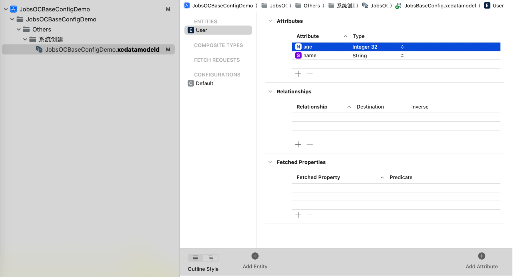

  * `AppDelegate`设置**Core Data**堆栈

    ```objective-c
    #import <UIKit/UIKit.h>
    #import <CoreData/CoreData.h>
    
    @interface AppDelegate : UIResponder <UIApplicationDelegate>
    
    @property (strong, nonatomic) UIWindow *window;
    @property (readonly, strong) NSPersistentContainer *persistentContainer;
    
    - (void)saveContext;
    
    @end
    ```

    ```objective-c
    #import "AppDelegate.h"
    
    @interface AppDelegate ()
    
    @end
    
    @implementation AppDelegate
    
    @synthesize persistentContainer = _persistentContainer;
    
    - (BOOL)application:(UIApplication *)application didFinishLaunchingWithOptions:(NSDictionary *)launchOptions {
        return YES;
    }
    
    - (NSPersistentContainer *)persistentContainer {
        @synchronized (self) {
            if (_persistentContainer == nil) {
                _persistentContainer = [[NSPersistentContainer alloc] initWithName:@"ModelName"];
                [_persistentContainer loadPersistentStoresWithCompletionHandler:^(NSPersistentStoreDescription *storeDescription, NSError *error) {
                    if (error != nil) {
                        NSLog(@"Unresolved error %@, %@", error, error.userInfo);
                        abort();
                    }
                }];
            }
        }
        return _persistentContainer;
    }
    
    - (void)saveContext {
        NSManagedObjectContext *context = self.persistentContainer.viewContext;
        if ([context hasChanges]) {
            NSError *error = nil;
            if (![context save:&error]) {
                NSLog(@"Unresolved error %@, %@", error, error.userInfo);
                abort();
            }
        }
    }
    
    @end
    ```

  * 增删查改

    ```objective-c
    #import "ViewController.h"
    #import "AppDelegate.h"
    #import <CoreData/CoreData.h>
    
    @interface ViewController ()
    
    @property (nonatomic, strong) NSManagedObjectContext *context;
    
    @end
    
    @implementation ViewController
    
    - (void)viewDidLoad {
        [super viewDidLoad];
        
        self.context = ((AppDelegate *)[UIApplication sharedApplication].delegate).persistentContainer.viewContext;
        
        // 插入数据
        [self insertUserWithName:@"Alice" age:25];
        [self insertUserWithName:@"Bob" age:30];
        
        // 获取所有用户
        NSArray *users = [self fetchAllUsers];
        NSLog(@"Users: %@", users);
        
        // 更新用户
        if (users.count > 0) {
            NSManagedObject *user = users[0];
            [self updateUser:user newName:@"Alice Smith" newAge:26];
        }
        
        // 删除用户
        if (users.count > 1) {
            NSManagedObject *user = users[1];
            [self deleteUser:user];
        }
        
        // 获取更新后的用户列表
        users = [self fetchAllUsers];
        NSLog(@"Updated Users: %@", users);
    }
    
    - (void)insertUserWithName:(NSString *)name age:(NSInteger)age {
        NSManagedObject *newUser = [NSEntityDescription insertNewObjectForEntityForName:@"User" inManagedObjectContext:self.context];
        [newUser setValue:name forKey:@"name"];
        [newUser setValue:@(age) forKey:@"age"];
        [self saveContext];
    }
    
    - (NSArray *)fetchAllUsers {
        NSFetchRequest *fetchRequest = [NSFetchRequest fetchRequestWithEntityName:@"User"];
        NSError *error = nil;
        NSArray *result = [self.context executeFetchRequest:fetchRequest error:&error];
        if (error) {
            NSLog(@"Error fetching users: %@", error);
        }
        return result;
    }
    
    - (void)updateUser:(NSManagedObject *)user newName:(NSString *)newName newAge:(NSInteger)newAge {
        [user setValue:newName forKey:@"name"];
        [user setValue:@(newAge) forKey:@"age"];
        [self saveContext];
    }
    
    - (void)deleteUser:(NSManagedObject *)user {
        [self.context deleteObject:user];
        [self saveContext];
    }
    
    - (void)saveContext {
        NSError *error = nil;
        if ([self.context hasChanges] && ![self.context save:&error]) {
            NSLog(@"Unresolved error %@, %@", error, error.userInfo);
            abort();
        }
    }
    
    @end
    ```

### 26、指纹识别 <a href="#前言" style="font-size:17px; color:green;"><b>回到顶部</b></a>

* 关注实现类：[**@interface  TouchID : NSObject**](https://github.com/295060456/JobsOCBaseConfigDemo/tree/main/JobsOCBaseConfigDemo/JobsOCBaseCustomizeUIKitCore/NSObject/BaseObject/TouchID)

### 27、<font id=创建UICollectionView color=red>创建**`UICollectionView`**</font> <a href="#前言" style="font-size:17px; color:green;"><b>回到顶部</b></a>

#### 27.1、关于**`UICollectionView`**

* 设置为NO，使得`UICollectionView`只能上拉，不能下拉

  ```objective-c
  _collectionView.bounces = NO;
  ```

* `UICollectionView`必须执行注册机制。当且仅当用字符串获取`UICollectionViewCell`的时候才开辟内存

  * ```objective-c
    _collectionView.registerCollectionViewClass();
    ```

  * ```objective-c
    _collectionView.registerCollectionElementKindSectionHeaderClass(TMSWalletCollectionReusableView.class);
    _collectionView.registerCollectionElementKindSectionFooterClass(TMSWalletCollectionReusableView.class);
    ```

  * ```objective-c
    _collectionView.registerCollectionElementKindSectionHeaderClass(TMSWalletCollectionReusableView.class);
    _collectionView.registerCollectionElementKindSectionFooterClass(TMSWalletCollectionReusableView.class);
    ```

* 滚动到指定位置

  * ```objective-c
    _collectionView.contentOffset = CGPointMake(0,-100);
    ```

  * ```objective-c
    [_collectionView setContentOffset:CGPointMake(0, -200) animated:YES];// 只有在viewDidAppear周期 或者 手动触发才有效
    ```

* 增加**`UICollectionView`** 的可滚动区域（`contentInset`）

  ```objective-c
  _collectionView.contentInset = UIEdgeInsetsMake(0, 0, JobsBottomSafeAreaHeight(), 0);
  ```

* 支持水平方向的<u>左拉加载</u>和<u>右拉刷新</u> [**XZMRefresh**](https://github.com/xiezhongmin/XZMRefresh)

  ```ruby
  pod 'XZMRefresh' # https://github.com/xiezhongmin/XZMRefresh
  ```

  ```objective-c
  #if __has_include(<XZMRefresh/XZMRefresh.h>)
  #import <XZMRefresh/XZMRefresh.h>
  #else
  #import "XZMRefresh.h"
  #endif
  ```

  ```objective-c
  [self layoutIfNeeded];
  @jobs_weakify(self)
  [_collectionView xzm_addNormalHeaderWithTarget:self
                                          action:selectorBlocks(^id _Nullable(id _Nullable weakSelf,
                                                                              id _Nullable arg) {
      NSLog(@"KKK加载新的数据，参数: %@", arg);
      /// 在需要结束刷新的时候调用（只能调用一次）
      /// _collectionView.endRefreshing();
      return nil;
  }, MethodName(self), self)];
  
  [_collectionView xzm_addNormalFooterWithTarget:self
                                          action:selectorBlocks(^id _Nullable(id _Nullable weakSelf,
                                                                              id _Nullable arg) {
      NSLog(@"KKK加载新的数据，参数: %@", arg);
      /// 在需要结束刷新的时候调用（只能调用一次）
      /// _collectionView.endRefreshing();
      return nil;
  }, MethodName(self), self)];
  
  [_collectionView.xzm_header beginRefreshing];
  ```
  
* 支持垂直方向上的<u>上拉加载</u>和<u>下拉刷新</u> [**MJRefresh**](https://github.com/CoderMJLee/MJRefresh) 

  ```objective-c
  pod 'MJRefresh' # https://github.com/CoderMJLee/MJRefresh
  ```

  ```objective-c
  _tableView.mj_header = self.view.MJRefreshNormalHeaderBy(jobsMakeRefreshConfigModel(^(__kindof MJRefreshConfigModel * _Nullable data) {
      data.stateIdleTitle = JobsInternationalization(@"下拉可以刷新");
      data.pullingTitle = JobsInternationalization(@"下拉可以刷新");
      data.refreshingTitle = JobsInternationalization(@"松开立即刷新");
      data.willRefreshTitle = JobsInternationalization(@"刷新数据中");
      data.noMoreDataTitle = JobsInternationalization(@"下拉可以刷新");
      data.automaticallyChangeAlpha = YES;/// 根据拖拽比例自动切换透明度
      data.loadBlock = ^id _Nullable(id _Nullable data) {
          @jobs_strongify(self)
          /// 下拉刷新
          self.feedbackGenerator();//震动反馈
          self->_tableView.endRefreshing(YES);
          return nil;
      };
  }));
  ```
  
  ```objective-c
  _tableView.mj_footer = self.view.MJRefreshFooterBy(jobsMakeRefreshConfigModel(^(__kindof MJRefreshConfigModel * _Nullable data) {
      data.stateIdleTitle = JobsInternationalization(@"");
      data.pullingTitle = JobsInternationalization(@"");
      data.refreshingTitle = JobsInternationalization(@"");
      data.willRefreshTitle = JobsInternationalization(@"");
      data.noMoreDataTitle = JobsInternationalization(@"");
      data.loadBlock = ^id _Nullable(id _Nullable data){
          @jobs_strongify(self)
          self->_tableView.endRefreshing(YES);
          return nil;
      };
  }));
  ```
  
* 支持[**lottie**](https://github.com/airbnb/lottie-ios)动画

  ```ruby
  pod 'lottie-ios', '~> 2.5.3' # 这是OC终极版本 https://github.com/airbnb/lottie-ios
  ```

  ```objective-c
  #if __has_include(<lottie-ios/Lottie.h>)
  #import <lottie-ios/Lottie.h>
  #else
  #import "Lottie.h"
  #endif
  ```

  ```objective-c
  _tableView.mj_header = self.LOTAnimationMJRefreshHeaderBy(jobsMakeRefreshConfigModel(^(__kindof MJRefreshConfigModel * _Nullable data) {
    data.stateIdleTitle = JobsInternationalization(@"下拉刷新数据");
    data.pullingTitle = JobsInternationalization(@"下拉刷新数据");
    data.refreshingTitle = JobsInternationalization(@"正在刷新数据");
    data.willRefreshTitle = JobsInternationalization(@"刷新数据中");
    data.noMoreDataTitle = JobsInternationalization(@"下拉刷新数据");
    data.loadBlock = ^id _Nullable(id  _Nullable data) {
        @jobs_strongify(self)
        NSLog(@"下拉刷新");
        self.tableView.endRefreshing(self.jobsIMListMutArr.count);
        return nil;
    };
  }));
  ```

* **`UICollectionView`**的无数据占位方案

  * 静态图 [**LYEmptyView**](https://github.com/dev-liyang/LYEmptyView)

    ```ruby
    pod 'LYEmptyView' # https://github.com/dev-liyang/LYEmptyView iOS一行代码集成空白页面占位图(无数据、无网络占位图)
    ```

    ```objective-c
    #if __has_include(<LYEmptyView/LYEmptyViewHeader.h>)
    #import <LYEmptyView/LYEmptyViewHeader.h>
    #else
    #import "LYEmptyViewHeader.h"
    #endif
    ```

    ```objective-c
    _collectionView.ly_emptyView = [LYEmptyView emptyViewWithImageStr:JobsInternationalization(@"暂无数据")
                                                             titleStr:JobsInternationalization(@"暂无数据")
                                                            detailStr:JobsInternationalization(@"")];
    
    _collectionView.ly_emptyView.titleLabTextColor = JobsLightGrayColor;
    _collectionView.ly_emptyView.contentViewOffset = JobsWidth(-180);
    _collectionView.ly_emptyView.titleLabFont = UIFontWeightMediumSize(16);
    ```

  * 动画 [**TABAnimated**](https://github.com/tigerAndBull/TABAnimated)

    ```ruby
    pod 'TABAnimated' # https://github.com/tigerAndBull/TABAnimated
    ```

    ```objective-c
    #if __has_include(<TABAnimated/TABAnimated.h>)
    #import <TABAnimated/TABAnimated.h>
    #else
    #import "TABAnimated.h"
    #endif
    ```

    ```objective-c
    #pragma mark —— 全局配置 TABAnimated
    -(jobsByVoidBlock _Nonnull)makeTABAnimatedConfig{
        return ^(){
            [TABAnimated.sharedAnimated initWithOnlySkeleton];
            /// 是否开启控制台Log提醒，默认不开启
            TABAnimated.sharedAnimated.openLog = YES;
            ///开启后，会在每一个动画元素上增加一个红色的数字，该数字表示该动画元素所在的下标，方便快速定位某个动画元素。
    //        TABAnimated.sharedAnimated.openAnimationTag = YES;
    //        TABAnimated.sharedAnimated.animationType;/// 全局动画类型
    //        TABAnimated.sharedAnimated.animatedHeightCoefficient;/// 动画高度与视图原有高度的比例系数，该属性仅仅对`UILabel`生效。
    //        TABAnimated.sharedAnimated.animatedColor;/// 全局动画内容颜色，默认值为0xEEEEEE
            TABAnimated.sharedAnimated.animatedBackgroundColor = JobsLightGrayColor;/// 全局动画背景颜色，默认值为UIColor.whiteColor
    //        TABAnimated.sharedAnimated.useGlobalCornerRadius;/// 是否开启全局圆角。开启后，全局圆角默认值为: 动画高度/2.0
    //        TABAnimated.sharedAnimated.animatedCornerRadius;/// 全局圆角的值。优先级：此属性 < view自身的圆角
    //        TABAnimated.sharedAnimated.useGlobalAnimatedHeight;/// 是否需要全局动画高度
    //        TABAnimated.sharedAnimated.animatedHeight;/// 全局动画高度
    //        TABAnimated.sharedAnimated.scrollEnabled;/// 是否可以在滚动，默认可以滚动
    //        TABAnimated.sharedAnimated.closeCache;/// 关闭缓存功能，默认开启
    //        TABAnimated.sharedAnimated.darkAnimatedBackgroundColor;/// 暗黑模式下，动画背景色
    //        TABAnimated.sharedAnimated.darkAnimatedColor;/// 暗黑模式下，动画内容的颜色
    //        TABAnimated.sharedAnimated.darkModeType;/// 暗黑模式选择，跟随系统、强制普通模式、强制暗黑模式
    //        TABAnimated.sharedAnimated.classicAnimation;/// 经典动画全局配置
    //        TABAnimated.sharedAnimated.dropAnimation;/// 下坠动画全局配置
    //        TABAnimated.sharedAnimated.binAnimation;/// 呼吸灯动画全局配置
    //        TABAnimated.sharedAnimated.shimmerAnimation;/// 闪光灯动画全局配置
        };
    }
    ```
    
    ```objective-c
    NSArray *classArray = @[
                            DDCollectionViewCell_Style2.class,
                            DDCollectionViewCell_Style3.class,
                            DDCollectionViewCell_Style4.class,
                            ];
    NSArray *sizeArray = @[
                           [NSValue valueWithCGSize:[DDCollectionViewCell_Style2 cellSizeWithModel:nil]],
                           [NSValue valueWithCGSize:[DDCollectionViewCell_Style3 cellSizeWithModel:nil]],
                           [NSValue valueWithCGSize:[DDCollectionViewCell_Style4 cellSizeWithModel:nil]]
                           ];
    
    _collectionView.tabAnimated = [TABCollectionAnimated animatedWithCellClassArray:classArray
                                                                      cellSizeArray:sizeArray
                                                                 animatedCountArray:@[@(1),@(1),@(1)]];
    
    [_collectionView.tabAnimated addHeaderViewClass:BaseCollectionReusableView_Style1.class
                                           viewSize:[BaseCollectionReusableView_Style1 collectionReusableViewSizeWithModel:nil]
                                          toSection:0];
    [_collectionView.tabAnimated addHeaderViewClass:BaseCollectionReusableView_Style1.class
                                           viewSize:[BaseCollectionReusableView_Style2 collectionReusableViewSizeWithModel:nil]
                                          toSection:2];
    
    _collectionView.tabAnimated.containNestAnimation = YES;
    _collectionView.tabAnimated.superAnimationType = TABViewSuperAnimationTypeShimmer;
    _collectionView.tabAnimated.canLoadAgain = YES;
    [_collectionView tab_startAnimation];   // 开启动画
    ```
    
    ```objective-c
    _collectionView.tabAnimated = [TABCollectionAnimated animatedWithCellClass:HomeCVCell.class
                                                                      cellSize:HomeCVCell.cellSizeByModel(nil)];
    _collectionView.tabAnimated.superAnimationType = TABViewSuperAnimationTypeBinAnimation;
    _collectionView.tabAnimated.canLoadAgain = YES;
    _collectionView.tabAnimated.animatedBackViewCornerRadius = JobsWidth(8);
    //_collectionView.tabAnimated.animatedBackgroundColor = JobsRedColor;
    [_collectionView tab_startAnimation];   // 开启动画
    ```


#### 27.2、关于**`UICollectionViewFlowLayout`**

  * `UICollectionView` 的一个布局对象，用于定义网格布局
  
  * ```objective-c
    @jobs_weakify(self)
    _collectionView = BaseCollectionView.initByLayout(jobsMakeCollectionViewFlowLayout(^(UICollectionViewFlowLayout * _Nullable data) {
        @jobs_strongify(self)
        data = self.verticalLayout;
    //  data.itemSize = CGSizeMake(100, 100);  // 设置单元格尺寸
    //  data.minimumLineSpacing = 10;  // 设置行间距
    //  data.minimumInteritemSpacing = 10;  // 设置单元格之间的间距
    //  data.sectionInset = UIEdgeInsetsMake(20, 20, 20, 20);  // 设置 section 的内边距
    }));
  ```
  
  * 在`UICollectionViewFlowLayout`和`UICollectionViewDelegateFlowLayout`协议方法中设置布局属性时，<font color=red>**`UICollectionViewDelegateFlowLayout`协议方法的优先级更高**</font>。也就是说，如果你同时在`UICollectionViewFlowLayout`对象和`UICollectionViewDelegateFlowLayout`方法中设置了布局属性，集合视图将优先使用`UICollectionViewDelegateFlowLayout`方法中提供的值

#### 27.3、[<font color=red>**`UICollectionView`实现重叠的卡包效果**</font>](https://github.com/TMMMMMS/TMSWalletLayout)

* [**@interface TMSCollectionViewLayout : UICollectionViewLayout**](https://github.com/295060456/JobsOCBaseConfigDemo/tree/main/JobsOCBaseConfigDemo/%F0%9F%94%A8Manual_Add_ThirdParty%EF%BC%88%E6%8C%89%E9%9C%80%E5%BC%95%E5%85%A5%EF%BC%89/WalletLayout/TMSCollectionViewLayout)
* [**@interface TMSWalletCollectionReusableView : UICollectionReusableView<BaseViewProtocol,BaseProtocol>**](https://github.com/295060456/JobsOCBaseConfigDemo/tree/main/JobsOCBaseConfigDemo/%F0%9F%94%A8Manual_Add_ThirdParty%EF%BC%88%E6%8C%89%E9%9C%80%E5%BC%95%E5%85%A5%EF%BC%89/WalletLayout/TMSWalletCollectionReusableView)
* [**@interface TMSWalletCollectionViewCell : UICollectionViewCell<BaseViewProtocol>**](https://github.com/295060456/JobsOCBaseConfigDemo/tree/main/JobsOCBaseConfigDemo/%F0%9F%94%A8Manual_Add_ThirdParty%EF%BC%88%E6%8C%89%E9%9C%80%E5%BC%95%E5%85%A5%EF%BC%89/WalletLayout/TMSWalletCollectionViewCell)

#### 27.4、<font color=red id=关于UICollectionView的注册机制>关于**`UICollectionView`**的注册机制</font>

* 注册的时候不开辟内存，只有当用字符串进行取值的时候才开辟内存

* **`UICollectionView`** 本身并没有直接提供公开的 API 来检查某个 **reuseIdentifier** 是否已经注册。如果通过字符串索取不到**`UICollectionView`**（未注册），会直接崩溃

* <font color=red>可以用方法交换去插入一个自定义标志位（**`NSMutableSet`**），如果没有在集合里面的即为未注册的**`UICollectionView`**，此时进入注册流程</font>。关注实现类：[**@interface UICollectionView (RegistrationTracking)**](https://github.com/295060456/JobsOCBaseConfigDemo/tree/main/JobsOCBaseConfigDemo/JobsOCBaseCustomizeUIKitCore/UICollectionView/UICollectionView%2BCategory/UICollectionView%2BRegistrationTracking)

  *  正常情况下，如果用字符串无法取**`UICollectionViewCell`**会直接崩溃，即`collectionViewCellClass`无意义。但是添加了上述的方法交换以后这里不会崩溃，其作用机制是：<font color=red>**利用方法交换，在进行复用时候，先检测标志位里面是否包含已经注册的对象索引，如果没有即进行注册，再进行复用**</font>。所以第一步得到的**Cell**一定会存在，不会出现<font color=red>**nil**</font>的情况。而保留`!cell`写法的作用更多是向下兼容，同时方便代码的阅读。同时，这个字符串是根据需要注册的cell的类名字符串化得到的，为了避免可能得命名冲突，保证全局的唯一性，在必要的时候，可以通过"<u>**加盐**</u>"的形式进行字符串拼接。（注意在用字符串进行索取的时候，也对应需要"<u>**加盐**</u>"）

  *  <font color=red>**涉及到的方法交换**</font>
  
    ```objective-c
    + (void)load {
        static dispatch_once_t onceToken;
        dispatch_once(&onceToken, ^{
    #pragma mark —— registerClass:forCellWithReuseIdentifier:
            Method originalMethod = class_getInstanceMethod(self,
                @selector(registerClass:forCellWithReuseIdentifier:));
            Method swizzledMethod = class_getInstanceMethod(self,
                @selector(swizzled_registerClass:forCellWithReuseIdentifier:));
            method_exchangeImplementations(originalMethod, swizzledMethod);
    #pragma mark —— registerClass:forSupplementaryViewOfKind:withReuseIdentifier:
            Method originalSupplementaryMethod = class_getInstanceMethod(self, @selector(registerClass:forSupplementaryViewOfKind:withReuseIdentifier:));
            Method swizzledSupplementaryMethod = class_getInstanceMethod(self, @selector(swizzled_registerClass:forSupplementaryViewOfKind:withReuseIdentifier:));
            method_exchangeImplementations(originalSupplementaryMethod, swizzledSupplementaryMethod);
    #pragma mark —— dequeueReusableCellWithReuseIdentifier:forIndexPath:
            Method originalMethod1 = class_getInstanceMethod(self.class, @selector(dequeueReusableCellWithReuseIdentifier:forIndexPath:));
            Method swizzledMethod1 = class_getInstanceMethod(self.class, @selector(swizzled_dequeueReusableCellWithReuseIdentifier:forIndexPath:));
            method_exchangeImplementations(originalMethod1, swizzledMethod1);
    #pragma mark —— dequeueReusableSupplementaryViewOfKind:withReuseIdentifier:forIndexPath:
            Method originalMethod2 = class_getInstanceMethod(self.class, @selector(dequeueReusableSupplementaryViewOfKind:withReuseIdentifier:forIndexPath:));
            Method swizzledMethod2 = class_getInstanceMethod(self.class, @selector(swizzled_dequeueReusableSupplementaryViewOfKind:withReuseIdentifier:forIndexPath:));
            method_exchangeImplementations(originalMethod2, swizzledMethod2);
        });
    }
  ```

    ```objective-c
    +(instancetype)cellWithCollectionView:(nonnull UICollectionView *)collectionView
                             forIndexPath:(nonnull NSIndexPath *)indexPath{
        JobsBtnStyleCVCell *cell = (JobsBtnStyleCVCell *)[collectionView collectionViewCellClass:JobsBtnStyleCVCell.class forIndexPath:indexPath];
        if (!cell) {
            collectionView.registerCollectionViewCellClass(JobsBtnStyleCVCell.class,@"");
            cell = (JobsBtnStyleCVCell *)[collectionView collectionViewCellClass:JobsBtnStyleCVCell.class forIndexPath:indexPath];
        }
        
        // UICollectionViewCell圆切角
    //    cell.contentView.layer.cornerRadius = cell.layer.cornerRadius = JobsWidth(8);
    //    cell.contentView.layer.borderWidth = cell.layer.borderWidth = JobsWidth(1);
    //    cell.contentView.layer.borderColor = cell.layer.borderColor = RGBA_COLOR(255, 225, 144, 1).CGColor;
    //    cell.contentView.layer.masksToBounds = cell.layer.masksToBounds = YES;
    
        cell.indexPath = indexPath;
        
        return cell;
    }
    ```

#### 27.5、一些用做基类的**`UICollectionViewCell`**

* **`BaseCollectionViewCell`**
* **`JobsBaseCollectionViewCell`**
* **`JobsBtnStyleCVCell`**：只在**`BaseCollectionViewCell`**完整的盖一个**`Button`**，其目的是利用**`Button`**丰富的图文展示效果
* **`JobsBtnsStyleCVCell`**：左右两边各有一个**`Button`**
* **`JobsImageViewStyleCVCell`**：只在**`BaseCollectionViewCell`**完整的盖一个**`ImageView`**
* **`JobsTextFieldStyleCVCell`**：只在**`BaseCollectionViewCell`**完整的盖一个**`TextField`**

#### 27.6、**`UICollectionView`**的完整调用

* <details id="UICollectionView的完整调用">
   <summary><strong>点我查看</strong></summary>
   
   ```objective-c
   @interface JobsImageNumberViewCVCell ()
   
   @property(nonatomic,strong)UIImageView *textIMGV;
   
   @end
   
   @implementation JobsImageNumberViewCVCell
   #pragma mark —— UICollectionViewCellProtocol
   +(instancetype)cellWithCollectionView:(nonnull UICollectionView *)collectionView
                            forIndexPath:(nonnull NSIndexPath *)indexPath{
       JobsImageNumberViewCVCell *cell = (JobsImageNumberViewCVCell *)[collectionView collectionViewCellClass:JobsImageNumberViewCVCell.class forIndexPath:indexPath];
       if (!cell) {
           collectionView.registerCollectionViewCellClass(JobsImageNumberViewCVCell.class,@"");
           cell = (JobsImageNumberViewCVCell *)[collectionView collectionViewCellClass:JobsImageNumberViewCVCell.class forIndexPath:indexPath];
       }
       cell.indexPath = indexPath;
       return cell;
   }
   #pragma mark —— BaseCellProtocol
   /// 具体由子类进行复写【数据定UI】【如果所传参数为基本数据类型，那么包装成对象NSNumber进行转化承接】
   -(jobsByIDBlock _Nonnull)richElementsInCellWithModel{
       @jobs_weakify(self)
       return ^(id _Nullable model) {
           @jobs_strongify(self)
           self.backgroundColor = self.contentView.backgroundColor = JobsClearColor;
           self.textIMGV.image = model;
       };
   }
   ////具体由子类进行复写【数据定高】【如果所传参数为基本数据类型，那么包装成对象NSNumber进行转化承接】
   //+(CGFloat)cellHeightWithModel:(id _Nullable)model;
   //具体由子类进行复写【数据尺寸】【如果所传参数为基本数据类型，那么包装成对象NSNumber进行转化承接】
   +(CGSize)cellSizeWithModel:(UIImage *_Nullable)model{
       if ([model isEqual:JobsIMG(@"小数点")]) {
           return CGSizeMake(JobsWidth(15), JobsWidth(28));
       }return CGSizeMake(JobsWidth(19), JobsWidth(28));
   }
   #pragma mark —— lazyLoad
   -(UIImageView *)textIMGV{
       if (!_textIMGV) {
           _textIMGV = UIImageView.new;
           [self.contentView addSubview:_textIMGV];
           [_textIMGV mas_makeConstraints:^(MASConstraintMaker *make) {
               make.edges.equalTo(self.contentView);
           }];
       }return _textIMGV;
   }
   
   @end
   ```
   
   
   ```objective-c
   @property(nonatomic,strong)BaseCollectionView *collectionView;
   ```
   
   ```objective-c
   -(BaseCollectionView *)collectionView{
       if (!_collectionView) {
           @jobs_weakify(self)
           _collectionView = BaseCollectionView.initByLayout(jobsMakeCollectionViewFlowLayout(^(UICollectionViewFlowLayout * _Nullable data) {
               @jobs_strongify(self)
               data = self.verticalLayout;
   //            data.itemSize = CGSizeMake(100, 100);  // 设置单元格尺寸
   //            data.minimumLineSpacing = 10;  // 设置行间距
   //            data.minimumInteritemSpacing = 10;  // 设置单元格之间的间距
   //            data.sectionInset = UIEdgeInsetsMake(20, 20, 20, 20);  // 设置 section 的内边距
           }));
           _collectionView.backgroundColor = JobsCor(@"#FFFFFF");
           _collectionView.dataLink(self);
           _collectionView.showsVerticalScrollIndicator = NO;
           _collectionView.showsHorizontalScrollIndicator = NO;
           _collectionView.bounces = NO;
           
           _collectionView.registerCollectionViewClass();
           _collectionView.registerCollectionViewCellClass(MSMineView6CVCell.class,@"");
           
           {
               _collectionView.mj_header = self.MJRefreshNormalHeaderBy(jobsMakeRefreshConfigModel(^(__kindof MJRefreshConfigModel * _Nullable data) {
                   data.stateIdleTitle = JobsInternationalization(@"下拉可以刷新");
                   data.pullingTitle = JobsInternationalization(@"下拉可以刷新");
                   data.refreshingTitle = JobsInternationalization(@"松开立即刷新");
                   data.willRefreshTitle = JobsInternationalization(@"刷新数据中");
                   data.noMoreDataTitle = JobsInternationalization(@"下拉可以刷新");
                   data.automaticallyChangeAlpha = YES; /// 根据拖拽比例自动切换透明度
                   data.loadBlock = ^id _Nullable(id  _Nullable data) {
                       @jobs_strongify(self)
                       self.feedbackGenerator();//震动反馈
                       self->_collectionView.endRefreshing(YES);
                       return nil;
                   };
               }));
               _collectionView.mj_footer = self.MJRefreshBackNormalFooterBy(jobsMakeRefreshConfigModel(^(__kindof MJRefreshConfigModel * _Nullable data) {
                   data.stateIdleTitle = JobsInternationalization(@"");
                   data.pullingTitle = JobsInternationalization(@"");
                   data.refreshingTitle = JobsInternationalization(@"");
                   data.willRefreshTitle = JobsInternationalization(@"");
                   data.noMoreDataTitle = JobsInternationalization(@"");
                   data.loadBlock = ^id _Nullable(id  _Nullable data) {
                       @jobs_strongify(self)
                       self->_collectionView.endRefreshing(YES);
                       return nil;
                   };
               }));
           }
         
           {
               _collectionView.tabAnimated = [TABCollectionAnimated animatedWithCellClass:HomeCVCell.class
                                                                                 cellSize:HomeCVCell.cellSizeByModel(nil)];
               _collectionView.tabAnimated.superAnimationType = TABViewSuperAnimationTypeBinAnimation;
               _collectionView.tabAnimated.canLoadAgain = YES;
               _collectionView.tabAnimated.animatedBackViewCornerRadius = JobsWidth(8);
   //            _collectionView.tabAnimated.animatedBackgroundColor = JobsRedColor;
               [_collectionView tab_startAnimation];   // 开启动画
           }
           
           [self addSubview:_collectionView];
           [_collectionView mas_makeConstraints:^(MASConstraintMaker *make) {
               make.top.left.right.equalTo(self);
               make.height.mas_equalTo(JobsWidth(102));
           }];
       }return _collectionView;
   }
   ```
   
   ```objective-c
   #pragma mark - UICollectionViewDataSource
   - (NSInteger)numberOfSectionsInCollectionView:(UICollectionView *)collectionView {
       return 1;
   }
   
   - (nonnull __kindof UICollectionViewCell *)collectionView:(nonnull UICollectionView *)collectionView
                                      cellForItemAtIndexPath:(nonnull NSIndexPath *)indexPath {
       JobsImageNumberViewCVCell *cell = [JobsImageNumberViewCVCell cellWithCollectionView:collectionView
                                                                      forIndexPath:indexPath];
       cell.richElementsInCellWithModel(self.dataMutArr[indexPath.row]);
       return cell;
   }
   
   - (NSInteger)collectionView:(nonnull UICollectionView *)collectionView
        numberOfItemsInSection:(NSInteger)section {
       return self.dataMutArr.count;
   }
   #pragma mark —— UICollectionViewDelegate
   //允许选中时，高亮
   -(BOOL)collectionView:(UICollectionView *)collectionView
   shouldHighlightItemAtIndexPath:(NSIndexPath *)indexPath {
       NSLog(@"%s", __FUNCTION__);
       return YES;
   }
   // 高亮完成后回调
   -(void)collectionView:(UICollectionView *)collectionView
   didHighlightItemAtIndexPath:(NSIndexPath *)indexPath {
       NSLog(@"%s", __FUNCTION__);
   }
   // 由高亮转成非高亮完成时的回调
   -(void)collectionView:(UICollectionView *)collectionView
   didUnhighlightItemAtIndexPath:(NSIndexPath *)indexPath {
       NSLog(@"%s", __FUNCTION__);
   }
   // 设置是否允许选中
   -(BOOL)collectionView:(UICollectionView *)collectionView
   shouldSelectItemAtIndexPath:(NSIndexPath *)indexPath {
       NSLog(@"%s", __FUNCTION__);
       return YES;
   }
   // 设置是否允许取消选中
   -(BOOL)collectionView:(UICollectionView *)collectionView
   shouldDeselectItemAtIndexPath:(NSIndexPath *)indexPath {
       NSLog(@"%s", __FUNCTION__);
       return YES;
   }
   // 选中操作
   - (void)collectionView:(UICollectionView *)collectionView
   didSelectItemAtIndexPath:(NSIndexPath *)indexPath {
       NSLog(@"%s", __FUNCTION__);
   }
   // 取消选中操作
   -(void)collectionView:(UICollectionView *)collectionView
   didDeselectItemAtIndexPath:(NSIndexPath *)indexPath {
       NSLog(@"%s", __FUNCTION__);
   }
   #pragma mark —— UICollectionViewDelegateFlowLayout
   - (CGSize)collectionView:(UICollectionView *)collectionView
                     layout:(UICollectionViewLayout *)collectionViewLayout
     sizeForItemAtIndexPath:(NSIndexPath *)indexPath {
       return [JobsImageNumberViewCVCell cellSizeWithModel:self.dataMutArr[indexPath.row]];
   }
   /// 定义的是元素垂直之间的间距
   - (CGFloat)collectionView:(UICollectionView *)collectionView
                      layout:(UICollectionViewLayout *)collectionViewLayout
   minimumLineSpacingForSectionAtIndex:(NSInteger)section {
       return 0;
   }
   /// 定义的是UICollectionViewScrollDirectionVertical下，元素水平之间的间距。
   /// UICollectionViewScrollDirectionHorizontal下，垂直和水平正好相反
   /// Api自动计算一行的Cell个数，只有当间距小于此定义的最小值时才会换行，最小执行单元是Section（每个section里面的样式是统一的）
   - (CGFloat)collectionView:(UICollectionView *)collectionView
                      layout:(UICollectionViewLayout *)collectionViewLayout
   minimumInteritemSpacingForSectionAtIndex:(NSInteger)section{
       return 0;
   }
   ///内间距
   -(UIEdgeInsets)collectionView:(UICollectionView *)collectionView
                          layout:(UICollectionViewLayout*)collectionViewLayout
          insetForSectionAtIndex:(NSInteger)section {
       return jobsSameEdgeInset(JobsWidth(0));
   }
   ```
   
   </details>

### 28、<font color=red id=创建UITableView>创建`UITableView`</font> <a href="#前言" style="font-size:17px; color:green;"><b>回到顶部</b></a>

#### 28.1、关于<font color=red>**`UITableView`**</font>

* <font color=red>**`UITableView`**的生命周期</font>

  * <u>**`UITableView`** 可以不用像**`UICollectionView`**一样执行注册机制</u>。注册机制的生命周期有别于普通的生命周期

  * 对于"三问一答"，如果**`UITableViewCell`**的高度为0，压根就不会执行**`UITableViewCell`**的绘制，即：`- (__kindof UITableViewCell *)tableView:(UITableView *)tableView cellForRowAtIndexPath:(NSIndexPath *)indexPath`。所以利用这一点，我们在进数据源的时候，可以在`- (CGFloat)tableView:(UITableView *)tableView heightForRowAtIndexPath:(NSIndexPath *)indexPath`这里面对数据源所需的高度进行计算和反馈

  * 在**`UITableViewCell`**将要出现的时候，进行最后的绘制

    ```objective-c
    - (void)tableView:(UITableView *)tableView
      willDisplayCell:(UITableViewCell *)cell
    forRowAtIndexPath:(NSIndexPath *)indexPath{
        /// 隐藏最后一个单元格的分界线
        [tableView hideSeparatorLineAtLast:indexPath
                                      cell:cell];
        /// 自定义 UITableViewCell 的箭头
        cell.img = JobsIMG(@"向右的箭头（大）");
        @jobs_weakify(self)
        [cell customAccessoryView:^(id data) {
            @jobs_strongify(self)
            JobsBaseTableViewCell *cell = (JobsBaseTableViewCell *)data;
            NSLog(@"MMM - %ld",cell.index);
        }];
        /// 以section为单位，每个section的第一行和最后一行的 UITableViewCell 圆角化处理
        [cell cutFirstAndLastTableViewCellWithBackgroundCor:HEXCOLOR(0xFFFFFF)
                                              bottomLineCor:HEXCOLOR(0xFFFFFF) 
                                             cellOutLineCor:HEXCOLOR(0xEEE2C8)
                                           cornerRadiusSize:CGSizeMake(JobsWidth(8), JobsWidth(8))
                                                borderWidth:JobsWidth(10)
                                                         dx:JobsWidth(0)
                                                         dy:JobsWidth(0)];
    }
    ```

* **`UITableView`** 的初始化方法

  * ```objective-c
    BaseTableView.initWithStylePlain;
    ```

  * 会在每个`section`分组的时候，自动产生组与组之间的距离

    ```objective-c
    BaseTableView.initWithStyleGrouped;
    ```

* 对父类**`UIScrollView`**三要素（**`contentOffset`**、**`contentSize`**、**`contentInset`**）的封装设置。关注实现类[**@interface UIView (Measure)**](https://github.com/295060456/JobsOCBaseConfigDemo/tree/main/JobsOCBaseConfigDemo/JobsOCBaseCustomizeUIKitCore/UIView/UIView%2BCategory/UIView%2BMeasure)

  ```objective-c
  #pragma mark —— UIScrollView.contentSize
  -(jobsBySizeBlock _Nullable)resetContentSize;
  -(jobsByCGFloatBlock _Nullable)resetContentSizeWidth;
  -(jobsByCGFloatBlock _Nullable)resetContentSizeHeight;
  -(jobsByCGFloatBlock _Nullable)resetContentSizeOffsetWidth;
  -(jobsByCGFloatBlock _Nullable)resetContentSizeOffsetHeight;
  ```

  ```objective-c
  #pragma mark —— UIScrollView.contentOffset
  -(jobsByPointBlock _Nullable)resetContentOffset;
  -(jobsByCGFloatBlock _Nullable)resetContentX;
  -(jobsByCGFloatBlock _Nullable)resetContentY;
  -(jobsByCGFloatBlock _Nullable)resetContentOffsetX;
  -(jobsByCGFloatBlock _Nullable)resetContentOffsetY;
  ```

  ```objective-c
  #pragma mark —— UIScrollView.contentInset
  -(jobsByEdgeInsetBlock _Nullable)resetContentInset;
  -(jobsByCGFloatBlock _Nullable)resetContentInsetTop;
  -(jobsByCGFloatBlock _Nullable)resetContentInsetLeft;
  -(jobsByCGFloatBlock _Nullable)resetContentInsetBottom;
  -(jobsByCGFloatBlock _Nullable)resetContentInsetRight;
  -(jobsByCGFloatBlock _Nullable)resetContentInsetOffsetTop;
  -(jobsByCGFloatBlock _Nullable)resetContentInsetOffsetLeft;
  -(jobsByCGFloatBlock _Nullable)resetContentInsetOffsetBottom;
  -(jobsByCGFloatBlock _Nullable)resetContentInsetOffsetRight;
  ```

* 增加**`UITableView`** 的可滚动区域（`contentInset`）

  ```objective-c
  _tableView.contentInset = UIEdgeInsetsMake(0, 0, JobsBottomSafeAreaHeight(), 0);
  ```

* <font color=red>**滚动到指定行**</font>

  * ```objective-c
    NSInteger s = self.tableView.numberOfSections;/// 有多少组
    if (s < 1) return;
    NSInteger r = [self.tableView numberOfRowsInSection:s - 1];/// 最后一组有多少行
    if (r < 1) return;
    NSIndexPath *indexPath = [NSIndexPath indexPathForRow:r - 1 inSection:s - 1];/// 取最后一行数据
    [self.tableView scrollToRowAtIndexPath:indexPath
                          atScrollPosition:UITableViewScrollPositionBottom
                                  animated:YES];/// 滚动到最后一行
    ```

  * ```objective-c
    NSIndexPath *indexPath = [NSIndexPath indexPathForRow:0 inSection:0];/// 取第一行数据
    [self.tableView scrollToRowAtIndexPath:indexPath
                          atScrollPosition:UITableViewScrollPositionTop
                                  animated:YES];/// 滚动到第一行
    ```

* `tableHeaderView`也会随着**`UITableView`**的滚动而滚动

* **`UITableView`** 的可折叠效果。第三方分类实现，关注：[**@interface UITableView (WWFoldableTableView)**](https://github.com/295060456/JobsOCBaseConfigDemo/tree/main/JobsOCBaseConfigDemo/JobsOCBaseCustomizeUIKitCore/UITableView/UITableView+Category/UITableView+WWFoldableTableView)

  ```objective-c
  _tableView.ww_foldable = YES;
  ```

* **`UITableView`**的无数据占位方案

  * 静态图 [**LYEmptyView**](https://github.com/dev-liyang/LYEmptyView)

    ```objective-c
    pod 'LYEmptyView' # https://github.com/dev-liyang/LYEmptyView iOS一行代码集成空白页面占位图(无数据、无网络占位图)
    ```

    ```objective-c
    #if __has_include(<LYEmptyView/LYEmptyViewHeader.h>)
    #import <LYEmptyView/LYEmptyViewHeader.h>
    #else
    #import "LYEmptyViewHeader.h"
    #endif
    ```

    ```objective-c
    _tableView.ly_emptyView = [LYEmptyView emptyViewWithImageStr:JobsInternationalization(@"暂无数据")
                                                        titleStr:JobsInternationalization(@"暂无数据")
                                                       detailStr:JobsInternationalization(@"")];
    
    _tableView.ly_emptyView.titleLabTextColor = JobsLightGrayColor;
    _tableView.ly_emptyView.contentViewOffset = JobsWidth(-180);
    _tableView.ly_emptyView.titleLabFont = UIFontWeightLightSize(16);
    ```

  * 动画 [**TABAnimated**](https://github.com/tigerAndBull/TABAnimated)

    ```ruby
    pod 'TABAnimated' # https://github.com/tigerAndBull/TABAnimated
    ```

    ```objective-c
    #if __has_include(<TABAnimated/TABAnimated.h>)
    #import <TABAnimated/TABAnimated.h>
    #else
    #import "TABAnimated.h"
    #endif
    ```

    ```objective-c
    // 可以不进行手动初始化，将使用默认属性
    _tableView.tabAnimated = [TABTableAnimated animatedWithCellClass:JobsBaseTableViewCell.class
                                                          cellHeight:JobsBaseTableViewCell.cellHeightByModel(nil)];
    _tableView.tabAnimated.superAnimationType = TABViewSuperAnimationTypeShimmer;
    [_tableView tab_startAnimation];   // 开启动画
    ```

* 支持垂直方向的<u>上拉加载</u>和<u>下拉刷新</u> [**MJRefresh**](https://github.com/CoderMJLee/MJRefresh)

  ```ruby
  pod 'MJRefresh' # https://github.com/CoderMJLee/MJRefresh NO_SMP 不支持横向刷新
  ```

  ```objective-c
  #if __has_include(<MJRefresh/MJRefresh.h>)
  #import <MJRefresh/MJRefresh.h>
  #else
  #import "MJRefresh.h"
  #endif
  ```

  ```objective-c
  {
              _tableView.mj_header = self.view.MJRefreshNormalHeaderBy(jobsMakeRefreshConfigModel(^(__kindof MJRefreshConfigModel * _Nullable data) {
                  data.stateIdleTitle = JobsInternationalization(@"下拉可以刷新");
                  data.pullingTitle = JobsInternationalization(@"下拉可以刷新");
                  data.refreshingTitle = JobsInternationalization(@"松开立即刷新");
                  data.willRefreshTitle = JobsInternationalization(@"刷新数据中");
                  data.noMoreDataTitle = JobsInternationalization(@"下拉可以刷新");
                  data.automaticallyChangeAlpha = YES;/// 根据拖拽比例自动切换透明度
                  data.loadBlock = ^id _Nullable(id _Nullable data) {
                      @jobs_strongify(self)
                      /// 下拉刷新
                      self.feedbackGenerator();//震动反馈
                      self->_tableView.endRefreshing(YES);
                      return nil;
                  };
              }));
              _tableView.mj_footer = self.view.MJRefreshFooterBy(jobsMakeRefreshConfigModel(^(__kindof MJRefreshConfigModel * _Nullable data) {
                  data.stateIdleTitle = JobsInternationalization(@"");
                  data.pullingTitle = JobsInternationalization(@"");
                  data.refreshingTitle = JobsInternationalization(@"");
                  data.willRefreshTitle = JobsInternationalization(@"");
                  data.noMoreDataTitle = JobsInternationalization(@"");
                  data.loadBlock = ^id _Nullable(id _Nullable data){
                      @jobs_strongify(self)
                      self->_tableView.endRefreshing(YES);
                      return nil;
                  };
              }));
          }
  ```

* 支持水平方向的<u>左拉加载</u>和<u>右拉刷新</u> [**XZMRefresh**](https://github.com/xiezhongmin/XZMRefresh)

  ```ruby
  pod 'XZMRefresh' # https://github.com/xiezhongmin/XZMRefresh
  ```

  ```objective-c
  #if __has_include(<XZMRefresh/XZMRefresh.h>)
  #import <XZMRefresh/XZMRefresh.h>
  #else
  #import "XZMRefresh.h"
  #endif
  ```

  ```objective-c
  [self layoutIfNeeded];
  @jobs_weakify(self)
  [_tableView xzm_addNormalHeaderWithTarget:self
                                     action:selectorBlocks(^id _Nullable(id _Nullable weakSelf,
                                                                         id _Nullable arg) {
      NSLog(@"KKK加载新的数据，参数: %@", arg);
      /// 在需要结束刷新的时候调用（只能调用一次）
      /// _collectionView.endRefreshing();
      return nil;
  }, MethodName(self), self)];
  
  [_tableView xzm_addNormalFooterWithTarget:self
                                     action:selectorBlocks(^id _Nullable(id _Nullable weakSelf,
                                                                                      id _Nullable arg) {
      NSLog(@"KKK加载新的数据，参数: %@", arg);
      /// 在需要结束刷新的时候调用（只能调用一次）
      /// _collectionView.endRefreshing();
      return nil;
  }, MethodName(self), self)];
  
  [_tableView.xzm_header beginRefreshing];
  ```
  
* 切角

  * [**关于UITableViewCell和UICollectionViewCell圆切角+Cell的偏移量**](https://github.com/295060456/JobsOCBaseConfig/blob/main/%E6%96%87%E6%A1%A3%E5%92%8C%E8%B5%84%E6%96%99.md/%E5%85%B6%E4%BB%96.md/%E5%85%B3%E4%BA%8EUITableViewCell%E5%92%8CUICollectionViewCell%E5%9C%86%E5%88%87%E8%A7%92%2BCell%E7%9A%84%E5%81%8F%E7%A7%BB%E9%87%8F.md)

  * 以section为单位，每个section的第一行和最后一行的`UITableViewCell`圆角化处理【`UITableViewCell`之间没有分割线】

    作用于：`- (void)tableView:(UITableView *)tableView willDisplayCell:(UITableViewCell *)cell forRowAtIndexPath:(NSIndexPath *)indexPath`

    ```objective-c
    [cell cutFirstAndLastTableViewCellWithBackgroundCor:HEXCOLOR(0xFFFFFF)
                                          bottomLineCor:HEXCOLOR(0xFFFFFF) 
                                         cellOutLineCor:HEXCOLOR(0xEEE2C8)
                                       cornerRadiusSize:CGSizeMake(JobsWidth(8), JobsWidth(8))
                                            borderWidth:JobsWidth(10)
                                                     dx:JobsWidth(0)
                                                     dy:JobsWidth(0)];
    ```

* 其他

  * 隐藏最后一个单元格的分界线

    ```objective-c
    -(void)hideSeparatorLineAtLast:(NSIndexPath *)indexPath
                              cell:(UITableViewCell *)cell{
        /// 判断是否是该 section 的最后一行
        if (indexPath.row == [self numberOfRowsInSection:indexPath.section] - 1){
            cell.separatorInset = UIEdgeInsetsMake(0, 0, 0, cell.bounds.size.width);
        }
    }
    ```

  * 自定义**`UITableViewCell`**的箭头

    <font color=red>**使用前提：必须`UITableViewCell.accessoryType = UITableViewCellAccessoryDisclosureIndicator; `打开后才可以启用**</font>

    作用于：`- (void)tableView:(UITableView *)tableView willDisplayCell:(UITableViewCell *)cell forRowAtIndexPath:(NSIndexPath *)indexPath`

    ```objective-c
    -(void)customAccessoryView:(jobsByIDBlock)customAccessoryViewBlock{
        /// 不用系统自带的箭头
        if (self.accessoryType == UITableViewCellAccessoryDisclosureIndicator) {
            @jobs_weakify(self)
            BaseButton *btn = BaseButton.initByBackgroundImage(self.img)
                .bgColor(JobsClearColor.colorWithAlphaComponent(0))
                .onClick(^(__kindof UIButton *x){
                    @jobs_strongify(self)
                if (self.objectBlock) self.objectBlock(x);
                if (customAccessoryViewBlock) customAccessoryViewBlock(self);
            });
            /// 特比注意:如果这个地方是纯view（UIView、UIIMageView...）就可以不用加size，UIButton是因为受到了UIControl，需要接收一个size，否则显示不出来
            btn.Size = self.Size;
            btn.resetByOffsetWidth(JobsWidth(5));
            self.accessoryView = btn;
        }
    }
    ```
  
* <details id="UITableView的完整调用">
   <summary><strong>UITableView的完整调用</strong></summary>
   
   ```objective-c
   #pragma mark —— UI
   @property(nonatomic,strong)BaseTableView *tableView;
   // 分组的 cell
   @property(nonatomic,strong)NSMutableArray <NSMutableArray <__kindof UITableViewCell *>*>*tbvSectionRowCellMutArr;
   // 不分组的 cell
   @property(nonatomic,strong)NSMutableArray <__kindof UITableViewCell *>*rowCellMutArr;
   // sectionView
   @property(nonatomic,strong)NSMutableArray <__kindof UITableViewHeaderFooterView *>*tbvHeaderFooterViewMutArr;
   // HeaderView
   @property(nonatomic,strong)FMTableHeaderView1 *tableHeaderView;
   #pragma mark —— Data
   // 分组的 Data
   @property(nonatomic,strong)NSMutableArray <NSMutableArray <UIViewModel *>*>*dataMutArr;
   // 不分组的 Data
   @property(nonatomic,strong)NSMutableArray <UIViewModel *>*rowDataMutArr;
   ```
   
   ```objective-c
   -(BaseTableView *)tableView{
       if (!_tableView) {
           @jobs_weakify(self)
           _tableView = BaseTableView.initWithStyleGrouped;/// 一般用 initWithStylePlain。initWithStyleGrouped会自己预留一块空间
           _tableView.dataLink(self);
           _tableView.backgroundColor = JobsCor(@"#FFFFFF");
           _tableView.separatorStyle = UITableViewCellSeparatorStyleNone;
           _tableView.separatorColor = HEXCOLOR(0xEEE2C8);
           _tableView.showsVerticalScrollIndicator = NO;
           _tableView.scrollEnabled = YES;
           _tableView.tableHeaderView = self.tableHeaderView;/// 这里接入的就是一个UIView的派生类
           _tableView.tableFooterView = UIView.new;/// 这里接入的就是一个UIView的派生类
           _tableView.ww_foldable = YES;//设置可折叠 见 @interface UITableView (WWFoldableTableView)
           _tableView.resetContentInsetOffsetBottom(200);/// 增加tableView的可滚动区域
           _tableView.registerHeaderFooterViewClass(MSCommentTableHeaderFooterView.class,@"");
           if(@available(iOS 11.0, *)) {
               _tableView.contentInsetAdjustmentBehavior = UIScrollViewContentInsetAdjustmentNever;
           }
         
           if(@available(iOS 11.0, *)) {
               _tableView.contentInsetAdjustmentBehavior = UIScrollViewContentInsetAdjustmentNever;
           }else{
               SuppressWdeprecatedDeclarationsWarning(self.automaticallyAdjustsScrollViewInsets = NO);
           }
           
   {
               _tableView.mj_header = self.view.MJRefreshNormalHeaderBy(jobsMakeRefreshConfigModel(^(__kindof MJRefreshConfigModel * _Nullable data) {
                   data.stateIdleTitle = JobsInternationalization(@"下拉可以刷新");
                   data.pullingTitle = JobsInternationalization(@"下拉可以刷新");
                   data.refreshingTitle = JobsInternationalization(@"松开立即刷新");
                   data.willRefreshTitle = JobsInternationalization(@"刷新数据中");
                   data.noMoreDataTitle = JobsInternationalization(@"下拉可以刷新");
                   data.automaticallyChangeAlpha = YES;/// 根据拖拽比例自动切换透明度
                   data.loadBlock = ^id _Nullable(id _Nullable data) {
                       @jobs_strongify(self)
                       /// 下拉刷新
                       self.feedbackGenerator();//震动反馈
                       self->_tableView.endRefreshing(YES);
                       return nil;
                   };
               }));
               _tableView.mj_footer = self.view.MJRefreshFooterBy(jobsMakeRefreshConfigModel(^(__kindof MJRefreshConfigModel * _Nullable data) {
                   data.stateIdleTitle = JobsInternationalization(@"");
                   data.pullingTitle = JobsInternationalization(@"");
                   data.refreshingTitle = JobsInternationalization(@"");
                   data.willRefreshTitle = JobsInternationalization(@"");
                   data.noMoreDataTitle = JobsInternationalization(@"");
                   data.loadBlock = ^id _Nullable(id _Nullable data){
                       @jobs_strongify(self)
                       self->_tableView.endRefreshing(YES);
                       return nil;
                   };
               }));
           }
         
         	{
               [_tableView xzm_addNormalHeaderWithTarget:self
                                                  action:selectorBlocks(^id _Nullable(id _Nullable weakSelf,
                                                                                      id _Nullable arg) {
                   NSLog(@"SSSS加载新的数据，参数: %@", arg);
                   @jobs_strongify(self)
                   /// 在需要结束刷新的时候调用（只能调用一次）
                   /// _tableView.endRefreshing();
                   return nil;
               }, MethodName(self), self)];
   
               [_tableView xzm_addNormalFooterWithTarget:self
                                                  action:selectorBlocks(^id _Nullable(id _Nullable weakSelf,
                                                                                      id _Nullable arg) {
                   NSLog(@"SSSS加载新的数据，参数: %@", arg);
                   @jobs_strongify(self)
                   /// 在需要结束刷新的时候调用（只能调用一次）
                   /// _tableView.endRefreshing();
                   return nil;
               }, MethodName(self), self)];
               [_tableView.xzm_header beginRefreshing];
           }
           
           {
               _tableView.ly_emptyView = [LYEmptyView emptyViewWithImageStr:JobsInternationalization(@"暂无数据")
                                                                   titleStr:JobsInternationalization(@"暂无数据")
                                                                  detailStr:JobsInternationalization(@"")];
               
               _tableView.ly_emptyView.titleLabTextColor = JobsLightGrayColor;
               _tableView.ly_emptyView.contentViewOffset = JobsWidth(-180);
               _tableView.ly_emptyView.titleLabFont = UIFontWeightLightSize(16);
           }
           
           {// 设置tabAnimated相关属性
               _tableView.tabAnimated = [TABTableAnimated animatedWithCellClass:JobsBaseTableViewCell.class
                                                                     cellHeight:JobsBaseTableViewCell.cellHeightByModel(nil)];
               _tableView.tabAnimated.superAnimationType = TABViewSuperAnimationTypeBinAnimation;
               _tableView.tabAnimated.canLoadAgain = YES;
   //            _tableView.tabAnimated.animatedBackViewCornerRadius = JobsWidth(8);
   //            _tableView.tabAnimated.animatedBackgroundColor = JobsRedColor;
               [_tableView tab_startAnimation];   // 开启动画
           }
   
           [self addSubview:_tableView];
           [_tableView mas_makeConstraints:^(MASConstraintMaker *make) {
               make.edges.equalTo(self);
           }];
   
       }return _tableView;
   }
   
   -(FMTableHeaderView1 *)tableHeaderView{
       if(!_tableHeaderView){
           tableHeaderView = FMTableHeaderView1.new;
           _tableHeaderView.size = [FMTableHeaderView1 viewSizeWithModel:nil];
           _tableHeaderView.jobsRichElementsInViewWithModel(nil);
       }return _tableHeaderView;
   }
   ```
   
   ```objective-c
   #import "BaseView.h"
   
   NS_ASSUME_NONNULL_BEGIN
   
   @interface FMTableHeaderView1 : BaseView
   
   @end
   
   NS_ASSUME_NONNULL_END
   ```
   
   ```objective-c
   // sectionView
   -(NSMutableArray<__kindof UITableViewHeaderFooterView *> *)tbvHeaderFooterViewMutArr{
       if(!_tbvHeaderFooterViewMutArr){
           _tbvHeaderFooterViewMutArr = NSMutableArray.array;
           _tbvHeaderFooterViewMutArr.add(self.tableView.tableViewHeaderFooterView(FMTBVHeaderFooterView1.class,@""));
           _tbvHeaderFooterViewMutArr.add(self.tableView.tableViewHeaderFooterView(FMTBVHeaderFooterView2.class,@""));
           _tbvHeaderFooterViewMutArr.add(self.tableView.tableViewHeaderFooterView(FMTBVHeaderFooterView2.class,@""));
       }return _tbvHeaderFooterViewMutArr;
   }
   // 不分组的 cell
   -(NSMutableArray<__kindof UITableViewCell *> *)rowCellMutArr{
       if(!_rowCellMutArr){
           _rowCellMutArr = NSMutableArray.array;
           _rowCellMutArr.add([FMTableViewCellStyle4 cellStyleValue1WithTableView:self.tableView]);
       }return _rowCellMutArr;
   }
   // 分组的 cell
   -(NSMutableArray<NSMutableArray<__kindof UITableViewCell *> *> *)tbvSectionRowCellMutArr{
       if(!_tbvSectionRowCellMutArr){
           _tbvSectionRowCellMutArr = NSMutableArray.array;
           {
               NSMutableArray<__kindof UITableViewCell *> *rowCellMutArr = NSMutableArray.array;
               rowCellMutArr.add([FMTableViewCellStyle4 cellStyleValue1WithTableView:self.tableView]);
               rowCellMutArr.add([FMTableViewCellStyle3 cellStyleValue1WithTableView:self.tableView]);
               rowCellMutArr.add([FMTableViewCellStyle2 cellStyleValue1WithTableView:self.tableView]);
               rowCellMutArr.add([FMTableViewCellStyle4 cellStyleValue1WithTableView:self.tableView]);
               rowCellMutArr.add([FMTableViewCellStyle3 cellStyleValue1WithTableView:self.tableView]);
               rowCellMutArr.add([FMTableViewCellStyle3 cellStyleValue1WithTableView:self.tableView]);
               _tbvSectionRowCellMutArr.add(rowCellMutArr);
           }
           
           {
               NSMutableArray <__kindof UITableViewCell *>*rowCellMutArr = NSMutableArray.array;
               rowCellMutArr.add([FMTableViewCellStyle3 cellStyleValue1WithTableView:self.tableView]);
               rowCellMutArr.add([FMTableViewCellStyle1 cellStyleValue1WithTableView:self.tableView]);
               _tbvSectionRowCellMutArr.add(rowCellMutArr);
           }
           
           {
               NSMutableArray <__kindof UITableViewCell *>*rowCellMutArr = NSMutableArray.array;
               rowCellMutArr.add([FMTableViewCellStyle3 cellStyleValue1WithTableView:self.tableView]);
               rowCellMutArr.add([FMTableViewCellStyle1 cellStyleValue1WithTableView:self.tableView]);
               _tbvSectionRowCellMutArr.add(rowCellMutArr);
           }
           
       }return _tbvSectionRowCellMutArr;
   }
   ```
   
   ```objective-c
   // 不分组的 Data
   -(NSMutableArray<UIViewModel *> *)rowDataMutArr{
       if(!_rowDataMutArr){
           _rowDataMutArr = NSMutableArray.array;
           
           {
               UIViewModel *viewModel = UIViewModel.new;
               viewModel.text = JobsInternationalization(@"Please fill out your Personal Information completely");
               viewModel.textCor = JobsCor(@"#FFC700");
               viewModel.font = bayonRegular(JobsWidth(20));
               _rowDataMutArr.data = viewModel;
           }
           
           {
               UIViewModel *viewModel = UIViewModel.new;
               viewModel.text = JobsInternationalization(@"Nationality");
               viewModel.textCor = JobsCor(@"#FFFFFF");
               viewModel.font = UIFontWeightRegularSize(14);
               viewModel.placeholder = JobsInternationalization(@"Philippines");
               _rowDataMutArr.add(viewModel);
           }
           
           {
               UIViewModel *viewModel = UIViewModel.new;
               viewModel.text = JobsInternationalization(@"Nationality");
               viewModel.textCor = JobsCor(@"#FFFFFF");
               viewModel.font = UIFontWeightRegularSize(14);
               viewModel.placeholder = JobsInternationalization(@"Philippines");
               _rowDataMutArr.add(viewModel);
           }
       }return _rowDataMutArr;
   }
   // 分组的 Data
   -(NSMutableArray<NSMutableArray<UIViewModel *> *> *)dataMutArr{
       if(!_dataMutArr){
           _dataMutArr = NSMutableArray.array;
           {
               NSMutableArray <UIViewModel *>*temp = NSMutableArray.array;
               {
                   UIViewModel *viewModel = UIViewModel.new;
                   viewModel.text = JobsInternationalization(@"Please fill out your Personal Information completely");
                   viewModel.textCor = JobsCor(@"#FFC700");
                   viewModel.font = bayonRegular(JobsWidth(20));
                   temp.data = viewModel;
               }
               
               {
                   UIViewModel *viewModel = UIViewModel.new;
                   viewModel.text = JobsInternationalization(@"Full Name");
                   viewModel.textCor = JobsCor(@"#FFFFFF");
                   viewModel.font = UIFontWeightRegularSize(14);
                   viewModel.placeholder = JobsInternationalization(@"This Name must match the name on any IDs or any bank accounts");
                   temp.add(viewModel);
               }
               {
                   UIViewModel *viewModel = UIViewModel.new;
                   viewModel.text = JobsInternationalization(@"Nationality");
                   viewModel.textCor = JobsCor(@"#FFFFFF");
                   viewModel.font = UIFontWeightRegularSize(14);
                   viewModel.placeholder = JobsInternationalization(@"Philippines");
                   temp.add(viewModel);
               }
               {
                   UIViewModel *viewModel = UIViewModel.new;
                   viewModel.text = JobsInternationalization(@"Date of Birth");
                   viewModel.textCor = JobsCor(@"#FFFFFF");
                   viewModel.font = UIFontWeightRegularSize(14);
                   viewModel.subText = JobsInternationalization(@"21 / 09 / 2021");
                   viewModel.subTextCor = JobsCor(@"#FFFFFF");
                   viewModel.subFont = UIFontWeightRegularSize(14);
                   temp.add(viewModel);
               }
               {
                   UIViewModel *viewModel = UIViewModel.new;
                   viewModel.text = JobsInternationalization(@"Place of Birth");
                   viewModel.textCor = JobsCor(@"#FFFFFF");
                   viewModel.font = UIFontWeightRegularSize(14);
                   temp.add(viewModel);
               }
               {
                   UIViewModel *viewModel = UIViewModel.new;
                   viewModel.text = JobsInternationalization(@"Nature of Work");
                   viewModel.textCor = JobsCor(@"#FFFFFF");
                   viewModel.font = UIFontWeightRegularSize(14);
                   temp.add(viewModel);
               }
               {
                   UIViewModel *viewModel = UIViewModel.new;
                   viewModel.text = JobsInternationalization(@"Source of Income");
                   viewModel.textCor = JobsCor(@"#FFFFFF");
                   viewModel.font = UIFontWeightRegularSize(14);
                   temp.add(viewModel);
               }
               
               _dataMutArr.add(temp);
           }
           {
               NSMutableArray <UIViewModel *>*temp = NSMutableArray.array;
              {
                  UIViewModel *viewModel = UIViewModel.new;
                  viewModel.text = JobsInternationalization(@"Current Address");
                  viewModel.textCor = JobsCor(@"#FFC700");
                  viewModel.font = bayonRegular(JobsWidth(20));
                  temp.data = viewModel;
              }
              
              {
                  UIViewModel *viewModel = UIViewModel.new;
                  viewModel.text = JobsInternationalization(@"Province/City");
                  viewModel.textCor = JobsCor(@"#FFFFFF");
                  viewModel.font = UIFontWeightRegularSize(14);
                  temp.add(viewModel);
              }
              {
                  UIViewModel *viewModel = UIViewModel.new;
                  temp.add(viewModel);
             }
     
              _dataMutArr.add(temp);
          }
          {
              NSMutableArray <UIViewModel *>*temp = NSMutableArray.array;
              {
                  UIViewModel *viewModel = UIViewModel.new;
                  viewModel.text = JobsInternationalization(@"Permanent Address");
                  viewModel.textCor = JobsCor(@"#FFC700");
                  viewModel.font = bayonRegular(JobsWidth(20));
                  temp.data = viewModel;
              }
              
              {
                  UIViewModel *viewModel = UIViewModel.new;
                  viewModel.text = JobsInternationalization(@"Province/City");
                  viewModel.textCor = JobsCor(@"#FFFFFF");
                  viewModel.font = UIFontWeightRegularSize(14);
                  temp.add(viewModel);
              }
              {
                  UIViewModel *viewModel = UIViewModel.new;
                  temp.add(viewModel);
              }
              _dataMutArr.add(temp);
         }
   }return _dataMutArr;
   }
   
   -(NSMutableArray<UIViewModel *> *)rowDataMutArr{
       if(!_rowDataMutArr){
           _rowDataMutArr = NSMutableArray.array;
           
           {
              UIViewModel *viewModel = UIViewModel.new;
              viewModel.text = JobsInternationalization(@"Please fill out your Personal Information completely");
              viewModel.textCor = JobsCor(@"#FFC700");
              viewModel.font = bayonRegular(JobsWidth(20));
              _rowDataMutArr.data = viewModel;
          }
          
          {
              UIViewModel *viewModel = UIViewModel.new;
              viewModel.text = JobsInternationalization(@"Nationality");
              viewModel.textCor = JobsCor(@"#FFFFFF");
              viewModel.font = UIFontWeightRegularSize(14);
              viewModel.placeholder = JobsInternationalization(@"Philippines");
              _rowDataMutArr.add(viewModel);
          }
          
          {
              UIViewModel *viewModel = UIViewModel.new;
              viewModel.text = JobsInternationalization(@"Nationality");
              viewModel.textCor = JobsCor(@"#FFFFFF");
              viewModel.font = UIFontWeightRegularSize(14);
              viewModel.placeholder = JobsInternationalization(@"Philippines");
              _rowDataMutArr.add(viewModel);
          }
     }return _rowDataMutArr;
   }
   ```
  
  ```objective-c
  #pragma mark —— UITableViewDelegate,UITableViewDataSource
  - (void)tableView:(UITableView *)tableView
  commitEditingStyle:(UITableViewCellEditingStyle)editingStyle
  forRowAtIndexPath:(NSIndexPath *)indexPath{
      
  }
  /// 编辑模式下，点击取消左边已选中的cell的按钮
  - (void)tableView:(UITableView *)tableView
  didDeselectRowAtIndexPath:(NSIndexPath *)indexPath{
      
  }
  
  - (void)tableView:(UITableView *)tableView
  didSelectRowAtIndexPath:(NSIndexPath *)indexPath{
  		UITableViewCell *cell = [tableView cellForRowAtIndexPath:indexPath];
      for (UITableViewCell *visibleCell in tableView.visibleCells) {
          
      }
  }
  
  - (NSInteger)numberOfSectionsInTableView:(UITableView *)tableView {
      return self.tbvSectionRowCellMutArr.count;
  }
  
  - (CGFloat)tableView:(UITableView *)tableView
  heightForRowAtIndexPath:(NSIndexPath *)indexPath{
      return JobsWidth(36);
  }
  
  - (NSInteger)tableView:(UITableView *)tableView
   numberOfRowsInSection:(NSInteger)section{
      return self.tbvSectionRowCellMutArr[section].count;
  }
  
  - (__kindof UITableViewCell *)tableView:(UITableView *)tableView
               	    cellForRowAtIndexPath:(NSIndexPath *)indexPath{
      JobsBaseTableViewCell *cell = self.tbvSectionRowCellMutArr[indexPath.section][indexPath.row];
      cell.accessoryType = UITableViewCellAccessoryDisclosureIndicator;
      cell.indexPath = indexPath;
      cell.richElementsInCellWithModel(self.dataMutArr[indexPath.section][indexPath.row]);
      return cell;
  }
  
  - (CGFloat)tableView:(UITableView *)tableView
  heightForHeaderInSection:(NSInteger)section{
      return JobsWidth(36);
  }
  /// 这里涉及到复用机制，return出去的是UITableViewHeaderFooterView的派生类
  - (UIView *)tableView:(UITableView *)tableView
  viewForHeaderInSection:(NSInteger)section{
      UITableViewHeaderFooterView *headerView = self.tbvHeaderFooterViewMutArr[section];
      // 不写这三句有悬浮
      headerView.headerFooterViewStyle = JobsHeaderViewStyle;
      headerView.tableView = tableView;
      headerView.section = section;
      headerView.jobsRichElementsInViewWithModel(self.dataMutArr[section].data);
      @jobs_weakify(self)
      [headerView actionObjectBlock:^(id data) {
          @jobs_strongify(self)
      }];return headerView;
  }
  
  - (void)tableView:(UITableView *)tableView
    willDisplayCell:(UITableViewCell *)cell
  forRowAtIndexPath:(NSIndexPath *)indexPath{
      /// 隐藏最后一个单元格的分界线
      [tableView hideSeparatorLineAtLast:indexPath
                                    cell:cell];
      /// 自定义 UITableViewCell 的箭头
      cell.img = JobsIMG(@"向右的箭头（大）");
      @jobs_weakify(self)
      [cell customAccessoryView:^(id data) {
          @jobs_strongify(self)
          JobsBaseTableViewCell *cell = (JobsBaseTableViewCell *)data;
          NSLog(@"MMM - %ld",cell.index);
      }];
      /// 以section为单位，每个section的第一行和最后一行的cell圆角化处理【cell之间没有分割线】
      [cell cutFirstAndLastTableViewCellWithBackgroundCor:HEXCOLOR(0xFFFFFF)
                                            bottomLineCor:HEXCOLOR(0xFFFFFF) 
                                           cellOutLineCor:HEXCOLOR(0xEEE2C8)
                                         cornerRadiusSize:CGSizeMake(JobsWidth(8), JobsWidth(8))
                                              borderWidth:JobsWidth(10)
                                                       dx:JobsWidth(0)
                                                       dy:JobsWidth(0)];
  }
  #pragma mark —— UIScrollViewDelegate
  - (void)scrollViewDidScroll:(UIScrollView *)scrollView {
      /// 关闭悬停效果
      CGFloat sectionHeaderHeight = JobsWidth(36); /// header的高度
      if (scrollView.contentOffset.y <= sectionHeaderHeight && scrollView.contentOffset.y >= 0) {
          scrollView.resetContentInsetTop(-scrollView.contentOffset.y);
      } else if (scrollView.contentOffset.y >= sectionHeaderHeight) {
          scrollView.resetContentInsetTop(-sectionHeaderHeight);
      }
      scrollView.resetContentInsetOffsetBottom(200);/// 额外增加的可滑动区域距离
  }
  ```
  
  </details>
#### 28.2、关于<font id=UITableViewHeaderFooterView color=red>**`UITableViewHeaderFooterView`**</font>（**`viewForHeaderInSection`**）

* **`UICollectionView`**没有类型相关的东西，有如下替代方案

  * 使用 `UICollectionReusableView` 作为头视图

* **系统默认布局**

  * 如果同时设置了`sectionHeaderHeight`和`sectionFooterHeight` ，=> 那么在每一个`sectionHeader`距离上一组的尾部，总会有一段距离（这个距离是22）

    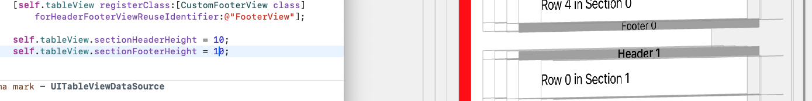

  * 如果只设置`sectionHeaderHeight`（<u>或者不管这个值设置的有多小</u>），而不设置`sectionFooterHeight` ，=> 那么在每一个`sectionHeader`距离上一组的尾部，总会有一段距离（这个距离是22）

    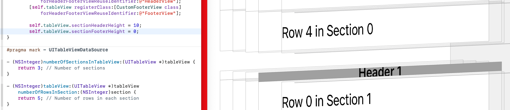

  * 如果不设置`sectionHeaderHeight`，只设置`sectionFooterHeight` ，=> <font color=red>**那么每个组之间无缝隙丝滑相接**</font>
  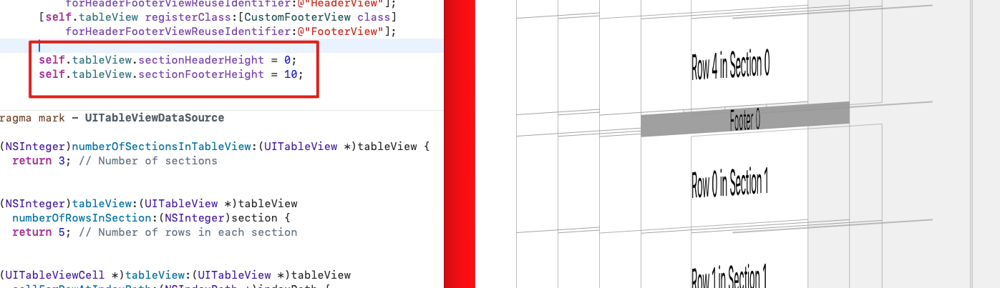

* 高度的优先级 => <font color=red>**协议方法的优先级 > 属性的优先级**</font>

  * 如果同时实现，则协议方法会覆盖属性配置

     ```objective-c
     - (CGFloat)tableView:(UITableView *)tableView heightForHeaderInSection:(NSInteger)section;
     - (CGFloat)tableView:(UITableView *)tableView heightForFooterInSection:(NSInteger)section;
     ```

    ```objective-c
    _tableView.sectionFooterHeight;
    _tableView.sectionHeaderHeight;
    ```

* **`UITableViewHeaderFooterView`** 的背景色

  * 默认情况下，**`UITableViewHeaderFooterView`**.**`backgroundView`** 是 <font color=red>nil</font>

  * ```objective-c
    self.backgroundColor 
      和 
    self.contentView.backgroundColor 
      
    均是无效操作❌
    ```

  * ```objective-c
    只有 
    self.backgroundView.backgroundColor 
    是有效操作✅
    ```

* 视图结构

  * 悬浮的时候：**UITableViewHeaderFooterView**→`_UISystemBackgroundView`(系统内部类)→<font color=red>`UIVisualEffectView`</font>(系统内部类)→<font color=red>`_UIVisualEffectBackdropView`</font>（系统内部类）→<font color=red>`_UIVisualEffectContentView`</font>（系统内部类）→`_UITableViewHeaderFooterContentView`（系统内部类）

  * 未悬浮的时候：**UITableViewHeaderFooterView**→`_UISystemBackgroundView`（系统内部类） →`UIView`→`_UITableViewHeaderFooterContentView`（系统内部类）

  * 结论

    * `_UIVisualEffectBackdropView`带背景色

    * <font color=red>**悬浮的时候，视图结构会发生变化**</font>。关注点：<u>新产生的视图的背景色</u>

    * 也就意味着，当视图内部进行调整的时候，会执行

      ```objective-c
      - (void)layoutSubviews{
          [super layoutSubviews];
          NSLog(@"");
      }
      ```

  * 解决方案

    * 在具体的`UITableViewHeaderFooterView *`子类，执行

      **此时，设置背景色是无效的**

      ```objective-c
      - (void)layoutSubviews{
          [super layoutSubviews];
          NSLog(@"");
          // 遍历子视图，找到UIVisualEffectView
            for (UIView *subview in self.subviews) {
                if([subview isKindOfClass:NSClassFromString(@"_UISystemBackgroundView")]){
                    // subview.backgroundColor = JobsClearColor; 设置成透明色，无效
                    subview.jobsVisible = NO;
                }
            }
      }
      ```

* <font color=red>**`UITableView`** 取消`viewForHeaderInSection` 产生的悬停效果</font>

  * 如果使用`BaseTableView.initWithStylePlain;`则会产生悬停效果

    * 方法一：`viewForHeaderInSection` 有值有高度 <font color=red>**强烈推荐**</font>

      假设 `viewForHeaderInSection` 的高度为 `JobsWidth(36)`，需要实现如下父类协议<UIScrollViewDelegate>关闭悬停效果

      ```objective-c
      #pragma mark - UIScrollViewDelegate
      - (void)scrollViewDidScroll:(UIScrollView *)scrollView {
          /// 关闭悬停效果
          CGFloat sectionHeaderHeight = JobsWidth(36); /// header的高度
          if (scrollView.contentOffset.y <= sectionHeaderHeight && scrollView.contentOffset.y >= 0) {
              scrollView.resetContentInsetTop(-scrollView.contentOffset.y);
          } else if (scrollView.contentOffset.y >= sectionHeaderHeight) {
              scrollView.resetContentInsetTop(-sectionHeaderHeight);
          }
          scrollView.resetContentInsetOffsetBottom(200);/// 额外增加的可滑动区域距离
      }
      ```

    * 方法二：<font color=red>**强烈推荐**</font>

      * <font color=green>**用了方法二，就可以不用方法一**</font>
      
      * [**资料来源**](https://github.com/Zydhjx/HeaderDemo)
      
      * 继承自基类**`BaseTableViewHeaderFooterView`**
      
        * <font color=red>**只能在基类实现。不可在分类实现**</font>
      
          ```objective-c
          /**
           #import "UITableViewHeaderFooterView+Attribute.h"
           在具体的子类实现，实现控制UITableViewHeaderFooterView是否悬停
           资料来源：https://github.com/Zydhjx/HeaderDemo
           */
          - (void)setFrame:(CGRect)frame {
              if (self.headerFooterViewStyle == JobsHeaderViewStyle) {
                  [super setFrame:[self.tableView rectForHeaderInSection:self.section]];
              }else if (self.headerFooterViewStyle == JobsFooterViewStyle){
                  [super setFrame:[self.tableView rectForFooterInSection:self.section]];
              }else{}
          }
          ```
      
      * 关注实现类：[**@interface BaseTableViewHeaderFooterView : UITableViewHeaderFooterView**](https://github.com/295060456/JobsOCBaseConfigDemo/tree/main/JobsOCBaseConfigDemo/JobsOCBaseCustomizeUIKitCore/UITableViewHeaderFooterView/BaseTableViewHeaderFooterView) + [**@interface UITableViewHeaderFooterView (Attribute)**](https://github.com/295060456/JobsOCBaseConfigDemo/tree/main/JobsOCBaseConfigDemo/JobsOCBaseCustomizeUIKitCore/UITableViewHeaderFooterView/BaseTableViewHeaderFooterView)
      
      * ```objective-c
        /// 这里涉及到复用机制，return出去的是UITableViewHeaderFooterView的派生类
        - (UIView *)tableView:(UITableView *)tableView
        viewForHeaderInSection:(NSInteger)section{
            UITableViewHeaderFooterView *headerView = self.tbvHeaderFooterViewMutArr[section];
            {
                /**
                 如果不是继承自BaseTableViewHeaderFooterView，那么在UITableViewHeaderFooterView的派生类中，添加：
                 @synthesize headerFooterViewStyle = _headerFooterViewStyle;
                 */
                // 不写这三句有悬浮
                headerView.headerFooterViewStyle = JobsHeaderViewStyle;
                headerView.tableView = tableView;
                headerView.section = section;
            }
            headerView.jobsRichElementsInViewWithModel(self.dataMutArr[section].data);
            @jobs_weakify(self)
            [headerView actionObjectBlock:^(id data) {
                @jobs_strongify(self)
            }];return headerView;
        }
        ```
      
    * 方法三：取巧，不推荐

      ```objective-c
      #pragma mark - UITableViewDelegate
      - (CGFloat)tableView:(UITableView *)tableView heightForHeaderInSection:(NSInteger)section {
          return CGFLOAT_MIN; // 设置 header 高度为非常小的值
      }
      
      - (UIView *)tableView:(UITableView *)tableView viewForHeaderInSection:(NSInteger)section {
          return UIView.new; // 返回一个空的 UIView
      }
      ```

  * 如果使用`BaseTableView.initWithStyleGrouped;`，则不会产生悬停效果

* <font color=red>如果需要在整个`TableView`的首尾出现一个大**View**，则用下面的代码。注意和**`viewForHeaderInSection`**进行区分</font>

  ```objective-c
  _tableView.tableHeaderView;
  _tableView.tableFooterView;
  ```

* 注册（注册不开辟内存，通过全局唯一的字符串进行取值的时候才开辟内存）

  ```objective-c
  _tableView.registerHeaderFooterViewClass(FMTBVHeaderFooterView1.class,@"");
  _tableView.registerHeaderFooterViewClass(FMTBVHeaderFooterView2.class,@"");
  ```

* 这里涉及到复用机制，`return`出去的是**`UITableViewHeaderFooterView`**的派生类

  ```objective-c
  - (UIView *)tableView:(UITableView *)tableView
  viewForHeaderInSection:(NSInteger)section{
      if(section == 0){
          FMTBVHeaderFooterView1 *headerView = tableView.tableViewHeaderFooterView(FMTBVHeaderFooterView1.class,@"");
          if(!headerView){
  //            headerView = FMTBVHeaderFooterView1.jobsInitWithReuseIdentifier(@"");// 不要用这个
              tableView.registerHeaderFooterViewClass(FMTBVHeaderFooterView1.class,@"");
              headerView = tableView.tableViewHeaderFooterView(FMTBVHeaderFooterView1.class,@"");
          }
          headerView.backgroundColor = JobsRedColor;
          // 不写这三句有悬浮
          headerView.headerFooterViewStyle = JobsHeaderViewStyle;
          headerView.tableView = tableView;
          headerView.section = section;
          headerView.jobsRichElementsInViewWithModel(self.dataMutArr[section].data);
          @jobs_weakify(self)
          [headerView actionObjectBlock:^(id data) {
              @jobs_strongify(self)
          }];return headerView;
      }else if (section == 1){
          FMTBVHeaderFooterView2 *headerView = tableView.tableViewHeaderFooterView(FMTBVHeaderFooterView2.class,@"");
          if(!headerView){
  //            headerView = FMTBVHeaderFooterView2.jobsInitWithReuseIdentifier(@"");// 不要用这个
              tableView.registerHeaderFooterViewClass(FMTBVHeaderFooterView2.class,@"");
              headerView = tableView.tableViewHeaderFooterView(FMTBVHeaderFooterView2.class,@"");
          }
          headerView.backgroundColor = JobsBlueColor;
          {
              /**
               如果不是继承自BaseTableViewHeaderFooterView，那么在UITableViewHeaderFooterView的派生类中，添加：
               @synthesize headerFooterViewStyle = _headerFooterViewStyle;
               */
              // 不写这三句有悬浮
              headerView.headerFooterViewStyle = JobsHeaderViewStyle;
              headerView.tableView = tableView;
              headerView.section = section;
          }
          headerView.jobsRichElementsInViewWithModel(self.dataMutArr[section].data);
          @jobs_weakify(self)
          [headerView actionObjectBlock:^(id data) {
              @jobs_strongify(self)
          }];return headerView;
      }else if (section == 2){
          FMTBVHeaderFooterView2 *headerView = tableView.tableViewHeaderFooterView(FMTBVHeaderFooterView2.class,@"");
          if(!headerView){
  //            headerView = FMTBVHeaderFooterView2.jobsInitWithReuseIdentifier(@"");// 不要用这个
              tableView.registerHeaderFooterViewClass(FMTBVHeaderFooterView2.class,@"");
              headerView = tableView.tableViewHeaderFooterView(FMTBVHeaderFooterView2.class,@"");
          }
          headerView.backgroundColor = JobsYellowColor;
          // 不写这三句有悬浮
          headerView.headerFooterViewStyle = JobsHeaderViewStyle;
          headerView.tableView = tableView;
          headerView.section = section;
          headerView.jobsRichElementsInViewWithModel(self.dataMutArr[section].data)
          @jobs_weakify(self)
          [headerView actionObjectBlock:^(id data) {
              @jobs_strongify(self)
          }];return headerView;
      }else return UIView.new;
  }
  
  /// 这里涉及到复用机制，return出去的是UITableViewHeaderFooterView的派生类
  - (nullable UIView *)tableView:(UITableView *)tableView
          viewForFooterInSection:(NSInteger)section{
      if(self.viewModel.usesTableViewFooterView){
          BaseTableViewHeaderFooterView *tbvFooterView = tableView.tableViewHeaderFooterView(BaseTableViewHeaderFooterView.class,@"");
          {
              // 不写这三句有悬浮
   						tbvFooterView.headerFooterViewStyle = JobsHeaderViewStyle;
        		  tbvFooterView.tableView = tableView;
         		  tbvFooterView.section = section;
          }
          tbvFooterView.backgroundColor = HEXCOLOR(0xEAEBED);
          tbvFooterView.backgroundView.backgroundColor = HEXCOLOR(0xEAEBED);
          tbvFooterView.jobsRichElementsInViewWithModel(nil);
          @jobs_weakify(self)
          [tbvFooterView actionObjectBlock:^(id data) {
              @jobs_strongify(self)
          }];return tbvFooterView;
      }return nil;
  }
  ```

  ```objective-c
  - (CGFloat)tableView:(UITableView *)tableView
  heightForHeaderInSection:(NSInteger)section{
      return JobsWidth(36);
  }
  
  - (CGFloat)tableView:(UITableView *)tableView
  heightForFooterInSection:(NSInteger)section{
      return JobsWidth(10);
  }
  ```

 * [<font color=red>对 **UITableView**.**section**的header和footer高度设置</font>](https://www.jianshu.com/p/65425a9d98e3)

   * 不实现 footer、header 设置方法，默认无 header、footer
   * footer 设置同 header 设置 
   * iOS 11 设置 header 高度必须同时实现 `viewForHeaderInSection` 和 `heightForHeaderInSection` 
   * iOS 11 之前版本只设置 `heightForHeaderInSection` 即可设置 header 高度，只是在 `UITableViewStyleGrouped` 时无法设置 header 高度为0，设置0时高度为系统默认高度
   
   |                    UITableViewStylePlain                     |               iOS 11               |             < iOS 11             |
   | :----------------------------------------------------------: | :--------------------------------: | :------------------------------: |
   |                   `viewForHeaderInSection`                   | 只实现此方法 header 高度为系统默认 |   只实现此方法 header 设置无效   |
   |                  `heightForHeaderInSection`                  |    只实现此方法 header 设置无效    | 只实现此方法 header 高度设置有效 |
   | 同时实现 `viewForHeaderInSection` 和 `heightForHeaderInSection` |        header 高度设置有效         |       header 高度设置有效        |
   
   |                   UITableViewStyleGrouped                    |               iOS 11               |                < iOS 11                 |
   | :----------------------------------------------------------: | :--------------------------------: | :-------------------------------------: |
   |                   `viewForHeaderInSection`                   | 只实现此方法 header 高度为系统默认 |   只实现此方法 header 高度为系统默认    |
   |                  `heightForHeaderInSection`                  | 只实现此方法 header 高度为系统默认 | 实现此方法 header 高度设置有效，不可为0 |
   | 同时实现 `viewForHeaderInSection` 和 `heightForHeaderInSection` |        header 高度设置有效         |           header 高度设置有效           |
   
 * **`UITableViewHeaderFooterView`**的子类

   ```objective-c
   #import "BaseViewProtocol.h"
   #import "UIViewModelOthersProtocol.h"
   
   NS_ASSUME_NONNULL_BEGIN
   
   @interface FMTBVHeaderFooterView1 : UITableViewHeaderFooterView
   <BaseViewProtocol,UIViewModelOthersProtocol>
   @end
   
   NS_ASSUME_NONNULL_END
   ```

   ```objective-c
   #import "FMTBVHeaderFooterView1.h"
   
   @interface FMTBVHeaderFooterView1 ()
   /// UI
   @property(nonatomic,strong)UILabel *titleLab;
   
   @end
   
   @implementation FMTBVHeaderFooterView1
   @synthesize viewModel = _viewModel;
   /// 具体由子类进行复写【数据定UI】【如果所传参数为基本数据类型，那么包装成对象NSNumber进行转化承接】
   -(jobsByIDBlock)jobsRichElementsInViewWithModel{
       @jobs_weakify(self)
       return ^(id _Nullable model) {
           @jobs_strongify(self)
     		  self.contentView.backgroundColor = self.backgroundColor = JobsClearColor.colorWithAlphaComponent(0);
           if([model isKindOfClass:UIViewModel.class]){
              self.viewModel = (UIViewModel *)model;
       }self.titleLab.alpha = 1;
     };
   }
   #pragma mark —— lazyLoad
   -(UILabel *)titleLab{
       if(!_titleLab){
           _titleLab = UILabel.new;
           _titleLab.text = self.viewModel.text;
           _titleLab.font = self.viewModel.font;
           _titleLab.textColor = self.viewModel.textCor;
           [self.contentView addSubview:_titleLab];
           [_titleLab mas_makeConstraints:^(MASConstraintMaker *make) {
               make.edges.equalTo(self.contentView);
           }];
       }return _titleLab;
   }
   
   @end
   ```

#### 28.3、**`UITableViewCell`**

* **`UITableViewCell`**的自带样式。关注实现类：[**@implementation UITableViewCell (UITableViewCellProtocol)**](https://github.com/295060456/JobsOCBaseConfigDemo/blob/main/JobsOCBaseConfigDemo/JobsOCBaseCustomizeUIKitCore/UITableViewCell/UITableViewCell%2BCategory/UITableViewCell%2BUITableViewCellProtocol/UITableViewCell%2BUITableViewCellProtocoll.m)

  * <font color=blue>**UITableViewCellStyleDefault**</font>

    ```objective-c
    +(JobsReturnTableViewCellByTableViewBlock _Nonnull)cellStyleDefaultWithTableView{
        @jobs_weakify(self)
        return ^(UITableView * _Nonnull tableView) {
            @jobs_strongify(self)
            UITableViewCell *cell = tableView.tableViewCellClass(self.class,@"");
            if (!cell) {
                cell = [self initTableViewCell:self
                                     withStyle:UITableViewCellStyleDefault];
                cell.settingForTableViewCell();
            }return cell;
        };
    }
    ```

    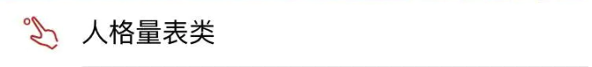

  * <font color=blue>**UITableViewCellStyleSubtitle**</font>

    ```objective-c
    +(JobsReturnTableViewCellByTableViewBlock _Nonnull)cellStyleSubtitleWithTableView{
        @jobs_weakify(self)
        return ^(UITableView * _Nonnull tableView) {
            @jobs_strongify(self)
            UITableViewCell *cell = (UITableViewCell *)tableView.tableViewCellClass(self.class,@"");
            if (!cell) {
                cell = [self initTableViewCell:self
                                     withStyle:UITableViewCellStyleSubtitle];
                cell.settingForTableViewCell();
            }return cell;
        };
    }
    ```

    

  * <font color=blue>**UITableViewCellStyleValue1**</font>

    ```objective-c
    +(JobsReturnTableViewCellByTableViewBlock _Nonnull)cellStyleValue1WithTableView{
        @jobs_weakify(self)
        return ^(UITableView * _Nonnull tableView) {
            @jobs_strongify(self)
            UITableViewCell *cell = tableView.tableViewCellClass(self.class,@"");
            if (!cell) {
                cell = [self initTableViewCell:self
                                     withStyle:UITableViewCellStyleValue1];
                cell.settingForTableViewCell();
            }return cell;
        };
    }
    ```

    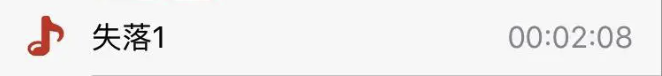

  * <font color=blue>**UITableViewCellStyleValue2**</font>

    ```objective-c
    +(JobsReturnTableViewCellByTableViewBlock _Nonnull)cellStyleValue2WithTableView{
        @jobs_weakify(self)
        return ^(UITableView * _Nonnull tableView) {
            @jobs_strongify(self)
            UITableViewCell *cell = tableView.tableViewCellClass(self.class,@"");
            if (!cell) {
                cell = [self initTableViewCell:self
                                     withStyle:UITableViewCellStyleValue2];
                cell.settingForTableViewCell();
            }return cell;
        };
    }
    ```

    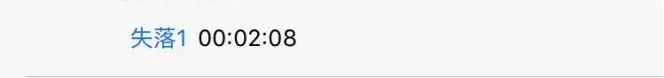

* 一些用做基类的**`UITableViewCell`**

  * **`JobsBaseTableViewCell`**：用于内部子控件的重定义Frame
  * **`JobsBtnStyleTBVCell`**：将一个按钮整体覆盖在`TableViewCell`之上，利用按钮内部图文进行布局
    * **`JobsImageStyleTBVCell`**：将一个图像整体覆盖在`TableViewCell`之上
  * **`JobsTextStyleTBVCell`**：将一个文本整体覆盖在`TableViewCell`之上
    * **`JobsBtnsStyleTBVCell`**：左右两边各有一个`UIButton`

* **`UITableViewCell`**.<font color=red>**registerClass**</font>

  * 使用`registerClass`注册`UITableViewCell`与直接创建`UITableViewCell`实例之间的**主要区别在于单元格的重用机制**

  * **生命周期**

    * **注册阶段**

      当调用 `registerClass` 方法时，`UITableView` 会提前为指定的重用标识符（`CellIdentifier`）注册一个 `UITableViewCell` 类。这样，当需要显示单元格时，`UITableView` 可以快速创建单元格实例。

      ```objective-c
      [self.tableView registerClass:UITableViewCell.class forCellReuseIdentifier:@"CellIdentifier"];
      ```

    * **创建阶段**

      ```objective-c
      UITableViewCell *cell = [tableView dequeueReusableCellWithIdentifier:@"CellIdentifier"];
      if (cell == nil) {
          cell = [[UITableViewCell alloc] initWithStyle:UITableViewCellStyleDefault reuseIdentifier:@"CellIdentifier"];
      ```

      - 在 `tableView:cellForRowAtIndexPath:` 方法中，当需要显示某一行时，调用 `dequeueReusableCellWithIdentifier:` 方法
      - 如果有可重用的单元格存在（即之前已经创建并离开屏幕的单元格），则返回该重用单元格
      - 如果没有可重用的单元格存在，`UITableView` 会使用 `registerClass` 注册的类来创建一个新的单元格实例

    * **配置阶段**

      - 调用 `cellForRowAtIndexPath:` 方法时，获取重用或新创建的单元格实例，并配置其内容

    * **显示阶段**

      - 将配置好的单元格显示在屏幕上

    * **重用阶段**

      - 当单元格滑出屏幕时，系统会将其放入重用队列，以便后续使用

* 示例代码

  * 使用 **registerClass** 注册 **`UITableViewCell`**

    ```objective-c
    - (void)viewDidLoad {
        [super viewDidLoad];
        [self.tableView registerClass:[UITableViewCell class] forCellReuseIdentifier:@"CellIdentifier"];
    }
    
    - (__kindof UITableViewCell *)tableView:(UITableView *)tableView 
                      cellForRowAtIndexPath:(NSIndexPath *)indexPath{
        UITableViewCell *cell = [tableView dequeueReusableCellWithIdentifier:@"CellIdentifier" forIndexPath:indexPath];
        cell.textLabel.text = [NSString stringWithFormat:@"Row %ld", (long)indexPath.row];
        return cell;
    }
    ```

  * 不使用 **registerClass** 直接创建 **`UITableViewCell`**

    ```objective-c
    - (__kindof UITableViewCell *)tableView:(UITableView *)tableView
                      cellForRowAtIndexPath:(NSIndexPath *)indexPath{
        UITableViewCell *cell = [tableView dequeueReusableCellWithIdentifier:@"CellIdentifier"];
        if (cell == nil) {
            cell = [[UITableViewCell alloc] initWithStyle:UITableViewCellStyleDefault reuseIdentifier:@"CellIdentifier"];
        }
        cell.textLabel.text = [NSString stringWithFormat:@"Row %ld", (long)indexPath.row];
        return cell;
    }
    ```

* 编辑模式

  ```objective-c
  - (void)tableView:(UITableView *)tableView
  commitEditingStyle:(UITableViewCellEditingStyle)editingStyle
  forRowAtIndexPath:(NSIndexPath *)indexPath{
      
  }
  ```

  ```objective-c
  /// 编辑模式下，点击取消左边已选中的cell的按钮
  - (void)tableView:(UITableView *)tableView
  didDeselectRowAtIndexPath:(NSIndexPath *)indexPath{
      
  }
  ```

* [**MGSwipeTableCell**](https://github.com/MortimerGoro/MGSwipeTableCell) 滑动的**`TableViewCell`**

  ```ruby
  pod 'MGSwipeTableCell' # https://github.com/MortimerGoro/MGSwipeTableCell 滑动tableViewCell
  ```

  ```objective-c
  #if __has_include(<MGSwipeTableCell/MGSwipeTableCell.h>)
  #import <MGSwipeTableCell/MGSwipeTableCell.h>
  #else
  #import "MGSwipeTableCell.h"
  #endif
  ```

#### 28.4、锚定点击的控件下方（动画）出现的下拉菜单[**`JobsDropDownListView`**](https://github.com/295060456/JobsOCBaseConfigDemo/tree/main/JobsOCBaseConfigDemo/OCBaseConfig/JobsMixFunc/JobsDropDownListView)

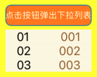

* 内部用**`UITableView`**创建

* ```objective-c
  - (void)dealloc{
      NSLog(@"%@",JobsLocalFunc);
  //    JobsRemoveNotification(self);;
      [self endDropDownListView];
  }
  ```

  ```objective-c
  -(UIButton *)btn{
      if(!_btn){
          @jobs_weakify(self)
          _btn = [BaseButton.alloc jobsInitBtnByConfiguration:nil
                                                   background:nil
                                   buttonConfigTitleAlignment:UIButtonConfigurationTitleAlignmentAutomatic
                                                textAlignment:NSTextAlignmentCenter
                                             subTextAlignment:NSTextAlignmentCenter
                                                  normalImage:nil
                                               highlightImage:nil
                                              attributedTitle:nil
                                      selectedAttributedTitle:nil
                                           attributedSubtitle:nil
                                                        title:JobsInternationalization(@"点击按钮弹出下拉列表")
                                                     subTitle:nil
                                                    titleFont:UIFontWeightRegularSize(12)
                                                 subTitleFont:nil
                                                     titleCor:JobsWhiteColor
                                                  subTitleCor:nil
                                           titleLineBreakMode:NSLineBreakByWordWrapping
                                        subtitleLineBreakMode:NSLineBreakByWordWrapping
                                          baseBackgroundColor:JobsOrangeColor
                                              backgroundImage:nil
                                                 imagePadding:JobsWidth(0)
                                                 titlePadding:JobsWidth(0)
                                               imagePlacement:NSDirectionalRectEdgeNone
                                   contentHorizontalAlignment:UIControlContentHorizontalAlignmentCenter
                                     contentVerticalAlignment:UIControlContentVerticalAlignmentCenter
                                                contentInsets:jobsSameDirectionalEdgeInsets(0)
                                            cornerRadiusValue:JobsWidth(8)
                                              roundingCorners:UIRectCornerAllCorners
                                         roundingCornersRadii:CGSizeZero
                                               layerBorderCor:nil
                                                  borderWidth:JobsWidth(1)
                                                primaryAction:nil
                                   longPressGestureEventBlock:^(id  _Nullable weakSelf,
                                                                id  _Nullable arg) {
              NSLog(@"按钮的长按事件触发");
       }
                                              clickEventBlock:^id(BaseButton *x){
              @jobs_strongify(self)
              if (self.objectBlock) self.objectBlock(x);
              NSLog(@"AAA = %@",self.dropDownListView);
              x.selected = !x.selected;
              if (x.selected) {
                  /// ❤️只能让它执行一次❤️
                  self.dropDownListView = [self motivateFromView:x
                                   jobsDropDownListViewDirection:self.dropDownListViewDirection
                                                            data:self.listViewData
                                              motivateViewOffset:JobsWidth(5)
                                                     finishBlock:^(UIViewModel *data) {
                      NSLog(@"data = %@",data);
                  }];
              }else{
                  [self endDropDownListView];
              }return nil;
           return nil;
          }];
          [self.view addSubview:_btn];
          [_btn mas_makeConstraints:^(MASConstraintMaker *make) {
              make.center.equalTo(self.view);
  //            make.size.mas_equalTo(CGSizeMake(JobsWidth(120), JobsWidth(25)));
              make.height.mas_equalTo(JobsWidth(30));
          }];
          _btn.makeBtnLabelByShowingType(UILabelShowingType_03);
      }return _btn;
  }
  ```

### 29、**`JobsStepView`** <a href="#前言" style="font-size:17px; color:green;"><b>回到顶部</b></a>

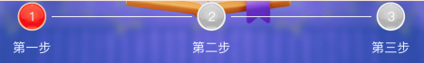

* ```objective-c
  @property(nonatomic,strong)JobsStepView *stepView;
  @property(nonatomic,strong)NSMutableArray <UIButtonModel *>*btnModelMutArr;
  ```

  ```objective-c
  -(JobsStepView *)stepView{
      if(!_stepView){
          _stepView = JobsStepView.new;
          _stepView.backgroundColor = JobsRedColor;
          [self addSubview:_stepView];
          [_stepView mas_makeConstraints:^(MASConstraintMaker *make) {
              make.center.equalTo(self);
              make.size.mas_equalTo([_stepView viewSizeWithModel:nil]);
          }];
          _stepView.jobsRichElementsInViewWithModel(self.btnModelMutArr);
      }return _stepView;
  }
  
  -(NSMutableArray<UIButtonModel *> *)btnModelMutArr{
      if(!_btnModelMutArr){
          _btnModelMutArr = NSMutableArray.array;
          {
              UIButtonModel *buttonModel = UIButtonModel.new;
              buttonModel.title = JobsInternationalization(@"第一步");
              buttonModel.titleCor = JobsWhiteColor;
              buttonModel.titleFont = UIFontWeightRegularSize(14);
              buttonModel.normalImage = JobsIMG(@"正在进行第一步");
              buttonModel.imagePlacement = NSDirectionalRectEdgeTop;
              buttonModel.imagePadding = JobsWidth(10);
              buttonModel.roundingCorners = UIRectCornerAllCorners;
              buttonModel.leftViewWidth = JobsWidth(80);
              buttonModel.rightViewWidth = JobsWidth(80);
              buttonModel.selected = YES;
              [_btnModelMutArr addObject:buttonModel];
          }
          
          {
              UIButtonModel *buttonModel = UIButtonModel.new;
              buttonModel.title = JobsInternationalization(@"第二步");
              buttonModel.titleCor = JobsWhiteColor;
              buttonModel.titleFont = UIFontWeightRegularSize(14);
              buttonModel.normalImage = JobsIMG(@"还未进行第二步");
              buttonModel.imagePlacement = NSDirectionalRectEdgeTop;
              buttonModel.imagePadding = JobsWidth(10);
              buttonModel.roundingCorners = UIRectCornerAllCorners;
              buttonModel.leftViewWidth = JobsWidth(80);
              buttonModel.rightViewWidth = JobsWidth(80);
              buttonModel.selected = YES;
              [_btnModelMutArr addObject:buttonModel];
          }
          
          {
              UIButtonModel *buttonModel = UIButtonModel.new;
              buttonModel.title = JobsInternationalization(@"第三步");
              buttonModel.titleCor = JobsWhiteColor;
              buttonModel.titleFont = UIFontWeightRegularSize(14);
              buttonModel.normalImage = JobsIMG(@"还未进行第三步");
              buttonModel.imagePlacement = NSDirectionalRectEdgeTop;
              buttonModel.imagePadding = JobsWidth(10);
              buttonModel.roundingCorners = UIRectCornerAllCorners;
              buttonModel.leftViewWidth = JobsWidth(80);
              buttonModel.rightViewWidth = JobsWidth(80);
              buttonModel.selected = YES;
              [_btnModelMutArr addObject:buttonModel];
          }
      }return _btnModelMutArr;
  }
  ```


### 30、关于**`UITabBarController`** <a href="#前言" style="font-size:17px; color:green;"><b>回到顶部</b></a>

#### 30.1、架构说明

* <font color=red>`JobsTabBarVC`</font>：**`UITabBarController`**
  * `JobsTabBarItemConfig`：**`NSObject`**
  * **UITabBarItem**
    * `JobsTabBarItem`：**`UITabBarItem`**
    * `UITabBarItem+TLAnimation`
  * **UITabBar**
    * `UITabBar+Ex`
    * `UITabBar+TLAnimation`
    * `JobsTabBar`：**`UITabBar`**
* <font color =red>`JobsCustomTabBarVC`</font>：**`UITabBarController`**
  * `JobsCustomTabBarConfig`：**`NSObject`**
  * `JobsCustomTabBar`：**`UIView`**
  * `JobsCustomTabBarButton`：**`UIButton`**
* <font color=red>`LZTabBarController`</font>：**`UITabBarController`**
  * `LZTabBar`：**`UIView`**
  * `LZTabBarConfig` ：**`NSObject`**
  * `LZTabBarItem`：**`UIView`**

#### 30.2、[自定义 **`UITabBarController`**](https://github.com/295060456/JobsOCBaseConfigDemo/blob/main/JobsOCBaseConfigDemo/OCBaseConfig/JobsMixFunc/UITabBarCtr/%E8%87%AA%E5%AE%9A%E4%B9%89%20UITabBarController.md/%E8%87%AA%E5%AE%9A%E4%B9%89%20UITabBarController.md)

### 31、联动视图的解决方案 <a href="#前言" style="font-size:17px; color:green;"><b>回到顶部</b></a>

#### 31.1、[**`JXCategoryView`**](https://github.com/pujiaxin33/JXCategoryView)

* 评价

  * 是一个针对`UIViewController`的视图联动，<font color=red>所属可滑动的子部是`UIViewController`的子类</font>
  * <font color=red>**但是因为`View`上不能添加`UIViewController`，所以在某些场景的使用会有一定局限**</font>
  * <font color=red>**垂直方向的使用会有局限。所以[`JXCategoryView`](https://github.com/pujiaxin33/JXCategoryView)是针对的水平场景**</font>
  
* 集成方式

  ```ruby
  pod 'JXCategoryView' # https://github.com/pujiaxin33/JXCategoryView NO_SMP
  pod 'JXPagingView/Pager' # https://github.com/pujiaxin33/JXPagingView NO_SMP
  # pod 'JXCategoryViewExt' # https://github.com/QuintGao/JXCategoryViewExt 来自于另外一个作者的优化
  ```
  
  ```objective-c
  #if __has_include(<JXCategoryView/JXCategoryView.h>)
  #import <JXCategoryView/JXCategoryView.h>
  #else
  #import "JXCategoryView.h"
  #endif
  ```
  
  ```objective-c
  <
  JXCategoryTitleViewDataSource
  ,JXCategoryListContainerViewDelegate
  ,JXCategoryViewDelegate
  >
  ```
  
* 公共部分

  * 定义高度

    ```objective-c
    #ifndef listContainerViewDefaultOffset
    #define listContainerViewDefaultOffset JobsWidth(50)
    #endif
    ```

  * UI部分

    * ```objective-c
      @property(nonatomic,strong)JXCategoryTitleView *categoryView;/// 文字
      ```

    * ```objective-c
      @property(nonatomic,strong)JXCategoryDotView *categoryView;/// 右上角带红点
      ```

    * ```objective-c
      @property(nonatomic,strong)JXCategoryImageView *categoryView;/// 纯图
      ```

    * ```objective-c
      @property(nonatomic,strong)JXCategoryNumberView *categoryView;/// 右上角带文字
      ```

    * ```objective-c
      @property(nonatomic,strong)JXCategoryIndicatorLineView *lineView;/// 跟随的指示器
      @property(nonatomic,strong)JXCategoryListContainerView *listContainerView;/// 此属性决定依附于此的viewController
      @property(nonatomic,strong)JXCategoryIndicatorBackgroundView *categoryBgView;
      ```

  * Data部分

    ```objective-c
    @property(nonatomic,strong)NSMutableArray <NSString *>*titleMutArr;
    @property(nonatomic,strong)NSMutableArray <NSString *>*imageNames;
    @property(nonatomic,strong)NSMutableArray <NSString *>*selectedImageNames;
    @property(nonatomic,strong)NSMutableArray <__kindof UIViewController *>*childVCMutArr;
    ```

  * ```objective-c
    -(JXCategoryIndicatorBackgroundView *)categoryBgView{
        if (!_categoryBgView) {
            _categoryBgView = JXCategoryIndicatorBackgroundView.new;
            _categoryBgView.indicatorHeight = JobsWidth(30);
            _categoryBgView.indicatorWidth = JobsWidth(76);
            _categoryBgView.indicatorColor = HEXCOLOR(0xFFEABA);
            _categoryBgView.indicatorCornerRadius = JXCategoryViewAutomaticDimension;
        }return _categoryBgView;
    }
    
    -(JXCategoryIndicatorLineView *)lineView{
        if (!_lineView) {
            _lineView = JXCategoryIndicatorLineView.new;
            _lineView.indicatorColor = HEXCOLOR(0xFFEABA);
            _lineView.indicatorHeight = JobsWidth(4);
            _lineView.indicatorWidthIncrement = JobsWidth(10);
            _lineView.verticalMargin = 0;
        }return _lineView;
    }
    /// 此属性决定依附于此的viewController
    -(JXCategoryListContainerView *)listContainerView{
        if (!_listContainerView) {
            _listContainerView = [JXCategoryListContainerView.alloc initWithType:JXCategoryListContainerType_CollectionView
                                                                        delegate:self];
            _listContainerView.defaultSelectedIndex = 1;// 默认从第二个开始显示
            [self.view addSubview:_listContainerView];
            [_listContainerView mas_makeConstraints:^(MASConstraintMaker *make) {
    //            make.edges.equalTo(self.view);
                make.top.equalTo(self.infoBoardView.mas_bottom).offset(listContainerViewDefaultOffset);
                make.left.right.bottom.equalTo(self.view);
                
            }];
            [self.view layoutIfNeeded];
            
            /// ❤️在需要的地方写❤️
            NSNumber *currentIndex = [self.listContainerView valueForKey:@"currentIndex"];
            NSLog(@"滑动或者点击以后，改变控制器，得到的目前最新的index = %d",currentIndex.intValue);
            
        }return _listContainerView;
    }
    
    -(NSMutableArray<NSString *> *)titleMutArr{
        if (!_titleMutArr) {
            _titleMutArr = NSMutableArray.array;
            [_titleMutArr addObject:JobsInternationalization(@"全部游戏")];
            [_titleMutArr addObject:JobsInternationalization(@"真人")];
            [_titleMutArr addObject:JobsInternationalization(@"体育")];
            [_titleMutArr addObject:JobsInternationalization(@"电子")];
            [_titleMutArr addObject:JobsInternationalization(@"棋牌")];
            [_titleMutArr addObject:JobsInternationalization(@"彩票")];
        }return _titleMutArr;
    }
    
    -(NSMutableArray<__kindof UIViewController *> *)childVCMutArr{
        if (!_childVCMutArr) {
            _childVCMutArr = NSMutableArray.array;
            [_childVCMutArr addObject:BaiShaETProjAllGameVC.new];// 全部游戏
            [_childVCMutArr addObject:BaiShaETProjManVideoVC.new];// 真人
            [_childVCMutArr addObject:BaiShaETProjSportVC.new];// 体育
            [_childVCMutArr addObject:BaiShaETProjGameOnllineVC.new];// 电子
            [_childVCMutArr addObject:BaiShaETProjChessPokerVC.new];// 棋牌
            [_childVCMutArr addObject:BaiShaETProjLotteryVC.new];// 彩票
        }return _childVCMutArr;
    }
    ```

  * 协议部分，主要是以下3个协议

    * **`JXCategoryTitleViewDataSource`**

      ```objective-c
      #pragma mark JXCategoryTitleViewDataSource
      //// 如果将JXCategoryTitleView嵌套进UITableView的cell，每次重用的时候，JXCategoryTitleView进行reloadData时，会重新计算所有的title宽度。所以该应用场景，需要UITableView的cellModel缓存titles的文字宽度，再通过该代理方法返回给JXCategoryTitleView。
      //// 如果实现了该方法就以该方法返回的宽度为准，不触发内部默认的文字宽度计算。
      //- (CGFloat)categoryTitleView:(JXCategoryTitleView *)titleView
      //               widthForTitle:(NSString *)title{
      //
      //    return 10;
      //}
      ```

    * **`JXCategoryListContainerViewDelegate`**

      ```objective-c
      #pragma mark JXCategoryListContainerViewDelegate
      /**
       返回list的数量
      
       @param listContainerView 列表的容器视图
       @return list的数量
       */
      - (NSInteger)numberOfListsInlistContainerView:(JXCategoryListContainerView *)listContainerView{
          return self.titleMutArr.count;
      }
      /**
       根据index初始化一个对应列表实例，需要是遵从`JXCategoryListContentViewDelegate`协议的对象。
       如果列表是用自定义UIView封装的，就让自定义UIView遵从`JXCategoryListContentViewDelegate`协议，该方法返回自定义UIView即可。
       如果列表是用自定义UIViewController封装的，就让自定义UIViewController遵从`JXCategoryListContentViewDelegate`协议，该方法返回自定义UIViewController即可。
      
       @param listContainerView 列表的容器视图
       @param index 目标下标
       @return 遵从JXCategoryListContentViewDelegate协议的list实例
       */
      - (id<JXCategoryListContentViewDelegate>)listContainerView:(JXCategoryListContainerView *)listContainerView
                                                initListForIndex:(NSInteger)index{
          return self.childVCMutArr[index];
      }
      ```

    * **`JXCategoryViewDelegate`**

      ```objective-c
      #pragma mark JXCategoryViewDelegate
      ///【点击的结果】点击选中的情况才会调用该方法。传递didClickSelectedItemAt事件给listContainerView
      - (void)categoryView:(JXCategoryBaseView *)categoryView
      didClickSelectedItemAtIndex:(NSInteger)index {
          [self.listContainerView didClickSelectedItemAtIndex:index];
      }
      ///【点击选中或者滚动选中的结果】点击选中或者滚动选中都会调用该方法。适用于只关心选中事件，不关心具体是点击还是滚动选中的。
      - (void)categoryView:(JXCategoryBaseView *)categoryView
      didSelectedItemAtIndex:(NSInteger)index {
          
      }
      ///【滚动选中的结果】滚动选中的情况才会调用该方法
      - (void)categoryView:(JXCategoryBaseView *)categoryView 
      didScrollSelectedItemAtIndex:(NSInteger)index{
          
      }
      /// 传递scrolling事件给listContainerView，必须调用！！！
      - (void)categoryView:(JXCategoryBaseView *)categoryView
      scrollingFromLeftIndex:(NSInteger)leftIndex
              toRightIndex:(NSInteger)rightIndex
                     ratio:(CGFloat)ratio {
          NSLog(@"");
      //    [self.listContainerView scrollingFromLeftIndex:leftIndex
      //                                      toRightIndex:rightIndex
      //                                             ratio:ratio
      //                                     selectedIndex:categoryView.selectedIndex];
      }
      ```

* 手动跳转到某个指定的页面

  ```objective-c
  [self.categoryTitleView selectItemAtIndex:3];
  ```

* 不同风格的`JXCategory`的实现

  * ```objective-c
    -(JXCategoryTitleView *)categoryView{
        if (!_categoryView) {
            _categoryView = JXCategoryTitleView.new;
            _categoryView.backgroundColor = UIColor.clearColor;
            _categoryView.titleSelectedColor = UIColor.whiteColor;
            _categoryView.titleColor = UIColor.whiteColor;
            _categoryView.titleFont = [UIFont systemFontOfSize:18 weight:UIFontWeightRegular];
            _categoryView.titleSelectedFont = [UIFont systemFontOfSize:28 weight:UIFontWeightRegular];
            _categoryView.delegate = self;
            _categoryView.titles = self.titleMutArr;
            _categoryView.titleColorGradientEnabled = YES;
            _categoryView.indicators = @[self.lineView];//
            _categoryView.defaultSelectedIndex = 1;// 默认从第二个开始显示
            _categoryView.cellSpacing = JobsWidth(-20);
            // 关联cotentScrollView，关联之后才可以互相联动！！！
            _categoryView.contentScrollView = self.listContainerView.scrollView;//
            _categoryView.indicators = @[self.categoryBgView];/// BackgroundView 椭圆形
            [self.view addSubview:_categoryView];
            [_categoryView mas_makeConstraints:^(MASConstraintMaker *make) {
                make.top.equalTo(self.infoBoardView.mas_bottom).offset(0);
                make.left.right.equalTo(self.view);
                make.height.mas_equalTo(listContainerViewDefaultOffset);
            }];
            [self.view layoutIfNeeded];
        }return _categoryView;
    }
    ```

  * ```objective-c
    -(JXCategoryImageView *)categoryView{
        if (!_categoryView) {
            _categoryView = JXCategoryImageView.new;
            _categoryView.backgroundColor = UIColor.clearColor;
            _categoryView.delegate = self;
    
            _categoryView.imageNames = @[@"彩票_已选择",@"电子_已选择",@"棋牌_已选择",@"全部游戏_已选择",@"体育_已选择",@"真人直播_已选择"];
            _categoryView.selectedImageNames = @[@"彩票_已选择",@"电子_已选择",@"棋牌_已选择",@"全部游戏_已选择",@"体育_已选择",@"真人直播_已选择"];
            
            //_categoryView.imageInfoArray = @[@"彩票_已选择",@"电子_已选择",@"棋牌_已选择",@"全部游戏_已选择",@"体育_已选择",@"真人直播_已选择"];
            //@[KIMG(@"彩票_已选择"),KIMG(@"电子_已选择"),KIMG(@"棋牌_已选择"),KIMG(@"全部游戏_已选择"),KIMG(@"体育_已选择"),KIMG(@"真人直播_已选择")];
            //_categoryView.selectedImageInfoArray = @[@"彩票_已选择",@"电子_已选择",@"棋牌_已选择",@"全部游戏_已选择",@"体育_已选择",@"真人直播_已选择"];
            
            _categoryView.imageSize = CGSizeMake(JobsWidth(30), JobsWidth(30));
            _categoryView.imageCornerRadius = JobsWidth(8);
            _categoryView.imageZoomEnabled = YES;
            _categoryView.imageZoomScale = 2;
    
            _categoryView.indicators = @[self.lineView];//
            _categoryView.defaultSelectedIndex = 1;// 默认从第二个开始显示
            _categoryView.cellSpacing = JobsWidth(-20);
            // 关联cotentScrollView，关联之后才可以互相联动！！！
            _categoryView.contentScrollView = self.listContainerView.scrollView;//
            _categoryView.indicators = @[self.categoryBgView];/// BackgroundView 椭圆形
            [self.view addSubview:_categoryView];
            [_categoryView mas_makeConstraints:^(MASConstraintMaker *make) {
                make.top.equalTo(self.infoBoardView.mas_bottom).offset(0);
                make.left.right.equalTo(self.view);
                make.height.mas_equalTo(listContainerViewDefaultOffset);
            }];
            [self.view layoutIfNeeded];
        }return _categoryView;
    }
    ```

  * ```objective-c
    -(JXCategoryDotView *)categoryTitleView{
        if (!_categoryTitleView) {
            _categoryTitleView = JXCategoryDotView.new;
            _categoryTitleView.delegate = self;
            _categoryTitleView.dotStates = self.dotStatesMutArr;
            _categoryTitleView.titles = self.titleMutArr;
            _categoryTitleView.indicators = @[self.lineView];
            _categoryTitleView.backgroundColor = HEXCOLOR(0xFCFBFB);
            _categoryTitleView.titleSelectedColor = HEXCOLOR(0xAE8330);
            _categoryTitleView.titleColor = HEXCOLOR(0xC4C4C4);
            _categoryTitleView.titleFont = notoSansRegular(12);
            _categoryTitleView.titleSelectedFont = notoSansRegular(12);
            _categoryTitleView.defaultSelectedIndex = 1;//默认从第二个开始显示
            _categoryTitleView.titleColorGradientEnabled = YES;
    //        _categoryTitleView.titleLabelZoomEnabled = YES;//默认为NO。为YES时titleSelectedFont失效，以titleFont为准。这句话貌似有点问题，等作者回复
            _categoryTitleView.listContainer = self.listContainerView;
            _categoryView.indicators = @[self.categoryBgView];/// BackgroundView 椭圆形
            _categoryTitleView.dotSize = CGSizeMake(JobsWidth(5), JobsWidth(5));
            // 关联cotentScrollView，关联之后才可以互相联动！！！
            _categoryTitleView.contentScrollView = self.listContainerView.scrollView;
            [_categoryTitleView reloadDataWithoutListContainer];
            [self.view addSubview:_categoryTitleView];
            [_categoryTitleView mas_makeConstraints:^(MASConstraintMaker *make) {
                make.top.equalTo(self.topLineLab.mas_bottom);
                make.left.right.equalTo(self.view);
                make.height.mas_equalTo(listContainerViewDefaultOffset);
            }];
        }return _categoryTitleView;
    }
    ```

    ```objective-c
    @property(nonatomic,strong)NSMutableArray <NSNumber *>*dotStatesMutArr;
    -(NSMutableArray<NSNumber *> *)dotStatesMutArr{
        if (!_dotStatesMutArr) {
            _dotStatesMutArr = NSMutableArray.array;
            [_dotStatesMutArr addObject:@YES];
            [_dotStatesMutArr addObject:@NO];
            [_dotStatesMutArr addObject:@YES];
            [_dotStatesMutArr addObject:@NO];
            [_dotStatesMutArr addObject:@YES];
        }return _dotStatesMutArr;
    }
    
    - (void)categoryView:(JXCategoryBaseView *)categoryView
    didSelectedItemAtIndex:(NSInteger)index {
        self.navigationController.interactivePopGestureRecognizer.enabled = (index == 0);
        //点击以后红点消除
        if ([self.dotStatesMutArr[index] boolValue]) {
            self.dotStatesMutArr[index] = @(NO);
            self.categoryTitleView.dotStates = self.dotStatesMutArr;
            [categoryView reloadCellAtIndex:index];
        }
    }
    ```
    
  * ```objective-c
    -(JXCategoryNumberView *)categoryTitleView{
        if (!_categoryTitleView) {
            _categoryTitleView = JXCategoryNumberView.new;
            _categoryTitleView.delegate = self;
            _categoryTitleView.titles = self.titleMutArr;
            _categoryTitleView.indicators = @[self.lineView];
            _categoryTitleView.backgroundColor = HEXCOLOR(0xFCFBFB);
            _categoryTitleView.titleSelectedColor = HEXCOLOR(0xAE8330);
            _categoryTitleView.titleColor = HEXCOLOR(0xC4C4C4);
            _categoryTitleView.titleFont = notoSansRegular(12);
            _categoryTitleView.titleSelectedFont = notoSansRegular(12);
            _categoryTitleView.defaultSelectedIndex = 1;//默认从第二个开始显示
            _categoryTitleView.titleColorGradientEnabled = YES;
    //        _categoryTitleView.titleLabelZoomEnabled = YES;//默认为NO。为YES时titleSelectedFont失效，以titleFont为准。这句话貌似有点问题，等作者回复
            _categoryTitleView.listContainer = self.listContainerView;
            _categoryTitleView.counts = self.numberMutArr;
            _categoryTitleView.numberLabelOffset = CGPointMake(JobsWidth(5), JobsWidth(2));
            /// 内部默认不会格式化数字，直接转成字符串显示。比如业务需要数字超过999显示999+，可以通过该block实现。
            _categoryTitleView.numberStringFormatterBlock = ^NSString *(NSInteger number) {
                if (number > 999) {
                    return @"999+";
                }
                return [NSString stringWithFormat:@"%ld", (long)number];
            };
            /// 关联cotentScrollView，关联之后才可以互相联动！！！
            _categoryTitleView.contentScrollView = self.listContainerView.scrollView;
            _categoryView.indicators = @[self.categoryBgView];/// BackgroundView 椭圆形
            [_categoryTitleView reloadDataWithoutListContainer];
            [self.view addSubview:_categoryTitleView];
            [_categoryTitleView mas_makeConstraints:^(MASConstraintMaker *make) {
                make.top.equalTo(self.topLineLab.mas_bottom);
                make.left.right.equalTo(self.view);
                make.height.mas_equalTo(listContainerViewDefaultOffset);
            }];
        }return _categoryTitleView;
    }
    ```

#### 31.2、[**`JobsToggleView`**](https://github.com/295060456/JobsOCBaseConfigDemo/tree/main/JobsOCBaseConfigDemo/%F0%9F%94%A8Manual_Add_ThirdParty%EF%BC%88%E6%8C%89%E9%9C%80%E5%BC%95%E5%85%A5%EF%BC%89/JobsToggleView)优化自[**`RPTaggedNavView`**](https://github.com/RollingPin/RPTaggedNavView)

* `JobsToggleBaseView`
  * <font color=red>**这是一个纯视图**</font> 对外调用这个视图容器
  
  * ```objective-c
    @property(nonatomic,strong,readonly)JobsToggleNavView *taggedNavView;
    @property(nonatomic,strong,readonly)UIScrollView *bgScroll;
    ```
  
  * 点击了导航的按钮以后在`JobsToggleBaseView`的`scrollviewDelegate`实现滚动逻辑
  
  * <font color=red>点击和手动滑动最后都会触发`-(jobsByNSIntegerBlock _Nonnull)selectingOneTagWithIndex`</font>
  
  * 点击和手动滑动最后都会进入`- (void)scrollViewDidScroll:(UIScrollView *)scrollView`，但是，因为`- (void)scrollViewDidScroll:(UIScrollView *)scrollView`要反复调用，<u>所以将视图手动滚动逻辑的生命周期提前到`-(void)scrollViewDidEndDragging:(UIScrollView *)scrollView willDecelerate:(BOOL)decelerate`</u>
  
* `JobsToggleNavView`
  * 上部的导航栏
  * 可点击部分由`UIButton`构成，并匹配了系统最新的Api，丰富使用
  * 每一个`Button`用`UIButtonModel`进行渲染
  
* 使用方式
  
  ```objective-c
  @property(nonatomic,strong)JobsToggleBaseView *toggleBaseView;
  @property(nonatomic,strong)Login_account_code_view *account_code_view;
  @property(nonatomic,strong)Login_verification_code_view *verification_code_view;
  ```
  
  ```objective-c
  -(JobsToggleBaseView *)toggleBaseView{
      if(!_toggleBaseView){
          @jobs_weakify(self)
          _toggleBaseView = JobsToggleBaseView.new;
          _toggleBaseView.btn_each_offset = JobsWidth(8);
          [self addSubview:_toggleBaseView];
          [_toggleBaseView mas_makeConstraints:^(MASConstraintMaker *make) {
              make.size.mas_equalTo(JobsToggleBaseView.viewSizeByModel(nil));
              make.top.equalTo(self.titleLab.mas_bottom);
              make.centerX.equalTo(self);
          }];
          [self layoutIfNeeded];
          _toggleBaseView.taggedNavView_width = JobsWidth(94 * 2);//LoginView.viewSizeByModel(nil).width / 2;
          _toggleBaseView.taggedNavView_height = JobsWidth(24);
          _toggleBaseView.taggedNavViewBgColor = JobsClearColor.colorWithAlphaComponent(0);
          _toggleBaseView.jobsRichViewByModel(jobsMakeMutArr(^(__kindof NSMutableArray <UIButtonModel *>*_Nullable data) {
              data.add(jobsMakeButtonModel(^(__kindof UIButtonModel * _Nullable data1) {
                  @jobs_strongify(self)
                  data1.backgroundImage = JobsIMG(@"PHONE_NO_未点击");
                  data1.selected_backgroundImage = JobsIMG(@"PHONE_NO_已点击");
                  data1.baseBackgroundColor = JobsClearColor.colorWithAlphaComponent(0);
                  data1.title = JobsInternationalization(@"PHONE NO.");
                  data1.titleCor = JobsClearColor;
                  data1.selected_titleCor = JobsClearColor;
                  data1.roundingCorners = UIRectCornerAllCorners;
                  data1.view = self.verification_code_view;
                  data1.clickEventBlock = ^id _Nullable(__kindof UIButton *_Nullable x){
                      @jobs_strongify(self)
                      if(KindOfBaseButtonCls(x)){
                          self.toggleBaseView.switchViewsBy(x.index);
                      }return nil;
                  };
              }));
              data.add(jobsMakeButtonModel(^(__kindof UIButtonModel * _Nullable data1) {
                  @jobs_strongify(self)
                  data1.backgroundImage = JobsIMG(@"ACCOUNT_NAME_未点击");
                  data1.selected_backgroundImage = JobsIMG(@"ACCOUNT_NAME_已点击");
                  data1.baseBackgroundColor = JobsClearColor.colorWithAlphaComponent(0);
                  data1.title = JobsInternationalization(@"ACCOUNT NAME");
                  data1.titleCor = JobsClearColor;
                  data1.selected_titleCor = JobsClearColor;
                  data1.roundingCorners = UIRectCornerAllCorners;
                  data1.view = self.account_code_view;
                  data1.clickEventBlock = ^id _Nullable(__kindof UIButton *_Nullable x){
                      @jobs_strongify(self)
                      if(KindOfBaseButtonCls(x)){
                          self.toggleBaseView.switchViewsBy(x.index);
                      }return nil;
                  };
              }));
          }));
      }return _toggleBaseView;
  }
  
  -(Login_verification_code_view *)verification_code_view{
      if(!_verification_code_view){
          _verification_code_view = Login_verification_code_view.new;
          _verification_code_view.Size = _verification_code_view.viewSizeByModel(nil);
          _verification_code_view.jobsRichViewByModel(nil);
          @jobs_weakify(self)
          [_verification_code_view actionObjectBlock:^(id  _Nullable data) {
              if(KindOfBtnCls(data)){
                  UIButton *btn = (UIButton *)data;
                  @jobs_strongify(self)
                  if(btn.titleForNormalState){
                      if(btn.titleForNormalState.isEqualToString(JobsInternationalization(@"GET_CODE"))){
                          if (self.objectBlock) self.objectBlock(JobsInternationalization(@"GET_CODE"));
                      }
                      if(btn.titleForNormalState.isEqualToString(JobsInternationalization(@"是否显示密码明文"))){
                          if (self.objectBlock) self.objectBlock(JobsInternationalization(@"是否显示密码明文"));
                      }
                      if(btn.titleForNormalState.isEqualToString(JobsInternationalization(@"Forgot Password?"))){
                          if (self.objectBlock) self.objectBlock(JobsInternationalization(@"Forgot Password?"));
                      }
                      if(btn.titleForNormalState.isEqualToString(JobsInternationalization(@"LOGIN"))){
                          if (self.objectBlock) self.objectBlock(JobsInternationalization(@"LOGIN"));
                      }
                  }
              }
          }];
      }return _verification_code_view;
  }
  
  -(Login_account_code_view *)account_code_view{
      if(!_account_code_view){
          _account_code_view = Login_account_code_view.new;
          _account_code_view.Size = _account_code_view.viewSizeByModel(nil);
          _account_code_view.jobsRichViewByModel(nil);
      }return _account_code_view;
  }
  ```

#### 31.3、[**`JobsLinkageMenuView`**](https://github.com/295060456/JobsOCBaseConfigDemo/tree/main/JobsOCBaseConfigDemo/%F0%9F%94%A8Manual_Add_ThirdParty%EF%BC%88%E6%8C%89%E9%9C%80%E5%BC%95%E5%85%A5%EF%BC%89/JobsLinkageMenuView)优化自 [**`LinkageMenuView`**](https://github.com/EmotionV/LinkageMenu)

* <font color=red>**这是一个纯视图**</font>

* 可点击的部分是由`UIButton`实现的

* 使用方式

  ```objective-c
  @property(nonatomic,strong)JobsLinkageMenuView *menuView;
  ```

  ```objective-c
  -(JobsLinkageMenuView *)menuView{
      if(!_menuView){
          _menuView = [JobsLinkageMenuView.alloc initWithFrame:self.bounds 
                                                     btnConfig:self.buttonModel];
          @jobs_weakify(self)
          [_menuView actionObjectBlock:^(id  _Nullable x) {
              @jobs_strongify(self)
              if (self.objectBlock) self.objectBlock(x);
          }];
          [self addSubview:_menuView];
      }return _menuView;
  }
  
  -(UIButtonModel *)buttonModel{
      if(!_buttonModel){
          _buttonModel = UIButtonModel.new;
          _buttonModel.normal_titles = self.titleMutArr;
          _buttonModel.titleCor = JobsClearColor;
          _buttonModel.selected_titleCor = JobsClearColor;
          _buttonModel.normal_backgroundImages = self.normal_titleBgImageMutArr;
          _buttonModel.selected_backgroundImages = self.select_titleBgImageMutArr;// TODO
          _buttonModel.data = self.subViewMutArr;
      }return _buttonModel;
  }
  
  -(NSMutableArray<NSString *> *)titleMutArr{
      if(!_titleMutArr){
          _titleMutArr = NSMutableArray.array;
          _titleMutArr.add(JobsInternationalization(@"TOP GAMES").add(@"       "));
          _titleMutArr.add(JobsInternationalization(@"SLOT GAMES").add(@"      "));
          _titleMutArr.add(JobsInternationalization(@"LIVE CASINO".add(@"       ")));
          _titleMutArr.add(JobsInternationalization(@"TABLE GAMES").add(@"     "));
          _titleMutArr.add(JobsInternationalization(@"SPORTS").add(@"                   "));
          _titleMutArr.add(JobsInternationalization(@"FISHING").add(@"                  "));
      }return _titleMutArr;
  }
  
  -(NSMutableArray<__kindof UIView *> *)subViewMutArr{
      if(!_subViewMutArr){
          _subViewMutArr = NSMutableArray.array;
          _subViewMutArr.add(self.topGamesView);
          _subViewMutArr.add(self.slotGamesView);
          _subViewMutArr.add(self.liveCasinoView);
          _subViewMutArr.add(self.tableGamesView);
          _subViewMutArr.add(self.sportsView);
          _subViewMutArr.add(self.fishingView);
      }return _subViewMutArr;
  }
  
  -(NSMutableArray<UIImage *> *)normal_titleBgImageMutArr{
      if(!_normal_titleBgImageMutArr){
          _normal_titleBgImageMutArr = NSMutableArray.array;
          _normal_titleBgImageMutArr.add(JobsIMG(@"Top_Games_menu_未点击"));
          _normal_titleBgImageMutArr.add(JobsIMG(@"Slot_Games_menu_未点击"));
          _normal_titleBgImageMutArr.add(JobsIMG(@"Live_Casino_menu_未点击"));
          _normal_titleBgImageMutArr.add(JobsIMG(@"Table_Games_menu_未点击"));
          _normal_titleBgImageMutArr.add(JobsIMG(@"Sport_Menu_未点击"));
          _normal_titleBgImageMutArr.add(JobsIMG(@"Fishing_menu_未点击"));
      }return _normal_titleBgImageMutArr;
  }
  
  -(NSMutableArray<UIImage *> *)select_titleBgImageMutArr{
      if(!_select_titleBgImageMutArr){
          _select_titleBgImageMutArr = NSMutableArray.array;
          _select_titleBgImageMutArr.add(JobsIMG(@"Top_Games_menu_已点击"));
          _select_titleBgImageMutArr.add(JobsIMG(@"Slot_Games_menu_已点击"));
          _select_titleBgImageMutArr.add(JobsIMG(@"Live_Casino_menu_已点击"));
          _select_titleBgImageMutArr.add(JobsIMG(@"Table_Games_menu_已点击"));
          _select_titleBgImageMutArr.add(JobsIMG(@"Sport_Menu_已点击"));
          _select_titleBgImageMutArr.add(JobsIMG(@"Fishing_menu_已点击"));
      }return _select_titleBgImageMutArr;
  }
  
  -(TopGamesView *)topGamesView{
      if(!_topGamesView){
          _topGamesView = TopGamesView.new;
          _topGamesView.frame = self.bounds;
          _topGamesView.jobsRichElementsInViewWithModel(nil);
      }return _topGamesView;
  }
  
  -(SlotGamesView *)slotGamesView{
      if(!_slotGamesView){
          _slotGamesView = SlotGamesView.new;
          _slotGamesView.frame = self.bounds;
          _slotGamesView.jobsRichElementsInViewWithModel(nil);
      }return _slotGamesView;
  }
  
  -(LiveCasinoView *)liveCasinoView{
      if(!_liveCasinoView){
          _liveCasinoView = LiveCasinoView.new;
          _liveCasinoView.frame = self.bounds;
          _liveCasinoView.jobsRichElementsInViewWithModel(nil);
      }return _liveCasinoView;
  }
  
  -(TableGamesView *)tableGamesView{
      if(!_tableGamesView){
          _tableGamesView = TableGamesView.new;
          _tableGamesView.frame = self.bounds;
          _tableGamesView.jobsRichElementsInViewWithModel(nil);
      }return _tableGamesView;
  }
  
  -(SportsView *)sportsView{
      if(!_sportsView){
          _sportsView = SportsView.new;
          _sportsView.frame = self.bounds;
          _sportsView.jobsRichElementsInViewWithModel(nil);
      }return _sportsView;
  }
  
  -(FishingView *)fishingView{
      if(!_fishingView){
          _fishingView = FishingView.new;
          _fishingView.frame = self.bounds;
          _fishingView.jobsRichElementsInViewWithModel(nil);
      }return _fishingView;
  }
  ```

### 32、切角 <a href="#前言" style="font-size:17px; color:green;"><b>回到顶部</b></a>

* 切整个View的4个角为统一的切角参数

  ```objective-c
  -(jobsByCGFloatBlock _Nonnull)cornerCutToCircleWithCornerRadius{
      @jobs_weakify(self)
      return ^(CGFloat cornerRadiusValue) {
          self.layer.cornerRadius = cornerRadiusValue;
          self.layer.masksToBounds = YES;
      };
  }
  ```

* 指定圆切角（方法一）

  ⚠️这种写法存在一定的弊端：如果在某个View上添加子View，并对这个View使用如下方法的圆切角，则这个View上的子视图不可见⚠️

  ```objective-c
  -(void)appointCornerCutToCircleByRoundingCorners:(UIRectCorner)corners
                                       cornerRadii:(CGSize)cornerRadii{
      // 设置切哪个直角
      //    UIRectCornerTopLeft     = 1 << 0,  左上角
      //    UIRectCornerTopRight    = 1 << 1,  右上角
      //    UIRectCornerBottomLeft  = 1 << 2,  左下角
      //    UIRectCornerBottomRight = 1 << 3,  右下角
      //    UIRectCornerAllCorners  = ~0UL     全部角
      if (CGSizeEqualToSize(cornerRadii, CGSizeZero)) {
          cornerRadii = CGSizeMake(self.width / 2,self.height / 2);
      }
      /// 得到view的遮罩路径
      UIBezierPath *maskPath = [UIBezierPath bezierPathWithRoundedRect:self.bounds
                                                     byRoundingCorners:corners
                                                           cornerRadii:cornerRadii];
      /// 创建 layer
      CAShapeLayer *maskLayer = CAShapeLayer.new;
      maskLayer.frame = self.bounds;
      /// 赋值
      maskLayer.path = maskPath.CGPath;
      self.layer.mask = maskLayer;
  }
  ```

* 指定圆切角（方法二），避免了（方法一）的弊端

  作用于需要切的View的子类里面的`-(void)layoutSubviews`方法

  ```objective-c
  -(void)layoutSubviewsCutCnrByRoundingCorners:(UIRectCorner)corners
                                   cornerRadii:(CGSize)cornerRadii{
      //    设置切哪个直角
      //    UIRectCornerTopLeft     = 1 << 0,  左上角
      //    UIRectCornerTopRight    = 1 << 1,  右上角
      //    UIRectCornerBottomLeft  = 1 << 2,  左下角
      //    UIRectCornerBottomRight = 1 << 3,  右下角
      //    UIRectCornerAllCorners  = ~0UL     全部角
      
      if (CGSizeEqualToSize(cornerRadii, CGSizeZero)) {
          cornerRadii = CGSizeMake(self.width / 2,self.height / 2);
      }
      
      UIBezierPath *maskPath = [UIBezierPath bezierPathWithRoundedRect:self.bounds
                                                     byRoundingCorners:corners
                                                           cornerRadii:cornerRadii];
      CAShapeLayer *maskLayer = CAShapeLayer.layer;
      maskLayer.frame = self.bounds;
      maskLayer.path = maskPath.CGPath;
      self.layer.mask = maskLayer;
  }
  ```

### 33、刷新控件 <a href="#前言" style="font-size:17px; color:green;"><b>回到顶部</b></a>

* <font color=blue>都是锚定在其公共父类**UIScrollView**</font>

#### 33.1、纵向的刷新 [**MJRefresh**](https://github.com/CoderMJLee/MJRefresh)

* 集成方式
  
  ```ruby
  pod 'MJRefresh' # https://github.com/CoderMJLee/MJRefresh NO_SMP 不支持横向刷新
  ```
  
  ```objective-c
  #if __has_include(<MJRefresh/MJRefresh.h>)
  #import <MJRefresh/MJRefresh.h>
  #else
  #import "MJRefresh.h"
  #endif
  ```
  
*  相关继承关系图
  
  ```Mermaid
  classDiagram
      UIView <|-- MJRefreshComponent
      MJRefreshComponent <|-- MJRefreshHeader
      MJRefreshComponent <|-- MJRefreshFooter
      MJRefreshHeader <|-- MJRefreshStateHeader
      MJRefreshStateHeader <|-- MJRefreshGifHeader
      MJRefreshStateHeader <|-- MJRefreshNormalHeader
      MJRefreshFooter <|-- MJRefreshAutoFooter
      MJRefreshFooter <|-- MJRefreshBackFooter
      MJRefreshAutoFooter <|-- MJRefreshAutoStateFooter
      MJRefreshAutoStateFooter <|-- MJRefreshAutoGifFooter
      MJRefreshAutoStateFooter <|-- MJRefreshAutoNormalFooter
      MJRefreshBackFooter <|-- MJRefreshBackStateFooter
      MJRefreshBackStateFooter <|-- MJRefreshBackGifFooter
      MJRefreshBackStateFooter <|-- MJRefreshBackNormalFooter
  
      class UIView {
      }
  
      class MJRefreshComponent {
      }
  
      class MJRefreshHeader {
      }
  
      class MJRefreshFooter {
      }
  
      class MJRefreshStateHeader {
      }
  
      class MJRefreshGifHeader {
      }
  
      class MJRefreshNormalHeader {
      }
  
      class MJRefreshAutoFooter {
      }
  
      class MJRefreshBackFooter {
      }
  
      class MJRefreshAutoStateFooter {
      }
  
      class MJRefreshAutoGifFooter {
      }
  
      class MJRefreshAutoNormalFooter {
      }
  
      class MJRefreshBackStateFooter {
      }
  
      class MJRefreshBackGifFooter {
      }
  
      class MJRefreshBackNormalFooter {
      }
  ```
  
*  使用方式
  
  * [**对`UITableView`的使用方式**](#创建UITableView) 
  * [**对`UICollectionView`的使用方式**](#创建UICollectionView)

#### 33.2、水平方向的刷新 [**XZMRefresh**](https://github.com/xiezhongmin/XZMRefresh)

* 集成方式
  
  ```ruby
  pod 'XZMRefresh' # https://github.com/xiezhongmin/XZMRefresh
  ```
  
  ```objective-c
  #if __has_include(<XZMRefresh/XZMRefresh.h>)
  #import <XZMRefresh/XZMRefresh.h>
  #else
  #import "XZMRefresh.h"
  #endif
  ```
  
* 相关继承关系图

  ```Mermaid
  classDiagram
      UIView <|-- XZMBaseRefreshView
      XZMBaseRefreshView <|-- XZMRefreshHeader
      XZMBaseRefreshView <|-- XZMRefreshFooter
      XZMRefreshHeader <|-- XZMRefreshNormalHeader
      XZMRefreshHeader <|-- XZMRefreshGifHeader
      XZMRefreshFooter <|-- XZMRefreshNormalFooter
      XZMRefreshFooter <|-- XZMRefreshGifFooter
      
      class UIView{
      }
  
      class XZMBaseRefreshView{
      }
  
      class XZMRefreshHeader{
      }
  
      class XZMRefreshNormalHeader{
      }
  
      class XZMRefreshGifHeader{
      }
  
      class XZMRefreshFooter{
      }
  
      class XZMRefreshNormalFooter{
      }
  
      class XZMRefreshGifFooter{
      }
  ```
  
* <font color=red>**值得注意**</font>

  * 需要在母控件正确得出Frame值以后，**XZMRefresh**方可生效。否则可能出现**xzm_header**或者**xzm_footer**的Frame值不正确（比如，高为0）

    * ```objective-c
      [self layoutIfNeeded];
      ```
  
    * ```objective-c
      [self.view layoutIfNeeded];
      ```
  
  * 如果母控件是**`UICollectionView`**，需要使用<font color=red>**`XZMLayout`**</font>
  
    ```objective-c
    #import <UIKit/UIKit.h>
    @interface XZMLayout : UICollectionViewFlowLayout
    @end
    ```
  
    ```objective-c
    @implementation XZMLayout
    
    -(instancetype)init{
        if (self = [super init]) {
            
        }return self;
    }
    /**
     * 当collectionView的显示范围发生改变的时候，是否需要重新刷新布局
     * 一旦重新刷新布局，就会重新调用下面的方法：
     1.prepareLayout
     2.layoutAttributesForElementsInRect:方法
     */
    - (BOOL)shouldInvalidateLayoutForBoundsChange:(CGRect)newBounds{
        return YES;
    }
    /// 用来做布局的初始化操作（不建议在init方法中进行布局的初始化操作）
    - (void)prepareLayout{
        [super prepareLayout];
        // 水平滚动
        self.scrollDirection = UICollectionViewScrollDirectionHorizontal;
        CGFloat inset = (self.collectionView.frame.size.width - self.itemSize.width) * 0.5;
        /** 设置内边距 */
        self.sectionInset = UIEdgeInsetsMake(0, inset, 0, inset);
    }
    /**
     UICollectionViewLayoutAttributes *attrs;
     1.一个cell对应一个UICollectionViewLayoutAttributes对象
     2.UICollectionViewLayoutAttributes对象决定了cell的frame
     */
    /// 这个方法的返回值是一个数组（数组里面存放着rect范围内所有元素的布局属性）
    /// 这个方法的返回值决定了rect范围内所有元素的排布（frame）
    - (NSArray *)layoutAttributesForElementsInRect:(CGRect)rect{
        // 获得super已经计算好的布局属性
        NSArray *array = [super layoutAttributesForElementsInRect:rect];
        // 计算collectionView最中心点的x值
        CGFloat centerX = self.collectionView.contentOffset.x + self.collectionView.frame.size.width * 0.5;
        // 在原有布局属性的基础上，进行微调
        for (UICollectionViewLayoutAttributes *attrs in array) {
            // cell的中心点x 和 collectionView最中心点的x值 的间距
            CGFloat delta = ABS(attrs.center.x - centerX);
            // 根据间距值 计算 cell的缩放比例
            CGFloat scale = 1 - delta / self.collectionView.frame.size.width * 0.15;
            // 设置缩放比例
            attrs.transform = CGAffineTransformMakeScale(scale, scale);
        }return array;
    }
    /// 这个方法的返回值，就决定了collectionView停止滚动时的偏移量
    - (CGPoint)targetContentOffsetForProposedContentOffset:(CGPoint)proposedContentOffset
                                     withScrollingVelocity:(CGPoint)velocity{
        // 计算出最终显示的矩形框
        CGRect rect;
        rect.origin.y = 0;
        rect.origin.x = proposedContentOffset.x;
        rect.size = self.collectionView.frame.size;
        // 获得super已经计算好的布局属性
        NSArray *array = [super layoutAttributesForElementsInRect:rect];
        // 计算collectionView最中心点的x值
        CGFloat centerX = proposedContentOffset.x + self.collectionView.frame.size.width * 0.5;
        // 存放最小的间距值
        CGFloat minDelta = MAXFLOAT;
        for (UICollectionViewLayoutAttributes *attrs in array) {
            if (ABS(minDelta) > ABS(attrs.center.x - centerX)) {
                minDelta = attrs.center.x - centerX;
            }
        }
        // 修改原有的偏移量
        proposedContentOffset.x += minDelta;
        return proposedContentOffset;
    }
    
    @end
    ```
  
* 使用方式（以**UICollectionView**为例，**UITableView**同理）

  * **`UICollectionView` + 默认刷新**

    ```objective-c
    -(void)example01{
        @jobs_weakify(self)
        [_collectionView xzm_addNormalHeaderWithTarget:self
                                                action:selectorBlocks(^id _Nullable(id _Nullable weakSelf,
                                                                                    id _Nullable arg) {
            NSLog(@"SSSS加载新的数据，参数: %@", arg);
            @jobs_strongify(self)
            /// 在需要结束刷新的时候调用（只能调用一次）
            /// _collectionView.endRefreshing();
            return nil;
        }, MethodName(self), self)];
    
        [_collectionView xzm_addNormalFooterWithTarget:self
                                                action:selectorBlocks(^id _Nullable(id _Nullable weakSelf,
                                                                                    id _Nullable arg) {
            NSLog(@"SSSS加载新的数据，参数: %@", arg);
            @jobs_strongify(self)
            /// 在需要结束刷新的时候调用（只能调用一次）
            /// _collectionView.endRefreshing();
            return nil;
        }, MethodName(self), self)];
    
        [_collectionView.xzm_header beginRefreshing];
    }
    ```
    
  * **`UICollectionView` + 隐藏时间**
  
    ```objective-c
    -(void)example02{
        @jobs_weakify(self)
        [_collectionView xzm_addNormalHeaderWithTarget:self
                                                action:selectorBlocks(^id _Nullable(id _Nullable weakSelf,
                                                                                    id _Nullable arg) {
            NSLog(@"SSSS加载新的数据，参数: %@", arg);
            @jobs_strongify(self)
            /// 在需要结束刷新的时候调用（只能调用一次）
            /// _collectionView.endRefreshing();
            return nil;
        }, MethodName(self), self)];
    
        [_collectionView xzm_addNormalFooterWithTarget:self
                                                action:selectorBlocks(^id _Nullable(id _Nullable weakSelf,
                                                                                    id _Nullable arg) {
            NSLog(@"SSSS加载新的数据，参数: %@", arg);
            @jobs_strongify(self)
            /// 在需要结束刷新的时候调用（只能调用一次）
            /// _collectionView.endRefreshing();
            return nil;
        }, MethodName(self), self)];
        // 隐藏时间
        _collectionView.xzm_header.updatedTimeHidden = YES;
        [_collectionView.xzm_header beginRefreshing];
    }
    ```
    
  * **`UICollectionView` + 动图刷新**
  
    ```objective-c
    -(void)example04{
        @jobs_weakify(self)
        [_collectionView xzm_addGifHeaderWithTarget:self
                                             action:selectorBlocks(^id _Nullable(id _Nullable weakSelf,
                                                                                 id _Nullable arg) {
            NSLog(@"KKK加载新的数据，参数: %@", arg);
            // 模拟延迟加载数据，因此2秒后才调用）
            dispatch_after(dispatch_time(DISPATCH_TIME_NOW, (int64_t)(2.0 * NSEC_PER_SEC)),
                           dispatch_get_main_queue(), ^{
                @jobs_strongify(self)
                self->_collectionView.endRefreshing();
            });return nil;
        }, MethodName(self), self)];
    
        [_collectionView xzm_addGifFooterWithTarget:self
                                             action:selectorBlocks(^id _Nullable(id _Nullable weakSelf,
                                                                                 id _Nullable arg) {
            NSLog(@"SSSS加载新的数据，参数: %@", arg);
            @jobs_strongify(self)
            // 模拟延迟加载数据，因此2秒后才调用）
            dispatch_after(dispatch_time(DISPATCH_TIME_NOW,(int64_t)(2.0 * NSEC_PER_SEC)),
                           dispatch_get_main_queue(), ^{
                @jobs_strongify(self)
                self->_collectionView.endRefreshing();
            });return nil;
        }, MethodName(self), self)];
        // 隐藏时间
        _collectionView.xzm_gifHeader.updatedTimeHidden = YES;
        // 隐藏状态
        _collectionView.xzm_gifHeader.stateHidden = YES;
        _collectionView.xzm_gifFooter.stateHidden = YES;
        // 设置普通状态的动画图片
        NSMutableArray <UIImage *>*idleImages = jobsMakeMutArr(^(__kindof NSMutableArray * _Nullable data) {
            for (NSUInteger i = 1; i<=60; i++) {
                data.add(JobsIMG([NSString stringWithFormat:@"dropdown_anim__000%zd", i]));
            }
        });
    
        [_collectionView.xzm_gifHeader setImages:idleImages forState:XZMRefreshStateNormal];
        [_collectionView.xzm_gifFooter setImages:idleImages forState:XZMRefreshStateNormal];
        // 设置正在刷新状态的动画图片
        NSMutableArray <UIImage *>*refreshingImages = jobsMakeMutArr(^(__kindof NSMutableArray * _Nullable data) {
            for (NSUInteger i = 1; i<=3; i++) {
                data.add(JobsIMG([NSString stringWithFormat:@"dropdown_loading_0%zd", i]));
            }
        });
    
        [_collectionView.xzm_gifHeader setImages:refreshingImages forState:XZMRefreshStateRefreshing];
        [_collectionView.xzm_gifFooter setImages:refreshingImages forState:XZMRefreshStateRefreshing];
        // 马上进入刷新状态
        [_collectionView.xzm_gifHeader beginRefreshing];
    }
    ```
  
  * **`UICollectionView` + 动图刷新 + 隐藏文字**
  
    ```objective-c
    -(void)example04{
        @jobs_weakify(self)
        [_collectionView xzm_addGifHeaderWithTarget:self
                                             action:selectorBlocks(^id _Nullable(id _Nullable weakSelf,
                                                                                 id _Nullable arg) {
            NSLog(@"KKK加载新的数据，参数: %@", arg);
            // 模拟延迟加载数据，因此2秒后才调用）
            dispatch_after(dispatch_time(DISPATCH_TIME_NOW, (int64_t)(2.0 * NSEC_PER_SEC)),
                           dispatch_get_main_queue(), ^{
                @jobs_strongify(self)
                self->_collectionView.endRefreshing();
            });return nil;
        }, MethodName(self), self)];
    
        [_collectionView xzm_addGifFooterWithTarget:self
                                             action:selectorBlocks(^id _Nullable(id _Nullable weakSelf,
                                                                                 id _Nullable arg) {
            NSLog(@"SSSS加载新的数据，参数: %@", arg);
            @jobs_strongify(self)
            // 模拟延迟加载数据，因此2秒后才调用）
            dispatch_after(dispatch_time(DISPATCH_TIME_NOW,(int64_t)(2.0 * NSEC_PER_SEC)),
                           dispatch_get_main_queue(), ^{
                @jobs_strongify(self)
                self->_collectionView.endRefreshing();
            });return nil;
        }, MethodName(self), self)];
        // 隐藏时间
        _collectionView.xzm_gifHeader.updatedTimeHidden = YES;
        // 隐藏状态
        _collectionView.xzm_gifHeader.stateHidden = YES;
        _collectionView.xzm_gifFooter.stateHidden = YES;
        // 设置普通状态的动画图片
        NSMutableArray <UIImage *>*idleImages = jobsMakeMutArr(^(__kindof NSMutableArray * _Nullable data) {
            for (NSUInteger i = 1; i<=60; i++) {
                data.add(JobsIMG([NSString stringWithFormat:@"dropdown_anim__000%zd", i]));
            }
        });
    
        [_collectionView.xzm_gifHeader setImages:idleImages forState:XZMRefreshStateNormal];
        [_collectionView.xzm_gifFooter setImages:idleImages forState:XZMRefreshStateNormal];
        // 设置正在刷新状态的动画图片
        NSMutableArray <UIImage *>*refreshingImages = jobsMakeMutArr(^(__kindof NSMutableArray * _Nullable data) {
            for (NSUInteger i = 1; i<=3; i++) {
                data.add(JobsIMG([NSString stringWithFormat:@"dropdown_loading_0%zd", i]));
            }
        });
    
        [_collectionView.xzm_gifHeader setImages:refreshingImages forState:XZMRefreshStateRefreshing];
        [_collectionView.xzm_gifFooter setImages:refreshingImages forState:XZMRefreshStateRefreshing];
        // 马上进入刷新状态
        [_collectionView.xzm_gifHeader beginRefreshing];
    }
    ```
  
  * **`UICollectionView` + 自定义文字**
  
    ```objective-c
    -(void)example05{
        @jobs_weakify(self)
        [_collectionView xzm_addNormalHeaderWithTarget:self
                                                action:selectorBlocks(^id _Nullable(id _Nullable weakSelf,
                                                                                    id _Nullable arg) {
            NSLog(@"SSSS加载新的数据，参数: %@", arg);
            @jobs_strongify(self)
            /// 在需要结束刷新的时候调用（只能调用一次）
            /// _collectionView.endRefreshing();
            return nil;
        }, MethodName(self), self)];
    
        [_collectionView xzm_addNormalFooterWithTarget:self
                                                action:selectorBlocks(^id _Nullable(id _Nullable weakSelf,
                                                                                    id _Nullable arg) {
            NSLog(@"SSSS加载新的数据，参数: %@", arg);
            @jobs_strongify(self)
            /// 在需要结束刷新的时候调用（只能调用一次）
            /// _collectionView.endRefreshing();
            return nil;
        }, MethodName(self), self)];
        // 设置header文字
        [_collectionView.xzm_header setTitle:JobsInternationalization(@"滑动可以刷新") forState:XZMRefreshStateNormal];
        [_collectionView.xzm_header setTitle:JobsInternationalization(@"释放立即刷新") forState:XZMRefreshStatePulling];
        [_collectionView.xzm_header setTitle:JobsInternationalization(@"正在刷新中 ...") forState:XZMRefreshStateRefreshing];
        // 设置字体
        _collectionView.xzm_header.font = UIFontWeightRegularSize(15);
        // 设置颜色
        _collectionView.xzm_header.textColor = JobsRedColor;
        // 设置footer文字
        [_collectionView.xzm_footer setTitle:JobsInternationalization(@"滑动可以刷新") forState:XZMRefreshStateNormal];
        [_collectionView.xzm_footer setTitle:JobsInternationalization(@"释放立即刷新") forState:XZMRefreshStatePulling];
        [_collectionView.xzm_footer setTitle:JobsInternationalization(@"正在加载中数据 ...") forState:XZMRefreshStateRefreshing];
        // 设置字体
        _collectionView.xzm_footer.font = UIFontWeightRegularSize(17);
        // 设置颜色
        _collectionView.xzm_footer.textColor = JobsBlueColor;
        // 自动刷新(一进入程序就下拉刷新)
        [_collectionView.xzm_header beginRefreshing];
    }
    ```

### 34、<font color=red>**网络请求框架**</font> <a href="#前言" style="font-size:17px; color:green;"><b>回到顶部</b></a>

* ```objective-c
  -(void)基础的网络请求示例{
     [AFHTTPSessionManager.manager GET:@"http://172.24.135.12/CommentData.json"
                            parameters:nil
                               headers:nil
                              progress:^(NSProgress * _Nonnull downloadProgress) {
     } success:^(NSURLSessionDataTask * _Nonnull task,
                 id  _Nullable responseObject) {
         NSLog(@"%@",responseObject);
     } failure:^(NSURLSessionDataTask * _Nullable task,
                 NSError * _Nonnull error) {
         NSLog(@"%@",error);
     }];
  }
  ```

#### 34.1、[**猿题库的网络框架（强烈推荐使用）**](https://github.com/yuantiku/YTKNetwork)

* 集成
  
  ```ruby
  pod 'YTKNetwork' # https://github.com/yuantiku/YTKNetwork
  ```
  
  ```objective-c
  #if __has_include(<YTKNetwork/YTKNetwork.h>)
  #import <YTKNetwork/YTKNetwork.h>
  #else
  #import "YTKNetwork.h"
  #endif
  ```
  
* 公共配置：下列配置一般体现在**AppDelegate**

  ```objective-c
  YTKNetworkConfig *config = YTKNetworkConfig.sharedConfig;
  config.baseUrl = self.BaseUrl;
  config.cdnUrl = JobsInternationalization(@"");
  //config.urlFilters = nil;
  //config.cacheDirPathFilters = nil;
  config.securityPolicy = [AFSecurityPolicy policyWithPinningMode:AFSSLPinningModeNone];
  config.debugLogEnabled = YES;
  config.sessionConfiguration = NSURLSessionConfiguration.defaultSessionConfiguration;
  
  YTKUrlArgumentsFilter *urlFilter = [YTKUrlArgumentsFilter filterWithArguments:@{@"version": self.appVersion}];
  [config addUrlFilter:urlFilter];
  ```

* 请求的配置（<font color=blue>**请求的方式**</font>、<font color=blue>**请求的URL**</font>、是否使用CND...）

  * <font color=red>**所有的Api均需要继承此类**</font>

    ```objective-c
    #import <Foundation/Foundation.h>
    #import "YTKNetworkToolsHeader.h"
    
    NS_ASSUME_NONNULL_BEGIN
    
    @interface JobsBaseApi : BaseRequest
    
    @end
    
    NS_ASSUME_NONNULL_END
    ```

    ```objective-c
    //
    //  JobsBaseApi.m
    //  FM
    //
    //  Created by User on 9/12/24.
    //
    
    #import "JobsBaseApi.h"
    
    @implementation JobsBaseApi
    #pragma mark —— 需要在很具体子类进行实现的
    /// URL
    -(NSString *)requestUrl{
        return @"";
    }
    /// 请求方式
    -(YTKRequestMethod)requestMethod {
        return YTKRequestMethodPOST;
    }
    #pragma mark —— （本类）父类实现的
    /// Body 参数
    -(id _Nullable)requestArgument{
        return self.parameters;
    }
    /// 限定接收到的字段类型，如果不匹配则外层block走Failure
    -(id)jsonValidator{
        return nil;
    }
    
    -(NSInteger)cacheTimeInSeconds{
        return 60 * 3;
    }
    /// 设置自定义的 HTTP Header
    -(NSDictionary<NSString *, NSString *> *)requestHeaderFieldValueDictionary {
        // 在这里添加你想要的 HTTP header
        FMLoginModel *loginModel = self.readUserInfoByUserName(FMLoginModel.class,FM用户数据);
        return @{
            @"Content-Type": @"application/json", // 设置 Content-Type
            @"Authorization": loginModel.accessToken ? : @"" // 设置 Authorization
        };
    }
    
    - (NSURLRequest *)buildCustomUrlRequest{
        NSMutableURLRequest *request = self.request(self.requestUrl.jobsUrl);
        for (NSString *key in self.requestHeaderFieldValueDictionary) {
            JobsRequestBuilder.initByURLRequest(request)
                .httpHeaderField(key)
                .value(self.requestHeaderFieldValueDictionary[key]);
        }
        request.HTTPMethod = httpMethod(self.requestMethod);
        if(self.requestMethod != YTKRequestMethodGET){
            request.HTTPBody = self.dataByJSONObject(self.parameters);//body 数据
        }
        self.printRequestMessage(request);
        return request;
    }
    
    @end
    ```

  * 一般的请求

    ```objective-c
    #import "JobsBaseApi.h"
    
    NS_ASSUME_NONNULL_BEGIN
    
    @interface FM_favoriteGames_delete_api : JobsBaseApi
    
    @end
    
    NS_ASSUME_NONNULL_END
    
    @implementation FM_favoriteGames_delete_api
    /// 请求的完整URL：游戏大厅喜爱的游戏-删除【POST】
    -(NSString *)requestUrl{
        return self.BaseUrl.add(self.post_game_home_favoriteGames_delete.url);
    }
    /// 请求方式
    -(YTKRequestMethod)requestMethod {
        return YTKRequestMethodPOST;
    }
    
    @end
    ```

  * 图片上载

    ```objective-c
    #import <UIKit/UIKit.h>
    #import "JobsBaseApi.h"
    
    @interface UploadImageApi : JobsBaseApi
    
    +(JobsReturnIDByImageBlock)initByImage;
    -(instancetype)initWithImage:(UIImage *)image;
    -(NSString *)responseImageId;
    
    @end
    ```

    ```objective-c
    #import "UploadImageApi.h"
    
    @interface UploadImageApi ()
    
    @property(nonatomic,strong)UIImage *image;
    
    @end
    
    @implementation UploadImageApi
    
    +(JobsReturnIDByImageBlock)initByImage{
        @jobs_weakify(self)
        return ^id(UIImage *_Nullable data){
            @jobs_strongify(self)
            return [self.class.alloc initWithImage:data];
        };
    }
    
    -(instancetype)initWithImage:(UIImage *)image {
        if (self = [super init]) {
            self.image = image;
        }return self;
    }
    /// 请求的完整URL：
    -(NSString *)requestUrl {
        return self.BaseUrl.add(@"/iphone/image/upload");
    }
    /// 请求方式
    -(YTKRequestMethod)requestMethod {
        return YTKRequestMethodPOST;
    }
    
    -(AFConstructingBlock)constructingBodyBlock {
        @jobs_weakify(self)
        return ^(id<AFMultipartFormData> formData) {
            @jobs_strongify(self)
            NSData *data = UIImageJPEGRepresentation(self->_image, 0.9);
            NSString *name = @"image";
            NSString *formKey = @"image";
            NSString *type = @"image/jpeg";
            [formData appendPartWithFileData:data
                                        name:formKey
                                    fileName:name
                                    mimeType:type];
        };
    }
    
    -(id)jsonValidator {
        return @{@"imageId": NSString.class};
    }
    
    -(NSString *)responseImageId {
        NSDictionary *dict = self.responseJSONObject;
        return dict[@"imageId"];
    }
    
    @end
    ```

* 打印**`YTKBaseRequest`**

  ```objective-c
  -(void)checkRequest:(YTKBaseRequest *_Nonnull)request{
      NSLog(@"request.error = %@\n",request.error);
      NSLog(@"request.requestArgument = %@\n",request.requestArgument);
      NSLog(@"request.requestUrl = %@\n",request.requestUrl);
      NSLog(@"request.baseUrl = %@\n",request.baseUrl);
  }
  ```
  
* 请求方式

  * **普通的单个请求**

    ```objective-c
    /// 普通的单个请求
    -(jobsByVoidBlock)loadCacheData{
        return ^(){
            GetCustomerContactApi *api = [GetCustomerContactApi.alloc initWithParameters:nil];
            if ([api loadCacheWithError:nil]) {
                NSDictionary *json = api.responseJSONObject;
                NSLog(@"json = %@", json);
                // show cached data
            }
    
            api.animatingText = JobsInternationalization(@"正在加载");
            api.animatingView = self.view;
    
            [api startWithCompletionBlockWithSuccess:^(YTKBaseRequest *request) {
                NSLog(@"update ui");
                /// 以下是我们需要的值
                request.responseObject;
            } failure:^(YTKBaseRequest *request) {
                NSLog(@"failed");
            }];
        };
    }
    ```

  * **多请求**

    * <font color=red>**同步请求**</font>
  
      ```objective-c
      /// 同步请求
      -(jobsByVoidBlock)sendBatchRequest{
          return ^(){
              GetImageApi *a = [GetImageApi.alloc initWithParameters:nil];
              GetImageApi *b = [GetImageApi.alloc initWithParameters:nil];
              GetImageApi *c = [GetImageApi.alloc initWithParameters:nil];
              GetUserInfoApi *d = [GetUserInfoApi.alloc initWithParameters:nil];
              
              YTKBatchRequest *batchRequest = [YTKBatchRequest.alloc initWithRequestArray:@[a, b, c, d]];
              [batchRequest startWithCompletionBlockWithSuccess:^(YTKBatchRequest *batchRequest) {
                  NSLog(@"succeed");
                  NSArray *requests = batchRequest.requestArray;
                  GetImageApi *a = (GetImageApi *)requests[0];
                  GetImageApi *b = (GetImageApi *)requests[1];
                  GetImageApi *c = (GetImageApi *)requests[2];
                  GetUserInfoApi *user = (GetUserInfoApi *)requests[3];
                  ///deal with requests result ...
                  NSLog(@"%@, %@, %@, %@", a, b, c, user);
                  
                  /// 以下是我们需要的值
                  a.responseObject;
                  b.responseObject;
                  c.responseObject;
                  user.responseObject;
                  
              } failure:^(YTKBatchRequest *batchRequest) {
                  NSLog(@"failed");
              }];
          };
      }
      ```
  
    * <font color=red>**链式请求**</font>
    
      ```objective-c
      /// 链式请求的结果集体现在<YTKChainRequestDelegate>
      -(jobsByVoidBlock)sendChainRequest{
          @jobs_weakify(self)
          return ^(){
              @jobs_strongify(self)
              RegisterApi *reg = [RegisterApi.alloc initWithParameters:nil];
              YTKChainRequest *chainReq = YTKChainRequest.new;
              [chainReq addRequest:reg
                          callback:^(YTKChainRequest *chainRequest,
                                     YTKBaseRequest *baseRequest) {
                  
                  RegisterApi *result = (RegisterApi *)baseRequest;
                  /// 在链式请求中，下一个请求的参数来源于上一个请求的结果
                  GetUserInfoApi *api = [GetUserInfoApi.alloc initWithParameters:@{@"KKK":result.userId}];
                  [chainRequest addRequest:api callback:nil];
              }];
              chainReq.delegate = self;
              [chainReq start];// start to send request
          };
      }
      ```
      
      链式请求的结果集体现在 **YTKChainRequestDelegate**
      
      ```objective-c
      #pragma mark —— YTKChainRequestDelegate
      -(void)chainRequestFinished:(YTKChainRequest *)chainRequest{
          NSLog(@"all requests are done");
      }
      
      -(void)chainRequestFailed:(YTKChainRequest *)chainRequest
              failedBaseRequest:(YTKBaseRequest*)request{
          NSLog(@"some one of request is failed");
      }
      ```

#### 34.2、[**ZBNetworking**](https://github.com/Suzhibin/ZBNetworking)

* 集成

  ```ruby
  pod 'ZBNetworking', :git => 'https://github.com/Suzhibin/ZBNetworking.git'
  ```

  ```objective-c
  #if __has_include(<ZBNetworking/ZBNetworking.h>)
  #import <ZBNetworking/ZBNetworking.h>
  #else
  #import "ZBNetworking.h"
  #endif
  ```

* 一些拓展

  **JobsNetworkingAPI**

  ```objective-c
  @interface JobsNetworkingAPI : NSObject
  #pragma mark —— 普通的网络请求
  /// 【只有Body参数、不需要错误回调】
  +(void)requestApi:(NSString *_Nonnull)requestApi
         parameters:(id _Nullable)parameters
       successBlock:(jobsByIDBlock _Nullable)successBlock;
  ///【只有Body参数、需要错误回调的】
  +(void)requestApi:(NSString *_Nonnull)requestApi
         parameters:(id _Nullable)parameters
       successBlock:(jobsByIDBlock _Nullable)successBlock
       failureBlock:(jobsByIDBlock _Nullable)failureBlock;
  #pragma mark —— 特殊的上传文件的网络请求
  /// 上传【图片】文件的网络请求
  +(void)requestApi:(NSString *_Nonnull)requestApi
  uploadImagesParamArr:(NSArray *_Nullable)uploadImagesParamArr
       successBlock:(jobsByIDBlock _Nullable)successBlock
       failureBlock:(jobsByIDBlock _Nullable)failureBlock;
  /// 上传【视频】文件的网络请求
  +(void)requestApi:(NSString *_Nonnull)requestApi
  uploadVideosParamArr:(NSArray *_Nullable)uploadVideosParamArr
       successBlock:(jobsByIDBlock _Nullable)successBlock
       failureBlock:(jobsByIDBlock _Nullable)failureBlock;
  /// 请求成功的处理代码
  +(void)networkingSuccessHandleWithData:(JobsResponseModel *_Nullable)responseObject
                                 request:(ZBURLRequest *_Nullable)request
                            successBlock:(jobsByIDBlock _Nullable)successBlock
                            failureBlock:(jobsByIDBlock _Nullable)failureBlock;
  #pragma mark —— 错误处理
  +(void)handleError:(id)error;
  
  @end
  ```

* 普通的请求（**POST**、**GET**）：<font color=blue>**请求方法配置在如下的单个的api里面**</font>

  ```objective-c
  NSString *appInterfaceTesting;
  +(void)appInterfaceTesting:(id)parameters
                successBlock:(jobsByIDBlock _Nullable)successBlock
                failureBlock:(jobsByIDBlock _Nullable)failureBlock{
  //    NSDictionary *parameterss = @{};
  //    NSDictionary *headers = @{};
      
      [ZBRequestManager requestWithConfig:^(ZBURLRequest * _Nullable request) {
  
          request.server = self.BaseUrl;
          request.url = request.server.add(self.appInterfaceTesting.url);
          
          NSLog(@"request.URLString = %@",request.url);
          
          request.methodType = ZBMethodTypeGET;//默认为GET
          request.apiType = ZBRequestTypeRefresh;//（默认为ZBRequestTypeRefresh 不读取缓存，不存储缓存）
          request.parameters = parameters;//与公共配置 Parameters 兼容
  //        request.headers = headers;//与公共配置 Headers 兼容
          request.retryCount = 1;//请求失败 单次请求 重新连接次数 优先级大于 全局设置，不影响其他请求设置
          request.timeoutInterval = 10;//默认30 //优先级 高于 公共配置,不影响其他请求设置
          if (!DataManager.sharedInstance.tag.nullString) {
              request.userInfo = @{@"info":DataManager.sharedInstance.tag};//与公共配置 UserInfo 不兼容 优先级大于 公共配置
          };//与公共配置 UserInfo 不兼容 优先级大于 公共配置
          
          {
  //            request.filtrationCacheKey = @[JobsInternationalization(@"")];//与公共配置 filtrationCacheKey 兼容
  //            request.requestSerializer = ZBJSONRequestSerializer; //单次请求设置 请求格式 默认JSON，优先级大于 公共配置，不影响其他请求设置
  //            request.responseSerializer = ZBJSONResponseSerializer; //单次请求设置 响应格式 默认JSON，优先级大于 公共配置,不影响其他请求设置
             
              /**
               多次请求同一个接口 保留第一次或最后一次请求结果 只在请求时有用  读取缓存无效果。默认ZBResponseKeepNone 什么都不做
               使用场景是在 重复点击造成的 多次请求，如发帖，评论，搜索等业务
               */
  //            request.keepType=ZBResponseKeepNone;
          }//一些临时的其他的配置
          
      }progress:^(NSProgress * _Nullable progress){
          NSLog(@"进度 = %f",progress.fractionCompleted * 100);
      }success:^(id  _Nullable responseObject,
                 ZBURLRequest * _Nullable request){
          [JobsNetworkingAPI networkingSuccessHandleWithData:responseObject
                                                   request:request
                                              successBlock:successBlock
                                              failureBlock:failureBlock];
      }failure:^(NSError * _Nullable error){
          NSLog(@"error = %@",error);
          if (failureBlock) {
              failureBlock(error);
          }
      }finished:^(id  _Nullable responseObject,
                  NSError * _Nullable error,
                  ZBURLRequest * _Nullable request){
          NSLog(@"请求完成 userInfo:%@",request.userInfo);
      }];
  }
  ```

* 调用示例

  * 一般的网络请求，只带body参数，最多也就是自定义header

    ```objective-c
     -(void)networking_messageSecondClassListGET{
         NSLog(@"当前是否有网：%d 状态：%ld",[ZBRequestManager isNetworkReachable],(long)[ZBRequestManager networkReachability]);
         DataManager.sharedInstance.tag = [ReuseIdentifier stringByAppendingString:NSStringFromSelector(_cmd)];
         [RequestTool setupPublicParameters];//公共配置、插件机制、证书设置
         @jobs_weakify(self)
         NSDictionary *parameters = @{};
         [JobsNetworkingAPI requestApi:NSObject.messageSecondClassListGET.funcName
                          parameters:parameters
                        successBlock:^(id data) {
             @jobs_strongify(self)
         }failureBlock:^(id data) {
             @jobs_strongify(self)
         }];
     }
    ```

    ```objective-c
     /// 邀请好友
     +(void)userInfoInviteFriendPOST:(id)parameters
                        successBlock:(jobsByIDBlock _Nullable)successBlock{
     //    NSDictionary *parameterss = @{};
     //    NSDictionary *headers = @{};
         
         [ZBRequestManager requestWithConfig:^(ZBURLRequest * _Nullable request) {
    
             request.server = NSObject.BaseUrl;
             request.url = [request.server stringByAppendingString:NSObject.userInfoInviteFriendPOST.url];
             
             NSLog(@"request.URLString = %@",request.url);
             
             request.methodType = ZBMethodTypePOST;//默认为GET
             request.apiType = ZBRequestTypeRefresh;//（默认为ZBRequestTypeRefresh 不读取缓存，不存储缓存）
             request.parameters = parameters;//与公共配置 Parameters 兼容
     //        request.headers = headers;//与公共配置 Headers 兼容
             request.retryCount = 1;//请求失败 单次请求 重新连接次数 优先级大于 全局设置，不影响其他请求设置
             request.timeoutInterval = 10;//默认30 //优先级 高于 公共配置,不影响其他请求设置
             if (!DataManager.sharedInstance.tag.nullString) {
                 request.userInfo = @{@"info":DataManager.sharedInstance.tag};//与公共配置 UserInfo 不兼容 优先级大于 公共配置
             };//与公共配置 UserInfo 不兼容 优先级大于 公共配置
             
             {
     //            request.filtrationCacheKey = @[JobsInternationalization(@"")];//与公共配置 filtrationCacheKey 兼容
     //            request.requestSerializer = ZBJSONRequestSerializer; //单次请求设置 请求格式 默认JSON，优先级大于 公共配置，不影响其他请求设置
     //            request.responseSerializer = ZBJSONResponseSerializer; //单次请求设置 响应格式 默认JSON，优先级大于 公共配置,不影响其他请求设置
                
     /// 多次请求同一个接口 保留第一次或最后一次请求结果 只在请求时有用  读取缓存无效果。默认ZBResponseKeepNone 什么都不做。使用场景是在 重复点击造成的 多次请求，如发帖，评论，搜索等业务
     //            request.keepType=ZBResponseKeepNone;
             }//一些临时的其他的配置
             
         }progress:^(NSProgress * _Nullable progress){
             NSLog(@"进度 = %f",progress.fractionCompleted * 100);
         }success:^(id  _Nullable responseObject,
                    ZBURLRequest * _Nullable request){
             if (successBlock) {
                 successBlock(responseObject);
             }
         }failure:^(NSError * _Nullable error){
             NSLog(@"error = %@",error);
         }finished:^(id  _Nullable responseObject,
                     NSError * _Nullable error,
                     ZBURLRequest * _Nullable request){
             NSLog(@"请求完成 userInfo:%@",request.userInfo);
         }];
    }
    ```

  * 特殊的网络请求：可以body里面携带参数，也可以自定义header，并且表单模式post传输data数据

    * **传输图片**

      ```objective-c
      -(void)networking_postUploadImagePOST{
       NSLog(@"当前是否有网：%d 状态：%ld",[ZBRequestManager isNetworkReachable],(long)[ZBRequestManager networkReachability]);
       DataManager.sharedInstance.tag = [ReuseIdentifier stringByAppendingString:NSStringFromSelector(_cmd)];
      
       [RequestTool setupPublicParameters];//公共配置、插件机制、证书设置
       @jobs_weakify(self)
       NSDictionary *parameters = @{};
       [JobsNetworkingAPI requestApi:NSObject.postUploadImagePOST.funcName
              uploadImagesParamArr:@[parameters,
                                     self.photosImageMutArr]
                      successBlock:^(id data) {
           @jobs_strongify(self)
           NSLog(@"data = %@",data);
       }
                      failureBlock:^(id data) {
           @jobs_strongify(self)
           NSLog(@"data = %@",data);
       }];
      }
      ```

      ```objective-c
      +(void)postUploadImagePOST:(id)parameters
             uploadImageDatas:(NSMutableArray<UIImage *> *)uploadImageDatas
                 successBlock:(jobsByIDBlock _Nullable)successBlock
                 failureBlock:(jobsByIDBlock _Nullable)failureBlock{
       
       NSMutableArray *uploadDatas = NSMutableArray.array;
       for (int i = 0; i < uploadImageDatas.count; i++) {
           UIImage *image = uploadImageDatas[i];
           NSData *imageData = UIImageJPEGRepresentation(image, 1.0);
           NSInteger time = NSDate.date.timeIntervalSince1970 * 1000;
           NSString *fileName = [NSString stringWithFormat:@"%ld_%u.jpeg",time,arc4random() / 1000];
           ZBUploadData *zbdata = [ZBUploadData formDataWithName:@"file"
                                                        fileName:fileName
                                                        mimeType:@"image/jpeg"
                                                        fileData:imageData];
           [uploadDatas addObject:zbdata];
       }
       [ZBRequestManager requestWithConfig:^(ZBURLRequest * request) {
           request.server = NSObject.BaseUrl;
           request.url = [request.server stringByAppendingString:NSObject.postUploadImagePOST.url];
           NSLog(@"request.URLString = %@",request.url);
           request.methodType = ZBMethodTypeUpload;
           request.apiType = ZBRequestTypeRefresh;//（默认为ZBRequestTypeRefresh 不读取缓存，不存储缓存）
      //        request.parameters = parameters;//与公共配置 Parameters 兼容
      //        request.headers = headers;//与公共配置Headers 兼容
           request.retryCount = 1;//请求失败 单次请求 重新连接次数 优先级大于 全局设置，不影响其他请求设置
           request.timeoutInterval = 120;//默认30 //优先级 高于 公共配置,不影响其他请求设置
           request.requestSerializer = ZBHTTPRequestSerializer;
           request.uploadDatas = uploadDatas;
           if (!DataManager.sharedInstance.tag.nullString) {
               request.userInfo = @{@"info":DataManager.sharedInstance.tag};//与公共配置 UserInfo 不兼容 优先级大于 公共配置
           };//与公共配置 UserInfo 不兼容 优先级大于 公共配置
       } progress:^(NSProgress * _Nullable progress) {
           NSLog(@"onProgress: %.2f", 100.f * progress.completedUnitCount/progress.totalUnitCount);
       } success:^(id  responseObject,ZBURLRequest * request) {
           NSLog(@"responseObject: %@", responseObject);
           if (successBlock) {
               successBlock(responseObject);
           }
       } failure:^(NSError * _Nullable error) {
           NSLog(@"error: %@", error);
           if (failureBlock) {
               failureBlock(error);
           }
       }];
      }
      ```

    * **传输视频**

      ```objective-c
      /// 帖子视频上传 POST
      -(void)networking_postuploadVideoPOST{
       NSLog(@"当前是否有网：%d 状态：%ld",[ZBRequestManager isNetworkReachable],(long)[ZBRequestManager networkReachability]);
       DataManager.sharedInstance.tag = [ReuseIdentifier stringByAppendingString:NSStringFromSelector(_cmd)];
      
       [RequestTool setupPublicParameters];//公共配置、插件机制、证书设置
       @jobs_weakify(self)
       NSDictionary *parameters = @{};
       
       extern NSString *postuploadVideoPOST;
       extern NSString *preproccess;
       
       [JobsNetworkingAPI requestApi:NSObject.postuploadVideoPOST.funcName
              uploadVideosParamArr:@[parameters,
                                     self.videosData]
                      successBlock:^(id data) {
           @jobs_strongify(self)
           NSLog(@"data = %@",data);
       }
                      failureBlock:^(id data) {
           @jobs_strongify(self)
           NSLog(@"data = %@",data);
       }];
      }
      ```

      ```objective-c
       NSString *postuploadVideoPOST;
       +(void)postuploadVideoPOST:(id)parameters
                      uploadVideo:(NSMutableArray <NSData *>*)videoDatas
                     successBlock:(jobsByIDBlock _Nullable)successBlock
                     failureBlock:(jobsByIDBlock _Nullable)failureBlock{
           NSMutableArray *uploadDatas = NSMutableArray.array;
           for (int i = 0; i < videoDatas.count; i++) {
               NSInteger time = NSDate.date.timeIntervalSince1970 * 1000;
               NSString *fileName = [NSString stringWithFormat:@"%ld_%u.mp4", time, arc4random() / 1000];
      
               ZBUploadData *zbdata = [ZBUploadData formDataWithName:@"file"
                                                            fileName:fileName
                                                            mimeType:@"video/mp4"
                                                            fileData:videoDatas[i]];
               
           //    ZBUploadData *zbdata = [ZBUploadData formDataWithName:@"file"
           //                                                 fileName:fileName
           //                                                 mimeType:@"video/mp4"
           //                                                  fileURL:videoURL];
               [uploadDatas addObject:zbdata];
           }
           
           [ZBRequestManager requestWithConfig:^(ZBURLRequest * request) {
               request.server = NSObject.BaseUrl;
               request.url = [request.server stringByAppendingString:NSObject.postuploadVideoPOST.url];
               NSLog(@"request.URLString = %@",request.url);
               request.methodType = ZBMethodTypeUpload;
               request.apiType = ZBRequestTypeRefresh;//（默认为ZBRequestTypeRefresh 不读取缓存，不存储缓存）
       //        request.parameters = parameters;//与公共配置 Parameters 兼容
       //        request.headers = headers;//与公共配置Headers 兼容
               request.retryCount = 1;//请求失败 单次请求 重新连接次数 优先级大于 全局设置，不影响其他请求设置
               request.timeoutInterval = 120;//默认30 //优先级 高于 公共配置,不影响其他请求设置
               request.requestSerializer = ZBHTTPRequestSerializer;
               request.uploadDatas = uploadDatas;
               if (!DataManager.sharedInstance.tag.nullString) {
                   request.userInfo = @{@"info":DataManager.sharedInstance.tag};//与公共配置 UserInfo 不兼容 优先级大于 公共配置
               };//与公共配置 UserInfo 不兼容 优先级大于 公共配置
           } progress:^(NSProgress * _Nullable progress) {
               NSLog(@"onProgress: %.2f", 100.f * progress.completedUnitCount/progress.totalUnitCount);
               [WHToast toastLoadingMsg:@"视频上传中...请稍后"];
           } success:^(id  responseObject,ZBURLRequest * request) {
               NSLog(@"responseObject: %@", responseObject);
               [WHToast toastHide];
               if (successBlock) {
                   successBlock(responseObject);
               }
           } failure:^(NSError * _Nullable error) {
               NSLog(@"error: %@", error);
               [WHToast toastHide];
               if (failureBlock) {
                   failureBlock(error);
               }
           }];
       }
      ```

### 35、数据容器 = 数组 + 字典 + 集合 <a href="#前言" style="font-size:17px; color:green;"><b>回到顶部</b></a>

* 从底层开始，有且只有如下的容器类

  * 数组（**`NSArray`**、**`NSMutableArray`**）

    ```objective-c
    /// 阻止向可变数组添加空元素
    -(JobsReturnIDByIDBlock _Nonnull)add{
        @jobs_weakify(self)
        return ^id (id _Nullable data) {
            @jobs_strongify(self)
            if(data){
                /// 向数组加入nil会崩
                [self addObject:data];
            }else{
                NSLog(@"数组被添加了一个空元素");
            }return self;
        };
    }
    /// 向数组加入一个从来没有没有过的元素，以保证数组元素的单一性
    -(JobsReturnIDByIDBlock _Nonnull)jobsAddSoleObject{
        @jobs_weakify(self)
        return ^id (id _Nullable data) {
            @jobs_strongify(self)
            if(data){
                if (![self containsObject:data]) {
                    [self addObject:data];
                }
            }else{
                NSLog(@"数组被添加了一个空元素");
            }return self;
        };
    }
    ```

  * 字典（**`NSDictionary`**、**`NSMutableDictionary`**）

    * <font color=red>**在php语言中，没有字典的概念，转而用数组进行替代。即，数组下标做为key进行存取**</font>

  * 集合（**`NSSet`**、**`NSMutableSet`**）

* **原则上，是不希望在数据容器上用继承关系的。因为这样可能会导致一些未知错误的发生。**但是可以用分类的方式，定义一些算法方面的方法，减少应用层的负担

### 36、第三方验证码 <a href="#前言" style="font-size:17px; color:green;"><b>回到顶部</b></a>

#### 36.1、[网易验证码](https://github.com/yidun/NTESVerifyCode)的二次封装

* ```ruby
  pod 'NTESVerifyCode' # 网易验证码 https://github.com/yidun/NTESVerifyCode https://support.dun.163.com/documents/15588062143475712?docId=150442931089756160
  ```

  ```objective-c
  #if __has_include(<VerifyCode/NTESVerifyCodeManager.h>)
  #import <VerifyCode/NTESVerifyCodeManager.h>
  #else
  #import "NTESVerifyCodeManager.h"
  #endif
  ```

  ```objective-c
  -(void)verifyCode_simpleCall{
      // 显示验证码
      [self.verifyCodeManager openVerifyCodeView:nil];
  }
  ```

* 关注实现类 [**@interface NSObject (NTESVerifyCodeManager)<NTESVerifyCodeManagerDelegate>**](https://github.com/295060456/JobsOCBaseConfigDemo/tree/main/JobsOCBaseConfigDemo/JobsOCBaseCustomizeUIKitCore/NSObject/NSObject%2BCategory/NSObject%2BNTESVerifyCodeManager)

#### 36.2、[极验验证码](https://www2.geetest.com/)的二次封装

* 关注实现类 [**@interface NSObject (GTCaptcha4)<GTCaptcha4SessionTaskDelegate>**](https://github.com/295060456/JobsOCBaseConfigDemo/tree/main/JobsOCBaseConfigDemo/JobsOCBaseCustomizeUIKitCore/NSObject/NSObject%2BCategory/NSObject%2BNTESVerifyCodeManager)

  ```objective-c
  #import "NSObject+GTCaptcha4.h"
  ```

  ```objective-c
  #if __has_include(<GTCaptcha4/GTCaptcha4.h>)
  #import <GTCaptcha4/GTCaptcha4.h>
  #else
  #import "GTCaptcha4.h"
  #endif
  ```

  ```objective-c
  // 显示验证码
  -(jobsByVoidBlock _Nonnull)show_verifyCode_GTCaptcha4{
      @jobs_weakify(self)
      return ^(){
          @jobs_strongify(self)
          [self.captchaSession verify];
      };
  }
  ```

### 37、<font color=red id=UIView支持push和pop>让 **`UIView`**像 **`UINavigationController`**一样支持 push 和 pop</font> <a href="#前言" style="font-size:17px; color:green;"><b>回到顶部</b></a>

* <font color=green size=5>**pop**</font>

  ```objective-c
  if(self.navigator) self.navigator.popViewAnimated(YES);
  ```
  
* <font color=blue size=5>发起点为**`UIViewController *`**，在**`UIView *`**中进行push 和 pop</font>

  * 在**`UIViewController *`**中的配置（以下几种操作等价）

    * ```objective-c
      /// 一些必要配置
      JobsViewNavigator *navigator = JobsViewNavigator.new;
      navigator.frame = self.view.bounds;
      self.pushView.navigator = navigator;
      [self.view addSubview:navigator];
      /// push 页面
      navigator.pushView(self.pushView,YES);
      ```

    * ```objective-c
      /// 一些必要配置
      self.view.configViewNavigatorByPushview(self.pushView);
      /// push 页面
      self.view.navigator.pushView(self.pushView,YES);
      ```

    * ```objective-c
      /// 一些必要配置
      self.pushView.configViewNavigatorBySuperview(self.view);
      /// push 页面
      self.view.navigator.pushView(self.pushView,YES);
      ```

    * ```objective-c
      /// 一些必要配置
      self.configViewNavigatorBySuperviewAndView(self.view,self.pushView);
      /// push 页面
      self.view.navigator.pushView(self.pushView,YES);
      ```

  * 在**`UIView *`**中的配置（以下几种操作等价）

    * ```objective-c
      /// 一些必要配置
      /// 完全新的一个 navigator
      JobsViewNavigator *navigator = JobsViewNavigator.new;
      navigator.frame = self.bounds;
      self.pushView.navigator = navigator;
      [self addSubview:navigator];
      /// push 页面
      navigator.pushView(self.pushView,YES);
      ```

    * ```objective-c
      /// 一些必要配置
      self.navigator.frame = self.bounds;
      self.pushView.navigator = self.navigator;// 承接的上个控制器页面带来的 navigator
      /// push 页面
      self.navigator.pushView(self.pushView,YES);
      ```

    * ```objective-c
      /// 一些必要配置
      self.configViewNavigatorByPushview_(self.pushView);//（内含）承接的上个控制器页面带来的 navigator
      /// push 页面
      self.navigator.pushView(self.pushView,YES);
      ```

    * ```objective-c
      /// 一些必要配置
      self.pushView.configViewNavigatorBySuperview_(self);//（内含）承接的上个控制器页面带来的 navigator
      /// push 页面
      self.navigator.pushView(self.pushView,YES);
      ```

    * ```objective-c
      /// 一些必要配置
      self.configViewNavigatorBySuperviewAndView_(self,self.pushView);//（内含）承接的上个控制器页面带来的 navigator
      /// push 页面
      self.navigator.pushView(self.pushView,YES);
      ```

* <font color=blue size=5>发起点为**`UIView *`**，在**`UIView *`**中进行push 和 pop</font>

  * 在发起点**`UIView *`**中的配置

    * ```objective-c
      /// 一些必要配置
      JobsViewNavigator *navigator = JobsViewNavigator.new;
      navigator.frame = self.bounds;
      self.pushView.navigator = navigator;
      [self addSubview:navigator];
      /// push 页面
      navigator.pushView(self.pushView,YES);
      ```

    * ```objective-c
      /// 一些必要配置
      self.configViewNavigatorByPushview(self.pushView);
      /// push 页面
      self.navigator.pushView(self.pushView,YES);
      ```

    * ```objective-c
      /// 一些必要配置
      self.pushView.configViewNavigatorBySuperview(self);
      /// push 页面
      self.navigator.pushView(self.pushView,YES);
      ```

    * ```objective-c
      /// 一些必要配置
      self.configViewNavigatorBySuperviewAndView(self,self.pushView);
      /// push 页面
      self.navigator.pushView(self.pushView,YES);
      ```

  * 在`push`的**`UIView *`**中的配置（以下几种操作等价）

    * ```objective-c
      /// 一些必要配置
      /// 完全新的一个 navigator
      JobsViewNavigator *navigator = JobsViewNavigator.new;
      navigator.frame = self.bounds;
      self.pushView.navigator = navigator;
      [self addSubview:navigator];
      /// push 页面
      navigator.pushView(self.pushView,YES);
      ```

    * ```objective-c
      /// 一些必要配置
      self.navigator.frame = self.bounds;
      self.pushView.navigator = self.navigator;// 承接的上个页面带来的 navigator
      /// push 页面
      self.navigator.pushView(self.pushView,YES);
      ```

    * ```objective-c
      /// 一些必要配置
      self.configViewNavigatorByPushview_(self.pushView);//（内含）承接的上个页面带来的 navigator
      /// push 页面
      self.navigator.pushView(self.pushView,YES);
      ```

    * ```objective-c
      /// 一些必要配置
      self.pushView.configViewNavigatorBySuperview_(self);//（内含）承接的上个页面带来的 navigator
      /// push 页面
      self.navigator.pushView(self.pushView,YES);
      ```

    * ```objective-c
      self.configViewNavigatorBySuperviewAndView_(self,self.pushView);//（内含）承接的上个页面带来的 navigator
      /// push 页面
      self.navigator.pushView(self.pushView,YES);
      ```

### 38、轮播图 [**WMZBanner**](https://github.com/wwmz/WMZBanner) <a href="#前言" style="font-size:17px; color:green;"><b>回到顶部</b></a>

* <font color=red>**作者停止维护**</font>

* 文字过长会出现问题。跑马灯功能需要另辟蹊径

* <details id="WMZBanner的完整调用">
     <summary><strong>WMZBanner的完整调用</strong></summary>

  ```ruby
  pod 'WMZBanner' # https://github.com/wwmz/WMZBanner 轻量级轮播图+卡片样式+自定义样式 ⚠️作者停止维护
  ```

  ```objective-c
  #if __has_include(<WMZBanner/WMZBannerView.h>)
  #import <WMZBanner/WMZBannerView.h>
  #else
  #import "WMZBannerView.h"
  #endif
  ```

  ```objective-c
  /// UI
  @property(nonatomic,strong)WMZBannerView *bannerView;
  /// Data
  @property(nonatomic,strong)WMZBannerParam *bannerParam;
  @property(nonatomic,strong)NSMutableArray <FMBannerAdsModel *>*subViewModelMutArr;
  ```

  ```objective-c
  /// 具体由子类进行复写【数据定UI】【如果所传参数为基本数据类型，那么包装成对象NSNumber进行转化承接】
  -(jobsByIDBlock)jobsRichElementsInViewWithModel{
      @jobs_weakify(self)
      return ^(UIViewModel *_Nullable model) {
          @jobs_strongify(self)
          /// 用默认数据渲染原始的UI
          self.bannerView.alpha = 1;
          /// 用请求到的最新的数据渲染最新的UI
          [self promotionAdsInfoList:^(JobsResponseModel *_Nullable responseModel) {
              @jobs_strongify(self)
              self.subViewModelMutArr = FMBannerAdsModel.byData((responseModel.data));
              for (FMBannerAdsModel *model in self.subViewModelMutArr) {
                  model.image = JobsIMG(@"个人中心广告");
              }
          }];
      };
  }
  ```
  ```objective-c
  @synthesize subViewModelMutArr = _subViewModelMutArr;
  -(void)setSubViewModelMutArr:(NSMutableArray<FMBannerAdsModel *> *)subViewModelMutArr{
      _subViewModelMutArr = subViewModelMutArr;
      _bannerParam = nil;
      DestroyView(_bannerView);
      [self.bannerView updateUI];
  }
  
  -(NSMutableArray<FMBannerAdsModel *> *)subViewModelMutArr{
      if(!_subViewModelMutArr){
          _subViewModelMutArr = jobsMakeMutArr(^(__kindof NSMutableArray <FMBannerAdsModel *>* _Nullable data) {
              {
                  FMBannerAdsModel *model = FMBannerAdsModel.new;
                  model.image = JobsIMG(@"个人中心广告");
                  data.add(model);
              }
              {
                  FMBannerAdsModel *model = FMBannerAdsModel.new;
                  model.image = JobsIMG(@"个人中心广告");
                  data.add(model);
              }
              {
                  FMBannerAdsModel *model = FMBannerAdsModel.new;
                  model.image = JobsIMG(@"个人中心广告");
                  data.add(model);
              }
          });
      }return _subViewModelMutArr;
  }
  
  -(WMZBannerView *)bannerView{
      if (!_bannerView) {
          _bannerView = [WMZBannerView.alloc initConfigureWithModel:self.bannerParam];
          [self addSubview:_bannerView];
          [_bannerView mas_makeConstraints:^(MASConstraintMaker *make) {
              make.size.mas_equalTo(CGSizeMake(JobsWidth(148), JobsWidth(284)));
              make.top.equalTo(self).offset(JobsWidth(0));
              make.left.equalTo(self.tableView.mas_right).offset(JobsWidth(10));
          }];
          [_bannerView updateUI];
      }return _bannerView;
  }
  
  -(WMZBannerParam *)bannerParam{
      @jobs_weakify(self)
      if (!_bannerParam) {
          _bannerParam = BannerParam()//
          //自定义视图必传
          .wMyCellClassNameSet(JobsBaseCollectionViewCell.class.description)
          .wMyCellSet(^UICollectionViewCell *(NSIndexPath *indexPath,
                                              UICollectionView *collectionView,
                                              FMBannerAdsModel *model,
                                              UIImageView *bgImageView,
                                              NSArray *dataArr) {
             @jobs_strongify(self)
              //自定义视图
              JobsBaseCollectionViewCell *cell = [JobsBaseCollectionViewCell cellWithCollectionView:collectionView forIndexPath:indexPath];
              cell.backgroundColor = cell.contentView.backgroundColor = JobsClearColor.colorWithAlphaComponent(0);
              NSString *urlStr = @"";
              cell.backgroundImageView
                  .imageURL(self.BaseUrl.add(urlStr).jobsUrl)
                  .placeholderImage(model.image)
                  .options(SDWebImageRefreshCached)/// 强制刷新缓存
                  .completed(^(UIImage *_Nullable image,
                               NSError *_Nullable error,
                               SDImageCacheType cacheType,
                               NSURL *_Nullable imageURL) {
                      if (error) {
                          NSLog(@"图片加载失败: %@-%@", error,imageURL);
                      } else {
                          NSLog(@"图片加载成功");
                      }
                  }).load();
              return cell;
          })
          .wEventClickSet(^(id anyID, NSInteger index) {
              NSLog(@"点击 %@ %ld",anyID,index);
          })
          .wEventCenterClickSet(^(id anyID,
                                  NSInteger index,
                                  BOOL isCenter,
                                  UICollectionViewCell *cell) {
              NSLog(@"判断居中点击");
          })
          .wFrameSet(CGRectMake(0,
                                0,
                                JobsWidth(148),
                                JobsWidth(284)))
          //图片铺满
          .wImageFillSet(YES)
          //循环滚动
          .wRepeatSet(YES)
          //自动滚动时间
          .wAutoScrollSecondSet(5)
          //自动滚动
          .wAutoScrollSet(YES)
          //cell的位置
          .wPositionSet(BannerCellPositionCenter)
          //分页按钮的选中的颜色
          .wBannerControlSelectColorSet(JobsWhiteColor)
          //分页按钮的未选中的颜色
          .wBannerControlColorSet(JobsLightGrayColor)
          //分页按钮的圆角
          .wBannerControlImageRadiusSet(5)
          //自定义圆点间距
          .wBannerControlSelectMarginSet(3)
          //隐藏分页按钮
          .wHideBannerControlSet(NO)
          //能否拖动
          .wCanFingerSlidingSet(YES);
          _bannerParam.wDataSet(self.subViewModelMutArr);
      }return _bannerParam;
  }
  ```
  
  </details>

### 39、**`UIScrollView`** <a href="#前言" style="font-size:17px; color:green;"><b>回到顶部</b></a>

* 如果需要将**`UIScrollView`**拖动到某个地方，就不能拖动了，需要配置其**contentSize**属性

  ```objective-c
  -(UIScrollView *)scrollView{
      if (!_scrollView) {
          _scrollView = UIScrollView.new;
          _scrollView.delegate = self;
          _scrollView.frame = self.bounds;
          _scrollView.resetContentSizeWidth(1000);
          _scrollView.showsVerticalScrollIndicator = NO;
          _scrollView.showsHorizontalScrollIndicator = NO;
          [self addSubview:_scrollView];
      }return _scrollView;
  }
  ```

* 要获取 **`UIScrollView`** 滑动的距离，你可以使用 `contentOffset` 属性。`contentOffset` 表示 `UIScrollView` 的内容视图的原点相对于 **`UIScrollView`**自身边界的偏移量。

### 40、自动布局 <a href="#前言" style="font-size:17px; color:green;"><b>回到顶部</b></a>

* **SDAutoLayout** 和 **Masonry** 一起使用时可能会导致冲突

* 一个工程项目用一个自动布局框架即可

* 等价

  * ```objective-c
    self.mainV.sd_layout
    .topSpaceToView(self.view,260)
    .leftSpaceToView(self.view,15)
    .rightSpaceToView(self.view,15)
    .heightIs(200);
    
    [self.mainV mas_makeConstraints:^(MASConstraintMaker *make) {
        make.top.equalTo(self.view).offset(260);
        make.left.equalTo(self.view).offset(15);
        make.right.equalTo(self.view).offset(-15);
        make.height.mas_equalTo(200);
    }];
    ```

  * ```objective-c
    _tableV.sd_layout.spaceToSuperView(UIEdgeInsetsMake(0, 0, 0, 0));
    
    [_tableV mas_makeConstraints:^(MASConstraintMaker *make) {
        make.edges.equalTo(self).insets(UIEdgeInsetsMake(0, 0, 0, 0));
    }];  
    ```

#### 40.1、[**Masonry**](https://github.com/SnapKit/Masonry)

* 基于自动布局的轻量级封装，允许通过链式语法设置约束

  ```ruby
  pod 'Masonry' # https://github.com/SnapKit/Masonry NO_SMP
  ```

  ```objective-c
  #if __has_include(<Masonry/Masonry.h>)
  #import <Masonry/Masonry.h>
  #else
  #import "Masonry.h"
  #endif
  ```
  
* 所有的约束必须依托于

  ```objective-c
  - (void)addSubview:(UIView *)view;
  - (void)insertSubview:(UIView *)view belowSubview:(UIView *)siblingSubview;
  - (void)insertSubview:(UIView *)view aboveSubview:(UIView *)siblingSubview;
  ```
  
  * 也就意味着：<font color=red>如果执行`- (void)removeFromSuperview;`即便之后再将这些子视图加载到父视图，约束也需要重新加载，否则约束会有问题</font>

#### 40.2、[**SDAutoLayout**](https://github.com/gsdios/SDAutoLayout)

* 基于链式语法的简单自动布局框架

  ```ruby
  pod 'SDAutoLayout' # https://github.com/gsdios/SDAutoLayout
  ```

  ```objective-c
  #if __has_include(<SDAutoLayout/SDAutoLayout.h>)
  #import <SDAutoLayout/SDAutoLayout.h>
  #else
  #import "SDAutoLayout.h"
  #endif
  ```

### 41、颜色透明度

* 手动提取颜色的 RGB 分量并创建一个新的颜色对象，这样可以更加灵活地控制颜色的生成过程

  ```objective-c
  JobsBlackCor(0.5);
  ```

* 调用 `UIColor` 自带的方法，不改变颜色的 RGB 值，只调整透明度

  ```objective-c
  JobsBlackColor.colorWithAlphaComponent(0.5f);
  ```

### 42、数据模型的封装调用 <a href="#前言" style="font-size:17px; color:green;"><b>回到顶部</b></a>

#### 42.1、封装系统Api

* 对于类的封装

  ```objective-c
  NS_INLINE __kindof NSArray *_Nonnull jobsMakeMutArr(jobsByMutArrayBlock _Nonnull block){
      NSMutableArray *data = NSMutableArray.array;
      if (block) block(data);
      return data;
  }
  
  NS_INLINE __kindof NSSet *_Nonnull jobsMakeMutSet(jobsBySetBlock _Nonnull block){
      NSMutableSet *data = NSMutableSet.set;
      if (block) block(data);
      return data;
  }
  
  NS_INLINE __kindof NSMutableDictionary *_Nonnull jobsMakeMutDic(jobsByMutableDictionarycBlock _Nonnull block){
      NSMutableDictionary *data = NSMutableDictionary.dictionary;
      if (block) block(data);
      return data;
  }
  
  NS_INLINE __kindof NSDateFormatter *_Nonnull jobsMakeDateFormatter(jobsByDateFormatterBlock _Nonnull block){
      NSDateFormatter *data = NSDateFormatter.alloc.init;
      if (block) block(data);
      return data;
  }
  
  NS_INLINE UICollectionViewFlowLayout *_Nonnull jobsMakeCollectionViewFlowLayout(jobsByCollectionViewFlowLayoutBlock _Nonnull block){
      UICollectionViewFlowLayout *data = UICollectionViewFlowLayout.alloc.init;
      if (block) block(data);
      return data;
  }
  
  NS_INLINE UICollectionViewFlowLayout *_Nonnull jobsMakeHorizontalCollectionViewFlowLayout(jobsByCollectionViewFlowLayoutBlock _Nonnull block){
      UICollectionViewFlowLayout *data = UICollectionViewFlowLayout.alloc.init;
      data.scrollDirection = UICollectionViewScrollDirectionHorizontal;
      if (block) block(data);
      return data;
  }
  
  NS_INLINE UICollectionViewFlowLayout *_Nonnull jobsMakeVerticalCollectionViewFlowLayout(jobsByCollectionViewFlowLayoutBlock _Nonnull block){
      UICollectionViewFlowLayout *data = UICollectionViewFlowLayout.alloc.init;
      data.scrollDirection = UICollectionViewScrollDirectionVertical;
      if (block) block(data);
      return data;
  }
  
  NS_INLINE __kindof NotificationModel *_Nonnull jobsMakeNotificationModel(jobsByNotificationModelBlock _Nonnull block){
      NotificationModel *data = NotificationModel.alloc.init;
      if (block) block(data);
      return data;
  }
  
  NS_INLINE NSMutableAttributedString *_Nonnull jobsMakeMutableAttributedString(jobsByAttributedStringBlock _Nonnull block){
      NSMutableAttributedString *data = NSMutableAttributedString.alloc.init;
      if (block) block(data);
      return data;
  }
  
  NS_INLINE NSTextAttachment *_Nonnull jobsMakeTextAttachment(jobsByTextAttachmentBlock _Nonnull block){
      NSTextAttachment *data = NSTextAttachment.alloc.init;
      if (block) block(data);
      return data;
  }
  
  NS_INLINE NSMutableParagraphStyle *_Nonnull jobsMakeParagraphStyle(jobsByParagraphStyleBlock _Nonnull block){
      NSMutableParagraphStyle *data = NSMutableParagraphStyle.alloc.init;
      /**
       
       常见的属性及说明
       alignment               对齐方式，取值枚举常量 NSTextAlignment
       firstLineHeadIndent     首行缩进，取值 float
       headIndent              缩进，取值 float
       tailIndent              尾部缩进，取值 float
       ineHeightMultiple       可变行高,乘因数，取值 float
       maximumLineHeight       最大行高，取值 float
       minimumLineHeight       最小行高，取值 float
       lineSpacing             行距，取值 float
       paragraphSpacing        段距，取值 float
       paragraphSpacingBefore  段首空间，取值 float
  
       baseWritingDirection    句子方向，取值枚举常量 NSWritingDirection
       lineBreakMode           断行方式，取值枚举常量 NSLineBreakMode
       hyphenationFactor       连字符属性，在iOS，唯一支持的值分别为0和1
       
       */
      if (block) block(data);
      return data;
  }
  ```

* 对于结构体的封装

  ```objective-c
  #pragma mark —— UIEdgeInsets
  NS_INLINE UIEdgeInsets jobsMakeEdgeInsetsByLocationModelBlock(jobsByLocationModelBlock _Nonnull block){
      JobsLocationModel *data = JobsLocationModel.alloc.init;
      if (block) block(data);
      return UIEdgeInsetsMake(data.jobsTop,
                              data.jobsLeft,
                              data.jobsBottom,
                              data.jobsRight);
  }
  /// 构建一个四边距离相等的 UIEdgeInsets
  NS_INLINE UIEdgeInsets jobsSameEdgeInset(CGFloat insets){
      return jobsMakeEdgeInsetsByLocationModelBlock(^(__kindof JobsLocationModel * _Nullable data) {
          data.jobsTop = insets;
          data.jobsLeft = insets;
          data.jobsBottom = insets;
          data.jobsRight = insets;
      });
  }
  #pragma mark —— NSDirectionalEdgeInsets
  NS_INLINE NSDirectionalEdgeInsets jobsMakeDirectionalEdgeInsetsByLocationModelBlock(jobsByLocationModelBlock _Nonnull block){
      JobsLocationModel *data = JobsLocationModel.alloc.init;
      if (block) block(data);
      return NSDirectionalEdgeInsetsMake(data.jobsTop,
                                         data.jobsLeft,
                                         data.jobsBottom,
                                         data.jobsRight);
  }
  /// 构建一个内边距相等的 NSDirectionalEdgeInsets
  NS_INLINE NSDirectionalEdgeInsets jobsSameDirectionalEdgeInsets(CGFloat x){
      return jobsMakeDirectionalEdgeInsetsByLocationModelBlock(^(__kindof JobsLocationModel * _Nullable data) {
          data.jobsTop = x;
          data.jobsLeft = x;
          data.jobsBottom = x;
          data.jobsRight = x;
      });
  }
  #pragma mark —— CGRect
  NS_INLINE CGRect jobsMakeCGRectByLocationModelBlock(jobsByLocationModelBlock _Nonnull block){
      JobsLocationModel *data = JobsLocationModel.alloc.init;
      if (block) block(data);
      return CGRectMake(data.jobsX,
                        data.jobsY,
                        data.jobsWidth,
                        data.jobsHeight);
  }
  
  NS_INLINE CGRect jobsMakeFrameByLocationModelBlock(jobsByLocationModelBlock _Nonnull block){
      return jobsMakeCGRectByLocationModelBlock(block);
  }
  #pragma mark —— CGPoint
  NS_INLINE CGPoint jobsMakeCGPointByLocationModelBlock(jobsByLocationModelBlock _Nonnull block){
      JobsLocationModel *data = JobsLocationModel.alloc.init;
      if (block) block(data);
      return CGPointMake(data.jobsX, data.jobsY);
  }
  #pragma mark —— CGSize
  NS_INLINE CGSize jobsMakeCGSizeByLocationModelBlock(jobsByLocationModelBlock _Nonnull block){
      JobsLocationModel *data = JobsLocationModel.alloc.init;
      if (block) block(data);
      return CGSizeMake(data.jobsWidth, data.jobsHeight);
  }
  #pragma mark —— NSRange
  NS_INLINE NSRange jobsMakeRangeByLocationModelBlock(jobsByLocationModelBlock _Nonnull block){
      JobsLocationModel *data = JobsLocationModel.alloc.init;
      if (block) block(data);
      return NSMakeRange(data.location, data.length);
  }
  ```

#### 42.2、封装自建Api

```objective-c
NS_INLINE ButtonTimerConfigModel *_Nonnull jobsMakeButtonTimerConfigModel(jobsByButtonTimerConfigModelBlock _Nonnull block){
    ButtonTimerConfigModel *model = ButtonTimerConfigModel.alloc.init;
    if (block) block(model);
    return model;
}

NS_INLINE __kindof JobsNavBarConfig *_Nonnull jobsMakeNavBarConfig(jobsByNavBarConfigBlock _Nonnull block){
    JobsNavBarConfig *data = JobsNavBarConfig.alloc.init;
    if (block) block(data);
    return data;
}

NS_INLINE __kindof UIButtonModel *_Nonnull jobsMakeButtonModel(jobsByButtonModelBlock _Nonnull block){
    UIButtonModel *data = UIButtonModel.alloc.init;
    if (block) block(data);
    return data;
}

NS_INLINE __kindof UITextModel *_Nonnull jobsMakeTextModel(jobsByTextModelBlock _Nonnull block){
    UITextModel *data = UITextModel.alloc.init;
    if (block) block(data);
    return data;
}

NS_INLINE __kindof UIViewModel *_Nonnull jobsMakeViewModel(jobsByViewModelBlock _Nonnull block){
    UIViewModel *data = UIViewModel.alloc.init;
    if (block) block(data);
    return data;
}

NS_INLINE __kindof JobsParagraphStyle *_Nonnull jobsMakeParagraphStyler(jobsByParagraphStyleBlock _Nonnull block){
    JobsParagraphStyle *data = JobsParagraphStyle.alloc.init;
    if (block) block(data);
    return data;
}

NS_INLINE __kindof JobsRichTextConfig *_Nonnull jobsMakeRichTextConfig(jobsByRichTextConfigBlock _Nonnull block){
    JobsRichTextConfig *data = JobsRichTextConfig.alloc.init;
    if (block) block(data);
    return data;
}

NS_INLINE __kindof JobsTabBarItemConfig *_Nonnull jobsMakeTabBarItemConfig(jobsByTabBarItemConfigBlock _Nonnull block){
    JobsTabBarItemConfig *data = JobsTabBarItemConfig.alloc.init;
    if (block) block(data);
    return data;
}

NS_INLINE __kindof LZTabBarConfig *_Nonnull jobsMakeLZTabBarConfig(jobsByLZTabBarConfigBlock _Nonnull block){
    LZTabBarConfig *data = LZTabBarConfig.alloc.init;
    if (block) block(data);
    return data;
}

NS_INLINE __kindof MJRefreshConfigModel *_Nonnull jobsMakeRefreshConfigModel(jobsByRefreshConfigModelBlock _Nonnull block){
    MJRefreshConfigModel *model = MJRefreshConfigModel.alloc.init;
    if (block) block(model);
    return model;
}

NS_INLINE __kindof JobsParagraphStyleModel *_Nonnull jobsMakeParagraphStyleModel(jobsByParagraphStyleModelBlock _Nonnull block){
    JobsParagraphStyleModel *data = JobsParagraphStyleModel.alloc.init;
    if (block) block(data);
    return data;
}

NS_INLINE __kindof MasonryModel *_Nonnull jobsMakeMasonryModel(jobsByMasonryModelBlock _Nonnull block){
    MasonryModel *data = MasonryModel.alloc.init;
    if (block) block(data);
    return data;
}

NS_INLINE __kindof JobsTimeModel *_Nonnull jobsMakeTimeModel(jobsByTimeModelBlock _Nonnull block){
    JobsTimeModel *data = JobsTimeModel.alloc.init;
    if (block) block(data);
    return data;
}

NS_INLINE __kindof JobsTimeFormatterModel *_Nonnull jobsMakeTimeFormatterModel(jobsByTimeFormatterModelBlock _Nonnull block){
    JobsTimeFormatterModel *data = JobsTimeFormatterModel.alloc.init;
    if (block) block(data);
    return data;
}

NS_INLINE __kindof PopListBaseView *_Nonnull jobsMakePopListBaseView(jobsByPopListBaseViewBlock _Nonnull block){
    PopListBaseView *data = PopListBaseView.alloc.init;
    if (block) block(data);
    return data;
}

NS_INLINE __kindof JobsExcelConfigureViewModel *_Nonnull jobsMakeExcelConfigureViewModel(jobsByExcelConfigureViewModelBlock _Nonnull block){
    JobsExcelConfigureViewModel *data = JobsExcelConfigureViewModel.alloc.init;
    if (block) block(data);
    return data;
}

NS_INLINE __kindof NSNotificationKeyboardModel *_Nonnull jobsMakeNotificationKeyboardModel(jobsByNSNotificationKeyboardModelBlock _Nonnull block){
    NSNotificationKeyboardModel *data = NSNotificationKeyboardModel.alloc.init;
    if (block) block(data);
    return data;
}

NS_INLINE __kindof VideoModel_Core *_Nonnull jobsMakeVideoModelCore(jobsByVideoModelCoreBlock _Nonnull block){
    VideoModel_Core *data = VideoModel_Core.alloc.init;
    if (block) block(data);
    return data;
}
```

#### 42.3、`UIAlertController` + `UIAlertAction`

* UIAlertController 的标题和消息属性仅支持简单的字符串 (NSString) 类型，而不直接支持富文本 (NSAttributedString)

  ```objective-c
  self.getCurrentViewController.comingToPresentVC(self.makeAlertControllerByAlertModel(jobsMakeAlertModel(^(JobsAlertModel * _Nullable data) {
       data.alertControllerTitle = @"主标题";
       data.message = @"副标题";
       data.preferredStyle = UIAlertControllerStyleAlert;
       data.alertActionTitle = @"OK";
       data.alertActionStyle = UIAlertActionStyleDefault;
       data.alertActionBlock = ^(__kindof UIAlertAction * _Nullable action) {
           NSLog(@"OK");
       };
       data.cancelAlertActionTitle = @"取消";
       data.cancelAlertActionStyle = UIAlertActionStyleCancel;
       data.cancelAlertActionBlock = ^(__kindof UIAlertAction * _Nullable action) {
           NSLog(@"Cancel");
       };
   })));
  ```

  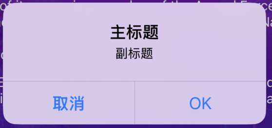

### Test  

<details id="Test">
 <summary><strong>点我了解详情</strong></summary>

* [**OC代码实验室**](https://github.com/295060456/Jobs_ObjectiveC_Laboratory)
  
  ```objective-c
  /// TODO
  ```
  </details>

## 六、<font color=red>**马甲包**</font> <a href="#前言" style="font-size:17px; color:green;"><b>回到顶部</b></a>

### 1、相关资料

* https://github.com/520coding/confuse/blob/master/README_ZH.md

### 2、相关工具

* [**confuse**](https://github.com/520coding/confuse)

## 七、[一些文档和资料](https://github.com/295060456/JobsOCBaseConfig/tree/main/%E6%96%87%E6%A1%A3%E5%92%8C%E8%B5%84%E6%96%99) <a href="#前言" style="font-size:17px; color:green;"><b>回到顶部</b></a>

### 1、配置相关
* [**解决xcode出现：SDK does not contain 'libarclite' 错误**](https://github.com/295060456/JobsOCBaseConfig/tree/main/%E8%A7%A3%E5%86%B3Xcode%E5%87%BA%E7%8E%B0%EF%BC%9ASDK%20does%20not%20contain%20'libarclite'%20%E9%94%99%E8%AF%AF)
* [**通过SSH连接到GitHub**](https://github.com/295060456/JobsOCBaseConfig/blob/main/%E6%96%87%E6%A1%A3%E5%92%8C%E8%B5%84%E6%96%99/%E9%80%9A%E8%BF%87SSH%E8%BF%9E%E6%8E%A5%E5%88%B0GitHub/%E9%80%9A%E8%BF%87SSH%E8%BF%9E%E6%8E%A5%E5%88%B0GitHub.md)
* [**JobsGenesis**](https://github.com/295060456/JobsGenesis)
* [**unknown class viewcontroller in interface builder file**](https://github.com/295060456/JobsOCBaseConfig/blob/main/%E6%96%87%E6%A1%A3%E5%92%8C%E8%B5%84%E6%96%99/%E5%85%B6%E4%BB%96.md/unknown%20class%20viewcontroller%20in%20interface%20builder%20file.md)
* [**xcode资料下载**](https://github.com/295060456/JobsOCBaseConfig/blob/main/%E6%96%87%E6%A1%A3%E5%92%8C%E8%B5%84%E6%96%99/%E5%85%B6%E4%BB%96.md/Xcode%E8%B5%84%E6%96%99%E4%B8%8B%E8%BD%BD.md)
* [**配置`info.plist`文件**](https://github.com/295060456/JobsOCBaseConfigDemo/blob/main/JobsOCBaseConfigDemo/%E9%85%8D%E7%BD%AEinfo.plist/%E9%85%8D%E7%BD%AEinfo.plist.md)
* [**Github.workflow（工作流）的使用**](https://github.com/295060456/JobsOCBaseConfig/blob/main/%E6%96%87%E6%A1%A3%E5%92%8C%E8%B5%84%E6%96%99/Github.workflow.md/Github.workflow.md)
### 2、面试相关
* [**yanmingLiu-Xminds**](https://github.com/yanmingLiu/Xminds)
* [**yanmingLiu-iOSNotes**](https://github.com/yanmingLiu/iOSNotes)
* [**OC相关经验**](https://github.com/295060456/JobsOCBaseConfig/blob/main/OCDoc/OCDoc.md)
* [**Swift 相关经验**](https://github.com/295060456/JobsOCBaseConfig/blob/main/SwiftDoc/SwiftDoc.md)
* [**谁说HTTP GET就不能通过Body来发送数据呢？**](https://juejin.cn/post/6844903685206573069)

### 3、功能相关
  * [**UITableView 的使用指南**](https://github.com/295060456/JobsOCBaseConfig/blob/main/%E6%96%87%E6%A1%A3%E5%92%8C%E8%B5%84%E6%96%99/UITableView/UITableView.md)
  * [**关于UITableViewCell和UICollectionViewCell圆切角+Cell的偏移量**](https://github.com/295060456/JobsOCBaseConfig/blob/main/%E6%96%87%E6%A1%A3%E5%92%8C%E8%B5%84%E6%96%99/%E5%85%B6%E4%BB%96.md/%E5%85%B3%E4%BA%8EUITableViewCell%E5%92%8CUICollectionViewCell%E5%9C%86%E5%88%87%E8%A7%92%2BCell%E7%9A%84%E5%81%8F%E7%A7%BB%E9%87%8F.md)
  * [**查找系统警告对应的编码**](https://github.com/295060456/JobsOCBaseConfig/blob/main/%E6%96%87%E6%A1%A3%E5%92%8C%E8%B5%84%E6%96%99/%E6%9F%A5%E6%89%BE%E7%B3%BB%E7%BB%9F%E8%AD%A6%E5%91%8A%E5%AF%B9%E5%BA%94%E7%9A%84%E7%BC%96%E7%A0%81/%E6%9F%A5%E6%89%BE%E7%B3%BB%E7%BB%9F%E8%AD%A6%E5%91%8A%E5%AF%B9%E5%BA%94%E7%9A%84%E7%BC%96%E7%A0%81.png)
  * [**iOS状态栏颜色的修改**](文档和资料/iOS状态栏颜色的修改.md)
  * [**UICollectionView点击事件**](文档和资料/UICollectionView点击事件.md)
  * [**JXCategoryView**](https://github.com/295060456/JobsOCBaseConfig/tree/main/%E6%96%87%E6%A1%A3%E5%92%8C%E8%B5%84%E6%96%99/JXCategoryView)
  * [**同一应用设置不同图标和名称**](https://github.com/295060456/JobsOCBaseConfig/blob/main/%E6%96%87%E6%A1%A3%E5%92%8C%E8%B5%84%E6%96%99/%E5%90%8C%E4%B8%80%E5%BA%94%E7%94%A8%E8%AE%BE%E7%BD%AE%E4%B8%8D%E5%90%8C%E5%9B%BE%E6%A0%87%E5%92%8C%E5%90%8D%E7%A7%B0/%E5%90%8C%E4%B8%80%E5%BA%94%E7%94%A8%E8%AE%BE%E7%BD%AE%E4%B8%8D%E5%90%8C%E5%9B%BE%E6%A0%87%E5%92%8C%E5%90%8D%E7%A7%B0.md)
  * [**模型解析**](https://github.com/295060456/JobsOCBaseConfig/blob/main/%E6%96%87%E6%A1%A3%E5%92%8C%E8%B5%84%E6%96%99/%E6%A8%A1%E5%9E%8B%E8%A7%A3%E6%9E%90/%E6%A8%A1%E5%9E%8B%E8%A7%A3%E6%9E%90.md)
  * [**iOS 多语言环境设置**](https://github.com/295060456/JobsOCBaseConfig/blob/main/%E6%96%87%E6%A1%A3%E5%92%8C%E8%B5%84%E6%96%99/iOS%20%E5%A4%9A%E8%AF%AD%E8%A8%80%E7%8E%AF%E5%A2%83%E8%AE%BE%E7%BD%AE/iOS%20%E5%A4%9A%E8%AF%AD%E8%A8%80%E7%8E%AF%E5%A2%83%E8%AE%BE%E7%BD%AE.md)
  * [**<font color=red id=iOS功能：跳转其他App,如果本机不存在,则进行下载 >iOS功能：跳转其他App,如果本机不存在,则进行下载 （需要补充）</font>**](https://github.com/295060456/JobsOCBaseConfig/blob/main/%E6%96%87%E6%A1%A3%E5%92%8C%E8%B5%84%E6%96%99/%E8%B7%B3%E8%BD%AC%E5%85%B6%E4%BB%96App%E6%B2%A1%E6%9C%89%E5%88%99%E4%B8%8B%E8%BD%BD/%E8%B7%B3%E8%BD%AC%E5%85%B6%E4%BB%96App%E6%B2%A1%E6%9C%89%E5%88%99%E4%B8%8B%E8%BD%BD.md)
  * [**iOS禁用返回手势**](https://github.com/295060456/JobsOCBaseConfig/blob/main/%E6%96%87%E6%A1%A3%E5%92%8C%E8%B5%84%E6%96%99/%E5%85%B6%E4%BB%96.md/iOS%E7%A6%81%E7%94%A8%E8%BF%94%E5%9B%9E%E6%89%8B%E5%8A%BF.md)
  * [**读取本地plist**](https://github.com/295060456/JobsOCBaseConfig/blob/main/%E6%96%87%E6%A1%A3%E5%92%8C%E8%B5%84%E6%96%99/%E5%85%B6%E4%BB%96.md/%E8%AF%BB%E5%8F%96%E6%9C%AC%E5%9C%B0plist.md)
  * [**<font color=red id=时间按照【年-月份】分组>时间按照【年-月份】分组</font>**](https://github.com/295060456/JobsOCBaseConfig/blob/main/%E6%96%87%E6%A1%A3%E5%92%8C%E8%B5%84%E6%96%99/%E5%85%B6%E4%BB%96.md/%E6%97%B6%E9%97%B4%E6%8C%89%E7%85%A7%E3%80%90%E5%B9%B4-%E6%9C%88%E4%BB%BD%E3%80%91%E5%88%86%E7%BB%84.md)
  * [**精确度量 iOS App 的启动时间**](https://github.com/295060456/JobsOCBaseConfig/blob/main/%E6%96%87%E6%A1%A3%E5%92%8C%E8%B5%84%E6%96%99/%E5%85%B6%E4%BB%96.md/%E7%B2%BE%E7%A1%AE%E5%BA%A6%E9%87%8F%20iOS-App%E7%9A%84%E5%90%AF%E5%8A%A8%E6%97%B6%E9%97%B4.md)
### 4、相关研究
#### 4.1、架构问题
* [**路由**](https://github.com/295060456/JobsOCBaseConfig/blob/main/%E6%96%87%E6%A1%A3%E5%92%8C%E8%B5%84%E6%96%99/%E5%85%B6%E4%BB%96.md/%E8%B7%AF%E7%94%B1.md)
#### 4.2、语法糖问题
* [**关于WMZBanner的怪异写法探究**](https://github.com/295060456/JobsOCBaseConfig/blob/main/%E6%96%87%E6%A1%A3%E5%92%8C%E8%B5%84%E6%96%99/%E5%85%B3%E4%BA%8EWMZBanner%E7%9A%84%E6%80%AA%E5%BC%82%E5%86%99%E6%B3%95%E6%8E%A2%E7%A9%B6/%E5%85%B3%E4%BA%8EWMZBanner%E7%9A%84%E6%80%AA%E5%BC%82%E5%86%99%E6%B3%95%E6%8E%A2%E7%A9%B6.md)
* [**关于RAC框架中的@符号进行宏定义唤起的探究**](https://github.com/295060456/JobsOCBaseConfig/blob/main/%E6%96%87%E6%A1%A3%E5%92%8C%E8%B5%84%E6%96%99/%E5%85%B6%E4%BB%96.md/%E5%85%B3%E4%BA%8ERAC%E6%A1%86%E6%9E%B6%E4%B8%AD%E7%9A%84%40%E7%AC%A6%E5%8F%B7%E8%BF%9B%E8%A1%8C%E5%AE%8F%E5%AE%9A%E4%B9%89%E5%94%A4%E8%B5%B7%E7%9A%84%E6%8E%A2%E7%A9%B6.md)
  * 响应链
    * [**关于响应链的一些研究成果**](https://github.com/295060456/JobsOCBaseConfig/blob/main/%E6%96%87%E6%A1%A3%E5%92%8C%E8%B5%84%E6%96%99/%E5%85%B6%E4%BB%96.md/%E5%85%B3%E4%BA%8E%E5%93%8D%E5%BA%94%E9%93%BE%E7%9A%84%E4%B8%80%E4%BA%9B%E7%A0%94%E7%A9%B6%E6%88%90%E6%9E%9C.md)
    * [**UICollectionView点击事件**](https://github.com/295060456/JobsOCBaseConfig/blob/main/%E6%96%87%E6%A1%A3%E5%92%8C%E8%B5%84%E6%96%99/%E5%85%B6%E4%BB%96.md/UICollectionView%E7%82%B9%E5%87%BB%E4%BA%8B%E4%BB%B6.md)
#### 4.3、算法问题
* [**N宫格问题**](https://github.com/295060456/JobsOCBaseConfig/blob/main/%E6%96%87%E6%A1%A3%E5%92%8C%E8%B5%84%E6%96%99/%E5%85%B6%E4%BB%96.md/N%E5%AE%AB%E6%A0%BC%E9%97%AE%E9%A2%98.md)
* [**定一行个数得出几行**](https://github.com/295060456/JobsOCBaseConfig/blob/main/%E6%96%87%E6%A1%A3%E5%92%8C%E8%B5%84%E6%96%99/%E5%85%B6%E4%BB%96.md/%E5%AE%9A%E4%B8%80%E8%A1%8C%E4%B8%AA%E6%95%B0%E5%BE%97%E5%87%BA%E5%87%A0%E8%A1%8C.md)
#### 4.4、加密体系相关
##### 4.4.1、加密（编码）算法
* **Base编码系列**
  * [**Base16**](https://github.com/295060456/JobsOCBaseConfigDemo/blob/main/%F0%9F%94%A8Manual_Add_ThirdParty%EF%BC%88%E6%8C%89%E9%9C%80%E5%BC%95%E5%85%A5%EF%BC%89/%E5%8A%A0%E5%AF%86%E4%BD%93%E7%B3%BB/%E5%8A%A0%E5%AF%86%EF%BC%88%E7%BC%96%E7%A0%81%EF%BC%89%E7%AE%97%E6%B3%95/Base%E7%BC%96%E7%A0%81%E7%B3%BB%E5%88%97/Base16/Base16.md)
  * [**Base32**](https://github.com/295060456/JobsOCBaseConfigDemo/blob/main/%F0%9F%94%A8Manual_Add_ThirdParty%EF%BC%88%E6%8C%89%E9%9C%80%E5%BC%95%E5%85%A5%EF%BC%89/%E5%8A%A0%E5%AF%86%E4%BD%93%E7%B3%BB/%E5%8A%A0%E5%AF%86%EF%BC%88%E7%BC%96%E7%A0%81%EF%BC%89%E7%AE%97%E6%B3%95/Base%E7%BC%96%E7%A0%81%E7%B3%BB%E5%88%97/Base32/Base32.md)
  * [**Base64**](https://github.com/295060456/JobsOCBaseConfigDemo/blob/main/%F0%9F%94%A8Manual_Add_ThirdParty%EF%BC%88%E6%8C%89%E9%9C%80%E5%BC%95%E5%85%A5%EF%BC%89/%E5%8A%A0%E5%AF%86%E4%BD%93%E7%B3%BB/%E5%8A%A0%E5%AF%86%EF%BC%88%E7%BC%96%E7%A0%81%EF%BC%89%E7%AE%97%E6%B3%95/Base%E7%BC%96%E7%A0%81%E7%B3%BB%E5%88%97/Base64/Base64.md)
  * [**Base85**](https://github.com/295060456/JobsOCBaseConfigDemo/blob/main/%F0%9F%94%A8Manual_Add_ThirdParty%EF%BC%88%E6%8C%89%E9%9C%80%E5%BC%95%E5%85%A5%EF%BC%89/%E5%8A%A0%E5%AF%86%E4%BD%93%E7%B3%BB/%E5%8A%A0%E5%AF%86%EF%BC%88%E7%BC%96%E7%A0%81%EF%BC%89%E7%AE%97%E6%B3%95/Base%E7%BC%96%E7%A0%81%E7%B3%BB%E5%88%97/Base85/Base85.md)
* [**Unicode**](https://github.com/295060456/JobsOCBaseConfigDemo/blob/main/%F0%9F%94%A8Manual_Add_ThirdParty%EF%BC%88%E6%8C%89%E9%9C%80%E5%BC%95%E5%85%A5%EF%BC%89/%E5%8A%A0%E5%AF%86%E4%BD%93%E7%B3%BB/%E5%8A%A0%E5%AF%86%EF%BC%88%E7%BC%96%E7%A0%81%EF%BC%89%E7%AE%97%E6%B3%95/Unicode/Unicode.md)
* [**MIME**](https://github.com/295060456/JobsOCBaseConfigDemo/blob/main/%F0%9F%94%A8Manual_Add_ThirdParty%EF%BC%88%E6%8C%89%E9%9C%80%E5%BC%95%E5%85%A5%EF%BC%89/%E5%8A%A0%E5%AF%86%E4%BD%93%E7%B3%BB/%E5%8A%A0%E5%AF%86%EF%BC%88%E7%BC%96%E7%A0%81%EF%BC%89%E7%AE%97%E6%B3%95/MIME/MIME.md)
* [**HexadecimalData**](https://github.com/295060456/JobsOCBaseConfigDemo/blob/main/%F0%9F%94%A8Manual_Add_ThirdParty%EF%BC%88%E6%8C%89%E9%9C%80%E5%BC%95%E5%85%A5%EF%BC%89/%E5%8A%A0%E5%AF%86%E4%BD%93%E7%B3%BB/%E5%8A%A0%E5%AF%86%EF%BC%88%E7%BC%96%E7%A0%81%EF%BC%89%E7%AE%97%E6%B3%95/HexadecimalData/HexadecimalData.md)
* [**凯撒加密解密**](https://github.com/295060456/JobsOCBaseConfigDemo/blob/main/%F0%9F%94%A8Manual_Add_ThirdParty%EF%BC%88%E6%8C%89%E9%9C%80%E5%BC%95%E5%85%A5%EF%BC%89/%E5%8A%A0%E5%AF%86%E4%BD%93%E7%B3%BB/%E5%8A%A0%E5%AF%86%EF%BC%88%E7%BC%96%E7%A0%81%EF%BC%89%E7%AE%97%E6%B3%95/%E5%87%AF%E6%92%92%E5%8A%A0%E5%AF%86%E8%A7%A3%E5%AF%86/%E5%87%AF%E6%92%92%E5%8A%A0%E5%AF%86%E8%A7%A3%E5%AF%86.md)
* [**AESCipher**]()
* [**DES**](https://github.com/295060456/JobsOCBaseConfigDemo/blob/main/%F0%9F%94%A8Manual_Add_ThirdParty%EF%BC%88%E6%8C%89%E9%9C%80%E5%BC%95%E5%85%A5%EF%BC%89/%E5%8A%A0%E5%AF%86%E4%BD%93%E7%B3%BB/%E5%8A%A0%E5%AF%86%EF%BC%88%E7%BC%96%E7%A0%81%EF%BC%89%E7%AE%97%E6%B3%95/DES/DES.md)
* [**SHA**](https://github.com/295060456/JobsOCBaseConfigDemo/blob/main/%F0%9F%94%A8Manual_Add_ThirdParty%EF%BC%88%E6%8C%89%E9%9C%80%E5%BC%95%E5%85%A5%EF%BC%89/%E5%8A%A0%E5%AF%86%E4%BD%93%E7%B3%BB/%E5%8A%A0%E5%AF%86%EF%BC%88%E7%BC%96%E7%A0%81%EF%BC%89%E7%AE%97%E6%B3%95/SHA/SHA.md)
  * [**SHA1**](https://github.com/295060456/JobsOCBaseConfigDemo/blob/main/%F0%9F%94%A8Manual_Add_ThirdParty%EF%BC%88%E6%8C%89%E9%9C%80%E5%BC%95%E5%85%A5%EF%BC%89/%E5%8A%A0%E5%AF%86%E4%BD%93%E7%B3%BB/%E5%8A%A0%E5%AF%86%EF%BC%88%E7%BC%96%E7%A0%81%EF%BC%89%E7%AE%97%E6%B3%95/SHA/SHA-1/SHA-1.md)
  * [**SHA-224**](https://github.com/295060456/JobsOCBaseConfigDemo/blob/main/%F0%9F%94%A8Manual_Add_ThirdParty%EF%BC%88%E6%8C%89%E9%9C%80%E5%BC%95%E5%85%A5%EF%BC%89/%E5%8A%A0%E5%AF%86%E4%BD%93%E7%B3%BB/%E5%8A%A0%E5%AF%86%EF%BC%88%E7%BC%96%E7%A0%81%EF%BC%89%E7%AE%97%E6%B3%95/SHA/SHA-224/SHA-224.md)
  * [**SHA-256**](https://github.com/295060456/JobsOCBaseConfigDemo/blob/main/%F0%9F%94%A8Manual_Add_ThirdParty%EF%BC%88%E6%8C%89%E9%9C%80%E5%BC%95%E5%85%A5%EF%BC%89/%E5%8A%A0%E5%AF%86%E4%BD%93%E7%B3%BB/%E5%8A%A0%E5%AF%86%EF%BC%88%E7%BC%96%E7%A0%81%EF%BC%89%E7%AE%97%E6%B3%95/SHA/SHA-256/SHA-256.md)
  * [**SHA-384**](https://github.com/295060456/JobsOCBaseConfigDemo/blob/main/%F0%9F%94%A8Manual_Add_ThirdParty%EF%BC%88%E6%8C%89%E9%9C%80%E5%BC%95%E5%85%A5%EF%BC%89/%E5%8A%A0%E5%AF%86%E4%BD%93%E7%B3%BB/%E5%8A%A0%E5%AF%86%EF%BC%88%E7%BC%96%E7%A0%81%EF%BC%89%E7%AE%97%E6%B3%95/SHA/SHA-384/SHA-384.md)
  * [**SHA-512**](https://github.com/295060456/JobsOCBaseConfigDemo/blob/main/%F0%9F%94%A8Manual_Add_ThirdParty%EF%BC%88%E6%8C%89%E9%9C%80%E5%BC%95%E5%85%A5%EF%BC%89/%E5%8A%A0%E5%AF%86%E4%BD%93%E7%B3%BB/%E5%8A%A0%E5%AF%86%EF%BC%88%E7%BC%96%E7%A0%81%EF%BC%89%E7%AE%97%E6%B3%95/SHA/SHA-512/SHA-512.md)
* [**RSA**](https://github.com/295060456/JobsOCBaseConfigDemo/blob/main/%F0%9F%94%A8Manual_Add_ThirdParty%EF%BC%88%E6%8C%89%E9%9C%80%E5%BC%95%E5%85%A5%EF%BC%89/%E5%8A%A0%E5%AF%86%E4%BD%93%E7%B3%BB/%E5%8A%A0%E5%AF%86%EF%BC%88%E7%BC%96%E7%A0%81%EF%BC%89%E7%AE%97%E6%B3%95/%E9%9D%9E%E5%AF%B9%E7%A7%B0%E5%8A%A0%E5%AF%86RSA/RSA.md)

##### 4.4.2、HASH 信息摘要

* [**MD5**](https://github.com/295060456/JobsOCBaseConfigDemo/blob/main/%F0%9F%94%A8Manual_Add_ThirdParty%EF%BC%88%E6%8C%89%E9%9C%80%E5%BC%95%E5%85%A5%EF%BC%89/%E5%8A%A0%E5%AF%86%E4%BD%93%E7%B3%BB/HASH%20%E4%BF%A1%E6%81%AF%E6%91%98%E8%A6%81/MD5/MD5.md)
* [**HASH**](https://github.com/295060456/JobsOCBaseConfigDemo/blob/main/%F0%9F%94%A8Manual_Add_ThirdParty%EF%BC%88%E6%8C%89%E9%9C%80%E5%BC%95%E5%85%A5%EF%BC%89/%E5%8A%A0%E5%AF%86%E4%BD%93%E7%B3%BB/HASH%20%E4%BF%A1%E6%81%AF%E6%91%98%E8%A6%81/HASH.md)

### 5、其他研究
* [**LYM的研究成果**](https://github.com/295060456/JobsOCBaseConfig/tree/main/%E6%96%87%E6%A1%A3%E5%92%8C%E8%B5%84%E6%96%99/%E2%9D%A4%EF%B8%8FLYM%E7%9A%84%E7%A0%94%E7%A9%B6%E6%88%90%E6%9E%9C%E2%9D%A4%EF%B8%8F)
* [**iOS项目常用的第三方框架**](https://www.cnblogs.com/sundaysgarden/articles/14208764.html)
* [**滚动数字显示**](https://github.com/lf19940514/LFScrollNumberDemo)
* https://github.com/SeongBrave/Swift__OC/blob/master/README.md?plain=1
* [**iOS圆盘转动引导图的简单实现**](https://blog.csdn.net/hmxhh/article/details/42145049)
### 6、课外阅读
  * [**FFmpeg**](https://github.com/295060456/JobsOCBaseConfig/blob/main/%E6%96%87%E6%A1%A3%E5%92%8C%E8%B5%84%E6%96%99/FFmpeg/FFmpeg.md)
  * [**优秀的关于音视频处理的文献资料**](https://github.com/295060456/JobsOCBaseConfig/blob/main/%E6%96%87%E6%A1%A3%E5%92%8C%E8%B5%84%E6%96%99/%E5%85%B6%E4%BB%96.md/%E4%BC%98%E7%A7%80%E7%9A%84%E5%85%B3%E4%BA%8E%E9%9F%B3%E8%A7%86%E9%A2%91%E5%A4%84%E7%90%86%E7%9A%84%E6%96%87%E7%8C%AE%E8%B5%84%E6%96%99.md)
  * [**Fastlane-iOS持续集成自动打包发布**](https://github.com/yanmingLiu/Xminds/blob/main/iOS/Fastlane-iOS%E6%8C%81%E7%BB%AD%E9%9B%86%E6%88%90%E8%87%AA%E5%8A%A8%E6%89%93%E5%8C%85%E5%8F%91%E5%B8%83%E3%80%82.md)
  * [**Flutter-iOS-打包等采坑ing**](https://github.com/yanmingLiu/Xminds/blob/main/iOS/Flutter-iOS-%E6%89%93%E5%8C%85%E7%AD%89%E9%87%87%E5%9D%91ing---.md)
  * [**创建Framework**](https://github.com/yanmingLiu/Xminds/blob/main/iOS/%E5%88%9B%E5%BB%BAFramework.md)
### 7、TODO
  * 将[**时间按照【年-月份】分组**](#时间按照【年-月份】分组)集成到靶场项目里
  * 完善 [**iOS功能：跳转其他App,如果本机不存在,则进行下载（需要补充）**](#iOS功能：跳转其他App,如果本机不存在,则进行下载)
  * iOS.热更新
  * iOS.Widget
* Demo里面有些因为Api升级而没有来得及对齐的，目前打开会崩溃
* 对多场景**SceneDelegate**的深入研究和支持
* JobsPostVC报错解决
* DebugLogDescription 会崩溃：`id value = self.valueForKeyBlock(name) ? : @"nil";//默认值为nil字符串`
* 侧滑菜单：JXCategoryView垂直表达
* 其他
## 八、打开苹果的[<font color=red>**反馈助理**</font>](applefeedback://) <a href="#前言" style="font-size:17px; color:green;"><b>回到顶部</b></a>
* 浏览器打开并输入 
  ```html
  feedbackassistant://
