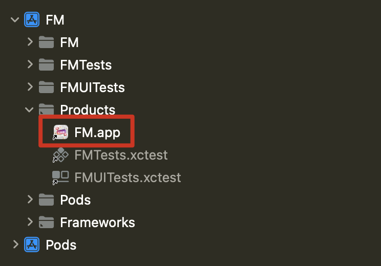
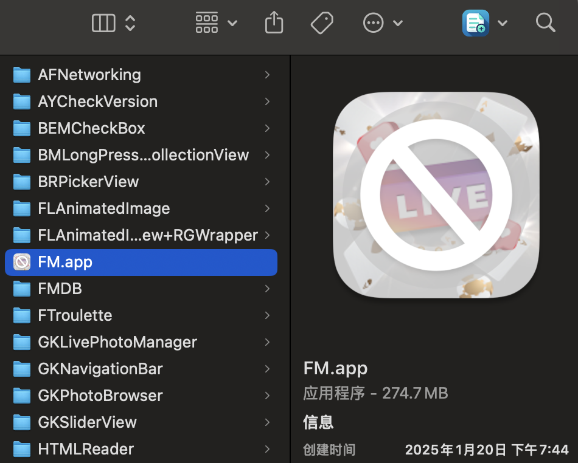

# 移动端上架（分发）流程

[toc]

## 1、苹果端上架

### 1.1、一些基础知识

#### 1.1.1、一个完整可用的`*.ipa`包，包括：

* 签名区段（Code Signature Section）：
  * 验证应用程序的完整性，确保代码没有被篡改；
  * 由 Apple 的签名工具（如 `codesign`）在应用打包过程中生成；
  * **位置**：位于应用二进制文件的一个独立区域，通常标记为 `__LINKEDIT` 段中的 `__code_signature`；
  * **内容**：
    * 哈希值：对应用的代码段（包括所有可执行文件和动态库）进行分块后生成的哈希值；
    * 签名证书：包含开发者账号的身份信息，用于验证签名合法性；
    * 加密信息：使用苹果的私钥对哈希值进行加密，确保签名不可伪造；
  * **验证**：系统通过公钥解密签名，并对哈希值进行比对。如果不一致，应用将无法运行；
* 代码区段（Code Section）：
  * 代码区段存储的是应用的实际可执行代码，iOS 系统会通过签名区段验证代码区段的完整性；
  * **位置**：通常位于 Mach-O 文件的 `__TEXT` 段中的 `__text` 区域。
  * 内容：汇编指令（编译后的二进制指令）以及常量数据
* **保护机制**：
  * **运行时校验**：iOS 系统在运行应用时会加载签名区段，并验证代码区段的完整性。如果签名无效，应用无法启动；
  * iOS 系统会加载代码区段到内存中，并对其设置为只读；
  * 禁止动态修改代码段，以防止代码注入攻击；
  * **沙盒机制**：签名与沙盒机制配合，确保每个应用只能运行经过认证的代码，防止恶意代码运行；iOS系统“越狱”会打破沙盒机制，虽然会带来无限制的安装体验，但是也会随之而来带来显而易见的安全风险

#### 1.1.2、iOS.App 签名的分类

```mermaid
flowchart LR
    %% 定义统一的左对齐样式
    classDef leftAlign fill:#fff,stroke:#333,stroke-width:2px,text-align:left;
    %% 定义特殊样式（黄底黑字）
    classDef yellowBgByBlackText fill:#ff0,color:#000,stroke:#333,stroke-width:2px,text-align:left;
    %% 定义特殊样式（浅蓝色底黑字）
    classDef lightBlueBgByBlackText fill:#add8e6,color:#000,stroke:#333,stroke-width:2px,text-align:left;

    %% 主体流程
    A[iOS.App 签名的分类] --> B1[App Store（几乎用于白产）<br/>灰黑产如果需要上架此平台需要受到相当强力的监管，需要用到损耗掉无数多个苹果个人开发账户<br/>1、个人开发者账户至少是需要手机号码，在某些国家或者地区，手机号码受到严格监管（实名认证）；<br/>2、如果考虑使用虚拟号码接受短信，那么虚拟号码一旦过期忘记续费即会被回收，那么这个苹果账户因为无法正常接受短信验证码，接近报废<br/>3、无论是个人开发者还是公司开发者，正常的会员费用都是$99/年<br/>4、公司开发者需提交营业执照（法人资料）以获取全球通用的邓白氏编码<br/>5、马甲包（价格略贵，代码需要做混淆处理，且容易被同行举报而下架）<br/>]
    A --> B2[非App Store上架（分发）]

    B2 --> B2_1[苹果企业签<br/>1、适合需要企业级分发的场景，允许通过 URL 下载<br/>2、不受 App Store 审核限制，但对签名证书依赖较大<br/>3、一个企业签很贵（一度市场售价达百万人民币）名下可以签发很多iOS.App<br/>4、如果企业签被吊销，那么即使以前成功签发的App也不可使用]
    B2 --> B2_2[苹果超级签<br/>1、不需要企业账号，可直接分发<br/>2、通过 iOS 描述文件安装，灵活性较高]
    B2 --> B2_3[MDM 签名（Mobile Device Management）<br/>通过 MDM 管理分发应用，适合需要远程设备控制的企业场景<br/>]
    B2 --> B2_4[内测签名（TestFlight 分发）<br/>1、适合在 App Store 环境下进行应用的内测分发，无需额外签名证书<br/>2、需要通过苹果审核]
    B2 --> B2_5[Ad Hoc 签名<br/>适合小范围分发应用，需要设备 UDID 注册且有数量限制（每年最多100台设备）<br/>]
    B2 --> B2_6[自由签名（Jailbreak）<br/>针对越狱设备，无限制安装iOS.APP，用户主从性较高<br/>]
    B2 --> B2_7[开发者签名（Development Certificate）<br/>1、开发阶段，用于将应用安装到注册的测试设备上；<br/>2、需要设备的 UDID 注册到开发者账号中（最多 100 台设备）；<br/>3、签名有效期为一年，需定期更新；<br/>]
    
    %% 应用样式到所有节点
    class B2,B2_1,B2_2,B2_3,B2_4 yellowBgByBlackText;
    class B2_5,B2_6,B2_7 lightBlueBgByBlackText;
    class B1,B2,B2_1,B2_2,B2_3,B2_4,B2_5,B2_6,B2_7 leftAlign;
```

#### 1.1.3、`*.p12`文件（也称为 **PKCS #12 文件**）

* 用于存储加密证书和私钥的容器文件格式；

* 它在 **数字证书** 和 **加密密钥** 管理中非常常见，尤其在 iOS 开发中；

* 通过 **Xcode** 和 **命令行工具**（如 `codesign`）使用 `*.p12` 文件进行签名；

  ```shell
  codesign -s "iPhone Developer: Your Name (XXXXXXXXXX)" --deep --force /path/to/your/app.app
  ```

* 可以方便地从一个开发环境导出，传输到另一个开发环境或与他人共享；

* **保存开发者证书和私钥**：

  * 它包含用于签名的 **私钥** 和对应的 **公钥证书**（开发者证书）。可以将其导入到 macOS 的 **钥匙串** 中；
  * 私钥是生成和验证签名所必需的，而公钥证书是用于验证签名的；
  * iOS 应用需要这个 `*.p12` 文件来在打包和发布应用时进行签名；

* #### 生成 `*.p12` 文件的步骤

  1. **从开发者账号下载证书**：（个别受限地区（例如：柬埔寨）需要使用VPN才能正确访问苹果开发者官网）

     - 登录 [Apple Developer Portal](https://developer.apple.com/account/)，生成并下载开发者证书。

  2. **使用钥匙串访问导出 `*.p12` 文件**：

     - 将下载的开发者证书双击添加到 macOS 的 **钥匙串访问**（Keychain Access）中；

       ```shell
       security import /path/to/your/certificate.p12 -k ~/Library/Keychains/login.keychain
       ```

     - 在钥匙串访问中找到证书及其对应的私钥，右键点击并选择“导出”；

     - 选择导出格式为 `*.p12`，设置密码进行加密（可以不要密码），保护私钥；

  3. **保存和传输 `*.p12` 文件**：

     - 将导出的 `*.p12` 文件保存到安全的位置，并确保密码的保密性；
     - 通过 `*.p12` 文件，可以在不同的开发机器间共享证书和私钥；

#### 1.1.4、命令行工具

* 签名应用

  ```shell
  codesign -s "Certificate Name" --deep --force /path/to/app.app
  ```

* 列出所有证书

  * ```shell
    security find-identity -v -p codesigning
    ```

* 签名状态检查

  * `--verify`：验证签名是否有效
  * `--deep`：验证所有嵌套的内容

   ```shell
   codesign --verify --deep /path/to/your/app.app
   ```

* 显示签名信息

  * `--display`：显示签名信息。

  * `--verbose=4`：提供详细输出，帮助你查看证书和签名的详细信息。

  ```shell
  codesign --display --verbose=4 /path/to/your/app.app
  ```

### 1.2、上架 App Store流程（关键点）

* 申请相关权限（如需要）

  * 需要访问用户数据（如位置、摄像头等）时，添加隐私权限描述；
  * 特殊权限（如健康、金融、VPN）需提交补充说明；
* 准备应用资源

  * 应用名称、描述、关键词、分类；
  * App 图标（1024x1024px，无圆角）；
  * 截图：根据设备（iPhone、iPad、Mac）提供不同分辨率截图；
  * 预览视频（可选，展示应用功能）；
* 提交应用

  * **创建 App**
    * 登录 [**App Store Connect**](https://appstoreconnect.apple.com/)
    * 在 **我的 App** 中，点击 **+** 创建新应用，填写基本信息：
      - 应用名称
      - 主语言
      - 包名（Bundle ID）
      - 用户访问权限设置（是否需要登录）
  * **上传应用包**
    - 使用 Xcode 将应用上传到 App Store Connect：在 Xcode 中选择菜单 **Product > Archive**，然后上传
    - 确认上传成功后，检查 **App Store Connect** 中的构建版本
  * **填写元数据**
    * 应用描述、关键词、分类、隐私政策链接；
    * 提供支持的最低设备和版本要求；
    * 设置价格（免费或收费）；
  * **提交审核**
    * 填写审核信息（如测试账号、视频演示等）；
    * 选择发布选项
      - 手动发布；
      - 审核通过后立即发布；
* **App 审核**
  * [**App Store 审核指南**](https://developer.apple.com/app-store/review/)
  * **审核时间**：
  
    * 通常需要 1-3 个工作日；
    * **快速通道**（可选）：如果应用涉及紧急问题，可以申请加急审核。
  * 如果一直被打回修改，那么每次间隔的时间将会变长；
  * 审核被拒
    * 处理被拒：查看拒绝原因（App Store Connect 的消息中心）。修复问题后重新提交。
    * 如果有异议，可以通过 **App Store Connect > 联系支持** 提交申诉；
  * 机器扫描：
    * 查看是否调用违规Api（已封禁或者过期的Api）,比如热更新相关的Api被明令禁止调用；
    * 查看是否有后台开关：上架以后通过后台开关来改变App的页面展示情况，以跳过审核；
    * 是否包含一些有害的指令；
    * 查看是否过度索取权限，危害到用户隐私；
    * 是否是马甲包特征：马甲包需要做代码混淆处理，否则会被拒；
  * 人工审核：
    * App功能相关
    
      * App 启动时间不能超过 15 秒；
      * App 在启动或运行时不能发生崩溃；
      * App无法完成其核心功能（如地图应用无法显示地图）；
      * App 功能过于简单，如仅是一个 `WebView`；
      * 与其他 App 功能重复，缺乏创新；
    * 兼容性和适配
    
      * App 不兼容最新的 iOS 版本或硬件设备；
    
      * 未正确适配不同屏幕尺寸（如 iPhone SE、iPad）；
      * App 导致设备过热或耗电异常；
      * 应用仅支持英文但提交到非英文市场；
    * 购买相关
    
      * 未通过 Apple 的内购系统处理虚拟商品或服务；
      * 内购流程设计不清晰，用户无法完成购买；
    * 审核测试相关
      * 提交的测试账号无效，导致审核人员无法测试；
      * 未提供复杂功能的操作指引；
    * 注册/登录问题
    
      * 未支持 Apple 登录（如需要第三方登录时）；
      * 强制用户注册或登录但未提供访客模式；
    * 内容相关：
      * 虚假或误导信息；
      * 知识产权问题；
      * **低质量内容**：<font color=red>包含违法、色情、暴力或歧视性内容。涉及赌博、毒品或武器的内容未明确限制；</font>
    * 违反用户隐私政策；
    * 未符合当地法律；
    
      * 在特定国家或地区提供服务，但未屏蔽不适用的用户；
      * App 涉及加密技术但未提交相关声明；
      * App 发布区域与内容不符合当地法规（如 VPN 服务未授权）；
    * 赌博类 App
    
      * 涉及赌博内容但未获得合法授权；
      * 提供赌博服务但未限制未成年人使用；
    * **UI/UX** 问题
    
      * App 界面设计混乱，操作不直观；
      * 按钮或文本与背景颜色对比度不足，影响可读性；
      * 未正确使用 Apple 的设计元素（如状态栏、导航栏）；
      * 自定义界面元素导致用户体验不佳；
    * 广告干扰
    
      - 弹窗广告过多或难以关闭；
      - 提供虚假或误导性广告内容；
    * 构建相关问题
    
      - 提交的 App 包含调试符号或测试代码；
      - App 包体积过大（超过 200MB）但未优化；
    * 提交相关问题
    
      - 缺少必要的截图或预览视频；
      - 提交的构建版本与元数据不一致；
      - App 的分类标签与内容不符；
      - 年龄分级与实际内容不匹配；
      - 提供虚假的促销信息（如“限时免费”）；
      - 免费 App 中包含收费内容但未明确说明；
* 其他：
  * 如果涉及到支付流程（非加密货币）那么苹果会抽取30%的苹果税（包含App内购）；
  * 苹果的审核流程是黑盒机制，本意是不希望你去揣测而探寻其规则的漏洞；
  * 苹果的审核条款的具体执行细则会经常变更，导致开发者如果专门去应付，会造成较大开销；

### 1.3、非Apple官方渠道宣发：第三方签名

* 锚定我们需要处理的二进制文件（打包程序的初级产物）：

  

  

* `【MacOS】放在iOS项目工程根目录下，自动打包并输出为ipa文件.command`

  ```shell
  #!/bin/zsh
  
  print_color() {
      local COLOR="$1"
      local TEXT="$2"
      local RESET="\033[0m"
      echo "${COLOR}${TEXT}${RESET}"
  }
  
  _JobsPrint_Red() {
      print_color "\033[1;31m" "$1"
  }
  
  _JobsPrint_Green() {
      print_color "\033[1;32m" "$1"
  }
  # 打印 "Jobs" logo
  jobs_logo() {
      local border="=="
      local width=49  # 根据logo的宽度调整
      local top_bottom_border=$(printf '%0.1s' "${border}"{1..$width})
      local logo="
  ||${top_bottom_border}||
  ||  JJJJJJJJ     oooooo    bb          SSSSSSSSSS  ||
  ||        JJ    oo    oo   bb          SS      SS  ||
  ||        JJ    oo    oo   bb          SS          ||
  ||        JJ    oo    oo   bbbbbbbbb   SSSSSSSSSS  ||
  ||  J     JJ    oo    oo   bb      bb          SS  ||
  ||  JJ    JJ    oo    oo   bb      bb  SS      SS  ||
  ||   JJJJJJ      oooooo     bbbbbbbb   SSSSSSSSSS  ||
  ||${top_bottom_border}||
  "
      _JobsPrint_Green "$logo"
  }
  # 自述信息
  self_intro() {
      _JobsPrint_Green "【MacOS】放在iOS项目工程根目录下，自动打包并输出为ipa文件.）"
      _JobsPrint_Red "按回车键继续..."
      read
  }
  
  setup_xcode() {
      local XCODE_DIR="/Applications/Xcode.app"
      if [ ! -d "$XCODE_DIR" ]; then
          _JobsPrint_Red "Xcode.app not found in Applications."
          exit 1
      fi
      _JobsPrint_Green "Found Xcode.app at: $XCODE_DIR"
  }
  
  install_package_application() {
      local PACKAGE_DIR="$1/Contents/Developer/Platforms/iPhoneOS.platform/Developer/usr/bin"
      local PACKAGE_NAME="PackageApplication"
      local PACKAGE_ZIP="${PACKAGE_NAME}.zip"
      local PACKAGE_PATH="${PACKAGE_DIR}/${PACKAGE_NAME}"
  
      if [ ! -f "$PACKAGE_PATH" ]; then
          curl -# -OL "https://github.com/JackSteven/PackageApplication/raw/master/${PACKAGE_ZIP}" && unzip -o "$PACKAGE_ZIP" && mv "$PACKAGE_NAME" "$PACKAGE_DIR" && rm "$PACKAGE_ZIP"
          if [ $? -ne 0 ]; then
              _JobsPrint_Red "Failed to install $PACKAGE_NAME."
              exit 2
          fi
          sudo xcode-select -switch "$1/Contents/Developer/"
          chmod +x "$PACKAGE_PATH"
          _JobsPrint_Green "$PACKAGE_NAME installed successfully!"
      fi
  }
  
  build_app() {
      local build_command="xcodebuild"
      local workspace=$(find . -name "*.xcworkspace" -print -quit)
      local project=$(find . -name "*.xcodeproj" -print -quit)
  
      if [[ -n "$workspace" ]]; then
          scheme="${workspace%%.*}"
          build_command+=" -workspace $workspace -scheme $scheme"
      elif [[ -n "$project" ]]; then
          scheme="${project%%.*}"
          build_command+=" -project $project -scheme $scheme"
      else
          _JobsPrint_Red "No workspace or project found."
          exit 3
      fi
  
      local sdk=$(xcodebuild -showBuildSettings | awk '/SDK_NAME =/ {print $3}')
      build_command+=" -configuration Release -sdk $sdk"
      echo "Executing build command: $build_command"
      if ! $build_command; then
          _JobsPrint_Red "Build failed, please check!"
          exit 4
      fi
  }
  
  main() {
      _JobsPrint_Green "正在开始编译打包 ipa"
      jobs_logo
      self_intro
      setup_xcode
      install_package_application "/Applications/Xcode.app"
      build_app
      _JobsPrint_Green "编译打包 ipa 成功完成！！！"
  }
  
  main
  ```

* 给到第三方进行签名。一般是给一个网站以及账密（需要先付费），你将通过上述步骤得出的后缀名为`.ipa`的包上传到网站上进行签名，成功后下载

## 2、Android
